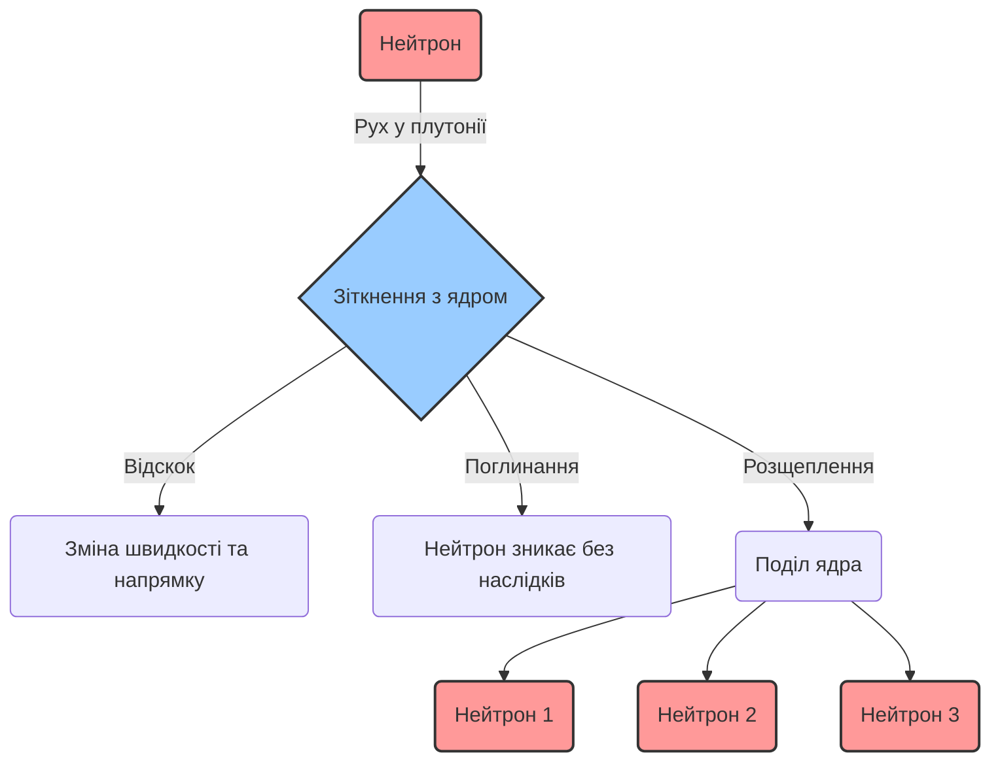
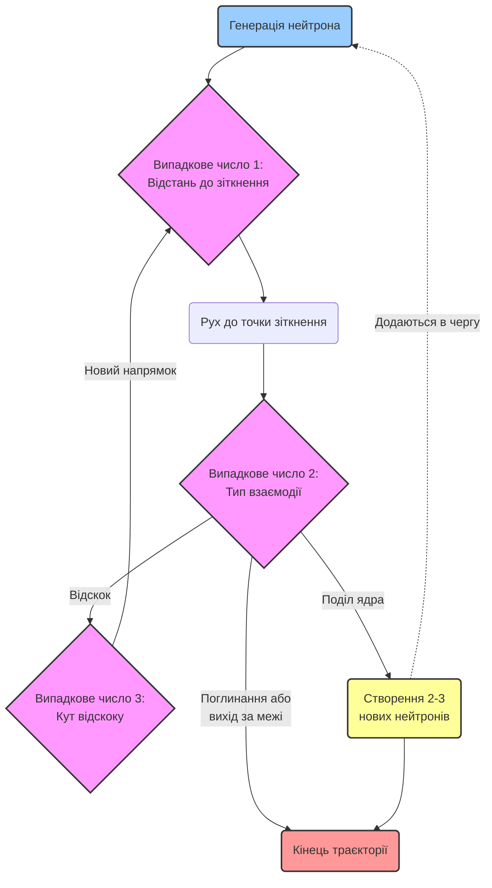
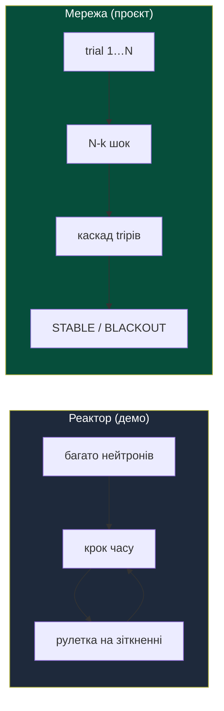

# Лекція 0: Еволюція обчислень. Від перших ЕОМ до сучасних Хмар

> **Декларація курсу.** Академічна доброчесність та авторство матеріалів — у [DISCLAIMER.md](DISCLAIMER.md).

**Питання для розминки 1:**
Уявіть, що ви перетасовуєте стандартну колоду з 52 карт для пасьянсу. Як ви вважаєте, скільки існує унікальних комбінацій (варіантів послідовності карт) у цій колоді?

<b>Дізнатися відповідь</b>

Кількість комбінацій — факторіал 52, тобто 52!. Це приблизно **8 × 10^67**. Для порівняння: атомів у нашій галактиці менше. Перебрати всі варіанти вручну неможливо — тому аналітика тут просто не працює.

**Питання для розминки 2:**
У 1990-х роках відеокарти створювалися виключно для рендерингу 3D-графіки в іграх. Чому ж сьогодні саме ці пристрої стали головним рушієм для навчання гігантських нейромереж (LLM), таких як ChatGPT, витіснивши класичні процесори (CPU)?

<b>Дізнатися відповідь</b>

Різниця в **архітектурі**. CPU — кілька потужних ядер, кожне тягне складну логіку послідовно. GPU — тисячі простих ядер, які паралельно виконують **одну й ту саму** просту операцію над векторами чи елементами матриці ([архітектура SIMD](./01_flynn_taxonomy.md#2-simd-single-instruction-multiple-data)). Навчання LLM — це саме така робота: мільярди однотипних операцій. Відеокарта, зроблена для пікселів на екрані, виявилася для цього набагато зручнішою. Архітектуру підганяють під навантаження — не навпаки.

---

## Манхеттенський проєкт

> [!NOTE]
> **Історична довідка:** Манхеттенський проєкт — таємна програма уряду США під час Другої світової війни зі створення першої атомної зброї. Найкращих **фізиків і математиків** зібрали в **Лос-Аламосі**. Сьогодні там діє **Los Alamos National Laboratory** — провідний науковий центр з ядерної фізики, матеріалознавства та великомасштабного комп'ютерного моделювання.

Мета проєкту була зібрати **дві** різні бомби. Перша — **«Малюк»** ([Little Boy](https://uk.wikipedia.org/wiki/Little_Boy)): уран, відносно проста схема — «гармата», що зводить дві маси в одну. Другу — **«Товстун»** ([Fat Man](https://uk.wikipedia.org/wiki/Товстун_(бомба))) — конструювали в Лос-Аламосі окремо: плутоній, **імплозія** (стиснення зсередини). Другий варіант був набагато складнішим: від симетрії вибуху залежало, чи взагалі стартує ланцюгова реакція.

6 і 9 серпня 1945 року обидві бомби були скинуті — [Хіросіма та Нагасакі](https://uk.wikipedia.org/wiki/Ядерне_бомбардування_Хіросіми_і_Нагасакі). Але шлях до цього не виглядав як «вивели формулу — отримали відповідь». Це були наближення, інтуїція та сотні експериментів. Рівняння для плутонієвої імплозії на папері в точності не розв'язували. Рахували люди — величезні команди **«комп'ютерок»** (так тоді називали операторок з арифмометрами) з механічними калькуляторами.

З плутонієм найбільше мороки: конструкцію «Товстуна» доводили до ладу експериментально аж до останніх тижнів. Інколи ціна помилки була фатальною — як у випадку [«Ядра-демона»](https://uk.wikipedia.org/wiki/%D0%AF%D0%B4%D1%80%D0%BE-%D0%B4%D0%B5%D0%BC%D0%BE%D0%BD).

У 1946-му фокус змістився. Лос-Аламос узявся за водневу бомбу (проєкт «Super»). Там спочатку поділ, потім синтез — за температур, яких старі наближення просто не витримують. Потрібна була модель поведінки нейтронів. Аналітика на цьому етапі остаточно здалася.

### Як це працює: один нейтрон у масі плутонію

Питання, на яке мали відповісти фізики, звучало просто: **чи встигне ланцюгова реакція розгорнутися**, поки маса плутонію ще **стиснута** імплозією? Нейтрон влучає в ядро — з'являються нові нейтрони — вони знову влучають… Якщо за мить народиться більше нейтронів, ніж зникне, реакція **надкритична** (енергія вивільниться). Якщо менше — **затухає**. А якщо встигне розлетітися раніше, ніж встигне «розігнатися» — реакція гасне сама по собі.

Порахувати це однією формулою на всю масу не вийшло: кожен нейтрон іде своєю траєкторією, а на кожному кроці результат **випадковий** — відскок, поглинання чи ділення.

Уявіть нейтрон, який рухається крізь товщу плутонію. На кожному мікрокроці він може:
1. Зіткнутися з ядром і відскочити, змінивши швидкість.
2. Бути просто поглинутим ядром.
3. Розщепити ядро, вивільнивши 2-3 нових нейтрони (початок ланцюгової реакції).

Ймовірність кожної події залежить від енергії нейтрона, геометрії, матеріалу — і змінюється на кожному кроці. Рівняння для такого каскаду настільки громіздкі, що **формулу на папері не вивести**.

Тут з'являється **Станіслав Улам**. Після важкої хвороби він потрапив у госпіталь — лежачий, нудьгуючий. Єдине розваження — розкладати **пасьянс**. І ось він дивиться на карти й думає: скільки взагалі можливих розкладів? Чи можна перед початком знати, чи гра «зійдеться»? Формули немає. Тоді Улам запропонував інше: **розіграти тисячі випадкових варіантів і подивитися на статистику**.

Ідею запропонував саме **Улам**. Його колега в Лос-Аламосі **Джон фон Нейман** (той самий, хто заклав архітектуру сучасних ЕОМ) одразу побачив у ній вихід для задачі з нейтронами — і разом вони перенесли метод на фізику ядра, зокрема на перші комп'ютерні розрахунки. Так з'явився метод **«Монте-Карло»** — назва від казино, де все вирішує випадковість.

### Алгоритм Монте-Карло для симуляції нейтронів

Замість одного рівняння на всю масу — **окремий нейтрон, крок за кроком**, з генератором випадкових чисел на кожному зіткненні. 

Алгоритм для одного нейтрона виглядає так:
1. **Старт:** Нейтрон "народжується" у певній точці простору з певною енергією.
2. **Пробіг:** Генерується *випадкове число*, яке визначає, яку відстань пролетить нейтрон до наступного зіткнення.
3. **Взаємодія:** У точці зіткнення генерується *інше випадкове число*, яке (з урахуванням фізичних ймовірностей) вирішує долю нейтрона: відскок, поглинання або поділ ядра.
4. **Повторення:** Якщо стався відскок — генерується *третє випадкове число* для кута розсіювання, і цикл повторюється. Якщо поділ — народжуються нові нейтрони, які додаються в чергу симуляції.
5. **Кінець:** Історія нейтрона закінчується, коли він поглинається або вилітає за межі матеріалу.

Зробивши мільйони таких індивідуальних симуляцій, фізики отримували точну статистичну картину замість аналітичної формули.

---

## Перші кроки: Монте-Карло на ENIAC

Задачу потрібно було десь обчислювати. У 1947 році метод Монте-Карло запустили на **ENIAC** — першому масштабному електронному комп'ютері.

Як це виглядало тоді:
- **Швидкодія та операції:** Машина виконувала базові арифметичні дії (додавання, віднімання, множення, ділення та добування квадратного кореня). ENIAC міг виконувати близько **5000 додавань за секунду** (сучасні процесори виконують мільярди).
- **Зберігання інформації:** Внутрішня пам'ять була мізерною — всього **20 чисел** (по 10 десяткових розрядів). Вхідні дані, проміжні результати та логіка частково зберігалися на **перфокартах**.

- **Ручне програмування:** "Написання" програми означало фізичне перемикання реальних кабелів та тумблерів на панелях. Процес налаштування задачі міг займати тижні.
- **Жодного State Management:** Якщо на 999-й ітерації згорала одна з 18 000 вакуумних ламп — **весь розрахунок втрачався**. Не існувало жодних механізмів збереження стану (чекпойнтів) або автоматичного повторення (ретраїв).

---

## Еволюція абстракцій: від ламп до Хмар

Математика Монте-Карло та сама, що в 1946-му: випадкова спроба, багато повторів, статистика замість формули. Але **світ навколо неї** змінився кардинально.

У 1947-му один комп'ютер стояв у залі, лампи перегоряли, мережі не було — розрахунок або йде, або згорів разом із вакуумною трубкою. Сьогодні той самий алгоритм може крутитися на ноутбуці, на кластері Гріда, в Docker-контейнері чи в хмарі, де віртуальні машини з'являються і зникають за хвилини. Змінилося **залізо**, **масштаб**, **ціна помилки** — і компроміси, на які доводиться йти інженеру.

**Мета цього курсу** — на прикладі методу Монте-Карло пройти цей шлях від першої ЕОМ до сучасності: зрозуміти, **як влаштовані** розподілені обчислення, мережі, Грід і хмари — не з підручника абстрактно, а на живій задачі, яку можна запустити, виміряти і зламати.

**Еволюція інженерних трейд-оффів:**

1. **1970–1990 (Суперкомп'ютери):** 
   Ера гігантських мейнфреймів (на кшталт Cray-1 або IBM System/360). **Масштабування було виключно вертикальним**. 
   - *Що саме додавали:* Більші модулі оперативної пам'яті, швидші центральні процесори (або спеціалізовані векторні процесори), місткіші магнітні диски.
   - *Як це реалізовувалось:* Апгрейд вимагав повної зупинки системи. Інженери фізично відкривали величезні шафи мейнфрейму і вставляли нові плати у внутрішню шину. Програми часто доводилося переписувати під специфічну архітектуру нового "заліза". Коли ліміт слотів, енергоспоживання чи охолодження було вичерпано — єдиним варіантом було купувати новий, ще дорожчий монолітний комп'ютер.
2. **2000-ні (ГРІД-системи):** 
   Народження Гріда. Замість одного суперкомп'ютера за мільйони доларів, об'єднали **десятки тисяч звичайних домашніх ПК через Інтернет (горизонтальне масштабування)**. Це породило нові виклики: гетерогенне залізо та постійні відмови вузлів (воркерів). Найвідоміші приклади:
   - **[SETI@home](https://uk.wikipedia.org/wiki/SETI@home):** Аналіз космічних радіосигналів у пошуках позаземного розуму. Комп'ютери волонтерів рахували дані замість того, щоб просто показувати скрінсейвер.
   - **[Folding@home](https://uk.wikipedia.org/wiki/Folding@home):** Розподілена симуляція згортання білків для пошуку ліків. Грід-обчислення були тут основним методом, поки вчені не знайшли кардинально кращий шлях — ШІ-модель **[AlphaFold 2](https://uk.wikipedia.org/wiki/AlphaFold)**, яка розв'язала задачу складання білків без потреби симулювати кожен рух молекули на мільйонах ПК.
   - **Сучасне застосування (ML & AI):** Сьогодні ідеї Гріда (розбиття надважкої задачі на тисячі паралельних процесів) лягли в основу **розподіленого машинного навчання (ML)**. Тренування гігантських мовних моделей (LLM) відбувається шляхом об'єднання тисяч відеокарт (GPU) у єдиний обчислювальний простір.
3. **2010-ті – сьогодення (Хмари, Мікросервіси та Kubernetes):** 
   Обчислення масово переходять у Cloud (AWS, GCP, Azure). Замість ручного налаштування "заліза", інфраструктура стає кодом (IaC). Задача описується як декларативний граф (DAG). Хмара сама керує ресурсами: миттєво створює тисячі віртуальних серверів під навантаження та знищує їх після завершення. Це народжує нову парадигму FinOps — ми платимо лише за секунди реальних обчислень.

---

### Порівняльний аналіз архітектур (Інженерні трейд-оффи)

Кожен етап щось полагоджує — і щось ламає. «Срібної кулі» не буває, є trade-offs. Інакше мейнфрейми давно б зникли. А вони досі крутять транзакції в банках.

| Характеристика | Мейнфрейми (1980-ті) | Грід-системи (2000-ні) | Хмари та Kubernetes (Сучасність) |
| :--- | :--- | :--- | :--- |
| **Тип системи** | Централізована (Моноліт) | Децентралізована (Розподілена) | Оркестрована розподілена система (Еластичний Shared-Pool) |
| **Масштабування** | Вертикальне (купівля плат/процесорів) | Горизонтальне (об'єднання тисяч ПК) | Еластичне горизонтальне (Автоскейлінг) |
| **Точка відмови** | Single Point of Failure (впав сервер = впало все) | Часті відмови окремих вузлів (ПК) | Втрата віртуального вузла — це норма (Self-healing) |
| **Головна біль** | Фізичні ліміти та астрономічна ціна | Мережа «завжди бреше» (втрата пакетів) | Shared Mutable State та «Галасливі сусіди» (Noisy Neighbors) |
| **Стан (State)** | Stateful (дані завжди в пам'яті) | Batch-чекпойнти | Stateless (безстановість, Immutability) |

**Чому мейнфрейми перестали бути єдиним варіантом?**
Від них **не відмовилися** — вони досі обслуговують банківські транзакції та інші задачі, де критична надійність. Але для **нових** масштабних навантажень (веб, аналітика, симуляції) індустрія пішла іншим шляхом: у моноліті виклик функції займає наносекунди, але якщо цей комп'ютер ламається — зупиняється весь бізнес. Щоб уникнути єдиної точки відмови, важку задачу стали **розбивати на мережу менших машин**.

**У чому пастка Грід-систем?**
Горизонтальне масштабування зняло обмеження вартості — але кожен вузол тепер залежить від **мережі**. А [мережа завжди бреше](https://vplanto.github.io/java/02_semester/10_distributed_systems.html): пакети губляться, затримуються, спотворюються. Вузол падає посеред розрахунку — рутина, не катастрофа. Звідси Slurm, DRF і інші планувальники.

*(У кластерах для ШІ це частково обходять **топологічною локальністю**: тримати пов'язані задачі на одній стійці, тягнути InfiniBand між GPU, обходити TCP/IP.)*

**Що змінив Kubernetes (K8s)?**
По суті — **ОС для кластера**. Два сервіси ще можна крутити руками. Дві тисячі — без оркестратора ніяк. K8s перезапускає впалі поди, ріже ресурси, і змушує писати **stateless**-код ([незмінність і безстановість](https://vplanto.github.io/functional_programming/01_immutability_and_state.html)): якщо стан не в пам'яті процесу, його можна вбити і підняти копію де завгодно — дані не губляться.

---

## Наша мета: відтворити історію на сучасних технологіях

На цьому курсі ми пройдемо той самий шлях — руками. Від `multiprocessing` на ноутбуці до кластера, який переживає падіння вузлів.

**Етапи курсу — *де* і *як* запускаємо той самий симулятор:**

Порядок **навмисний**: спочатку відчуваєте біль розподіленого запуску **без** контейнерів, і лише потім — як Docker цей біль знімає.

| № | Де запускаємо | Технологія | Що відтворюємо з історії |
| :---: | :--- | :--- | :--- |
| **1** | **Локально** на ноутбуці | `multiprocessing`, headless benchmark | один потужний «комп'ютер» (мейнфрейм на столі) |
| **2** | **Аналог Гріда** | **Ray** / кластер **без Docker** | різні машини, мережа, відмови вузлів, «на моєму ноуті працює» — біль до ери контейнерів |
| **3** | **У Docker** | контейнер + веб/API | однакове середовище на будь-якому вузлі — відповідь на біль етапу 2 |
| **4** | **Аналог K8s** | **Kubernetes** | оркестрація контейнерів, self-healing, автоскейл |
| **5** | **GPU** *(не робимо)* | відеокарта | прискорення Монте-Карло тисячами ядер — лише [лекційно](./01_flynn_taxonomy.md); практичних робіт немає через обмежений доступ до обладнання |

На етапах 1–4 — той самий MC-код, headless benchmark і порівняння throughput.

### Один метод Монте-Карло — різні «осі» випадковості

Метод один: багато випадкових спроб → статистика замість формули на папері. Але **що саме** робимо випадковим — залежить від задачі. На курсі ви побачите **два патерни**; інженерія паралелізму (`Pool.map`, chunk-и, headless benchmark) — спільна.

| | **Демо на лекції / практика 1 — реактор** | **Наскрізний проєкт — енергомережа IEEE-118** |
| :--- | :--- | :--- |
| **Що моделюємо** | рух і долю **нейтронів** у часі | **каскадні відмови** ліній після початкового шоку |
| **Що варіюємо (MC)** | на кожному кроці: відскок / поглинання / ділення; початкові позиції та швидкості | на кожному trial: **які саме** $k$ ліній відключилися (N-k) |
| **Зовнішній цикл** | багато **кроків часу** `step()` | багато **незалежних trials** ($10^5 \dots 10^7$) |
| **Що паралелимо** | ~500k нейтронів на один крок | пакети trials між ядрами CPU |
| **Головна метрика** | коефіцієнт $k$, число ділень, throughput | **каскад** (`cascade_trips`), потім наслідок — DNS / blackout |
| **Хто робить** | разом розбираємо готовий `app.py` | **самостійно** пишете симулятор на графі мережі |

**На лекції** і в [практиці 1](./p01_neutron_monte_carlo.md) — реактор: випадковість *всередині* кожного кроку, мільйони частинок, жива візуалізація в браузері. Це прямий нащадок лос-аламоського Монте-Карло для нейтронів.

**У семестровому проєкті** — [енергомережа](./n01_power_grid_project.md): випадковість *між* сценаріями. Один trial = один N-k шок і перегон каскаду до зупинки. Цікавить не «вимкнулось світло на одному відводі», а чи **розгорнувся ланцюг** tripів по мережі.

Той самий Монте-Карло, той самий MIMD-патерн — інша фізика і інша вісь випадковості. Деталі проєкту з датасетом PowerGraph — у [n01](./n01_power_grid_project.md); реалізація реактора — у [p01](./p01_neutron_monte_carlo.md).

---

## Контрольні питання

<b>1. Чому метод Монте-Карло замінив аналітичний підхід при розробці складних фізичних систем?</b>

Через кризу складності. Аналітичні рівняння для термоядерних реакцій чи комбінаторики були математично нерозв'язними. Виявилося, що замість складної формули набагато ефективніше провести тисячі випадкових симуляцій (спроб) і отримати високоточну практичну ймовірність.

<b>2. У чому різниця між вертикальним та горизонтальним масштабуванням?</b>

**Вертикальне масштабування** — додавання пам'яті чи CPU до одного сервера (так працювали мейнфрейми).
**Горизонтальне масштабування** — додавання нових серверів у мережу (так працює Грід і сучасні Хмари).

<b>3. Який головний біль принесло горизонтальне масштабування (Грід-системи)?</b>

Мережа, яка «завжди бреше» (затримка та втрата пакетів) і щоденна відмова вузлів (ПК). Якщо в моноліті виклик функції миттєвий і надійний, то в Гріді вузол міг відключитися від Інтернету просто під час обчислення.

<b>4. Чому код для Kubernetes (K8s) обов'язково має бути Stateless (безстановим)?</b>

K8s живе за правилом «вузол впав — не трагедія». Под можуть убити для балансування. Якщо стан сидить у пам'яті процесу — він зникне разом із ним. Stateless-код дозволяє підняти копію на будь-якому вузлі.

