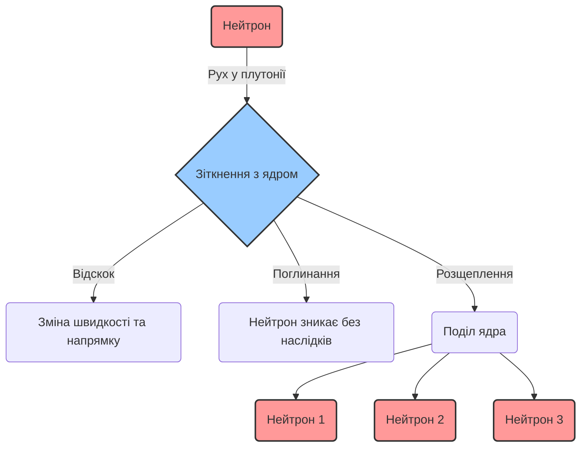
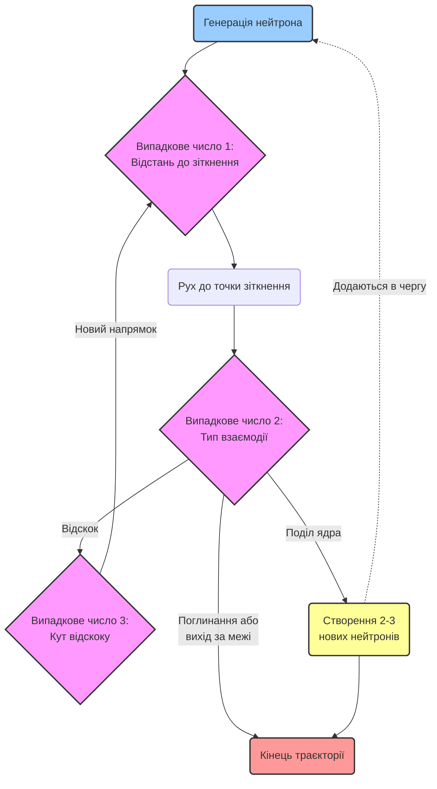

# Лекція 0: Еволюція обчислень. Від перших ЕОМ до сучасних Хмар

> **Декларація курсу.** Академічна доброчесність та авторство матеріалів — у [DISCLAIMER.md](DISCLAIMER.md).

**Питання для розминки 1:**
Уявіть, що ви перетасовуєте стандартну колоду з 52 карт для пасьянсу. Як ви вважаєте, скільки існує унікальних комбінацій (варіантів послідовності карт) у цій колоді?

<b>Дізнатися відповідь</b>

Кількість комбінацій дорівнює факторіалу 52 (52!). Це приблизно **8 × 10^67** (вісімка з 67 нулями). Це число настільки гігантське, що перевищує кількість атомів у нашій галактиці. Саме через таку неймовірну складність прямого перебору класичні аналітичні підходи тут безсилі.

**Питання для розминки 2:**
У 1990-х роках відеокарти створювалися виключно для рендерингу 3D-графіки в іграх. Чому ж сьогодні саме ці пристрої стали головним рушієм для навчання гігантських нейромереж (LLM), таких як ChatGPT, витіснивши класичні процесори (CPU)?

<b>Дізнатися відповідь</b>

Справа в **архітектурі паралелізму**. CPU має кілька дуже потужних ядер, здатних виконувати складні логічні завдання послідовно. Натомість GPU має тисячі простіших ядер. Навчання та робота LLM вимагає виконання мільярдів однотипних математичних операцій (множення матриць) одночасно. З цим відеокарти, які колись розроблялися, щоб паралельно рахувати колір пікселів на екрані, справляються на порядки швидше. Це класичний приклад еволюції архітектури під тип навантаження.

---

## Мангеттенський проєкт

> [!NOTE]
> **Історична довідка:** Мангеттенський проєкт — таємна програма уряду США часів Другої світової війни з розробки першої атомної зброї. Проєкт об'єднав найвидатніших науковців епохи у лабораторії в Лос-Аламосі.

Перші атомні бомби 1945 року (які скинули на [Хіросіму та Нагасакі](https://uk.wikipedia.org/wiki/Ядерне_бомбардування_Хіросіми_і_Нагасакі)) створювалися методом наближень та грубої сили (trial-and-error). Вчені тоді не могли точно розв'язати рівняння, тому використовували величезні команди дівчат-калькуляторів з механічними арифмометрами, які робили наближені підрахунки. Бомба ["Товстун" (Nagasaki)](https://uk.wikipedia.org/wiki/Товстун_(бомба)) була дуже неефективною, і її конструкція спиралася багато в чому на інтуїцію фізиків та емпіричні експерименти з плутонієм, які часто закінчувалися трагічно (наприклад, інциденти з ["Ядром-демоном"](https://uk.wikipedia.org/wiki/%D0%AF%D0%B4%D1%80%D0%BE-%D0%B4%D0%B5%D0%BC%D0%BE%D0%BD)).

Але в 1946 році фокус Лос-Аламоса змінився. Вони почали розробляти термоядерну (водневу) зброю (проєкт "Super"). У водневій бомбі процеси на порядки складніші: там відбувається спочатку поділ, а потім синтез за екстремальних температур. Старі методи наближень тут уже не працювали взагалі. Фізикам була потрібна точна математична модель того, як поводитимуться нейтрони в цих нових умовах, і саме на цій задачі аналітична математика остаточно "зламалася".

Уявіть нейтрон, який рухається крізь товщу плутонію. На кожному мікрокроці він може:
1. Зіткнутися з ядром і відскочити, змінивши швидкість.
2. Бути просто поглинутим ядром.
3. Розщепити ядро, вивільнивши 2-3 нових нейтрони (початок ланцюгової реакції).

Ймовірність кожної події постійно змінюється залежно від енергії нейтрона та геометрії матеріалів. Багатовимірні інтегро-диференціальні рівняння, які описували цей хаотичний каскад, були настільки громіздкими, що **класична аналітична математика впиралася у глухий кут** — вивести для них точну формулу на папері було неможливо.

У цей час математик **Станіслав Улам**, який був частиною проєкту, відновлюючись після важкої хвороби, грав у пасьянс. Він задав собі питання: *"Як з'ясувати до того, як я почну розкладати пасьянс, чи зійдеться він успішно? І скільки взагалі існує можливих комбінацій?"* Зрозумівши, що знайти аналітичну формулу неможливо, він запропонував революційну ідею: **не виводити формулу, а симулювати велику кількість випадкових варіантів**. 
Разом із **Джоном фон Нейманом** (автором архітектури сучасних комп'ютерів, яка базується на принципах машини Тюрінга) вони застосували цей метод до розрахунку траєкторій нейтронів, назвавши його **"Монте-Карло"**.

### Алгоритм Монте-Карло для симуляції нейтронів

Замість того, щоб описувати всю масу нейтронів одним надскладним диференціальним рівнянням, вчені вирішили моделювати **долю кожного окремого нейтрона кроками**, покладаючись на генератор випадкових чисел (як у рулетці казино, звідси й назва). 

Алгоритм для одного нейтрона виглядає так:
1. **Старт:** Нейтрон "народжується" у певній точці простору з певною енергією.
2. **Пробіг:** Генерується *випадкове число*, яке визначає, яку відстань пролетить нейтрон до наступного зіткнення.
3. **Взаємодія:** У точці зіткнення генерується *інше випадкове число*, яке (з урахуванням фізичних ймовірностей) вирішує долю нейтрона: відскок, поглинання або поділ ядра.
4. **Повторення:** Якщо стався відскок — генерується *третє випадкове число* для кута розсіювання, і цикл повторюється. Якщо поділ — народжуються нові нейтрони, які додаються в чергу симуляції.
5. **Кінець:** Історія нейтрона закінчується, коли він поглинається або вилітає за межі матеріалу.

Зробивши мільйони таких індивідуальних симуляцій, фізики отримували точну статистичну картину замість аналітичної формули.

---

## Перші кроки: Монте-Карло на ENIAC

Задачу потрібно було десь обчислювати. У 1947 році метод Монте-Карло запустили на **ENIAC** — першому масштабному електронному комп'ютері.

Як це виглядало тоді:
- **Швидкодія та операції:** Машина виконувала базові арифметичні дії (додавання, віднімання, множення, ділення та добування квадратного кореня). ENIAC міг виконувати близько **5000 додавань за секунду** (сучасні процесори виконують мільярди).
- **Зберігання інформації:** Внутрішня пам'ять була мізерною — всього **20 чисел** (по 10 десяткових розрядів). Вхідні дані, проміжні результати та логіка частково зберігалися на **перфокартах**.

- **Ручне програмування:** "Написання" програми означало фізичне перемикання реальних кабелів та тумблерів на панелях. Процес налаштування задачі міг займати тижні.
- **Жодного State Management:** Якщо на 999-й ітерації згорала одна з 18 000 вакуумних ламп — **весь розрахунок втрачався**. Не існувало жодних механізмів збереження стану (чекпойнтів) або автоматичного повторення (ретраїв).

---

## Еволюція абстракцій: від ламп до Хмар

Математична суть Монте-Карло не змінилася з 1946 року. Але інженерні інструменти пройшли колосальний шлях. Ми спостерігаємо постійну еволюцію **архітектури та інженерних трейд-оффів**:

1. **1970–1990 (Суперкомп'ютери):** 
   Ера гігантських мейнфреймів (на кшталт Cray-1 або IBM System/360). **Масштабування було виключно вертикальним**. 
   - *Що саме додавали:* Більші модулі оперативної пам'яті, швидші центральні процесори (або спеціалізовані векторні процесори), місткіші магнітні диски.
   - *Як це реалізовувалось:* Апгрейд вимагав повної зупинки системи. Інженери фізично відкривали величезні шафи мейнфрейму і вставляли нові плати у внутрішню шину. Програми часто доводилося переписувати під специфічну архітектуру нового "заліза". Коли ліміт слотів, енергоспоживання чи охолодження було вичерпано — єдиним варіантом було купувати новий, ще дорожчий монолітний комп'ютер.
2. **2000-ні (ГРІД-системи):** 
   Народження Гріда. Замість одного суперкомп'ютера за мільйони доларів, об'єднали **десятки тисяч звичайних домашніх ПК через Інтернет (горизонтальне масштабування)**. Це породило нові виклики: гетерогенне залізо та постійні відмови вузлів (воркерів). Найвідоміші приклади:
   - **[SETI@home](https://uk.wikipedia.org/wiki/SETI@home):** Аналіз космічних радіосигналів у пошуках позаземного розуму. Комп'ютери волонтерів рахували дані замість того, щоб просто показувати скрінсейвер.
   - **[Folding@home](https://uk.wikipedia.org/wiki/Folding@home):** Розподілена симуляція згортання білків для пошуку ліків. Грід-обчислення були тут основним методом, поки вчені не знайшли кардинально кращий шлях — ШІ-модель **[AlphaFold 2](https://uk.wikipedia.org/wiki/AlphaFold)**, яка розв'язала задачу складання білків без потреби симулювати кожен рух молекули на мільйонах ПК.
   - **Сучасне застосування (ML & AI):** Сьогодні ідеї Гріда (розбиття надважкої задачі на тисячі паралельних процесів) лягли в основу **розподіленого машинного навчання (ML)**. Тренування гігантських мовних моделей (LLM) відбувається шляхом об'єднання тисяч відеокарт (GPU) у єдиний обчислювальний простір.
3. **2010-ті – сьогодення (Хмари, Мікросервіси та Kubernetes):** 
   Обчислення масово переходять у Cloud (AWS, GCP, Azure). Замість ручного налаштування "заліза", інфраструктура стає кодом (IaC). Задача описується як декларативний граф (DAG). Хмара сама керує ресурсами: миттєво створює тисячі віртуальних серверів під навантаження та знищує їх після завершення. Це народжує нову парадигму FinOps — ми платимо лише за секунди реальних обчислень.

---

### Порівняльний аналіз архітектур (Інженерні трейд-оффи)

Кожен етап еволюції вирішував попередні проблеми, але неминуче створював нові. У світі інженерії немає "срібної кулі", є лише компроміси (trade-offs). Якби нова технологія була абсолютно кращою в усьому, попередні б просто зникли. Але оскільки це завжди питання компромісу, старі підходи (як-от мейнфрейми) досі існують і успішно працюють, наприклад, у банківському секторі.

| Характеристика | Мейнфрейми (1980-ті) | Грід-системи (2000-ні) | Хмари та Kubernetes (Сучасність) |
| :--- | :--- | :--- | :--- |
| **Тип системи** | Централізована (Моноліт) | Децентралізована (Розподілена) | Оркестрована розподілена система (Еластичний Shared-Pool) |
| **Масштабування** | Вертикальне (купівля плат/процесорів) | Горизонтальне (об'єднання тисяч ПК) | Еластичне горизонтальне (Автоскейлінг) |
| **Точка відмови** | Single Point of Failure (впав сервер = впало все) | Часті відмови окремих вузлів (ПК) | Втрата віртуального вузла — це норма (Self-healing) |
| **Головна біль** | Фізичні ліміти та астрономічна ціна | Мережа "завжди бреше" (втрата пакетів) | Shared Mutable State та "Галасливі сусіди" (Noisy Neighbors) |
| **Стан (State)** | Stateful (дані завжди в пам'яті) | Batch-чекпойнти | Stateless (Безстановість, Immutability) |

**Чому ми відмовилися від Мейнфреймів?**
У моноліті виклик функції займає наносекунди і ніколи не губиться. Але якщо цей комп'ютер ламався — зупинявся весь бізнес. Щоб уникнути єдиної точки відмови, ми розбили великого монстра на мережу менших машин.

**У чому пастка Грід-систем?**
Ми отримали горизонтальне масштабування, але натомість стали залежними від мережі. А мережа **завжди бреше**: вона затримує пакети, відключається або спотворює дані. Відмова вузла під час прорахунку стала щоденною рутиною, що змусило інженерів писати надскладні планувальники (наприклад, Slurm з алгоритмом DRF). *(У сучасних кластерах для ШІ та LLM цю проблему вирішують через **топологічну локальність** — планувальник максимально групує пов'язані задачі на одному сервері чи фізичній стійці, а також використовує спеціалізовані надшвидкі мережі типу InfiniBand, де відеокарти обмінюються даними безпосередньо, минаючи стандартні мережеві протоколи TCP/IP).*

**Що змінив Kubernetes (K8s)?**
Він став **операційною системою для кластера**. Коли у вас 2 сервіси — ви керуєте ними вручну. Коли їх 2000 — потрібен диригент. K8s автоматично перезапускає сервіси, що впали, ізолює ресурси та змушує нас писати код безстаново (Stateless). Якщо сервіс не зберігає стан локально, K8s може вбити його в будь-яку секунду і миттєво підняти копію на іншому сервері без втрати даних.

---

## Наша мета: відтворити історію на сучасних технологіях

У рамках цього курсу ми пройдемо цей шлях еволюції власноруч. Ми детально розберемося у кожній архітектурній парадигмі та спробуємо застосувати її на практиці до класичної ідеї симуляції Монте-Карло — цього разу для **аналізу надійності масштабних енергомереж**. 

Ми пройдемо шлях від одиночного Python-процесу на вашому ноутбуці до побудови **стійкого до відмов хмарного кластера**. Цей кластер дозволить суттєво прискорити прорахунок каскадних відмов масштабної енергосистеми, використовуючи сучасні Cloud & Grid технології.

---

## Контрольні питання

<b>1. Чому метод Монте-Карло замінив аналітичний підхід при розробці складних фізичних систем?</b>

Через кризу складності. Аналітичні рівняння для термоядерних реакцій чи комбінаторики були математично нерозв'язними. Виявилося, що замість складної формули набагато ефективніше провести тисячі випадкових симуляцій (спроб) і отримати високоточну практичну ймовірність.

<b>2. У чому різниця між вертикальним та горизонтальним масштабуванням?</b>

**Вертикальне масштабування** — додавання пам'яті чи CPU до одного сервера (так працювали мейнфрейми).
**Горизонтальне масштабування** — додавання нових серверів у мережу (так працює Грід і сучасні Хмари).

<b>3. Який головний біль принесло горизонтальне масштабування (Грід-системи)?</b>

Мережа, яка "завжди бреше" (затримка та втрата пакетів) і щоденна відмова вузлів (ПК). Якщо в моноліті виклик функції миттєвий і надійний, то в Гріді вузол міг відключитися від Інтернету просто під час обчислення.

<b>4. Чому код для Kubernetes (K8s) обов'язково має бути Stateless (безстановим)?</b>

K8s працює за принципом "втрата вузла — це норма". Він може в будь-яку мить вбити сервіс для балансування навантаження. Якщо сервіс зберігав би стан у своїй пам'яті, дані б втратились. Безстановість дозволяє K8s миттєво піднімати точні копії застосунку на будь-якому іншому сервері кластера.

