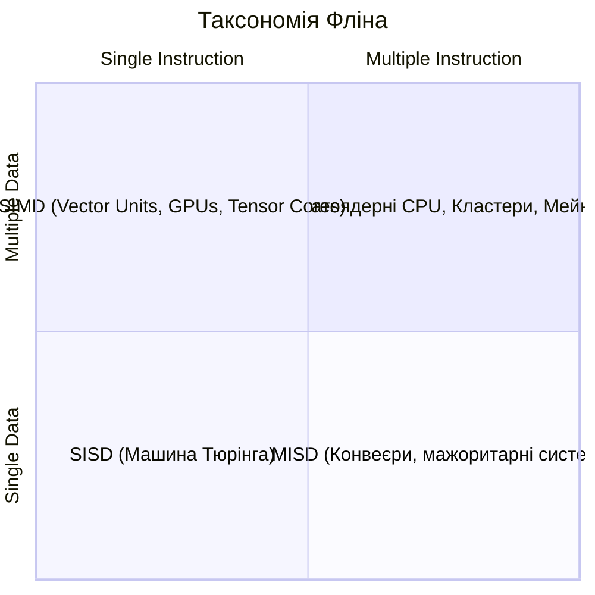
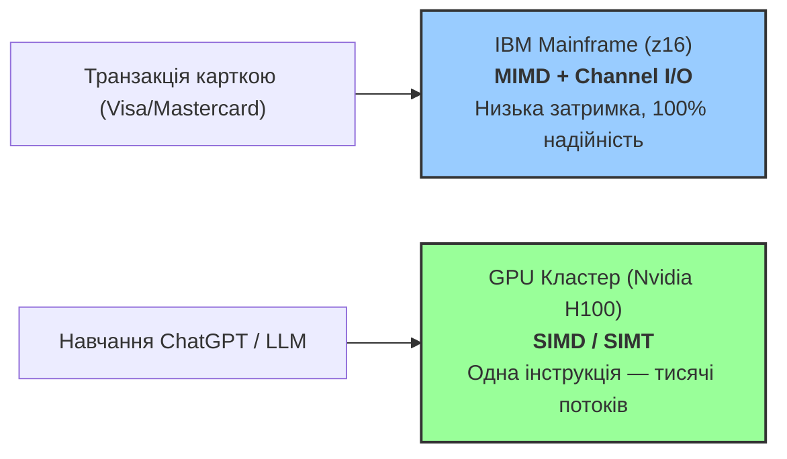
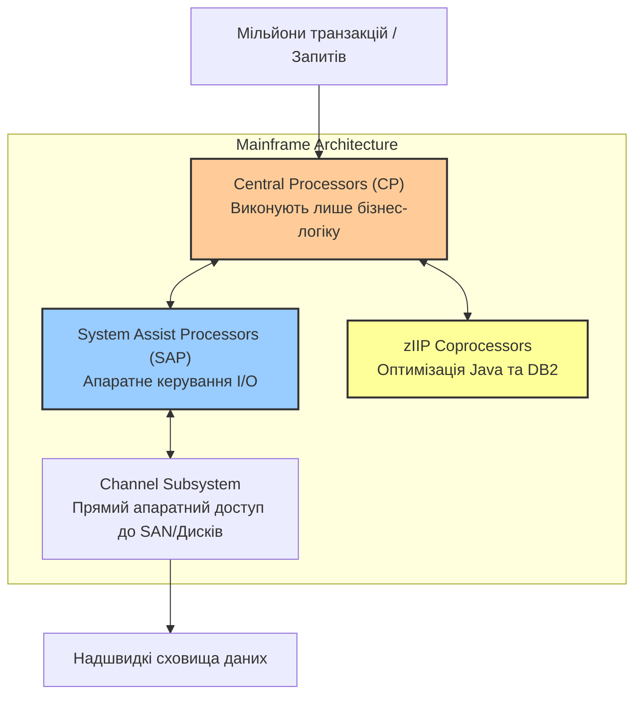

# Лекція 1: Таксономія Фліна. Анатомія сучасних ПК, Мейнфреймів та Прискорювачів

> **Декларація курсу.** Академічна доброчесність та авторство матеріалів — у [DISCLAIMER.md](DISCLAIMER.md).

**Питання для розминки 1:**
Ви купуєте новий смартфон із 8-ядерним процесором, але запуск звичайного додатка не стає у 8 разів швидшим. Чому розробники не розпаралелюють кожен мобільний застосунок на всі доступні ядра CPU?

<details markdown="1">
<summary><b>Дізнатися відповідь</b></summary>

Причина на стику **економіки** і **заліза**:

1. **Імперативний код** — інструкція B чекає на результат A. Паралелити таке автоматично не вийде.
2. **Time-to-market** — фіча важливіша за мікрооптимізацію. Розробник дорожчий за ядро CPU.
3. **Memory Wall** — ядра швидкі, RAM повільна. Більшість часу — чекання на дані (*cache miss*).
</details>

**Питання для розминки 2:**
Уявіть, що ви розробляєте бортовий комп'ютер для пасажирського літака. Чому інженери змушують 3–4 окремі процесори одночасно обробляти одні й ті самі показники датчиків за допомогою різних програмних алгоритмів?

<details markdown="1">
<summary><b>Дізнатися відповідь</b></summary>

Це **мажоритарне голосування**. Три–чотири процесори рахують одне й те саме різними алгоритмами. Збій у одному — аномальний результат відсікається (2 з 3).
</details>

---

## Таксономія Фліна (Flynn's Taxonomy)

У 1966 році Майкл Флін розділив усі обчислювальні системи за двома ознаками:
1. **Потік інструкцій (Instruction Stream)** — послідовність команд, які виконує процесор.
2. **Потік даних (Data Stream)** — послідовність вхідних даних, над якими виконуються команди.

Кожен потік може бути **одиничним (Single)** або **множинним (Multiple)**. Це дає 4 класи архітектур:



---

### 1. SISD (Single Instruction, Single Data)
- **Принцип:** Один потік інструкцій обробляє один потік даних.
- **Представники:** **ENIAC** (1945) — послідовна машина класу SISD, але ще **до** архітектури фон Неймана: програму задавали перемикачами й кабелями, а не кодом у пам'яті (див. [лекцію 0](./00_intro.md#перші-кроки-монте-карло-на-eniac)). Пізніше — класичний одноядерний комп'ютер фон Неймана (Intel 8086).
- **Суть:** Процесор послідовно виконує одну команду над одним елементом даних. У **архітектурі фон Неймана** програма (інструкції) і дані лежать у **одній спільній пам'яті** — це не стек викликів, а принцип «збереженої програми»: код можна змінювати так само, як числа в RAM.
- **Обмеження:** На кремнієвій (Silicon) напівпровідниковій технології SISD-парадигма вперлася у "бар'єр частоти" (Thermal / Frequency Wall) — підняти частоту ядра понад 4–5 ГГц стало неможливо через критичне виділення тепла та витік струму. Альтернативні матеріали та концепції (вуглецеві нанотрубки/графен, оптичні/фотонні процесори) потенційно долають цей бар'єр, але вони досі перебувають на стадії лабораторних досліджень і не готові до масового комерційного виробництва.

### 2. SIMD (Single Instruction, Multiple Data)
- **Принцип:** Одна інструкція виконується одночасно над багатьма елементами даних.
- **Представники:** Векторні процесори (Cray-1), розширення CPU (AVX-512, ARM NEON), графічні процесори (GPU).
- **Суть:** Замість того, щоб у циклі додавати 500 чисел по одному, процесор виконує одну команду `VADD`, яка додає два вектори з 500 чисел за один такт.
- **CPU (Скаляри) vs GPU (Вектори):**
  - **CPU (Скалярний майстер):** Оптимізований під *скалярні* обчислення та мінімальну затримку (Latency). Одне ядро CPU прорахує поодиноку складну функцію (наприклад, `y = sin(x)`) швидше за GPU завдяки високій частоті, великому кешу та **SFU** (Special Function Unit — апаратний блок для `sin`, `cos`, `√` тощо).
  - **GPU (Векторний конвеєр):** Оптимізований під *векторні* обчислення та масову пропускну здатність (Throughput). Прорахувати `sin(x[i])` для 10 000 000 елементів GPU зробить у десятки разів швидше за CPU, оскільки робить це одночасно тисячами ядер.
- **Трейд-офф:** Забезпечує колосальну обчислювальну щільність для однотипних масивів, але дуже чутливий до **Data Divergence** (якщо дані вимагають різних розгалужень `if/else`, продуктивність падає до рівня SISD).

### 3. MISD (Multiple Instruction, Single Data)
- **Принцип:** Кілька потоків інструкцій обробляють один і той самий потік даних.
- **Представники:**
  - **Мажоритарні системи** (TMR — Triple Modular Redundancy): бортові комп'ютери літаків, **захист АЕС**, де кілька незалежних каналів рахують одне й те саме різними шляхами.
  - **Потокові конвеєри аналізу** — антифрод у банку, перевірки на біржі; історично перехоплений шифротекст. Одна подія в потоці, на кожній стадії своя програма (детальніше — у блоці «Навіщо конвеєр?» нижче).
  - **Окремі космічні місії з апаратним резервуванням** — не будь-який супутник, а зонди, де ремонт неможливий (наприклад, Voyager).
- **Суть:** Один потік подій, кілька **різних** програм його обробляють — послідовно (конвеєр) або паралельно з голосуванням (мажоритарна схема).
- **Навіщо конвеєр?** Одна подія в реальному часі мусить пройти **багато незалежних перевірок**, швидше, ніж якби кожну ганяли окремо:
  - **Банк / платіж:** одна транзакція → **AML** (Anti-Money Laundering — перевірка на відмивання коштів) → скоринг шахрайства → перевірка санкційних списків → ліміти — різні алгоритми, **ті самі** сума, рахунок, час.
  - **Біржа:** один тик котировки → ризик-модуль → детектор маніпуляцій → комплаєнс — знову один потік ринкових даних, різні «інструкції» на кожній стадії.
  - **АЕС (захист реактора):** одні й ті самі датчики (нейронний потік, тиск, температура) → **кілька незалежних каналів безпеки** з різним залізом і програмами → голосування «2 з 3» → команда **SCRAM** (аварійне зупинення). Помилка одного каналу не повинна зупинити станцію; збіг двох — сигнал до дії. Це MISD через **надійність**, не через швидкість конвеєра.
  - **Історично (криптоаналіз):** перехоплений зашифрований трафік → перебір ключа → частотний аналіз → зіставлення з шаблоном — щоб **розшифрувати або знайти підозрілий** трафік у потоці.
- **Як це виглядає:** подія «тече» крізь стадії A → B → C; у кожної своя програма, на вході **одні й ті самі дані**. Це MISD: **Multiple Instruction**, **Single Data**.
- **Чому не всі супутники?** Більшість супутників і CubeSat — звичайний бортовий комп'ютер (SISD або MIMD): одна програма, один потік задач. MISD тут — **виняток для fault tolerance**: коли апарат свідомо дублюють, щоб радіація або збій одного чипа не вбив місію. Так роблять далекі зонди (Voyager), частина марсоходів, критична військова/avionics техніка — там, де ціна помилки астрономічна.
- **Кейс Voyager 1 (NASA):** Космічний зонд, який працює у міжзоряному просторі вже понад 47 років, спирається на **трикратне дублювання** бортових комп'ютерів (**CCS** — Computer Command Subsystem, підсистема командного керування). Єдиний потік телеметрії обробляється паралельними алгоритмами; рішення приймається за голосуванням. Коли у 2024 році на відстані 24 мільярдів кілометрів вийшов з ладу чип пам'яті, інженери NASA віддалено перерозподілили навантаження на резервні блоки — і місію врятували.
- **Трейд-офф:** Рідкісний клас у комерційному залізі, використовується переважно для забезпечення критичної відмовостійкості та специфічної потокової обробки.

### 4. MIMD (Multiple Instruction, Multiple Data)
- **Принцип:** Кілька незалежних процесорів виконують власні потоки інструкцій над власними потоками даних.
- **Представники:** Багатоядерні CPU, мейнфрейми, суперкомп'ютерні кластери, Грід-мережі, Хмари.
- **Суть:** Повна автономність обчислювальних вузлів. Кожне ядро має свій покажчик команд (Program Counter) та працює зі своєю ділянкою пам'яті або власною адресною просторою.
- **Трейд-офф:** Найвища гнучкість, але створює проблему **Shared Mutable State** (стан, що змінюється спільно) та вимагає складних механізмів синхронізації (м'ютекси, бар'єри, обмін повідомленнями).

---

У відповідях на розминку вже згадувалися **MIMD** (багатоядерний смартфон) та **MISD** (мажоритарне голосування на борту літака). Тепер ці скорочення мають визначення. Далі — два реальні кейси, де архітектуру обирають не з моди, а з навантаження.

## Кейс: Чому Wall Street купує Мейнфрейми, а OpenAI — кластери Nvidia?

> [!NOTE]
> **Архітектурний фокус:** «Найкращого» комп'ютера не існує. Є відповідність між потоком інструкцій, потоком даних і конкретним навантаженням.

У 2012-му AlexNet переніс навчання нейромережі на GPU Nvidia — матричні операції на відеокарті йшли **вдесятеро швидше**, ніж на CPU. Саме ця швидкість **зламала** стару логіку: глибокі мережі раптом стали практичними, і комп'ютерний зір пішов іншим шляхом.

А коли ви платите карткою в магазині — транзакція йде через **IBM z16**, не через GPU-кластер. 



Чому так відбувається? 
- **GPU (SIMD / SIMT)** — мільярди однакових операцій над масивами. **SIMD** — одна інструкція над вектором даних; **SIMT** (*Single Instruction, Multiple Threads*) — те саме на GPU, але програміст пише окремі *потоки*, а залізо збирає їх у групи (**warp**) і виконує синхронно. Тут добре заходить [**функціональний стиль**](https://vplanto.github.io/functional_programming/01_immutability_and_state.html): immutable-дані, чисті функції, `map`/`transform`. З'являться `if/else`, mutable-стан і хаотичний I/O — GPU просідає.
- **Mainframe (MIMD + I/O offload)** — ядра не чекають на диск. Синергія **z/OS**, конвеєра інструкцій і **супроцесорів**, які забирають I/O на себе. Мільйони транзакцій без простою.

---
## Анатомія сучасного ПК: Гібридний MIMD/SIMD комплекс

> [!NOTE]
> **Фундаментальна математична основа:** 
> - **CPU (Машина Тюрінга & Архітектура фон Неймана):** Залізо CPU оптимізоване під **послідовні мутації стану (Mutable State)**, умовні розгалуження та точкову роботу з оперативною пам'ятью.
> - **GPU (Лямбда-числення Алонзо Черча):** Залізо GPU набагато ближче до [**безстанового функціонального обчислення**](https://vplanto.github.io/functional_programming/01_immutability_and_state.html) (Stateless / Pure Functions) — масової трансформації незмінних векторизованих даних (`map/transform`) без побічних ефектів мутації пам'яті.

Проте на практичному рівні сучасний персональний комп'ютер чи ноутбук вже давно вийшов за межі простої одноядерної SISD-машини. Це **багаторівнева гібридна система**:

```
 ┌──────────────────────────────────────────────────────────────────────────────┐
 │                              Сучасний ПК (Node)                              │
 │                                                                              │
 │  ┌──────────────────────────────────────┐   ┌─────────────────────────────┐  │
 │  │           CPU (MIMD Ядра)            │   │        GPU (SIMD/SIMT)      │  │
 │  │ ┌──────────────────────────────────┐ │   │  ┌───────────────────────┐  │  │
 │  │ │        Physical Core 1           │ │   │  │  Streaming Multiproc. │  │  │
 │  │ │  ┌─────────────┐ ┌─────────────┐ │ │   │  │ ┌───────┐ ┌───────┐   │  │  │
 │  │ │  │ vCore 1 (T0)│ │ vCore 2 (T1)│ │ │   │  │ │ Core  │ │ Core  │...│  │  │
 │  │ │  └─────────────┘ └─────────────┘ │ │   │  │ └───────┘ └───────┘   │  │  │
 │  │ │  ┌─────────────────────────────┐ │ │   │  └───────────────────────┘  │  │
 │  │ │  │     AVX-512 (SIMD Unit)     │ │ │   └─────────────────────────────┘  │
 │  │ │  └─────────────────────────────┘ │ │                                    │
 │  │ └──────────────────────────────────┘ │                                    │
 │  └──────────────────────────────────────┘                                    │
 └──────────────────────────────────────────────────────────────────────────────┘
```

1. **CPU (MIMD-рівень):** Процесор містить множину фізичних ядер (від кількох у мобільних чіпах до десятків і сотень у серверних CPU). Завдяки технологіям мультипотоковості (SMT / Hyper-Threading) кожне фізичне ядро може надавати ОС по кілька **vCore (віртуальних ядер / апаратних потоків)**. ОС бачить їх як окремі MIMD-процесори, які ділять конвеєр виконання для усунення простоїв.
2. **Vector Registers у CPU (SIMD-рівень):** Усередині кожного MIMD-ядра є векторні блоки (наприклад, Intel AVX-512 або ARM NEON). 
   - *Навіщо:* Замість послідовної обробки чисел по одному, ядро за один такт обробляє блок даних (наприклад, 512 біт = 16 чисел `float32` одночасно).
   - *Коли і де використовується:* Обробка та кодування аудіо/відео (H.264/H.265), апаратне шифрування (AES/SHA), надшвидке парсування JSON (наприклад, бібліотека `simdjson` зчитує ГБ/с на CPU) та векторні фільтри в аналітичних базах даних (ClickHouse, DuckDB).
3. **GPU прискорювач (SIMD/SIMT-рівень):** Дискретна або інтегрована відеокарта містить тисячі простих обчислювальних блоків (**CUDA cores**), згрупованих у **Streaming Multiprocessors (SM)** — на схемі вище. Всередині SM потоки об'єднуються у **warp** і виконують одну інструкцію над тисячами пікселів чи елементів матриць.
   - **SIMT** (*Single Instruction, Multiple Threads* — одна інструкція, багато потоків): модель Nvidia. Ви пишете код «кожен потік рахує свій `i`-й елемент», а GPU **планувальник** збирає потоки в warp і виконує їх як один вектор — SIMD «знизу», SIMT «зверху» в API (CUDA, OpenCL).
   - **Warp** (варп) — **32 потоки**, що крокують **синхронно**: одна інструкція на всі 32. Якщо в warp різні гілки `if/else` — залізо проходить їх **по черзі** (*warp divergence*); це й є **Data Divergence** з розділу SIMD вище.
   - **Thread vs core:** «потік» у CUDA — логічна одиниця роботи; фізичне ядро GPU обслуговує десятки потоків, перемикаючись між warp'ами — тому їх тисячі, а не тисячі повноцінних MIMD-ядер.
   - *Приклад:* [GPU Process у браузері](https://vplanto.github.io/java_script/01b_html_dom.html) (Chrome, Firefox) — шари сторінки, композитинг, CSS-анімації. 60–120 FPS без цього не вийде.

---

## Мейнфрейми: Чому вони досі живі?

Студенти часто думають, що **мейнфрейм** — релікт 1970-х. Ні. IBM z16 (2022) — це MIMD для задач, де downtime взагалі неприпустимий.



### Ключові інженерні секрети Мейнфреймів:

1. **Апаратне відвантаження I/O (Channel I/O):**
   У звичайному ПК читання з диска викликає переривання CPU, змушуючи його витрачати такти на переключення контексту. У мейнфреймі центральний процесор (CP) лише відправляє команду в спеціалізований **Channel Processor (SAP)** і миттєво повертається до бізнес-логіки. SAP сам керує дисками та мережею на апаратному рівні.
2. **Принцип RAS (Reliability, Availability, Serviceability):**
   Мейнфрейми розраховані на **Zero Downtime** (нуль секунд простою). Вони мають дубльовані канали живлення, оперативну пам'ять із корекцією помилок (RAIM) та дубльовані обчислювальні блоки на одному кристалі (Lockstep Execution). Якщо один транзистор згорає, система **автоматично** переключається на резервний блок — без збою транзакції.
3. **Апаратна десяткова арифметика:**
   Звичайні CPU працюють із числами з плаваючою крапкою в двійковій системі (IEEE 754), що створює помилки округлення (наприклад, `0.1 + 0.2 = 0.30000000000000004`). Мейнфрейми мають апаратну підтримку **Packed Decimal** (упакований десятковий формат, BCD) — кожна цифра зберігається в окремому напівбайті, арифметика **десяткова**, не двійкова. Фінансові суми рахуються з точністю до цента на рівні заліза.

---

## Порівняльна матриця обчислювальних платформ

| Критерій | Сучасний ПК / Сервер (x86/ARM) | GPU прискорювач (Nvidia H100) | IBM Mainframe (z16) | Кластер / Хмара (Kubernetes) |
| :--- | :--- | :--- | :--- | :--- |
| **Класифікація Фліна** | MIMD (з SIMD розширеннями) | SIMD / SIMT (одна інструкція — багато потоків у warp) | MIMD (з апаратним I/O offloading) | MIMD (Distributed Memory) |
| **Основна сильна сторона** | Універсальність, низька latency для 1 потоку | Величезна математична щільність (TFLOPS) | 100% надійність (RAS) та колосальний I/O throughput | Необмежене еластичне горизонтальне масштабування |
| **Слабке місце** | Обмеження вертикального масштабування | Продуктивність падає при розгалуженні (`if/else`) | Астрономічна вартість, вендор-лок | Мережева затримка, відмови воркерів |
| **Сфера застосування** | Microservices, Web API, розробка | AI/ML, 3D рендеринг, фізичні симуляції | Core Banking, транзакції карточок, білінг | Cloud-Native системи, Big Data (Spark, Ray) |

---

## Підсумок лекції

1. **Таксономія Фліна** поділяє системи за потоками інструкцій та даних (SISD, SIMD, MISD, MIMD).
2. **Сучасні ПК** — це гібриди: MIMD-процесор містить усередині SIMD-векторні блоки та підключений до SIMD-відеокарти.
3. **Мейнфрейми** досі утримують фінансовий сектор завдяки апаратному відвантаженню I/O та нульовому простою (RAS).
4. **Хмарні системи та Грід** будуються як MIMD-мережі з розподіленою пам'яттю. Головний виклик — мережева затримка, синхронізація стану та відмови вузлів.

---

## Контрольні питання

<details markdown="1">
<summary><b>1. Чому спроба виконати код із великою кількістю умовних операторів (if/else) на GPU призводить до різкого падіння швидкодії?</b></summary>

GPU належить до **SIMD / SIMT**: потоки згруповані у **warp** (зазвичай 32), і всі в одному warp мусять виконувати **одну й ту саму** інструкцію за такт. Якщо виникає розгалуження `if/else`, warp проходить гілки **послідовно** (*warp divergence*) — це **Data Divergence**, і перевага паралелізму зникає.
</details>

<details markdown="1">
<summary><b>2. Чому центральний процесор IBM Mainframe витрачає менше часу на I/O (введення-виведення), ніж звичайний серверний процесор Intel Xeon?</b></summary>

У мейнфреймах використовується канальна архітектура (Channel I/O). Усі операції з дисками, мережею та периферією відвантажуються на спеціалізовані супроцесори (SAP — System Assist Processors). Центральний процесор мейнфрейму лише віддає команду та продовжує виконувати код без очікування переривань від диска.
</details>

<details markdown="1">
<summary><b>3. До якого класу за Фліном належить обчислювальний кластер з 1000 Linux-серверів, що обмінюються даними через мережу?</b></summary>

До класу **MIMD (Multiple Instruction, Multiple Data)** з розподіленою пам'ятью (Distributed Memory MIMD). Кожен сервер виконує власний потік інструкцій над власною оперативною пам'ятью.
</details>

<details markdown="1">
<summary><b>4. Чому стандартний двійковий формат чисел з плаваючою крапкою (IEEE 754), що використовується у звичайних CPU, неприйнятний для банківських мейнфреймів без додаткової обробки?</b></summary>

Двійковий формат IEEE 754 не може точно представити деякі десяткові дроби (наприклад, `0.1` або `0.01`), створюючи мікроскопічні помилки округлення в останніх розрядах. У мільярдах фінансових транзакцій ці копійчані накопичені помилки неприпустимі. Мейнфрейми використовують апаратну підтримку упакованого десяткового формату (Packed Decimal) для точних обчислень.
</details>
