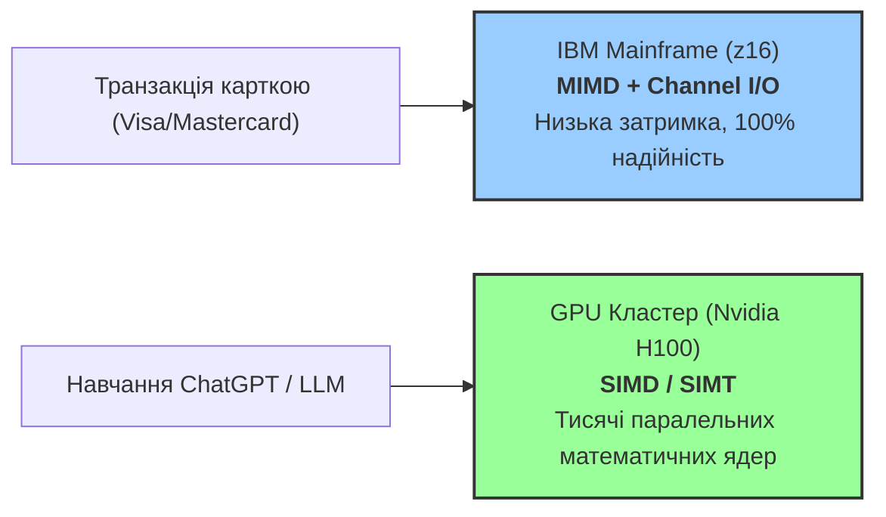

# Лекція 1: Таксономія Фліна. Анатомія сучасних ПК, Мейнфреймів та Прискорювачів

> **Декларація курсу.** Академічна доброчесність та авторство матеріалів — у [DISCLAIMER.md](DISCLAIMER.md).

**Питання для розминки 1:**
Ви купуєте новий смартфон із 8-ядерним процесором, але запуск звичайного додатка не стає у 8 разів швидшим. Чому розробники не розпаралелюють кожен мобільний застосунок на всі доступні ядра CPU?

<details markdown="1">
<summary><b>Дізнатися відповідь</b></summary>

Причина лежить на стику **економіки розробки** та **архітектури заліза**:

1. **Імперативна природа коду:** Класичні програми будуються на послідовній зміні стану. Якщо інструкція B залежить від результату інструкції A, їх неможливо автоматично виконати паралельно на 8 ядрах.
2. **Time-to-Market та короткий життєвий цикл:** У сучасній інженерії швидкість випуску фічі важливіша за низькорівневу оптимізацію. Час розробника коштує дорожче за залізо, тому ніхто не вкладається у складне ручне розпаралелювання типового UI-коду.
3. **Прірва пам'яті (Memory Wall):** Обчислювальні ядра процесора працюють на порядки швидше за оперативну пам'ять (DRAM). Більшість часу ядра простаюють у чеканні вибірки даних з RAM (*Cache Miss*).
</details>

**Питання для розминки 2:**
Уявіть, що ви розробляєте бортовий комп'ютер для пасажирського літака. Чому інженери змушують 3–4 окремі процесори одночасно обробляти одні й ті самі показники датчиків за допомогою різних програмних алгоритмів?

<details markdown="1">
<summary><b>Дізнатися відповідь</b></summary>

Це робиться задля **безпеки та відмовостійкості (мажоритарне голосування)**. Якщо у процесі обчислень в одному з процесорів станеться збій або апаратна помилка, інші процесори відкинуть аномальний результат (принцип голосування більшості 2 з 3).
</details>

---

У першому питанні ми зіткнулися з проблемою використання кількох ядер (**MIMD**), а у другому — з мажоритарним обчисленням одних даних різними алгоритмами (**MISD**). 

Давайте розберемося, що це взагалі за «звірі», як Майкл Флін розклав усі комп’ютери світу по поличках і чому сучасний Big Tech досі використовує як мейнфрейми, так і тисячі відеокарт!

---

## Кейс: Чому Wall Street купує Мейнфрейми, а OpenAI — кластери Nvidia?

> [!NOTE]
> **Архітектурний фокус:** У сучасній інженерії немає "найкращого" комп'ютера. Є лише відповідність між **потоком інструкцій**, **потоком даних** та **типом інженерного навантаження**.

У 2012 році нейромережа AlexNet зробила прорив у комп'ютерному зорі лише тому, що її авторам спало на думку перенести обчислення з CPU на графічні прискорювачі Nvidia. Графічний процесор (GPU) прорахував матриці у десятки разів швидше за топовий серверний процесор. 

Проте, коли ви розраховуєтесь карткою в магазині, ваша транзакція проходитиме через **IBM Mainframe (z16)**, а не через суперкомп'ютер з відеокартами. 



Чому так відбувається? 
- **GPU (SIMD)** вміє робити мільярди однакових математичних операцій над масивами чисел за секунду. На цій архітектурі найкраще працює парадигма **чистого Функціонального Програмування (ФП)**: незмінні дані (*Immutability*), чисті функції без побічних ефектів (*Pure Functions*) та декларативні операції `map/transform`. Проте, якщо в коді з'являються тисячі розгалужень (`if/else`), mutable-стан та хаотичне читання з диска — GPU втрачає свою перевагу.
- **Mainframe (MIMD з I/O супроцесорами)** розроблений так, щоб центральні ядра не чекали на читання з диска чи мережі. Це результат синергії **спеціалізованої операційної системи (z/OS)**, яка бездоганно керує асинхронними чергами, **аппаратно-глибокого конвеєру інструкцій CPU** (позачергове виконання) та **апаратного відвантаження I/O на супроцесори**. Це дозволяє обробляти мільйони банківських транзакцій без простоїв.

Щоб системно розуміти ці відмінності, інженери використовують **Таксономію Фліна**.

---

## Таксономія Фліна (Flynn's Taxonomy)

У 1966 році Майкл Флін розділив усі обчислювальні системи за двома ознаками:
1. **Потік інструкцій (Instruction Stream)** — послідовність команд, які виконує процесор.
2. **Потік даних (Data Stream)** — послідовність вхідних даних, над якими виконуються команди.

Кожен потік може бути **одиничним (Single)** або **множинним (Multiple)**. Це дає 4 класи архітектур:

```mermaid
quadrantChart
    title Таксономія Фліна
    x-axis Single Instruction --> Multiple Instruction
    y-axis Single Data --> Multiple Data
    quadrant-1 MIMD (Багатоядерні CPU, Кластери, Мейнфрейми)
    quadrant-2 SIMD (Vector Units, GPUs, Tensor Cores)
    quadrant-3 SISD (Класична машина фон Неймана)
    quadrant-4 MISD (Конвеєри, Редудантні мажоритарні системи)
```

---

### 1. SISD (Single Instruction, Single Data)
- **Принцип:** Один потік інструкцій обробляє один потік даних.
- **Представники:** Класична одноядерна машина фон Неймана, перші процесори Intel 8086.
- **Суть:** Процесор послідовно вибирає одну команду з пам'яті та застосовує її до однієї комірки даних. 
- **Обмеження:** На кремнієвій (Silicon) напівпровідниковій технології SISD-парадигма вперлася у "бар'єр частоти" (Thermal / Frequency Wall) — підняти частоту ядра понад 4–5 ГГц стало неможливо через критичне виділення тепла та витік струму. Альтернативні матеріали та концепції (вуглецеві нанотрубки/графен, оптичні/фотонні процесори) потенційно долають цей бар'єр, але вони досі перебувають на стадії лабораторних досліджень і не готові до масового комерційного виробництва.

### 2. SIMD (Single Instruction, Multiple Data)
- **Принцип:** Одна інструкція виконується одночасно над багатьма елементами даних.
- **Представники:** Векторні процесори (Cray-1), розширення CPU (AVX-512, ARM NEON), графічні процесори (GPU).
- **Суть:** Замість того, щоб у циклі додавати 500 чисел по одному, процесор виконує одну команду `VADD`, яка додає два вектори з 500 чисел за один такт.
- **CPU (Скаляри) vs GPU (Вектори):**
  - **CPU (Скалярний майстер):** Оптимізований під *скалярні* обчислення та мінімальну затримку (Latency). Одне ядро CPU прорахує поодиноку складну функцію (наприклад, `y = sin(x)`) швидше за GPU завдяки високій частоті, великому кешу та спецмодулям SFU.
  - **GPU (Векторний конвеєр):** Оптимізований під *векторні* обчислення та масову пропускну здатність (Throughput). Прорахувати `sin(x[i])` для 10 000 000 елементів GPU зробить у десятки разів швидше за CPU, оскільки робить це одночасно тисячами ядер.
- **Трейд-офф:** Забезпечує колосальну обчислювальну щільність для однотипних масивів, але дуже чутливий до **Data Divergence** (якщо дані вимагають різних розгалужень `if/else`, продуктивність падає до рівня SISD).

### 3. MISD (Multiple Instruction, Single Data)
- **Принцип:** Кілька потоків інструкцій обробляють один і той самий потік даних.
- **Представники:** Системи мажоритарного голосування (Triple Modular Redundancy), конвеєрні потокові криптоаналізатори, космічні зонди NASA.
- **Суть:** Дані пропускаються через ланцюжок різних обробників. У системі авіалайнера чи космічного апарата кілька процесорів паралельно обчислюють параметри за різними алгоритмами на основі одного потоку даних із датчиків.
- **Кейс Voyager 1 (NASA):** Космічний зонд «Вояджер-1», який працює у міжзоряному просторі вже понад 47 років, спирається на трикратне дублювання бортових комп'ютерів (CCS). Єдиний потік телеметрії обробляється паралельними алгоритмами. Коли у 2024 році на відстані 24 мільярдів кілометрів вийшов з ладу чип пам'яті, інженери NASA віддалено перерозподілили інструкції між резервними процесорними блоками, врятувавши місію.
- **Трейд-офф:** Рідкісний клас у комерційному залізі, використовується переважно для забезпечення критичної відмовостійкості та специфічної потокової обробки.

### 4. MIMD (Multiple Instruction, Multiple Data)
- **Принцип:** Кілька незалежних процесорів виконують власні потоки інструкцій над власними потоками даних.
- **Представники:** Багатоядерні CPU, мейнфрейми, суперкомп'ютерні кластери, Грід-мережі, Хмари.
- **Суть:** Повна автономність обчислювальних вузлів. Кожне ядро має свій покажчик команд (Program Counter) та працює зі своєю ділянкою пам'яті або власною адресною просторою.
- **Трейд-офф:** Найвища гнучкість, але створює проблему **Shared Mutable State** (стан, що змінюється спільно) та вимагає складних механізмів синхронізації (м'ютекси, бар'єри, обмін повідомленнями).

---

## Анатомія сучасного ПК: Гібридний MIMD/SIMD комплекс

> [!NOTE]
> **Фундаментальна математична основа:** 
> - **CPU (Машина Тюрінга & Архітектура фон Неймана):** Залізо CPU оптимізоване під **послідовні мутації стану (Mutable State)**, умовні розгалуження та точкову роботу з оперативною пам'ятью.
> - **GPU (Лямбда-числення Алонзо Черча):** Залізо GPU набагато ближче до концепції **безстанового функціонального обчислення (Stateless / Pure Functions)** — масової трансформації незмінних векторизованих даних (`map/transform`) без побічних ефектів мутації пам'яті.

Проте на практичному рівні сучасний персональний комп'ютер чи ноутбук вже давно вийшов за межі простої одноядерної SISD-машини. Це **багаторівнева гібридна система**:

```
 ┌──────────────────────────────────────────────────────────────────────────────┐
 │                              Сучасний ПК (Node)                              │
 │                                                                              │
 │  ┌──────────────────────────────────────┐   ┌─────────────────────────────┐  │
 │  │           CPU (MIMD Ядра)            │   │        GPU (SIMD/SIMT)      │  │
 │  │ ┌──────────────────────────────────┐ │   │  ┌───────────────────────┐  │  │
 │  │ │        Physical Core 1           │ │   │  │  Streaming Multiproc. │  │  │
 │  │ │  ┌─────────────┐ ┌─────────────┐ │ │   │  │ ┌───────┐ ┌───────┐   │  │  │
 │  │ │  │ vCore 1 (T0)│ │ vCore 2 (T1)│ │ │   │  │ │ Core  │ │ Core  │...│  │  │
 │  │ │  └─────────────┘ └─────────────┘ │ │   │  │ └───────┘ └───────┘   │  │  │
 │  │ │  ┌─────────────────────────────┐ │ │   │  └───────────────────────┘  │  │
 │  │ │  │     AVX-512 (SIMD Unit)     │ │ │   └─────────────────────────────┘  │
 │  │ │  └─────────────────────────────┘ │ │                                    │
 │  │ └──────────────────────────────────┘ │                                    │
 │  └──────────────────────────────────────┘                                    │
 └──────────────────────────────────────────────────────────────────────────────┘
```

1. **CPU (MIMD-рівень):** Процесор містить множину фізичних ядер (від кількох у мобільних чіпах до десятків і сотень у серверних CPU). Завдяки технологіям мультипотоковості (SMT / Hyper-Threading) кожне фізичне ядро може надавати ОС по кілька **vCore (віртуальних ядер / апаратних потоків)**. ОС бачить їх як окремі MIMD-процесори, які ділять конвеєр виконання для усунення простоїв.
2. **Vector Registers у CPU (SIMD-рівень):** Усередині кожного MIMD-ядра є векторні блоки (наприклад, Intel AVX-512 або ARM NEON). 
   - *Навіщо:* Замість послідовної обробки чисел по одному, ядро за один такт обробляє блок даних (наприклад, 512 біт = 16 чисел `float32` одночасно).
   - *Коли і де використовується:* Обробка та кодування аудіо/відео (H.264/H.265), апаратне шифрування (AES/SHA), надшвидке парсування JSON (наприклад, бібліотека `simdjson` зчитує ГБ/с на CPU) та векторні фільтри в аналітичних базах даних (ClickHouse, DuckDB).
3. **GPU прискорювач (SIMD/SIMT-рівень):** Дискретна або інтегрована відеокарта містить тисячі простих обчислювальних блоків, які згруповані у варпи (Warps) та виконують одну інструкцію над тисячами пікселів чи елементів матриць.
   - *Практичний приклад:* Саме завдяки апаратному GPU-прискоренню рендеринг у сучасних веб-браузерах (Chrome, Firefox) працює плавним і швидким (60–120 FPS). Браузер ділить веб-сторінку на графічні шари і відвантажує їх растрове композитування, трансформування пікселів та CSS-анімації безпосередньо на SIMD-потоки відеокарти.

---

## Мейнфрейми: Чому вони досі живі?

У студентському середовищі часто вважають, що **Мейнфрейм (Mainframe)** — це застарілий релікт 1970-х років. Проте це помилка. Сучасні мейнфрейми (наприклад, IBM z16, випущений у 2022 році) є вершиною MIMD-архітектури для високонадійних обчислень.


### Ключові інженерні секрети Мейнфреймів:

1. **Апаратне відвантаження I/O (Channel I/O):**
   У звичайному ПК читання з диска викликає переривання CPU, змушуючи його витрачати такти на переключення контексту. У мейнфреймі центральний процесор (CP) лише відправляє команду в спеціалізований **Channel Processor (SAP)** і миттєво повертається до бізнес-логіки. SAP сам керує дисками та мережею на апаратному рівні.
2. **Принцип RAS (Reliability, Availability, Serviceability):**
   Мейнфрейми розраховані на **Zero Downtime** (нуль секунд простою). Вони мають дубльовані канали живлення, оперативну пам'ять із корекцією помилок (RAIM) та дубльовані обчислювальні блоки на одному кристалі (Lockstep Execution). Якщо один транзистор згорає, система незапобіжно переключається на резервний без збою транзакції.
3. **Апаратна десяткова арифметика:**
   Звичайні CPU працюють із числами з плаваючою крапкою в двійковій системі (IEEE 754), що створює помилки округлення (наприклад, `0.1 + 0.2 = 0.30000000000000004`). Мейнфрейми мають апаратну підтримку **Packed Decimal (EBCDIC)**, де фінансові розрахунки відбуваються зі 100% точністю до цента на рівні заліза.

---

## Порівняльна матриця обчислювальних платформ

| Критерій | Сучасний ПК / Сервер (x86/ARM) | GPU прискорювач (Nvidia H100) | IBM Mainframe (z16) | Кластер / Хмара (Kubernetes) |
| :--- | :--- | :--- | :--- | :--- |
| **Класифікація Фліна** | MIMD (з SIMD розширеннями) | SIMD / SIMT | MIMD (з апаратним I/O offloading) | MIMD (Distributed Memory) |
| **Основна сильна сторона** | Універсальність, низька latency для 1 потоку | Величезна математична щільність (TFLOPS) | 100% надійність (RAS) та колосальний I/O throughput | Необмежене еластичне горизонтальне масштабування |
| **Слабке місце** | Обмеження вертикального масштабування | Продуктивність падає при розгалуженні (`if/else`) | Астрономічна вартість, вендор-лок | Мережева затримка, відмови воркерів |
| **Сфера застосування** | Microservices, Web API, розробка | AI/ML, 3D рендеринг, фізичні симуляції | Core Banking, транзакції карточок, білінг | Cloud-Native системи, Big Data (Spark, Ray) |

---

## Підсумок лекції

1. **Таксономія Фліна** поділяє системи за потоками інструкцій та даних (SISD, SIMD, MISD, MIMD).
2. **Сучасні ПК** — це гібриди: MIMD-процесор містить усередині SIMD-векторні блоки та підключений до SIMD-відеокарти.
3. **Мейнфрейми** досі утримують фінансовий сектор завдяки апаратному відвантаженню I/O та нульовому простою (RAS).
4. **Хмарні системи та Грід** будуються як MIMD-мережі з розподіленою пам'ятью, де головним викликом є мережева затримка та синхронізація стану.

---

## Контрольні питання

<details markdown="1">
<summary><b>1. Чому спроба виконати код із великою кількістю умовних операторів (if/else) на GPU призводить до різкого падіння швидкодії?</b></summary>

GPU належить до архітектури **SIMD (Single Instruction, Multiple Data)**. Усі ядра у варпі (групі ядер) мусять виконувати одну й ту саму інструкцію одночасно. Якщо виникає розгалуження `if/else`, процесор змушений спочатку послідовно виконати гілку `if` для одних потоків (заблокувавши інші), а потім гілку `else` для решти. Це явище називається **Data Divergence** і воно зводить нанівець переваги паралелізму.
</details>

<details markdown="1">
<summary><b>2. Чому центральний процесор IBM Mainframe витрачає менше часу на I/O (введення-виведення), ніж звичайний серверний процесор Intel Xeon?</b></summary>

У мейнфреймах використовується канальна архітектура (Channel I/O). Усі операції з дисками, мережею та периферією відвантажуються на спеціалізовані супроцесори (SAP — System Assist Processors). Центральний процесор мейнфрейму лише віддає команду та продовжує виконувати код без очікування переривань від диска.
</details>

<details markdown="1">
<summary><b>3. До якого класу за Фліном належить обчислювальний кластер з 1000 Linux-серверів, що обмінюються даними через мережу?</b></summary>

До класу **MIMD (Multiple Instruction, Multiple Data)** з розподіленою пам'ятью (Distributed Memory MIMD). Кожен сервер виконує власний потік інструкцій над власною оперативною пам'ятью.
</details>

<details markdown="1">
<summary><b>4. Чому стандартний двійковий формат чисел з плаваючою крапкою (IEEE 754), що використовується у звичайних CPU, неприйнятний для банківських мейнфреймів без додаткової обробки?</b></summary>

Двійковий формат IEEE 754 не може точно представити деякі десяткові дроби (наприклад, `0.1` або `0.01`), створюючи мікроскопічні помилки округлення в останніх розрядах. У мільярдах фінансових транзакцій ці копійчані накопичені помилки неприпустимі. Мейнфрейми використовують апаратну підтримку упакованого десяткового формату (Packed Decimal) для точних обчислень.
</details>
