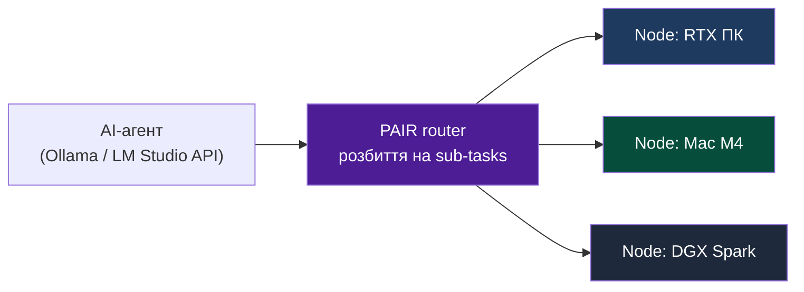

# Лекція 2: Моделі обчислень — HPC / Grid (Batch) vs Cloud (Interactive) та алгоритми планування

> **Декларація курсу.** Академічна доброчесність та авторство матеріалів — у [DISCLAIMER.md](DISCLAIMER.md).

**Питання для розминки 1: фура з вінчестерами чи оптика?**

Вам потрібно терміново перенести **50 петабайт** сирих логів з одеського дата-центру до Києва. Що відпрацює **швидше за загальним часом передачі всього обсягу**: прямий **100-гігабітний** оптичний канал чи завантаження жорстких дисків у фуру, яка їде трасою **Е95**? А що швидше, якщо потрібен **один конкретний кілобайт** з цих даних **прямо зараз**?

<details markdown="1">
<summary><b>Дізнатися відповідь</b></summary>

**50 ПБ цілком — переможе «фура»** (batch; підхід **sneakernet** — перенесення даних фізично на носіях, «бігун у кедах» з дисками). AWS [Snowmobile](https://aws.amazon.com/snowmobile/) працює за тим самим принципом: сотні дисків у кузові дають **throughput** (пропускна здатність) у петабайти на рейс, поки оптика фізично не встигає «прокачати» той самий обсяг через мережу годинами чи днями.

**Один кілобайт зараз — переможе оптика (interactive).** Фура дасть **latency** (затримка) порядку годин (завантаження, дорога, розвантаження) — незалежно від того, скільки петабайт у кузові.

**Підводка до лекції:** інфраструктура — це вибір метрики:
- **Throughput** (скільки даних/ітерацій за одиницю часу) → batch, HPC, Grid («вантажимо фури»), 100% утилізація каналу або CPU;
- **Latency** (як швидко відповісти на *один* запит) → Cloud, Web, швидкі RPC-виклики, SLA в мілісекундах.

Той самий «транспорт» не може одночасно бути найшвидшим і для 50 ПБ, і для одного КБ — різні **профілі навантаження**.
</details>

**Питання для розминки 2: джуніор і база даних**

Джуніор пише скрипт міграції: треба залити **1 мільйон** записів у **PostgreSQL**. Він робить цикл із **1 мільйоном окремих `INSERT`** через ORM. Скрипт крутиться **4 години**. Ви переписуєте на один **`COPY FROM`** (або `INSERT ... VALUES` **батчами** по тисячах рядків) — **15 секунд**. Залізо те саме, база та сама. Чому перший підхід «вбив» сервер?

<details markdown="1">
<summary><b>Дізнатися відповідь</b></summary>

Кожен **окремий запит** (single-request / interactive pattern) несе **фіксований оверхед**, який не масштабується з розміром одного рядка:

1. **Мережевий RTT** (*Round-Trip Time* — час «туди й назад» мережевого пакета) — клієнт ↔ сервер БД на кожен `INSERT`.
2. **Парсинг SQL** і планування запиту в PostgreSQL.
3. **Транзакція** — `BEGIN` / `COMMIT` (або неявний commit на кожен statement у autocommit).
4. **WAL** (*Write-Ahead Log* — журнал транзакцій) і **`fsync`** — запис журналу на диск; при мільйоні commit'ів диск тоне в дрібних синхронних записах, навіть якщо CPU вільний.

**`COPY FROM`** (або великий batch `INSERT`) — це **batch workload**:
- оверхед **один раз** на сесію або на пакет;
- дані йдуть **потоком**, БД пише сторінки й WAL **великими блоками**;
- метрика успіху — **throughput** (рядків/сек); latency одного рядка тут другорядна;

**Підводка до лекції:** у Cloud/Web платять «податок на запит» (ізоляція сесій, авторизація, окрема транзакція) за **передбачувану latency** одного виклику API. У HPC/Grid і масових міграціях той самий податок, помножений на мільйон, вбиває throughput — тому Монте-Карло на курсі ганяють **циклом усередині процесу** або `Pool.map`, замість мільйона HTTP POST.

Аналогія з [практикою 1](./p01_neutron_monte_carlo.md): один `step()` і паралельні **chunk**-и замість сотень тисяч RPC на кожен нейтрон.
</details>

---

## Архітектурний кейс: Чому виникли Гріди та Batch-пайплайни

Щоб зрозуміти прірву між інтерактивними хмарами (Cloud) та розподіленими пакетними обчисленнями (Grid/HPC), звернемося до двох реальних інженерних задач великої науки: Великого адронного колайдера (CERN LHC) та космічного телескопа Hubble (NASA/ESA).

### Кейс 1. Великий адронний колайдер (CERN LHC): цунамі даних і народження Гріда

В експериментах колайдера пучки протонів стикаються на швидкості, близькій до світлової:
- **Частота та сирий обсяг:** у детекторах (ATLAS, CMS) відбувається близько **1 мільярда зіткнень на секунду**. Сумарний потік необроблених даних із сенсорів сягає фантастичного значення — **1 Петабайт на секунду** ($10^{15}$ байт/с).
- **Апаратна фільтрація (тригери):** зберегти такий потік неможливо на жодному існуючому носії. Спеціалізовані багаторівневі FPGA-тригери у режимі реального часу відкидають 99.999% фонових подій, залишаючи лише кілька сотень потенційно цікавих зіткнень на секунду.
- **Річний зліпок і час обробки:** навіть після відсіювання колайдер генерує **від 50 до 90 Петабайт даних на рік**. Реконструкція траєкторій частинок одного експериментального прогону (Run) триває місяцями безперервних обчислень.
- **Магнітні стрічки замість HDD/SSD (Чому не диски?):** зберегти понад **1 Ексабайт** ($10^{18}$ байт) експериментальних даних на твердотільних накопичувачах або жорстких дисках економічно й енергетично неможливо. Дискові масиви такого обсягу вимагали б десятків мегават лише на обертання шпинделів та охолодження. Тому сирі дані CERN зберігає в **роботизованих бібліотеках магнітних стрічок** (IBM / Spectra Logic). Роботи-маніпулятори автоматично знаходять і вставляють потрібний картридж у привід лише в момент запиту. Картридж на полиці споживає **0 Ватів**, має термін зберігання понад 30 років і фізично ізольований від мережі (*air-gap*).
- **Енергетичний контраст і народження WLCG:** сам прискорювач LHC під час зіткнень споживає гігантські **200 МВт** електроенергії (тільки кріогенна система охолодження надпровідних магнітів до 1.9 Кельвіна забирає 40 МВт). На обчислення на майданчику залишається обмежений ліміт. Центральний дата-центр CERN (**Tier 0** у Женеві) має потужність до **12 МВт** і фізично не здатний аналізувати весь обсяг. Рішенням став розподілений **WLCG** (*Worldwide LHC Computing Grid*) — глобальний грід із понад **1.4 мільйона процесорних ядер** у 170 наукових центрах 42 країн світу, куди дані розсилаються пакетами по оптичних магістралях.

### Кейс 2. Космічний телескоп Hubble (NASA/ESA): терабайти за кадром одного фото

Коли публіка бачить знамените деталізоване зображення глибин космосу (наприклад, *Hubble Ultra Deep Field* розміром усього **40–110 МБ**):
- **Скільки даних насправді криється за однією фотографією:** телескоп ніколи не знімає «кольорове фото» за один клік. Сенсори детектують монохромні кванти світла через вузькі спектральні фільтри (ультрафіолет, видиме світло, ближній інфрачервоний діапазон). Одне фінальне зображення є синтезом **сотень окремих експозицій**, накопичених за сотні годин спостережень.
- **Щомісячний темп генерації:** бортова пам'ять телескопа становить усього близько **3 ГБ** (буфер для скидання радіосигналу на Землю), але щотижня Hubble передає на наземні станції 15–18 ГБ сирих вимірів, генеруючи **близько 850 Гігабайт** нових наукових даних щомісяця.
- **Науковий архів і обробка:** науковий архів телескопа (архів MAST) перевищив **400 Терабайт** сирих калібрувальних даних. Астрономи завантажують десятки терабайт цих «розкладених за довжинами хвиль» спектральних даних на місяць, щоб на локальних HPC-кластерах запускати тривалі batch-пайплайни очищення від космічних променів, калібрування шуму матриць та фотометричного стекування.

---

## Workload-Driven Architecture: архітектура під навантаження

У [лекції 1](./01_flynn_taxonomy.md) ми класифікували **залізо** (SISD, SIMD, MIMD). Далі — навіщо збирають його в кластери й хмари.

[Лекція 0](./00_intro.md) показала ланцюжок мейнфрейм → Грід → хмара. Кожен крок відповідав на інший тип задач.

[Розминка 1](#питання-для-розминки-1-фура-з-вінчестерами-чи-оптика) уже дала інтуїцію: **фура** виграє за throughput, **оптика** — за latency. Нижче — ключові вимоги та метрики, які визначають архітектурні рішення.

### NFR та базові метрики систем

#### NFR — нефункціональні вимоги

**NFR** (*Non-Functional Requirements* — нефункціональні вимоги) описують **як саме** система працює (швидкість, надійність, масштабованість), а не **що** вона робить. Детально про те, як невидимі вимоги формують архітектуру задовго до першого рядка коду — у [лекції 4: NFRs](https://vplanto.github.io/java/02_semester/04_nfr.html).

| Вимога | На яке питання відповідає | Приклад |
| :--- | :--- | :--- |
| **Функціональна** | Що система робить? | «Порахувати $P(\text{blackout})$ для енергомережі» |
| **Нефункціональна (NFR)** | Як саме вона це робить? | «10⁶ trials за ніч», «P99 API < 300 мс», «99.9% uptime» |

Архітектура кластера, вибір між Slurm і Kubernetes та структура коду (`COPY FROM` замість мільйона окремих `INSERT`) — це прямі відповіді на **NFR**.

#### Ключові метрики продуктивності

| Метрика | Що вимірює | Пріоритет |
| :--- | :--- | :--- |
| **Throughput** (пропускна здатність) | Кількість виконаної роботи за одиницю часу (jobs/sec, trials/sec, ГБ/с) | **Batch / HPC** (максимум результату за прогін) |
| **Latency** (затримка) | Час відправки запиту до отримання відповіді на *одну* операцію | **Cloud / Web** (мінімум очікування для клієнта) |
| **P50 / P99** (перцентилі) | 50% / 99% запитів швидші за це значення; P99 показує затримку найповільнішого 1% запитів | **Cloud SLA / SLO** |
| **Утилізація** | Відсоток завантаження ресурсів (CPU, RAM, GPU); мета — наблизитися до 100% | **HPC / Grid** |
| **Headroom** (запас) | Свідомо вільні ресурси для компенсації сплесків трафіку | **Cloud** |
| **Еластичність** | Здатність системи автоматично додавати або вимикати вузли під навантаження | **Cloud Autoscaling** |

> **Throughput** і **latency** — різні NFR. Жоден канал чи сервер не оптимізує одночасно передачу 50 ПБ даних і миттєву доставку одного КБ «прямо зараз» (див. [розминку 1](#питання-для-розминки-1-фура-з-вінчестерами-чи-оптика)).

#### Базові концепції лекції

| Поняття | Суть | Де застосовується |
| :--- | :--- | :--- |
| **Batch** (пакетний режим) | Задачі стають у чергу; живий клієнт не чекає на відповідь; мета — **Throughput** | Slurm, PBS, наукові симуляції |
| **Interactive** (інтерактивний) | Потік запитів від користувачів; пріоритет — передбачувана **Latency** (P99) | Web, REST/gRPC API, Kubernetes |
| **DAG** (*Directed Acyclic Graph*) | Граф залежностей етапів обчислення: «крок B стартує лише після кроку A» | Пайплайни даних, навчання ML-моделей |
| **Scheduler** (планувальник) | Сервіс, який розподіляє ресурси й задачі по вузлах (Slurm у HPC, `kube-scheduler` у K8s) | Кластерна оркестрація |
| **Noisy Neighbor** («гучний сусід») | Процес, що монополізує ресурси вузла й сповільнює сусідні сервіси на тій самій машині | Спільні сервери без суворої ізоляції |

> [!NOTE]
> **Головна ідея лекції:** «найкращого» планувальника не існує. Є зв'язка **профіль навантаження** (batch vs interactive) → **метрика успіху** (throughput vs latency, P99) → **механізм розподілу** (DRF у Slurm vs bin-packing у Kubernetes).

---

## Розділ 1. Профілі навантаження: Batch (Grid/HPC) vs Interactive (Cloud)

### HPC / Grid Workload (Batch)

**Пріоритет:** **Throughput** — кількість завершених одиниць роботи за одиницю часу (ітерацій MC, trials, кадрів рендеру) та **максимальна утилізація** CPU/RAM/GPU.

**Характер:**
- Немає зовнішнього користувача, який чекає на відповідь у реальному часі.
- Задача подається як **пакет** (job): «ось вхідні дані, ось програмa, ось ліміт часу».
- Часто описується як **DAG**: вузли — етапи обчислень, ребра — залежності «B стартує лише після A».

**Життєвий цикл:**
1. Потрапляє в **чергу** планувальника (Slurm, PBS, LSF).
2. Отримує виділені вузли.
3. Завантажує залізо на 100%, рахує, пише результат на диск.
4. Звільняє вузли — наступна задача в черзі.

Приклади: симуляція клімату, тренування моделі на кластері, [Монте-Карло в Лос-Аламосі](./00_intro.md), [SETI@home](https://uk.wikipedia.org/wiki/SETI@home), [Folding@home](https://uk.wikipedia.org/wiki/Folding@home), ваш [наскрізний проєкт IEEE-118](./n01_power_grid_project.md) у headless-режимі.

> [!NOTE]
> У [лекції 0](./00_intro.md) був **Volunteer Grid** — гетерогенне залізо волонтерів через Інтернет (SETI@home, Folding@home). Тут **Slurm/DRF** — **Corporate/Academic Grid**: локальний кластер організації, однорідні ресурси, центральна черга.

### Cloud Workload (Interactive / Multi-tenant)

**Пріоритет:** **Latency** — особливо **P99** та **еластичність** (масштаб під піковий трафік).

**Характер:**
- Випадковий потік **HTTP/gRPC/WebSocket**-запитів від зовнішніх клієнтів.
- Процеси (поди, контейнери) **постійно живуть** у пам'яті й чекають на подію.
- На одному вузлі — **багато орендарів** (*multi-tenancy*): ваш API, чужий API, Redis, sidecar.

**Життєвий цикл:**
1. Сервіс стартує при деплої (або при першому запиті в serverless).
2. Більшість часу — **idle** або легке I/O.
3. На запит — короткий сплеск CPU, відповідь клієнту, знову очікування.

Приклади: REST API, [dashboard реактора](./p01_neutron_monte_carlo.md) у браузері, платіжний шлюз, чат.

### Порівняльна таблиця

| Критерій | Batch (HPC / Grid) | Interactive (Cloud / Web) |
| :--- | :--- | :--- |
| **Головна метрика** | Throughput (jobs/sec, trials/sec) | P50 / P99 latency (мс) |
| **Утилізація заліза** | Прагнуть до **100%** | Свідомо залишають **запас** (headroom) |
| **Модель задачі** | Job, DAG, черга | Довгоживучий сервіс + потік запитів |
| **Користувач чекає?** | Ні (години в черзі — норма) | Так (секунди — катастрофа) |
| **Типова інфраструктура** | Slurm, PBS, Ray-кластер без UI | Kubernetes, load balancer, API Gateway |
| **Помилка планування** | Довга черга, недорахований батч | Timeout, 503, втрата клієнтів |

### ⚡ Кейс: Nvidia PAIR (Personal AI Router)

На **IFA 2026** Nvidia випустила [**PAIR**](https://developer.nvidia.com/blog/nvidia-pair-virtual-inference-router-expands-available-compute-on-your-local-network/) (*Personal AI Router* — персональний AI-роутер): open-source (Apache 2.0, beta), домашній Grid і Edge AI — кілька ПК у LAN замість одного GPU в хмарі.

| Архітектурний аспект | Що робить PAIR | Зв'язок із лекцією |
| :--- | :--- | :--- |
| **Оркестрація та балансування** | Локальний *traffic controller*: велику **агентну** AI-задачу ділить на незалежні мікрозавдання й **паралельно** розкидає їх по вузлах у LAN | Аналог планувальника (Slurm / `kube-scheduler`), але для **inference**-запитів до Ollama / LM Studio |
| **Без pooling VRAM** | VRAM вузлів **не зливається** в один пул (у DGX-кластерах інша історія) | Кожен вузол тримає свою частину пайплайну в межах **своїх** ресурсів — як batch-job «займи вузол і рахуй» |
| **Гетерогенне середовище** | *Plug-and-play*: динамічне виявлення, додавання й відключення вузлів; Windows, macOS, Ubuntu; RTX 20+, Apple M4+, DGX Spark | Класичний **Grid** — ближче до [Volunteer Grid](./00_intro.md), ніж до Corporate/Academic Slurm-кластера |
| **Privacy-first Edge** | Промпти й контекст лишаються в **локальній мережі**; повний **офлайн** без хмарних API | Компроміс **Edge vs Cloud**: менше еластичності хмари, зате приватність і нульова latency до інтернету |



PAIR — **проксі-роутер** над Ollama / LM Studio. Агент бачить одне локальне підключення; PAIR сам обирає вузол за готовністю, наявністю моделі й завантаженням GPU.

> **На парі:** порівняйте PAIR з bin-packing у Kubernetes і з SETI@home. Обговоріть, чому без pooling VRAM важко крутити одну велику LLM на кількох вузлах і коли це все одно вигідний компроміс.

---

## Розділ 2. Алгоритми планування ресурсів

Планувальник (*scheduler*) вирішує: **хто**, **де** і **скільки** ресурсів отримує.

### Grid / HPC: Slurm, PBS та Dominant Resource Fairness (DRF)

На кластерах університетів і дата-центрах досліджень домінують **Slurm** та **PBS/Torque** (Torque — форк PBS для керування batch-job'ами).

**Задача планувальника:**
- У черзі — десятки job'ів від різних груп: один просить 64 CPU + 512 GB RAM, інший — 8 CPU + 4 GPU.
- Треба розподілити **справедливо** і **щільно**, не залишаючи кластер напівпорожнім через «несумісні» заявки.

**DRF:**
- У кожного job є **домінуючий ресурс** — той, у якого він просить найбільшу *частку* від загального пулу (наприклад, GPU, якщо GPU — вузьке місце).
- Планувальник чергує так, щоб жодна команда не монополізувала свій домінуючий ресурс довше за інших.

**Чому тут потрібен DAG (приклад: розшифровка ДНК людини):**

Уявіть завдання медичної генетики: треба розшифрувати повний геном людини й знайти мутації. Це не можна зробити одним скриптом чи веб-запитом:

1. **Сирі дані з приладу (секвенатора):** це текстовий файл на **100 Гігабайт** із мільйонами розірваних шматочків ДНК.
2. **Крок 1 — Складання пазла (вирівнювання):** алгоритм порівнює ці шматочки з еталонним геномом людини. Задача вимагає **32–64 процесорні ядра**, **128 ГБ пам'яті** та безперервно рахує **добу (24 години)**.
3. **Крок 2 — Пошук мутацій:** лише після завершення кроку 1 інша програма шукає розбіжності (помилки в генах). Це ще **12 годин** обчислень.
4. **Крок 3 — Звіт для лікаря:** фінальна фільтрація та формування висновку.

Якщо в дослідженні беруть участь **500 пацієнтів**, це **50 Терабайт** сирих файлів і **десятки тисяч годин роботи процесорів**. 

Жоден веб-сервер не втримає з'єднання на 36 годин. Тому пайплайн описують як **граф залежностей (DAG)**: «Крок 2 запускати лише тоді, коли Крок 1 зберіг файл на диск». Спеціальні інструменти (Nextflow, Snakemake) передають цей граф у чергу кластера (Slurm), де завдання розкидаються на сотні серверів і рахуються тижнями.

**Реальний приклад з індустрії: DAG створення сучасної LLM (на прикладі Meta Llama 3):**

Створення великої мовної моделі — це класичний гігантський **DAG-конвеєр**, де кожен наступний етап споживає абсолютно інший тип заліза і не може стартувати без успішного завершення попереднього:

1. **Крок A — Скрейпінг та збір сирих даних (Data Lake):** з інтернету стягуються десятки петабайтів сирого HTML, коду та книг.
2. **Крок B — CPU-кластер: фільтрація та дедуплікація (ETL):** тисячі CPU-ядер тижнями чистять текст від спаму, видаляють дублікати та розбивають текст на **15 трильйонів токенів** (словник 128k).
3. **Крок C — GPU-суперкомп'ютер: Pre-training (Slurm / Ray):** лише після готовності токенів у бінарному форматі запускається кластер із **16 000 прискорювачів NVIDIA H100**. Навчання триває місяцями безперервно, де пошкодження навіть одного вузла вимагає відкату до останнього чекпойнта.
4. **Крок D — Post-training (SFT та RLHF):** отримана базова модель донавчається на діалогах та людських уподобаннях, щоб відповідати безпечно та зв'язно.
5. **Крок E — Автоматичні бенчмарки та Safety Eval:** перевірка моделі на галюцинації, математику (GSM8k) та безпеку. Лише при проходженні порогу ваги квантуються і відправляються у відкритий доступ або деплой.

**Чому без DAG цей процес неможливий:**
- **Економіка заліза:** година роботи кластера з 16 000 GPU H100 коштує понад **$50 000**. Вони не повинні чекати жодної секунди, поки CPU чистять текст або докачують сирі батчі.
- **Точки збереження (Checkpoints):** якщо на 45-й день навчання вибиває мережевий комутатор Infiniband і падає 10 серверів — планувальник відновлює стан матриць ваг з останнього збереженого кроку DAG на диску, не починаючи піврічне тренування спочатку.

### Cloud: Kubernetes `kube-scheduler` та Bin-packing

У хмарі один кластер обслуговує **сотні сервісів**. Планувальник — **`kube-scheduler`**: він вирішує, на **який Node** (вузол Kubernetes) посадити новий **Pod** (мінімальна одиниця запуску в Kubernetes).

**Bin-packing (упаковка в контейнери):**
- Кожен Pod декларує `requests` і `limits` (CPU, memory).
- Scheduler «упаковує» поди на вузли, як валізи в багажник: менше порожніх проміжків, без перевищення місткості.
- У batch часто один job на весь кластер; у K8s на тому ж залізі живуть **багато дрібних сервісів**.

**QoS-класи Kubernetes** (*Quality of Service* — якість обслуговування):

| QoS | Умова | Поведінка при нестачі пам'яті на Node |
| :--- | :--- | :--- |
| **Guaranteed** | `requests` = `limits` для CPU і RAM | Останніми під **eviction** |
| **Burstable** | `requests` < `limits` | Середній пріоритет |
| **BestEffort** | Без requests/limits | Першими вбиває OOM-killer (*Out Of Memory* — нестача RAM) |

Це **ізоляція** interactive-сервісів один від одного. Batch-адміністратор у тій же ситуації скаже: «віддай увесь сервер одній задачі». У Kubernetes планувальник розв'язує складнішу комбінаторну задачу.

#### Практичний кейс: як `kube-scheduler` розкладає інфраструктуру

Уявіть реальний продакшн-кластер з **11 вузлів** трьох різних типів:
- **3 великі ноди:** по **8 CPU / 24 GB RAM**
- **2 середні ноди:** по **4 CPU / 12 GB RAM**
- **6 потужних нод:** по **16 CPU / 32 GB RAM**

**Вимоги сервісів (що треба розмістити):**
1. **База даних (PostgreSQL Master + Replica):** вимагає високих `requests` (4 CPU, 16 GB), дисковий I/O та клас **Guaranteed**. 
   - *Жорстке правило (Taint / Anti-Affinity):* жоден сторонній веб-сервіс не має права сідати на той самий вузол, щоб не створювати конкуренцію за пам'ять і диск (проблема *Noisy Neighbor*).
2. **Стек логів (ELK / Elasticsearch):** вимагає багато RAM (8 GB) для індексації.
   - *Правило:* клас **Burstable**, живе на середніх або потужних нодах, але ізольований від критичної транзакційної бази.
3. **Бекап/бізнес-сервіс (4 репліки API):** легкі поди (1 CPU, 2 GB).
   - *Вимога високої доступності (High Availability / SLA):* заборонено садити 2 поди одного сервісу на одну фізичну ноду (`podAntiAffinity`). Якщо паде один сервер, 3 інші репліки мають продовжити обслуговувати трафік клієнтів.

**Як планувальник розв'язує це в реальності:**
- **Фільтрація (Filtering / Predicates):** відсіює ноди, де бракує CPU/RAM або стоїть заборонний ярлик (`Taint: database=true:NoSchedule`). Поди бази сідають на вузли 8/24, витісняючи всі сторонні контейнери.
- **Врахування правил доступності (Anti-affinity):** 4 репліки веб-сервісу розкидаються рівно по одній на 4 різні ноди 16/32.
- **Оптимальна упаковка (Scoring / Bin-packing):** стек ELK та фонові утиліти запаковуються в залишкові слоти середніх вузлів 4/12 з класом BestEffort/Burstable, залишаючи запланований запас пам'яті (*headroom*) для раптових пікових сплесків трафіку.

### Slurm vs Kubernetes — одна таблиця

| | **Slurm / PBS (Grid)** | **Kubernetes (Cloud)** |
| :--- | :--- | :--- |
| **Одиниця планування** | Job / Step | Pod / Deployment |
| **Типова мета** | Throughput, fair-share між дослідниками | Latency, еластичність, density |
| **Ключовий алгоритм** | DRF, пріоритети черги, резервації | Bin-packing, affinity, QoS |
| **DAG** | Нативно в HPC-workflow (часто зовнішні оркестратори) | CronJob / Argo Workflows — над K8s (Kubernetes) |
| **Multi-tenant** | Зазвичай одна організація, акаунти груп | Сотні сервісів, namespaces, rate limits |
| **Простій заліза** | Мінімізують навмисно | Допускають заради SLA |

> [!NOTE]
> **Імператив vs декларатив:** у Slurm ви зазвичай пишете `sbatch script.sh` — *запусти ось це*. У K8s ви подаєте YAML-маніфест — *бажаний стан: 3 репліки цього образу*; control loop сам підтягує реальність до декларації.

---

## Розділ 3. Головний інженерний trade-off

«Срібної кулі» немає — лише компроміси ([таблиця архітектур, лекція 0](./00_intro.md#порівняльний-аналіз-архітектур-інженерні-трейд-оффи)).

### Максимальна утилізація (Grid / Batch)

**Плюси:**
- Дешевше прорахувати величезний обсяг (один trial коштує копійки, якщо CPU не простоює).
- Ідеально для **Монте-Карло**: мільйони незалежних ітерацій — ідеально паралельні задачі (embarrassingly parallel).

**Мінуси:**
- Довга **черга** — job чекає, поки звільниться кластер.
- **Відмови вузлів** — [мережа завжди бреше](https://vplanto.github.io/java/02_semester/10_distributed_systems.html); batch має retries і checkpoint'и.
- **Noisy neighbor** на спільному залізі без ізоляції — batch «душить» сусідів.

### Прогнозованість затримки та ізоляція (Cloud)

**Плюси:**
- **P99** під контролем: резерв CPU/RAM, cgroups, окремі поди.
- **Еластичність:** autoscaling додає вузли під пік [Black Friday](https://vplanto.github.io/java/02_semester/04_nfr.html#1-відкрита-дискусія-warm-up).
- **Self-healing:** K8s перезапускає впалий Pod — критично для API.

**Мінуси:**
- **Оверхед:** контейнери, sidecar, мережеві проксі — кожен додає мілісекунди та RAM.
- **Простій заліза:** headroom = гроші «на вітер» з точки зору batch-адміна.
- **Складність:** маніфести, eviction, distributed tracing — ціна за надійність.

```
 Batch mindset:     «Якщо CPU не на 100% — ми втрачаємо гроші на електриці»
 Cloud mindset:     «Якщо P99 > 300 ms — ми втрачаємо клієнтів»
```

---

## Розділ 4. Місток до наскрізного проєкту Монте-Карло

Увесь курс тримається на одному методі — [Монте-Карло](./00_intro.md#один-метод-монте-карло--різні-осі-випадковості). З погляду цієї лекції обидва сценарії — **класичний batch / MIMD workload**.

| | [Практика 1 — реактор](./p01_neutron_monte_carlo.md) | [Проєкт — IEEE-118](./n01_power_grid_project.md) |
| :--- | :--- | :--- |
| **Профіль** | Batch: `run_headless_benchmark()`, без UI | Batch: $N$ незалежних `run_trial()` |
| **Метрика успіху** | neutrons/sec, speedup vs workers | trials/sec, $P(\text{blackout})$ |
| **Паралелізм** | MIMD — [лекція 1](./01_flynn_taxonomy.md#4-mimd-multiple-instruction-multiple-data) | Той самий патерн `Pool.map` / Ray на етапі 2 |
| **Етап курсу** | Етап 1: [p01](./p01_neutron_monte_carlo.md); етап 2: [p02 Ray-кластер](./p02_ray_grid.md) | Етап 1–2: MIMD → [Ray без Docker](./index.md) |

**Профіль batch (не interactive):**
- Користувач не чекає відповідь на *кожну* ітерацію MC.
- Chunk можна зупинити, перезапустити, перерахувати — результат статистичний, без транзакційної семантики.
- Метрика — **throughput**, а P99 одного trial майже нікого не цікавить.

### Що станеться без ізоляції: Noisy Neighbor

[Dashboard реактора](./p01_neutron_monte_carlo.md): браузер кожні 100 мс шле `POST /api/step`. На тому ж вузлі без `cgroups` (групи обмеження ресурсів у Linux) крутиться headless-прогін на **10⁶ trials** з `num_workers = всі ядра`.

| Спостереження | Причина |
| :--- | :--- |
| UI «зависає», кроки йдуть рвано | HTTP-воркер голодує по CPU |
| P99 `/api/step` злітає до секунд | batch-воркери займають run queue |
| OOM killer вбиває випадковий процес | RAM не розділена між сервісами |

**Рішення по етапах курсу:**
1. **Етап 1** — окремий headless-запуск (немає конкуренції з UI).
2. **Етап 2** — Ray розносить batch на інші вузлі ([аналог Гріда](./index.md)).
3. **Етап 3** — Docker + `limits` на контейнери.
4. **Етап 4** — Kubernetes QoS: API — Guaranteed, MC-worker — Burstable на окремому Node pool.

Курс будується так: спочатку відчуваєте біль спільного заліза без контейнерів, потім знімаєте його Docker/K8s — як у [вступі](./00_intro.md#наша-мета-відтворити-історію-на-сучасних-технологіях).


---

## Підсумок лекції

1. **Workload-Driven Architecture:** batch прагне **throughput** і 100% CPU; cloud — **P99 latency** і еластичність.
2. **Grid/HPC** планує через черги, DRF (Slurm/PBS) і DAG залежностей.
3. **Cloud/K8s** планує через bin-packing, `requests`/`limits` і QoS-класи.
4. **Trade-off:** утилізація заліза vs прогнозованість затримки та ізоляція орендарів.
5. **Монте-Карло** на курсі — batch MIMD; UI/API — interactive; змішувати на одному вузлі без ізоляції — шлях до Noisy Neighbor.
6. **Nvidia PAIR** — побутовий Grid/Edge: роутинг sub-tasks по гетерогенній LAN без pooling VRAM і без хмарних API.

---

## Reading (Landmark)

📄 **Основне читання:** Ghodsi et al., [*Dominant Resource Fairness: Fair Allocation of Multiple Resource Types*](https://www.usenix.org/conference/nsdi11/dominant-resource-fairness-fair-allocation-multiple-resource-types) (NSDI 2011) — §2–4: модель DRF і справедливий поділ CPU/RAM між job'ами.

📄 **Додатково:** Verma et al., [*Large-scale cluster management at Google with Borg*](https://research.google/pubs/large-scale-cluster-management-at-google-with-borg/) (EuroSys 2015) — §3–4: планування, пріоритети та bin-packing на вузлах.

**Питання на пару (5 хв):** який trade-off між **throughput** кластера та **справедливістю** між командами автори DRF вирішують інакше, ніж простий FIFO у черзі?

---

## Контрольні питання

<details markdown="1">
<summary><b>1. Чому для batch-задачі Монте-Карло метрика throughput важливіша за P99 latency однієї ітерації?</b></summary>

Кожна ітерація MC **статистично незалежна**; користувач не чекає результат *конкретного* trial у реальному часі. Після мільйонів прогонів цікава **сукупна статистика**, тому оптимізують **пропускну здатність** (trials/sec), а не затримку окремого кроку.
</details>

<details markdown="1">
<summary><b>2. Що таке DAG у контексті HPC і навіщо планувальник знає про залежності між вузлами?</b></summary>

**DAG** — орієнтований ациклічний граф етапів обчислення. Планувальник не запускає вузол **B**, поки не завершився **A**, якщо є ребро A→B. Це гарантує коректний порядок (спочатку завантаження даних, потім симуляція, потім звіт) і дозволяє паралелити **незалежні** гілки графа.
</details>

<details markdown="1">
<summary><b>3. У чому різниця між DRF у Slurm і bin-packing у Kubernetes?</b></summary>

**DRF** справедливо ділить **домінуючі ресурси** між великими batch-job'ами дослідників (черга, fair-share). **Bin-packing** у K8s **щільно розміщує** багато малих подів-сервісів на вузлах з урахуванням `requests`/`limits` і QoS — пріоритет **щільності та SLA**, а не одного величезного job на весь кластер.
</details>

<details markdown="1">
<summary><b>4. Що таке Noisy Neighbor і як курс це обходить на етапах 3–4?</b></summary>

**Noisy Neighbor** — процес, який монополізує CPU/RAM на спільному вузлі й погіршує P99 сусідніх сервісів. На **етапі 3** — Docker + ліміти cgroups; на **етапі 4** — Kubernetes QoS (Guaranteed для API, окремі node pool / Burstable для MC-worker), щоб batch і interactive не конкурували за ті самі ядра без контролю.
</details>
