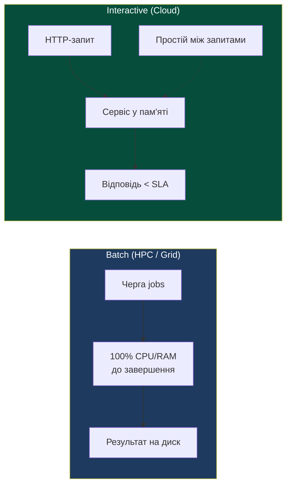
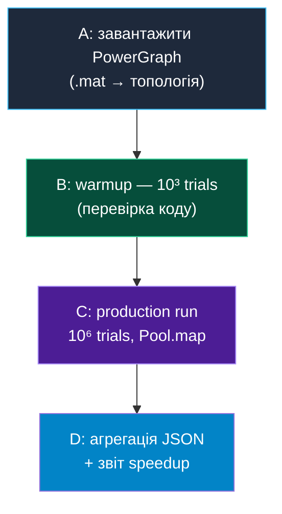
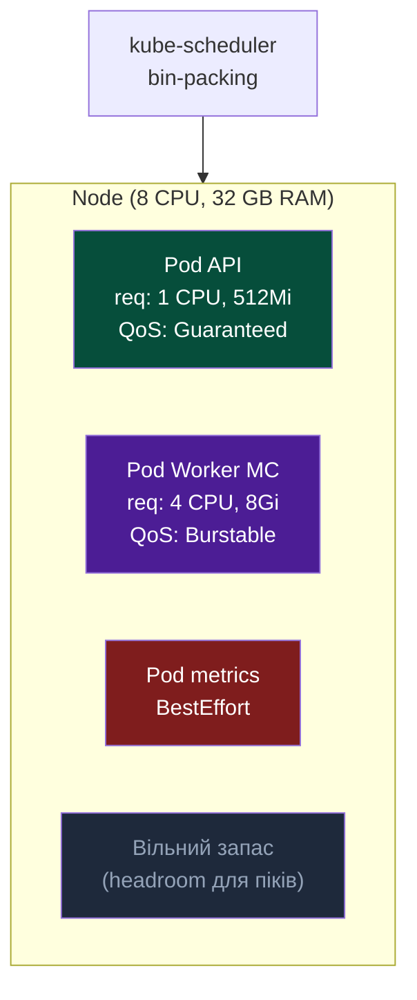
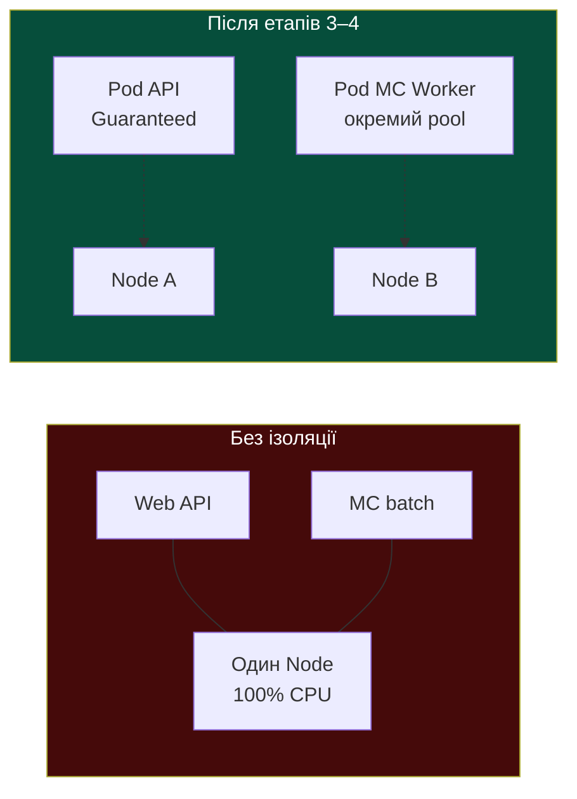

# Лекція 2: Моделі обчислень — HPC (*High Performance Computing*, високопродуктивні обчислення) / Grid (Batch) vs Cloud (Interactive) & алгоритми планування

> **Декларація курсу.** Академічна доброчесність та авторство матеріалів — у [DISCLAIMER.md](DISCLAIMER.md).

**Питання для розминки 1: фура з вінчестерами чи оптика?**

Вам потрібно терміново перенести **50 петабайт** сирих логів з одеського дата-центру до Києва. Що відпрацює **швидше за загальним часом передачі всього обсягу**: прямий **100-гігабітний** оптичний канал чи завантаження жорстких дисків у фуру, яка їде трасою **Е95**? А що швидше, якщо потрібен **один конкретний кілобайт** з цих даних **прямо зараз**?

<details markdown="1">
<summary><b>Дізнатися відповідь</b></summary>

**50 ПБ цілком — переможе «фура» (batch; підхід **sneakernet** — перенесення даних фізично, на носіях, а не по мережі: «бігун у кедах» з дисками).** Це не жарт, а реальний інженерний прийом (у хмарах — [AWS Snowmobile](https://aws.amazon.com/snowmobile/)): сотні дисків у кузові дають **throughput** (пропускна здатність) у петабайти на рейс, поки оптика фізично не встигає «прокачати» той самий обсяг через мережу годинами чи днями.

**Один кілобайт зараз — переможе оптика (interactive).** Фура дасть **latency** (затримка) порядку годин (завантаження, дорога, розвантаження) — незалежно від того, скільки петабайт у кузові.

**Підводка до лекції:** інфраструктура — це вибір метрики:
- **Throughput** (скільки даних/ітерацій за одиницю часу) → batch, HPC, Grid (*grid computing* — обчислювальна сітка для пакетних job'ів), «вантажимо фури», 100% утилізація каналу або CPU;
- **Latency** (як швидко відповісти на *один* запит) → Cloud, Web, дрібні RPC (*Remote Procedure Call* — віддалений виклик процедури), SLA (*Service Level Agreement* — угода про рівень сервісу) в мілісекундах.

Той самий «транспорт» не може одночасно бути найшвидшим і для 50 ПБ, і для одного КБ — різні **профілі навантаження**.
</details>

**Питання для розминки 2: джуніор і база даних**

Джуніор пише скрипт міграції: треба залити **1 мільйон** записів у **PostgreSQL**. Він робить цикл із **1 мільйоном окремих `INSERT`** через ORM (*Object-Relational Mapping* — об'єктно-реляційне відображення). Скрипт крутиться **4 години**. Ви переписуєте на один **`COPY FROM`** (або `INSERT ... VALUES` **батчами** по тисячах рядків) — **15 секунд**. Залізо те саме, база та сама. Чому перший підхід «вбив» сервер?

<details markdown="1">
<summary><b>Дізнатися відповідь</b></summary>

Кожен **окремий запит** (single-request / interactive pattern) несе **фіксований оверхед**, який не масштабується з розміром одного рядка:

1. **Мережевий RTT** (*Round-Trip Time* — час «туда-назад» мережевого пакета) — клієнт ↔ сервер БД на кожен `INSERT`.
2. **Парсинг SQL** і планування запиту в PostgreSQL.
3. **Транзакція** — `BEGIN` / `COMMIT` (або неявний commit на кожен statement у autocommit).
4. **WAL** (*Write-Ahead Log* — журнал попереднього запису) і **`fsync`** — журнал транзакцій на диск; при мільйоні commit'ів диск «тоне» в дрібних синхронних записах, навіть якщо CPU вільний.

**`COPY FROM`** (або великий batch `INSERT`) — це **batch workload**:
- оверхед **один раз** на сесію або на пакет;
- дані йдуть **потоком**, БД пише сторінки й WAL **великими блоками**;
- метрика успіху — **throughput** (рядків/сек), а не latency одного рядка.

**Підводка до лекції:** у Cloud/Web ми **свідомо платимо** «податок на запит» (ізоляція сесій, авторизація, окрема транзакція) заради **надійності та передбачуваної latency** одного виклику API. У HPC/Grid і в масових міграціях той самий податок, **помножений на мільйон**, знищує систему — тому Монте-Карло на курсі ганяють **циклом усередині процесу** або `Pool.map`, а не мільйоном HTTP POST.

Аналогія з [практикою 1](./p01_neutron_monte_carlo.md): не 500 000 окремих RPC на кожен нейтрон — один `step()` і паралельні **chunk**-и.
</details>

---

## Workload-Driven Architecture: архітектура під навантаження

У [лекції 1](./01_flynn_taxonomy.md) ми класифікували **залізо** (SISD — *Single Instruction, Single Data*; SIMD — *Single Instruction, Multiple Data*; MIMD — *Multiple Instruction, Multiple Data*). Тепер — **навіщо** його збирають у кластери й хмари.

Після [лекції 0](./00_intro.md) ви вже бачили еволюцію: мейнфрейм → Грід → хмара. Кожен крок — не мода, а відповідь на **інший тип задач**. Сьогодні формалізуємо цю різницю.

У [розминках](#питання-для-розминки-1-фура-з-вінчестерами-чи-оптика) ви вже інтуїтивно відчули: **фура** виграє за throughput, **оптика** — за latency. Перед розділом 1 зафіксуємо терміни, якими користуватимемось увесь матеріал.

### Словник: NFR, метрики та терміни лекції

#### NFR — нефункціональні вимоги

**NFR** (*Non-Functional Requirements* — нефункціональні вимоги) описують **як добре** система працює, а не **що** вона робить.

| Тип | Питання | Приклад |
| :--- | :--- | :--- |
| **Функціональні** | Що система *робить*? | «Порахувати $P(\text{blackout})$ для IEEE-118» |
| **Нефункціональні (NFR)** | *Як* вона це робить? | «10⁶ trials за ніч», «P99 API < 300 мс», «99.9% uptime» |

Архітектура кластера, вибір планувальника (Slurm чи Kubernetes) і патерн коду (`COPY FROM` vs мільйон `INSERT`) — це відповіді на **NFR**, а не на функціональну специфікацію.

#### Метрики продуктивності (ключові NFR)

| Термін | Розшифровка | Що вимірює | Типовий контекст |
| :--- | :--- | :--- | :--- |
| **Throughput** | пропускна здатність | Скільки одиниць роботи завершено за час (jobs/sec, trials/sec, ГБ/с) | Batch, HPC, міграції БД |
| **Latency** | затримка | Час від запиту до відповіді для *однієї* операції | Cloud, Web, RPC |
| **P50** | 50-й перцентиль (медіана) | Половина запитів швидші за це значення | SLA, моніторинг API |
| **P99** | 99-й перцентиль | 99% запитів швидші за цей поріг; «хвіст» розподілу | Cloud SLA, SLO |
| **SLA** | *Service Level Agreement* | Договірна межа NFR (наприклад, P99 < 300 мс) | Продакшн-сервіси |
| **SLO** | *Service Level Objective* | Внутрішня ціль команди (часто жорсткіша за SLA) | Моніторинг, алерти |
| **Утилізація** | utilization | Частка CPU/RAM/GPU, що реально зайнята (прагнуть до 100% у batch) | HPC, Grid |
| **Headroom** | запас потужності | Свідомо невикористані ресурси «на пік» | Cloud, Kubernetes |
| **Еластичність** | elasticity | Швидке додавання/зняття вузлів під навантаження | Autoscaling у хмарі |

> **Throughput vs latency** — не «одне краще за інше», а **різні NFR**. Той самий канал не може одночасно оптимізувати передачу 50 ПБ і доставку одного КБ «прямо зараз» (див. [розминку 1](#питання-для-розминки-1-фура-з-вінчестерами-чи-оптика)).

#### Профілі навантаження та інфраструктура

| Термін | Розшифровка | Суть |
| :--- | :--- | :--- |
| **Профіль навантаження** | workload profile | Повторюваний характер роботи: batch чи interactive |
| **Batch** | пакетний режим | Job'и в черзі; немає клієнта в реальному часі; пріоритет — throughput |
| **Interactive** | інтерактивний режим | Потік HTTP/gRPC/WebSocket-запитів; пріоритет — latency, P99 |
| **HPC** | *High Performance Computing* | Кластер для важких batch-обчислень (симуляції, MC, ML) |
| **Grid** | *grid computing* | Обчислювальна сітка / кластер для пакетних job'ів дослідників |
| **Cloud** | хмарна інфраструктура | Багато дрібних сервісів на спільному залізі; multi-tenant |
| **Job** | задача планувальника | Одиниця batch-роботи: вхідні дані + програма + ліміт часу |
| **DAG** | *Directed Acyclic Graph* | Граф залежностей етапів: «B стартує лише після A» |

#### Планування, ізоляція та допоміжні терміни

| Термін | Розшифровка | Де зустрінете |
| :--- | :--- | :--- |
| **Scheduler** | планувальник | Slurm, `kube-scheduler` — хто, де і скільки ресурсів отримує |
| **Slurm** | *Simple Linux Utility for Resource Management* | Планувальник batch-job'ів на HPC-кластерах |
| **PBS** | *Portable Batch System* | Альтернатива Slurm (разом із Torque) |
| **LSF** | *Load Sharing Facility* | Ще один планувальник batch-job'ів (IBM) |
| **DRF** | *Dominant Resource Fairness* | Справедливий поділ CPU/RAM/GPU між великими job'ами |
| **Bin-packing** | упаковка | Щільне розміщення багатьох Pod'ів на вузлах K8s |
| **K8s** | Kubernetes | Оркестратор контейнерів у хмарі |
| **Pod / Node** | под / вузол | Мінімальна одиниця запуску / машина в Kubernetes |
| **QoS** | *Quality of Service* | Клас пріоритету Pod при нестачі RAM (Guaranteed, Burstable, BestEffort) |
| **Eviction** | витіснення | Примусове завершення Pod при нестачі ресурсів на Node |
| **OOM-killer** | *Out Of Memory* | Механізм ядра Linux, що вбиває процес при нестачі RAM |
| **Multi-tenancy** | багато орендарів | Кілька сервісів на одному вузлі |
| **Noisy Neighbor** | «гучний сусід» | Процес, що монополізує CPU/RAM і псує P99 іншим |
| **ORM** | *Object-Relational Mapping* | Шар між кодом і БД (Hibernate, SQLAlchemy) |
| **REST** | *Representational State Transfer* | Стиль HTTP API (ресурси, методи GET/POST) |
| **RPC** | *Remote Procedure Call* | Віддалений виклик процедури (HTTP, gRPC) |
| **gRPC** | *gRPC Remote Procedure Call* | Бінарний RPC-протокол поверх HTTP/2 |
| **RTT** | *Round-Trip Time* | Час «туда-назад» мережевого пакета |
| **WAL** | *Write-Ahead Log* | Журнал попереднього запису в БД |
| **YAML** | *YAML Ain't Markup Language* | Формат декларативного опису конфігурації (K8s) |
| **cgroups** | control groups | Групи контролю CPU/RAM у Linux (Docker, K8s) |
| **MC** | *Monte Carlo* | Статистичне моделювання випадковими випробуваннями |
| **Trade-off** | компроміс | Неможливо максимізувати throughput і P99 одночасно на тому ж залізі |

> [!NOTE]
> **Головна ідея лекції:** не існує «найкращого» планувальника. Є відповідність між **профілем навантаження** (batch vs interactive), **метрикою успіху** (throughput vs latency, P99) і **механізмом розподілу ресурсів** (DRF у Slurm vs bin-packing у Kubernetes).

---

## Розділ 1. Профілі навантаження: Batch (Grid/HPC) vs Interactive (Cloud)

### HPC / Grid Workload (Batch)

**Пріоритет:** **Throughput** — кількість завершених одиниць роботи за одиницю часу (ітерацій MC, trials, кадрів рендеру) та **максимальна утилізація** CPU/RAM/GPU.

**Характер:**
- Немає зовнішнього користувача, який чекає на відповідь у реальному часі.
- Задача подається як **пакет** (job): «ось вхідні дані, ось програмa, ось ліміт часу».
- Часто описується як **DAG**: вузли — етапи обчислень, ребра — залежності «B стартує лише після A».

**Життєвий цикл:**
1. Потрапляє в **чергу** планувальника (Slurm, PBS, LSF).
2. Отримує виділені вузли.
3. Завантажує залізо на 100%, рахує, пише результат на диск.
4. Звільняє вузли — наступна задача в черзі.

Приклади: симуляція клімату, тренування моделі на кластері, [Монте-Карло в Лос-Аламосі](./00_intro.md), [SETI@home](https://uk.wikipedia.org/wiki/SETI@home), [Folding@home](https://uk.wikipedia.org/wiki/Folding@home), ваш [наскрізний проєкт IEEE-118](./n01_power_grid_project.md) у headless-режимі.

> [!NOTE]
> У [лекції 0](./00_intro.md) ми розглядали **Volunteer Grid** — децентралізоване гетерогенне залізо волонтерів через Інтернет (SETI@home, Folding@home). У цій лекції **Slurm/DRF** стосуються **Corporate/Academic Grid**: локального кластера організації зі спільними, однорідними ресурсами та центральною чергою.

### Cloud Workload (Interactive / Multi-tenant)

**Пріоритет:** **Latency** — особливо **P99** та **еластичність** (масштаб під піковий трафік).

**Характер:**
- Випадковий потік **HTTP/gRPC/WebSocket**-запитів від зовнішніх клієнтів.
- Процеси (поди, контейнери) **постійно живуть** у пам'яті й чекають на подію.
- На одному вузлі — **багато орендарів** (*multi-tenancy*): ваш API, чужий API, Redis, sidecar.

**Життєвий цикл:**
1. Сервіс стартує при деплої (або при першому запиті в serverless).
2. Більшість часу — **idle** або легке I/O.
3. На запит — короткий сплеск CPU, відповідь клієнту, знову очікування.

Приклади: REST API, [dashboard реактора](./p01_neutron_monte_carlo.md) у браузері, платіжний шлюз, чат.

### Порівняльна таблиця

| Критерій | Batch (HPC / Grid) | Interactive (Cloud / Web) |
| :--- | :--- | :--- |
| **Головна метрика** | Throughput (jobs/sec, trials/sec) | P50 / P99 latency (мс) |
| **Утилізація заліза** | Прагнуть до **100%** | Свідомо залишають **запас** (headroom) |
| **Модель задачі** | Job, DAG, черга | Довгоживучий сервіс + потік запитів |
| **Користувач чекає?** | Ні (години в черзі — норма) | Так (секунди — катастрофа) |
| **Типова інфраструктура** | Slurm, PBS, Ray-кластер без UI | Kubernetes, load balancer, API Gateway |
| **Помилка планування** | Довга черга, недорахований батч | Timeout, 503, втрата клієнтів |



---

## Розділ 2. Алгоритми планування ресурсів

Планувальник (*scheduler*) — це «диспетчер», який вирішує: **хто**, **де** і **скільки** ресурсів отримує.

### Grid / HPC: Slurm, PBS та Dominant Resource Fairness (DRF)

На кластерах університетів і дата-центрах досліджень домінують **Slurm** та **PBS/Torque** (Torque — форк PBS для керування batch-job'ами).

**Задача планувальника:**
- У черзі — десятки job'ів від різних груп: один просить 64 CPU + 512 GB RAM, інший — 8 CPU + 4 GPU.
- Треба розподілити **справедливо** і **щільно**, не залишаючи кластер напівпорожнім через «несумісні» заявки.

**DRF:**
- У кожного job є **домінуючий ресурс** — той, у якого він просить найбільшу *частку* від загального пулу (наприклад, GPU, якщо GPU — вузьке місце).
- Планувальник чергує так, щоб жодна команда не монополізувала свій домінуючий ресурс довше за інших.

**DAG у batch-системах:**

Типовий приклад — **аналіз ДНК** (секвенування WGS/WES): FASTQ → вирівнювання (BWA, minimap2) → variant calling (GATK, DeepVariant) → анотація. **Масштаб для орієнтиру:** один зразок **WGS** (людина, ~30× покриття) — **~100 ГБ** сирих FASTQ і job на **16–64 CPU**, **64–128 GB RAM**, **12–48 год** walltime; **WES** (екзом) — на порядок менше (**~10–20 ГБ** FASTQ, **8–32 CPU**, **32–64 GB RAM**). Когорта **500 зразків** — уже **тисячі CPU·доб** і **десятки ТБ** на диску. Типовий університетський кластер під Slurm: **50–500 вузлів**, **2–20 тис. ядер**, **ПБ-клас** сховища — саме тому pipeline описують як DAG у черзі, а не як один HTTP-запит. Такі pipeline'и на кластерах і в лабораторіях зазвичай описують у **Nextflow** (екосистема [nf-core](https://nf-co.re/)) або **Snakemake**; рідше — CWL, WDL або веб-платформу **Galaxy**. Запуск — поверх **Slurm** або хмари (AWS Batch, Google Life Sciences), часто в контейнерах Singularity/Docker.

Інший приклад DAG — інженерний/симуляційний pipeline (збір даних → препроцесинг → MC-симуляція → агрегація). Планувальник (або оркестратор рівня [Airflow](https://airflow.apache.org/), Nextflow, Snakemake) запускає вузол **B** лише коли **A** завершився успішно. Коротко про відмінності:

- **Airflow** — універсальний оркестратор **даних і ETL** (Python, cron-розклад, веб-UI); типово «над» K8s або Celery, а не безпосередньо на Slurm.
- **Nextflow** — **наукові/HPC** pipeline'и (біоінформатика тощо); власний DSL, контейнери (Docker/Singularity), зручний запуск на **Slurm** і в хмарі.
- **Snakemake** — правила «як Makefile» у **Python**; DAG від **файлів** (вхід/вихід кроку); популярний у reproducible science на кластері з conda/Singularity.



Якщо **C** впав на вузлі — batch-система або **перезапускає** задачу (retry), або позначає весь DAG як failed. Клієнт у браузері цього не помітить — немає клієнта в реальному часі.

### Cloud: Kubernetes `kube-scheduler` та Bin-packing

У хмарі один кластер обслуговує **сотні сервісів**. Планувальник — **`kube-scheduler`**: він вирішує, на **який Node** (вузол Kubernetes) посадити новий **Pod** (мінімальна одиниця запуску в Kubernetes).

**Bin-packing (упаковка в контейнери):**
- Кожен Pod декларує `requests` і `limits` (CPU, memory).
- Scheduler «упаковує» поди на вузли, як валізи в багажник: мінімізувати **порожні проміжки**, але не перевищити місткість.
- На відміну від batch, мета — не один job на весь кластер, а **багато дрібних сервісів** на спільному залізі.

**QoS-класи Kubernetes** (*Quality of Service* — якість обслуговування):

| QoS | Умова | Поведінка при нестачі пам'яті на Node |
| :--- | :--- | :--- |
| **Guaranteed** | `requests` = `limits` для CPU і RAM | Останніми під **eviction** |
| **Burstable** | `requests` < `limits` | Середній пріоритет |
| **BestEffort** | Без requests/limits | Першими вбиває OOM-killer (*Out Of Memory* — нестача RAM) |

Це механізм **ізоляції** interactive-сервісів один від одного — протилежність до «займи весь вузол і рахуй».



### Slurm vs Kubernetes — одна таблиця

| | **Slurm / PBS (Grid)** | **Kubernetes (Cloud)** |
| :--- | :--- | :--- |
| **Одиниця планування** | Job / Step | Pod / Deployment |
| **Типова мета** | Throughput, fair-share між дослідниками | Latency, еластичність, density |
| **Ключовий алгоритм** | DRF, пріоритети черги, резервації | Bin-packing, affinity, QoS |
| **DAG** | Нативно в HPC-workflow (часто зовнішні оркестратори) | CronJob / Argo Workflows — над K8s (Kubernetes) |
| **Multi-tenant** | Зазвичай одна організація, акаунти груп | Сотні сервісів, namespaces, rate limits |
| **Простій заліза** | Мінімізують навмисно | Допускають заради SLA |

> [!NOTE]
> **Імператив vs декларатив:** у Slurm ви часто пишете `sbatch script.sh` — *запусти ось це*. У K8s ви подаєте YAML (*YAML Ain't Markup Language* — формат декларативного опису конфігурації) — *бажаний стан: 3 репліки цього образу*; control loop сам підтягує реальність до декларації.

---

## Розділ 3. Головний інженерний trade-off

«Срібної кулі» немає — лише компроміси, як у [таблиці архітектур лекції 0](./00_intro.md#порівняльний-аналіз-архітектур-інженерні-трейд-оффи).

### Максимальна утилізація (Grid / Batch)

**Плюси:**
- Дешевше прорахувати величезний обсяг (один trial коштує копійки, якщо CPU не простоює).
- Ідеально для **Монте-Карло**: мільйони незалежних ітерацій — ембаррасingly parallel.

**Мінуси:**
- Довга **черга** — job чекає, поки звільниться кластер.
- **Відмови вузлів** — [мережа завжди бреше](https://vplanto.github.io/java/02_semester/10_distributed_systems.html); batch має retries і checkpoint'и.
- **Noisy neighbor** на спільному залізі без ізоляції — batch «душить» сусідів.

### Прогнозованість затримки та ізоляція (Cloud)

**Плюси:**
- **P99** під контролем: резерв CPU/RAM, cgroups, окремі поди.
- **Еластичність:** autoscaling додає вузли під пік Black Friday.
- **Self-healing:** K8s перезапускає впалий Pod — критично для API.

**Мінуси:**
- **Оверхед:** контейнери, sidecar, мережеві проксі — кожен додає мілісекунди та RAM.
- **Простій заліза:** headroom = гроші «на вітер» з точки зору batch-адміна.
- **Складність:** YAML, eviction, distributed tracing — ціна за надійність.

```
 Batch mindset:     «Якщо CPU не на 100% — ми втрачаємо гроші на електриці»
 Cloud mindset:     «Якщо P99 > 300 ms — ми втрачаємо клієнтів»
```

---

## Розділ 4. Місток до наскрізного проєкту Монте-Карло

Увесь курс тримається на одному методі — [Монте-Карло](./00_intro.md#один-метод-монте-карло--різні-осі-випадковості). З погляду цієї лекції обидва сценарії — **класичний batch / MIMD workload**.

| | [Практика 1 — реактор](./p01_neutron_monte_carlo.md) | [Проєкт — IEEE-118](./n01_power_grid_project.md) |
| :--- | :--- | :--- |
| **Профіль** | Batch: `run_headless_benchmark()`, без UI | Batch: $N$ незалежних `run_trial()` |
| **Метрика успіху** | neutrons/sec, speedup vs workers | trials/sec, $P(\text{blackout})$ |
| **Паралелізм** | MIMD — [лекція 1](./01_flynn_taxonomy.md#4-mimd-multiple-instruction-multiple-data) | Той самий патерн `Pool.map` / Ray на етапі 2 |
| **Етап курсу** | Етап 1: локальний `Pool.map` | Етап 1–2: MIMD → [Ray без Docker](./index.md) |

**Чому це не interactive workload:**
- Немає користувача, який чекає відповідь на *кожну* ітерацію MC.
- Можна зупинити, перезапустити, перерахувати chunk — результат статистичний, не транзакційний.
- Оптимальна метрика — **throughput**, не P99 одного trial.

### Що станеться без ізоляції: Noisy Neighbor

Уявіть [dashboard реактора](./p01_neutron_monte_carlo.md): браузер кожні 100 мс робить `POST /api/step`. На тому ж вузлі без `cgroups` (control groups — групи контролю CPU/RAM у Linux) крутиться headless-прогін на **10⁶ trials** з `num_workers = всі ядра`.

| Спостереження | Причина |
| :--- | :--- |
| UI «зависає», кроки йдуть рвано | HTTP-воркер голодує по CPU |
| P99 `/api/step` злітає до секунд | batch-воркери займають run queue |
| OOM killer вбиває випадковий процес | RAM не розділена між сервісами |

**Рішення по етапах курсу:**
1. **Етап 1** — окремий headless-запуск (немає конкуренції з UI).
2. **Етап 2** — Ray розносить batch на інші вузлі ([аналог Гріда](./index.md)).
3. **Етап 3** — Docker + `limits` на контейнери.
4. **Етап 4** — Kubernetes QoS: API — Guaranteed, MC-worker — Burstable на окремому Node pool.

Саме тому ми **спочатку** відчуваємо біль розподілу без контейнерів, і **потім** знімаємо його Docker/K8s — як у [вступі](./00_intro.md#наша-мета-відтворити-історію-на-сучасних-технологіях).



---

## Підсумок лекції

1. **Workload-Driven Architecture:** batch прагне **throughput** і 100% CPU; cloud — **P99 latency** і еластичність.
2. **Grid/HPC** планує через черги, DRF (Slurm/PBS) і DAG залежностей.
3. **Cloud/K8s** планує через bin-packing, `requests`/`limits` і QoS-класи.
4. **Trade-off:** утилізація заліза vs прогнозованість затримки та ізоляція орендарів.
5. **Монте-Карло** на курсі — batch MIMD; UI/API — interactive; змішувати на одному вузлі без ізоляції — шлях до Noisy Neighbor.

---

## Reading (Landmark)

📄 **Основне читання:** Ghodsi et al., [*Dominant Resource Fairness: Fair Allocation of Multiple Resource Types*](https://www.usenix.org/conference/nsdi11/dominant-resource-fairness-fair-allocation-multiple-resource-types) (NSDI 2011) — §2–4: модель DRF і справедливий поділ CPU/RAM між job'ами.

📄 **Додатково:** Verma et al., [*Large-scale cluster management at Google with Borg*](https://research.google/pubs/large-scale-cluster-management-at-google-with-borg/) (EuroSys 2015) — §3–4: планування, пріоритети та bin-packing на вузлах.

**Питання на пару (5 хв):** який trade-off між **throughput** кластера та **справедливістю** між командами автори DRF вирішують інакше, ніж простий FIFO у черзі?

---

## Контрольні питання

<details markdown="1">
<summary><b>1. Чому для batch-задачі Монте-Карло метрика throughput важливіша за P99 latency однієї ітерації?</b></summary>

Кожна ітерація MC **статистично незалежна**; користувач не чекає результат *конкретного* trial у реальному часі. Цікава **сукупна статистика** після мільйонів прогонів. Тому оптимізують **загальну пропускну здатність** (trials/sec), а не затримку окремого кроку.
</details>

<details markdown="1">
<summary><b>2. Що таке DAG у контексті HPC і навіщо планувальник знає про залежності між вузлами?</b></summary>

**DAG** — орієнтований ациклічний граф етапів обчислення. Планувальник не запускає вузол **B**, поки не завершився **A**, якщо є ребро A→B. Це гарантує коректний порядок (спочатку завантаження даних, потім симуляція, потім звіт) і дозволяє паралелити **незалежні** гілки графа.
</details>

<details markdown="1">
<summary><b>3. У чому різниця між DRF у Slurm і bin-packing у Kubernetes?</b></summary>

**DRF** справедливо ділить **домінуючі ресурси** між великими batch-job'ами дослідників (черга, fair-share). **Bin-packing** у K8s **щільно розміщує** багато малих подів-сервісів на вузлах з урахуванням `requests`/`limits` і QoS — пріоритет **щільності та SLA**, а не одного величезного job на весь кластер.
</details>

<details markdown="1">
<summary><b>4. Що таке Noisy Neighbor і як курс це обходить на етапах 3–4?</b></summary>

**Noisy Neighbor** — процес, який монополізує CPU/RAM на спільному вузлі й погіршує P99 сусідніх сервісів. На **етапі 3** — Docker + ліміти cgroups; на **етапі 4** — Kubernetes QoS (Guaranteed для API, окремі node pool / Burstable для MC-worker), щоб batch і interactive не конкурували за ті самі ядра без контролю.
</details>
