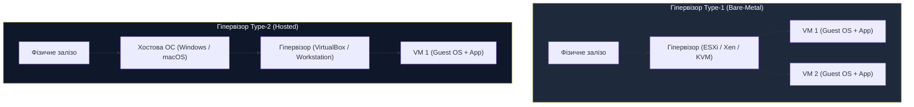
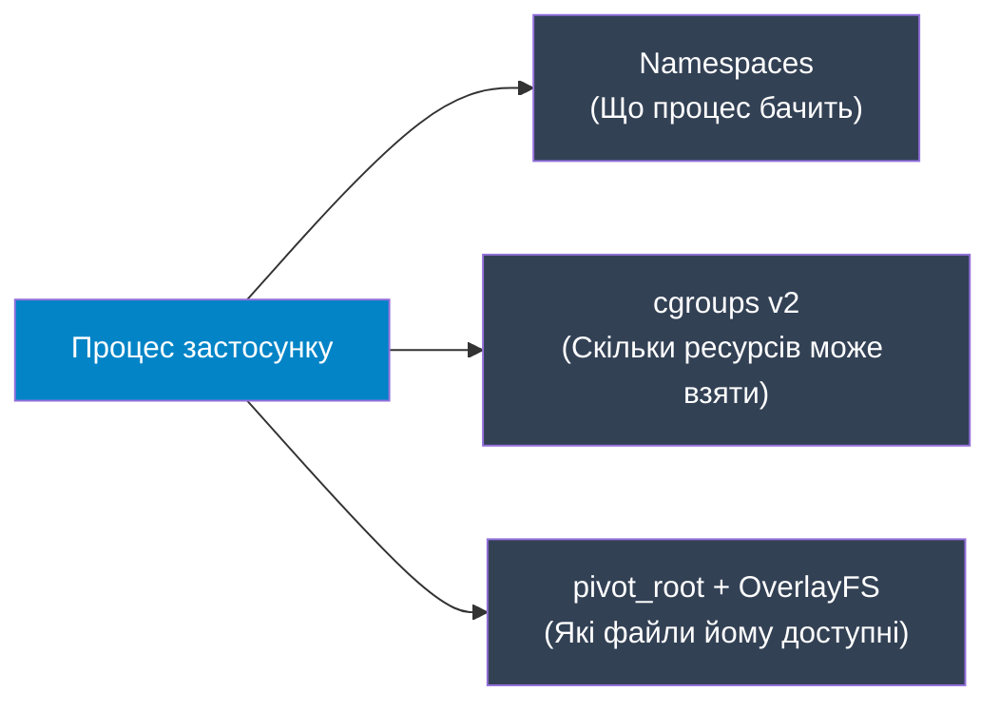
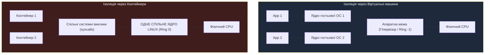

# Лекція 3: Механіка ізоляції — гіпервізори (VM) vs контейнеризація (cgroups & namespaces)

> **Декларація курсу.** Академічна доброчесність та авторство матеріалів — у [DISCLAIMER.md](DISCLAIMER.md).

---

## Рекомендовані першоджерела (Reading)

* **Обов'язкова стаття:** Barham et al., [*Xen and the Art of Virtualization*](https://www.cl.cam.ac.uk/research/srg/netos/papers/2003-xensosp.pdf) (ACM SOSP 2003). 
  * *Фокус під час читання:* Розділи 1–3. Зверніть увагу на різницю між пара-віртуалізацією (зміна гостьового ядра) та повною віртуалізацією до появи апаратної підтримки в процесорах.
  * *Питання для роздумів:* Яким інженерним компромісом автори пояснюють необхідність інформувати гостьову ОС про те, що вона працює у віртуальному середовищі?
* **Додаткова стаття (★):** Agache et al., [*Firecracker: Lightweight Virtualization for Serverless Applications*](https://www.usenix.org/system/files/nsdi20-paper-agache.pdf) (USENIX NSDI 2020).
  * *Фокус під час читання:* Чому традиційні гіпервізори (QEMU/KVM) виявилися занадто важкими для multi-tenant serverless-навантажень і як скорочення емуляції пристроїв дало старт за 5 мс.

---

## Питання для розминки

**Питання для розминки 1: фокус із номерами процесів**

Ви запускаєте веб-сервер у Docker-контейнері. Всередині контейнера команда `ps aux` показує, що ваш процес має **`PID 1`**. Системний адміністратор хост-сервера відкриває `htop` на фізичній машині і бачить той самий процес під номером **`PID 18452`**. Чому процес має два різні ідентифікатори одночасно і який із них «справжній»?

<details markdown="1">
<summary><b>Дізнатися відповідь</b></summary>

**Обидва ідентифікатори справжні — кожен у своїй системі відліку.**

Ядро Linux єдине. Для планувальника ядра цей процес має номер `18452`. Але процес поміщений у власний **PID Namespace**. Усередині цього простору номерний лічильник починається з `1`. 

Процес є звичайним процесом ОС Linux, якому ядро «надягнуло віртуальні окуляри»: він бачить себе володарем системи з номером 1, не підозрюючи про існування тисяч інших процесів на хості.
</details>

**Питання для розминки 2: що вбиває швидше — брак пам'яті чи процесора?**

Що відбудеться з вашим сервісом у контейнері, якщо він спробує спожити **150% від виділеного CPU limit**? А що станеться, якщо він спробує виділити **105% від виділеного Memory limit**? Чому реакція операційної системи на ці дві події кардинально відрізняється?

<details markdown="1">
<summary><b>Дізнатися відповідь</b></summary>

* **Перевищення CPU — компресійний ресурс:** Процес **не вбивають**. Планувальник ядра (CFS) застосовує **CPU Throttling**: штучно призупиняє виконання процесу на частину часового кванта. Застосунок стає повільним (росте P99 latency), але продовжує жити.
* **Перевищення RAM — некомпресійний ресурс:** Процес **миттєво вбивається ядром**. Пам'ять неможливо «стиснути в часі». Спрацьовує механізм **OOM Killer (Out Of Memory)**, надсилаючи процесу сигнал `SIGKILL` (**Exit Code 137**). Жодної обробки помилок у коді `try/catch` виконатися не встигає.
</details>

---

## Архітектурний кейс: Чому AWS створив Firecracker

У 2014 році Amazon запустив **AWS Lambda** — піонера концепції Serverless (FaaS). Ідея була революційною: розробник завантажує функцію, а хмара піднімає під неї ізольоване середовище, виконує запит за 100 мс і гасить.

Перед інженерами AWS постала дилема:

```
          ІЗОЛЯЦІЯ (Безпека)
                ▲
                │   [Full VM: EC2 / Xen]
                │   - Повна апаратна межа
                │   - Старт: десятки секунд
                │   - Оверхед: 100+ МБ на екземпляр
                │
                │              [MicroVM: Firecracker]
                │              - Апаратна межа KVM
                │              - Старт: 5 мс, RAM: 5 МБ
                │
                │   [Docker / Containers]
                │   - Спільне ядро хоста (Shared Kernel)
                │   - Ризик: Container Escape / Dirty COW
                │   - Старт: 100 мс, оверхед нульовий
                └─────────────────────────────────────► ШВИДКІСТЬ (Щільність)
```

1. **Шлях традиційних віртуальних машин (EC2):**
   * Надійна межа безпеки (апаратна віртуалізація, власне ядро гостьової ОС).
   * **Проблема:** Віртуальна машина стартує від 10 до 40 секунд і споживає мінімум сотні мегабайтів базової пам'яті. Зробити «cold start» функції за 20 мілісекунд у такому середовищі неможливо.
2. **Шлях звичайних контейнерів (Docker):**
   * Блискавичний запуск (мілісекунди), нульовий оверхед по RAM.
   * **Фатальна проблема Multi-Tenancy:** Контейнери ділять **одне спільне ядро Linux**. Якщо у функції клієнта А є вразливість (або шкідливий експлойт ядра на кшталт *Dirty COW*), зловмисник здійснює **Container Breakout**, отримує доступ до пам'яті сусіднього контейнера клієнта Б і краде секрети. Для публічної хмари запускати ненадійний код різних клієнтів на одному ядрі — неприпустимо.

**Інженерне рішення Amazon:**
Вони викинули з традиційного емулятора QEMU 95% застарілого коду (емуляцію флоппі-дисків, мишей, клавіатур, шини PCI) і написали на Rust ультралегкий гіпервізор **Firecracker**. Він запускає мінімальні віртуальні машини (**MicroVM**) на базі Linux KVM: старт за **5 мс**, споживання **5 МБ RAM** і апаратна межа безпеки, еквівалентна повноцінному серверу.

Цей кейс демонструє головний закон системної інженерії: **ізоляція — це завжди компроміс між безпекою, щільністю розміщення та затримкою запуску**.

---

## 1. Ракетний стек хмари: від заліза до контейнерів

Щоб зрозуміти розподіл обов'язків у дата-центрі, розглянемо метафору **«Хмарної ракети»**:

```
 ┌─────────────────────────────────────────────────────────────┐
 │       КОРИСНЕ НАВАНТАЖЕННЯ (Мікросервіси, stateless код)    │
 ├─────────────────────────────────────────────────────────────┤
 │   ДРУГИЙ СТУПІНЬ (Контейнеризація: namespaces, cgroups)    │
 │   - Плоске середовище виконання                             │
 │   - Зникають поняття «фізичний сервер» і «IP-адреса хоста»   │
 ├─────────────────────────────────────────────────────────────┤
 │   ПЕРШИЙ СТУПІНЬ (Гіпервізори: Type-1 / KVM, VMWare)        │
 │   - Нарізка фізичного пулу на віртуальні машини             │
 │   - Ізоляція заліза та відмовостійкість                     │
 ├─────────────────────────────────────────────────────────────┤
 │   СТАРТОВИЙ МАЙДАНЧИК (Залізо: CPU, RAM, NVMe, Мережа)      │
 └─────────────────────────────────────────────────────────────┘
```

### Еволюція моделей доставки: Onsite vs Offsite

Контейнеризація докорінно змінила розподіл операційних ризиків між розробкою та експлуатацією:

| Модель | Де конфігуруємо | Головний ризик | Що передається на прод |
| :--- | :--- | :--- | :--- |
| **Класична доставка (Bare-Metal / VM)** | **Onsite** (на самому сервері або проді) | Конфлікти бібліотек, розбіжність версій OS, ручні скрипти | Сирцевий код / `.war` / скрипти |
| **Контейнерна доставка (Docker / OCI)** | **Offsite** (на етапі збірки CI/CD) | Роздутий розмір образу, застарілі вразливості в базовому шарі | **Імутабельний артефакт (Image)**: код + середовище |

Контейнер переніс ризик налаштування із середи (production runtime) на стадію компіляції (build time).

---

## 2. Апаратна віртуалізація (Virtual Machines)

### Кільця захисту та проблема Ring 0

Архітектура x86 традиційно має 4 кільця привілеїв: від **Ring 0** (ядро ОС, прямий доступ до пам'яті та портів) до **Ring 3** (користувацькі програми).

```
   [ Ring 3: Застосунки користувача ]
               ▲
               │  Системні виклики (syscall)
               ▼
   [ Ring 0: Ядро операційної системи ]
               ▲
               │  Апаратні розширення (Intel VT-x / AMD-V)
               ▼
   [ Ring -1: Гіпервізор (Root Mode) ]
```

Коли з'явилися перші віртуальні машини, виник конфлікт: гостьова ОС вважає, що вона керує залізом і намагається виконати привілейовані інструкції в Ring 0. Але на фізичному залізі вже працює хостова ОС або гіпервізор.

* **Паравіртуалізація (ранній Xen, 2003):** Ядро гостьової ОС модифікували вручну, замінюючи заборонені інструкції на виклики гіпервізора (**Hypercalls**). Швидко, але неможливо запустити немодифікований Windows.
* **Апаратна віртуалізація (Intel VT-x, AMD-V, 2005+):** Введено новий привілейований режим процесора — **Ring -1 (VMX Root Mode)**. Гіпервізор живе в Ring -1, а гостьове ядро працює в Ring 0 у режимі Non-Root. Будь-яка небезпечна спроба гостя змінити фізичні таблиці сторінок викликає **VM-Exit** (перехоплення управління гіпервізором).
* **EPT / NPT (Extended Page Tables):** Дворівнева трансляція пам'яті на рівні кремнію CPU: `Guest Virtual Address` $\to$ `Guest Physical Address` $\to$ `Host Physical Address`. Знімає програмний оверхед на мапінг пам'яті.

### Класифікація гіпервізорів



* **Type-1 (Bare-Metal):** Гіпервізор встановлюється безпосередньо на «голе залізо» (VMware ESXi, Xen). Linux з модулем **KVM (Kernel-based Virtual Machine)** перетворює саме ядро Linux на Type-1 гіпервізор.
* **Type-2 (Hosted):** Гіпервізор працює як програма всередині хостової ОС (VirtualBox, VMware Workstation). Має подвійний оверхед через проходження викликів крізь хостову ОС. У промислових хмарах не використовується.

---

## 3. Контейнеризація під капотом Linux

> [!IMPORTANT]
> **Контейнерів як окремої сутності в ядрі Linux не існує.**
> «Контейнер» — це маркетингова назва для звичайного процесу Linux, ізольованого за допомогою трьох базових примітивів ядра: **Namespaces**, **cgroups** та **pivot_root**.



### Примітив 1: Linux Namespaces (Простори імен)

Namespaces відповідають на питання: **«Що процес бачить у системі?»**. Вони створюють ілюзію персональної ОС:

1. **PID (Process ID):** Ізоляція дерева процесів. Процес у контейнері отримує PID 1 і не бачить процеси інших контейнерів або хоста.
2. **NET (Network):** Власний мережевий стек: власні віртуальні інтерфейси (`veth`), локальна таблиця маршрутизації, правила `iptables`/`nftables`, закриті порти (наприклад, власний порт `8080`).
3. **MNT (Mount):** Власна таблиця точок монтування файлових систем.
4. **UTS (UNIX Timesharing System):** Власний hostname і domain name контейнера.
5. **IPC (Inter-Process Communication):** Ізоляція семафорів, черг повідомлень POSIX та спільної пам'яті (shared memory). Запобігає читанню shared memory іншого клієнта.
6. **USER:** Власна таблиця користувачів. Дозволяє бути `root` (UID 0) усередині контейнера, залишаючись непривілейованим користувачем (наприклад, UID 10001) на хості.
7. **CGROUP:** Ізоляція дерева контрольних груп (процес бачить лише свої ліміти).
8. **TIME (з'явився в Linux 5.6):** Ізоляція системного часу шляхом зміщення годинників `CLOCK_MONOTONIC` та `CLOCK_BOOTTIME`.
   * *Практичний інженерний кейс:* Тестування фінансових застосунків (нарахування відсотків на кінець місяця/кварталу, перевірка терміну дії банківських опціонів або сертифікатів безпеки) та генерація періодичної звітності з переведенням «віртуального часу» контейнера вперед/назад. Раніше для таких тестів доводилося змінювати системний час на фізичному хості, що фатально руйнувало кластерні алгоритми (Raft/Paxos), ламало валідацію TLS-сертифікатів, спотворювало логи та порушувало синхронізацію NTP для всіх сервісів на машині.

Створення нового простору імен у Linux здійснюється системним викликом:
```c
clone(..., CLONE_NEWPID | CLONE_NEWNET | CLONE_NEWNS | ...);
```

### Примітив 2: Control Groups (cgroups v1 vs cgroups v2)

Якщо namespaces визначають *видимість*, то cgroups визначають **«Скільки ресурсів процесу дозволено спожити?»**.

#### Чому індустрія відмовилася від cgroups v1: Катастрофа сторінкового кешу (Buffered I/O Writeback)

У ранньому Docker використовувався **cgroups v1**, де кожна підсистема (`cpu`, `memory`, `blkio`, `net_cls`) мала власну, повністю незалежну ієрархію каталогів:
* Якщо процес належав до групи `/sys/fs/cgroup/memory/groupA` і водночас до `/sys/fs/cgroup/blkio/groupB`, ядра цих підсистем **не координувалися між собою**.
* **Фатальний дефект Writeback:** Коли процес записує дані на диск через звичайне буферизоване введення-виведення (buffered I/O), дані спочатку осідають у RAM як «брудні сторінки» (**Page Cache**), за які відповідав контролер `memory`. Безпосереднім скиданням цих сторінок на фізичний диск займаються системні фонові нитки ядра (**flusher threads**).
* Але нитки flusher належать ядру і не мають прив'язки до конкретного контейнера! Контролер `blkio` у v1 не міг визначити, хто саме згенерував цей дисковий запис. У результаті процес міг забити 100% дискового каналу хоста гігабайтами скидання кешу, повністю ігноруючи свої `blkio`-квоти. Це спричиняло «тихий блек-аут» I/O (I/O Starvation) для сусідніх контейнерів.
* Окрім цього, роздільні дерева спричиняли deadlocks при міграціях процесів і блокували безпечне делегування прав непривілейованим користувачам (rootless containers).

**Рішення в cgroups v2 (Unified Hierarchy):**
Сучасний стандарт — **cgroups v2** (єдине уніфіковане дерево контролерів у `/sys/fs/cgroup/`). Будь-який процес належить рівно до одного вузла дерева, тому підсистеми пам'яті та дискового введення/виведення ділять спільний контекст: фонове скидання сторінкового кешу тепер строго списується на квоту того контейнера, який його згенерував.

#### Анатомія обмеження ресурсів: Компресійні vs Некомпресійні

```
                  ТИП РЕСУРСУ
          ┌────────────┴────────────┐
          ▼                         ▼
   КОМПРЕСІЙНІ (CPU)       НЕКОМПРЕСІЙНІ (RAM)
   [cpu.max]                [memory.high / memory.max]
          │                         │
   Перевищення ліміту       Перевищення ліміту
          │                         │
          ▼                         ▼
   CFS Throttling           Reclaim Throttle (high) -> OOM (max)
   (Затримка / Lag)         (Аварійне завершення / Exit 137)
```

1. **CPU (`cpu.max`):** 
   * Лімітується через планувальник CFS (*Completely Fair Scheduler*).
   * Задається парою чисел: `quota` та `period` (наприклад, `200000 100000` означає: максимум 200 мс процесорного часу за період 100 мс — еквівалент 2.0 ядер).
   * Якщо контейнер вичерпав квоту в поточному періоді, ядро просто переводить його нитки в чергу очікування до початку наступного періоду.
2. **Пам'ять (`memory.max` vs `memory.high`) — тонке налаштування рантаймів:**
   * **`memory.max` (Hard Limit):** Жорстка абсолютна межа. Якщо процес досягає `memory.max` і ядро не може звільнити жодного байта сторінкового кешу, ядро негайно викликає **OOM Killer**, знищуючи процес сигналом `SIGKILL` (**Exit Code 137**). Жоден обробник помилок у коді застосунку не встигає виконатися.
   * **`memory.high` (Soft Throttle Limit):** Захисний буфер перед катастрофою. При перевищенні `memory.high` процес **не вбивається**. Ядро активує механізм агресивного очищення пам'яті (**Page Reclaim Pressure**) і починає **штучно сповільнювати системні виклики виділення пам'яті** (Reclaim Throttling) для ниток цього процесу.
   * **Чому це критично для Java / Go (Garbage-Collected мови):**
     * У JVM раптова зупинка через OOM на `memory.max` трапляється тому, що Garbage Collector не встигає запустити повний цикл збирання сміття (Full GC) до вичерпання ліміту ядра.
     * Якщо налаштовано `memory.high`, ядро починає пригальмовувати контейнер на виділеннях пам'яті. Це уповільнення дає JVM або Go runtime критичні сотні мілісекунд, щоб зафіксувати сплеск аллокацій, активувати фоновий або паралельний GC, очистити Heap і повернутися нижче `memory.high` — врятувавши сервіс від аварійного перезапуску.

---

## 4. Файлова ізоляція: `pivot_root` та OverlayFS

Традиційний `chroot` лише змінював кореневий каталог для пошуку шляхів, але процес із правами `root` міг легко вирватися з нього через відкриті файлові дескриптори.

У контейнерах використовується:
1. **`pivot_root`**: Атомарно замінює поточну кореневу файлову систему на нову в межах окремого `mount` namespace і демонтує стару файлову систему хоста.
2. **OverlayFS (Union File System):** Дозволяє запускати сотні однакових контейнерів з одного образу, не копіюючи гігабайти файлів на диск.

```
 [ Merged View ]  ─── Об'єднана віртуальна точка монтування (те, що бачить контейнер)
        ▲
        │
 ┌──────┴───────────────────────────────────────────────────────┐
 │ Upperdir (Read-Write Layer): Зміни, додані чи змінені файли  │
 ├─────────────────────────────────────────────────────────────┤
 │ Lowerdir 2 (Read-Only Image Layer): Застосунок + бібліотеки │
 ├─────────────────────────────────────────────────────────────┤
 │ Lowerdir 1 (Read-Only Image Layer): Базова ОС (Ubuntu/Alpine)│
 └─────────────────────────────────────────────────────────────┘
```

* **Нижні шари (`lowerdir`):** Імутабельні (тільки для читання), спільні для всіх контейнерів на сервері.
* **Верхній шар (`upperdir`):** Тонкий шар для запису, унікальний для кожного екземпляра контейнера.
* **Copy-on-Write (CoW):** Якщо контейнер модифікує існуючий файл із базового образу, ядро прозоро копіює його з `lowerdir` у `upperdir`, де файл і змінюється. Базовий образ залишається незайманим.

---

## 5. Безпека: Чому контейнер — це НЕ віртуальна машина

Усі процеси контейнерів виконують свої системні виклики (`read`, `write`, `socket`, `ioctl`) до **одного й того самого ядра Linux** на хості. 

Якщо ядро містить вразливість (Buffer Overflow у драйвері мережі, Race Condition у підсистемі віртуальної пам'яті на кшталт Dirty COW), шкідливий процес у контейнері може отримати привілеї рівня ядра хоста — виконати **Container Breakout** і повністю скомпрометувати сусідні контейнери та сам сервер.



### Ешелонований захист контейнера (Defense in Depth)

Щоб мінімізувати ризик компрометації ядра, сучасні рушії (containerd, CRI-O, Docker) використовують три шари фільтрації:

1. **Linux Capabilities:** Замість всемогутнього `root` (який мав право робити все), ядро розбиває привілеї на окремі біти. У контейнерах за замовчуванням вимкнено більшість небезпечних прав, зокрема `CAP_SYS_ADMIN` (монтаж дисків, конфігурація мережі), `CAP_NET_ADMIN`, `CAP_SYS_RAWIO`.
2. **Seccomp (Secure Computing Mode):** Фільтр системних викликів на базі BPF (*Berkeley Packet Filter*). Ядро Linux підтримує понад 450 системних викликів. Стандартний профіль Seccomp у Docker блокує близько 50 найнебезпечніших системних викликів (наприклад, `reboot`, `kexec_load`, `iopl`), залишаючи лише необхідні для нормального життя програм.
3. **AppArmor / SELinux:** Мандатний контроль доступу (MAC). Навіть якщо процес отримав права root усередині контейнера, політика хоста заборонить йому запис у `/proc/sysrq-trigger` або читання чужих каталогів хоста.

### Фатальні помилки конфігурації: Монтування `docker.sock`

Навіть найсуворіші обмеження ядра (Seccomp, Capabilities, Namespaces) миттєво знецінюються однією необачною помилкою конфігурації: **прокиданням сокета демона Docker усередину контейнера**:

```bash
# Класичний "антипатерн" у CI/CD (Docker-outside-of-Docker / DooD):
docker run -v /var/run/docker.sock:/var/run/docker.sock ...
```

* **Чому так роблять:** Розробники використовують цей трюк у CI/CD-пайплайнах (GitLab Runner, Jenkins), щоб збирати та тестувати нові образи прямо всередині контейнера збірки.
* **Чому це повна компрометація хоста:** Сокет `/var/run/docker.sock` — це API керування рушієм Docker, який на хості працює з правами `root`. Процес у контейнері, маючи доступ до сокета, просто відправляє запит:
  ```bash
  # Створення нового контейнера, що монтує фізичний корінь хоста:
  docker run -v /:/host-root alpine chroot /host-root
  ```
* **Наслідок:** Процес отримує необмежений доступ до файлової системи хоста, файлів `/etc/shadow`, ключів SSH, пам'яті хоста та процесів інших клієнтів. Ізоляція просторів імен повністю нівелюється.
* **Безпечні інженерні альтернативи для CI/CD:** Використання рушіїв збірки, які не потребують демона з правами root на хості: **Kaniko** (Google), **Buildah** (RedHat) або **Rootless Podman**.

---

## 6. MicroVM: Синтез найкращого з обох світів

Для публічних хмарних сервісів із чужим ненадійним кодом (AWS Lambda, Google Cloud Run) ні традиційні важкі VM, ні звичайні контейнери не підійшли за критеріями безпеки та швидкості.

Відповіддю індустрії стали **MicroVM (AWS Firecracker, Kata Containers)**:

* Замість повної емуляції ПК гіпервізор запускає **чисте ядро Linux** через KVM API, надаючи лише 4 мінімальні пристрої: мережа (`virtio-net`), блочний диск (`virtio-block`), таймер і послідовна консоль.
* Окреме гостьове ядро гарантує **апаратну межу ізоляції** (злам гостьового ядра не дає доступу до хоста).
* Час завантаження: **< 5 мс**, споживання пам'яті: **< 5 МБ**.

---

## 7. Практичний інжиніринг: Діагностика відмов контейнерів

У промислових кластерах (Kubernetes / ECS) життєвий цикл контейнера діагностується за його кодом виходу (**Exit Code**).

| Код виходу | Офіційна назва | Що сталося під капотом | Перша дія інженера |
| :---: | :--- | :--- | :--- |
| **0** | Success / Normal exit | Процес успішно виконав задачу та завершився (норма для Batch Jobs). | Нічого, все штатно. |
| **1** | Application Error | Помилка в коді програми (Unhandled Exception, розрив з'єднання з БД під час старту). | Читати логи застосунку (`docker logs` / `kubectl logs`). |
| **125** | Container failed to run | Помилка рушія контейнеризації (помилка виклику `docker run`, непідтримувані прапорці). | Перевірити версію Docker/containerd та аргументи запуску. |
| **126** | Command invoke error | Команда вказана в `ENTRYPOINT`/`CMD`, але не має прав на виконання (`chmod +x`). | Перевірити права доступу бінарника в Dockerfile. |
| **127** | File or directory not found | Не знайдено бінарник або потрібну динамічну бібліотеку (`ld-linux.so` при збірці під glibc на Alpine/musl). | Перевірити шлях у `ENTRYPOINT` та сумісність збірки (glibc vs musl). |
| **137** | **SIGKILL (128 + 9)** | **Примусова страта процесу.** 99% випадків — **OOMKilled** (перевищення `memory.max`). Рідше — ручний `kill -9` або зупинка оркестратором після закінчення `grace-period`. | Збільшити memory limit у маніфесті, шукати витік пам'яті у heap. |
| **139** | **SIGSEGV (128 + 11)** | Помилка сегментації: спроба звернутися до недозволеної ділянки фізичної пам'яті (C/C++, native JNI extensions). | Перевірити нативні бібліотеки, аналізувати core dump. |
| **143** | **SIGTERM (128 + 15)** | Штатний сигнал на завершення. Контейнер отримав прохання зупинитися і коректно звільнив ресурси. | Штатна зупинка при масштабуванні вниз (Scale Down) або оновленні (Rolling Update). |

---

## 8. Зведена матриця інженерних компромісів

| Критерій | Фізичний сервер (Bare-Metal) | Віртуальна машина (KVM / ESXi) | MicroVM (Firecracker) | Контейнер (Docker / containerd) |
| :--- | :--- | :--- | :--- | :--- |
| **Межа ізоляції** | Апаратна (фізичний кремній) | Апаратна (Ring -1, VT-x, власне ядро) | Апаратна (KVM, мінімальне ядро) | **Програмна (спільне ядро, namespaces, cgroups)** |
| **Оверхед по пам'яті** | 0% | Високий (сотні МБ на власну ОС) | Мінімальний (~5 МБ) | **Майже нульовий (кілька КБ на структури ядра)** |
| **Час холодного старту** | Хвилини (BIOS/POST + OS boot) | Десятки секунд | **5–15 мілісекунд** | **50–200 мілісекунд** |
| **Multi-Tenant безпека** | 100% абсолютна | Дуже висока | Дуже висока | **Низька для untrusted коду; вимагає додаткових пісочниць** |
| **Утилізація заліза** | Низька (10–15%) | Середня (50–70%) | Висока (85–90%) | **Максимальна (до 95%+)** |
| **Цільове використання** | Бази даних надвисокої інтенсивності, HPC | Інфраструктурний шар хмар (IaaS), legacy ОС | FaaS (AWS Lambda), безпечні пісочниці | **Мікросервіси, веб-застосунки, обчислювальні воркери (MIMD)** |

---

## Підсумок лекції

1. **Контейнер — це не віртуальна машина.** Це звичайний процес Linux, ізольований ядрами просторів імен (**Namespaces**) та обмежений квотами ресурсів (**cgroups v2**).
2. **CPU дроселюється, пам'ять вбиває:** При вичерпанні CPU контейнер сповільнюється через CFS Throttling; при перевищенні RAM ядро безжально розстрілює процес через OOM Killer (**Exit Code 137**).
3. **Головний ризик контейнерів — спільне ядро:** Для систем із різними орендарями (Multi-Tenant) або ненадійним кодом звичайних контейнерів недостатньо; індустрія використовує **MicroVM (Firecracker)** для поєднання швидкості та апаратної ізоляції.
4. **Контейнери перенесли ризики:** Відмова від встановлення на проді (*onsite*) на користь збірки імутабельного образу в CI/CD (*offsite*) гарантує детермінізм розгортання в розподілених системах.

---

## Контрольні питання

<details markdown="1">
<summary><b>1. Чому спроба запустити утиліту ping всередині свіжоствореного базового контейнера часто повертає помилку «Operation not permitted», навіть якщо ви працюєте як користувач root?</b></summary>

Тому що право бути `root` (UID 0) всередині контейнера не означає володіння всіма системними привілеями хоста. 

Для роботи утиліти `ping` потрібен низькорівневий RAW-сокет (ICMP), який контролюється привілеєм ядра **`CAP_NET_RAW`**. Більшість сучасних безпечних профілів контейнеризації скидають цей біт capabilities при старті для запобігання підміні мережевих пакетів (IP Spoofing) та атакам на локальну мережу.
</details>

<details markdown="1">
<summary><b>2. Яким чином OverlayFS запобігає вичерпанню дискового простору, коли 50 контейнерів запускаються з одного й того самого образу розміром 2 ГБ?</b></summary>

Через механізм **імутабельних шарів (`lowerdir`)**. Всі 50 контейнерів монтують однакові шари образу в режимі Read-Only і спільно використовують ті самі фізичні блоки даних на диску (2 ГБ сумарно на всі 50 контейнерів). 

Кожен контейнер отримує лише власний порожній шар для запису (**`upperdir`**). Дисковий простір витрачається лише тоді, коли конкретний контейнер створює нові файли або модифікує існуючі через механізм Copy-on-Write.
</details>

<details markdown="1">
<summary><b>3. Що саме робить ядро Linux, коли контейнер отримує статус OOMKilled (Exit Code 137), і чому застосунок на Java чи Go не може перехопити цю подію в блоці catch/recover?</b></summary>

Коли споживання пам'яті досягає `memory.max` і ядро не може звільнити кеш сторінок, підсистема OOM Killer ядра посилає процесу сигнал **`SIGKILL` (номер 9)**. 

За стандартом POSIX, сигнал `SIGKILL` обробляється виключно самим ядром: ядро негайно звільняє таблиці сторінок пам'яті процесу та закриває дескриптори. Цей сигнал неможливо перехопити, проігнорувати чи заблокувати користувацьким кодом застосунку. Тому жоден блок обробки помилок не виконується.
</details>

<details markdown="1">
<summary><b>4. Чому запуск гостьової ОС у віртуальній машині Type-1 KVM вимагає підтримки процесором розширень Intel VT-x/AMD-V, тоді як запуск контейнера Docker працює на будь-якому, навіть старому x86-процесорі?</b></summary>

KVM запускає повноцінне ізольоване гостьове ядро, якому потрібен спеціальний апаратний режим виконання (**Ring -1 / VMX Root Mode** та **EPT** для апаратної трансляції гостьових адрес пам'яті без участі хостового софту). 

Контейнер Docker не запускає жодного гостьового ядра і не віртуалізує процесорні інструкції чи пам'ять. Процеси контейнера виконуються безпосередньо на фізичному процесорі хоста в звичайному користувацькому режимі **Ring 3**, використовуючи штатний планувальник та механізми захисту самого ядра Linux хоста.
</details>
