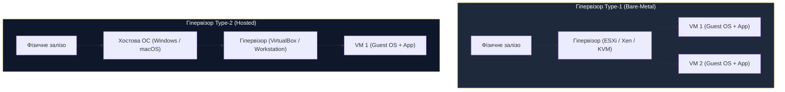
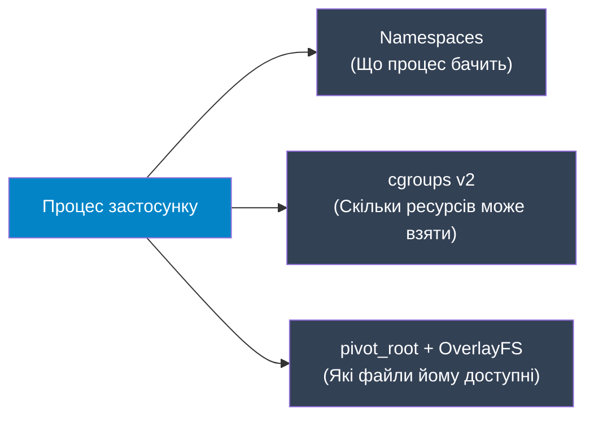
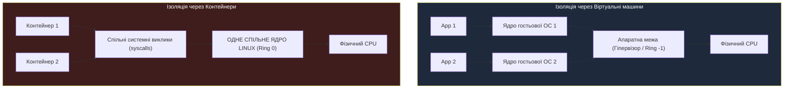
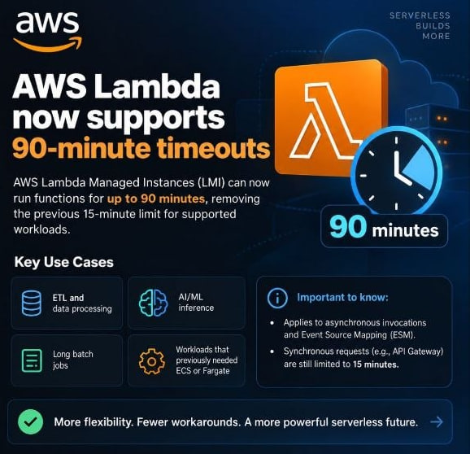

# Лекція 3: Механіка ізоляції — гіпервізори (VM) vs контейнеризація (cgroups & namespaces)

> **Декларація курсу.** Академічна доброчесність та авторство матеріалів — у [DISCLAIMER.md](DISCLAIMER.md).

---

## Рекомендовані першоджерела (Reading)

* **Обов'язкова стаття:** Barham et al., [*Xen and the Art of Virtualization*](https://www.cl.cam.ac.uk/research/srg/netos/papers/2003-xensosp.pdf) (ACM SOSP 2003). 
  * *Фокус під час читання:* Розділи 1–3. Паравіртуалізація (патч гостьового ядра) проти повної віртуалізації до VT-x/AMD-V.
  * *Питання для роздумів:* Яким інженерним компромісом автори пояснюють необхідність інформувати гостьову ОС про те, що вона працює у віртуальному середовищі?
* **Додаткова стаття (★):** Agache et al., [*Firecracker: Lightweight Virtualization for Serverless Applications*](https://www.usenix.org/system/files/nsdi20-paper-agache.pdf) (USENIX NSDI 2020).
  * *Фокус під час читання:* Чому традиційні гіпервізори (QEMU/KVM) виявилися занадто важкими для multi-tenant serverless-навантажень і як скорочення емуляції пристроїв дало старт за 5 мс.

---

## Базові пререквізити

Перед вивченням лекції рекомендується опрацювати піраміду абстракцій (від фізичного заліза й ядра ОС до процесів, тредів, контейнерів та віртуальних машин):
👉 **[03_isolation_mechanics_prerequisites.md](03_isolation_mechanics_prerequisites.md)**

---

## Питання для розминки

**Питання для розминки 1: фокус із номерами процесів**

Ви запускаєте веб-сервер у Docker-контейнері. Всередині контейнера команда `ps aux` показує, що ваш процес має **`PID 1`**. Системний адміністратор хост-сервера відкриває `htop` на фізичній машині і бачить той самий процес під номером **`PID 18452`**. Чому процес має два різні ідентифікатори одночасно і який із них «справжній»?

<details markdown="1">
<summary><b>Дізнатися відповідь</b></summary>

**Обидва PID справжні — у своїй системі відліку.**

Ядро одне. Планувальник бачить процес як `18452`. Але він сидить у власному **PID namespace**, де лічильник знову з `1`.

Процес звичайний; ядро просто «надягнуло окуляри»: PID 1 усередині, тисячі сусідів на хості — поза видимістю.
</details>

**Питання для розминки 2: що вбиває швидше — брак пам'яті чи процесора?**

Що відбудеться з вашим сервісом у контейнері, якщо він спробує спожити **150% від виділеного CPU limit**? А що станеться, якщо він спробує виділити **105% від виділеного Memory limit**? Чому реакція операційної системи на ці дві події кардинально відрізняється?

<details markdown="1">
<summary><b>Дізнатися відповідь</b></summary>

* **CPU — стисливий (compressible):** процес **лишається живим**. CFS **throttling** — ядро обмежує кванти процесорного часу. P99 зростає, але аварійного завершення немає.
* **RAM — нестисливий (non-compressible):** ядро **вбиває** процес. Пам'ять «стиснути в часі» неможливо → **OOM Killer**, `SIGKILL`, **Exit Code 137**. `try/catch` у коді не встигає зреагувати.
</details>

---

## Контекст: чому виникли віртуалізація та контейнери

Історично дата-центри страждали від хронічного недовантаження. За правилом «один сервіс — один фізичний сервер» залізо 90% часу працювало з мізерною утилізацією 5–15%.

* **Віртуалізація виникла для повноцінної утилізації ресурсів:** нарізати один потужний фізичний сервер на десятки незалежних віртуальних машин і завантажити дорогі процесори та пам'ять на повну.
* **Контейнеризація з'явилася для легкої ізоляції та спрощеної віртуалізації:** тримати окреме ядро ОС заради невеликого мікросервісу виявилося марнотратством. Контейнери дали ізоляцію на рівні процесів єдиної операційної системи — без дублювання ядер та оверхеду на залізо.

У цій лекції детально розберемося з механікою обох світів: де проходить апаратна межа гіпервізорів і як ядро Linux створює ілюзію окремого сервера через namespaces та cgroups.

---

## 1. Піраміда абстракцій хмари: від заліза до контейнерів

Розподіл обов'язків у дата-центрі зручно представити як **піраміду абстракцій**:

```
                     ▲
                    / \
                   /   \
                  /     \   4. КОРИСНЕ НАВАНТАЖЕННЯ (Мікросервіси, stateless-код, FaaS)
                 /───────\
                /         \  3. КОНТЕЙНЕРИЗАЦІЯ (Namespaces, cgroups — ізоляція процесів ядра)
               /───────────\
              /             \ 2. ВІРТУАЛІЗАЦІЯ (Гіпервізори — нарізка заліза, MicroVM)
             /───────────────\
            /                 \ 1. СИСТЕМНИЙ ШАР (Ядро ОС хоста — системні виклики, пам'ять)
           /───────────────────\
          /                     \ 0. ФІЗИЧНЕ ЗАЛІЗО (CPU, RAM, NVMe-накопичувачі, Мережа)
         └───────────────────────┘
```

### Проблема безперервної доставки (CD) до появи Docker: «Матриця пекла»

Сьогодні деплой у хмару сприймається як буденна дія: `git push`, збірка і новий под піднявся в Kubernetes. Але до появи контейнерів процес **Continuous Deployment (CD)** був головним джерелом нічних інцидентів та збоїв.

#### Як виглядав деплой у «доконтейнерну» еру:
1. **Збірка прямо на живому сервері:**
   CD-скрипти (або інструменти на кшталт Ansible/Puppet) заходили по SSH на цільовий сервер і починали встановлювати системні пакети: `apt-get install python3-dev libpq-dev libssl-dev`. Якщо репозиторій пакетів тимчасово не відповідав або віддавав несумісну версію — деплой падав із помилкою, залишаючи продакшн у напівробочому стані.
2. **Пекло залежностей (Dependency Hell):**
   На одному сервері запускалися два застосунки. Одному потрібна була бібліотека `libssl 1.1`, а іншому для оновлення безпеки — `libssl 3.0`. Оскільки в класичній ОС системні файли спільні для всіх, оновлення одного сервісу неминуче ламало сусідній.
3. **Розповзання конфігурацій (Configuration Drift):**
   Середовище розробника (macOS/Ubuntu), тестовий стенд (Staging) і бойовий сервер (Production) ніколи не були ідентичними. Адміністратор міг вручну підкрутити параметр у `/etc/` на проді й забути внести його в репозиторій.
4. **Легендарне «На моєму комп'ютері все працює!»:**
   Код успішно проходив тести на лептопі інженера, але падав на сервері через іншу версію системного компілятора чи брак шрифтів. Релізи перетворювалися на багатогодинний ручний траблшутинг.

---

### Еволюція моделей доставки: Onsite проти Offsite

Docker зробив революцію не стільки в самій ізоляції ядра (це вміли й старі механізми Linux), скільки в **радикальній зміні моделі доставки софту**:

* **Onsite-доставка («на місці», старий підхід):**
  Середовище виконання збиралося безпосередньо **на цільовому продакшн-сервері під час релізу**. Ризик несумісності вибухав прямо на працюючій системі.
* **Offsite-доставка («за межами сервера», підхід Docker):**
  Усе середовище (файли ОС, системні бібліотеки, конфігурації, інтерпретатор і код) упаковується в **імутабельний (незмінний) контейнерний образ (Image)** ще на етапі CI-пайплайну. На продакшн більше ніколи не передається сирцевий код і там нічого не компілюється. Сервер отримує повністю готовий «заморожений» артефакт, який запускається за мілісекунди.

| Критерій | Класична Onsite-доставка (Bare-Metal / VM) | Сучасна Offsite-доставка (Docker / OCI) |
| :--- | :--- | :--- |
| **Де збирається середовище** | **Onsite:** на самому продакшн-сервері під час деплою | **Offsite:** у хмарному CI/CD пайплайні до релізу |
| **Що передається на сервер** | Сирцевий код, `.war`/`.jar` архіви, набори Bash-скриптів | **Імутабельний артефакт (Image):** код + усі залежності |
| **Джерело відмов** | Конфлікти бібліотек, розбіжність версій ОС, збої мережі в `apt` | Роздутий розмір образу, вразливості в базовому шарі |
| **Головна перемога** | Відсутня: деплой залишався непередбачуваним | **Build Once, Run Anywhere:** якщо образ пройшов CI, він гарантовано запрацює на проді |

> **Головний висновок:**  
> Контейнери перенесли ризик збою конфігурації з **моменту виконання на проді (runtime)** на **етап збірки в репозиторії (build time)**.

---

## 2. Апаратна віртуалізація (Virtual Machines)

### Кільця захисту та проблема Ring 0

Архітектура x86 традиційно має 4 кільця привілеїв: від **Ring 0** (ядро ОС, прямий доступ до пам'яті та портів) до **Ring 3** (користувацькі програми).

```
   [ Ring 3: Застосунки користувача ]
               ▲
               │  Системні виклики (syscall)
               ▼
   [ Ring 0: Ядро операційної системи ]
               ▲
               │  Апаратні розширення (Intel VT-x / AMD-V)
               ▼
   [ Ring -1: Гіпервізор (Root Mode) ]
```

Коли з'явилися перші віртуальні машини, виник конфлікт: гостьова ОС вважає, що вона керує залізом і намагається виконати привілейовані інструкції в Ring 0. Але на фізичному залізі вже працює хостова ОС або гіпервізор.

* **Паравіртуалізація (ранній Xen, 2003):** Ядро гостьової ОС модифікували вручну, замінюючи заборонені інструкції на виклики гіпервізора (**Hypercalls**). Швидко, але неможливо запустити немодифікований Windows.
* **Апаратна віртуалізація (Intel VT-x, AMD-V, 2005+):** Введено новий привілейований режим процесора — **Ring -1 (VMX Root Mode)**. Гіпервізор живе в Ring -1, а гостьове ядро працює в Ring 0 у режимі Non-Root. Будь-яка небезпечна спроба гостя змінити фізичні таблиці сторінок викликає **VM-Exit** (перехоплення управління гіпервізором).
* **EPT / NPT (Extended Page Tables):** Дворівнева трансляція пам'яті на рівні кремнію CPU: `Guest Virtual Address` $\to$ `Guest Physical Address` $\to$ `Host Physical Address`. Знімає програмний оверхед на мапінг пам'яті.

### Класифікація гіпервізорів



* **Type-1 (Bare-Metal):** Гіпервізор встановлюється безпосередньо на «голе залізо» (VMware ESXi, Xen). Linux з модулем **KVM (Kernel-based Virtual Machine)** перетворює саме ядро Linux на Type-1 гіпервізор.
* **Type-2 (Hosted):** гіпервізор як програма в хостовій ОС (VirtualBox, VMware Workstation). Подвійний оверхед; у прод-хмарах не беруть.

---

## 3. Контейнеризація під капотом Linux

> [!IMPORTANT]
> **У ядрі Linux немає типу «контейнер».** На практиці це звичайний процес, ізольований **namespaces**, обмежений **cgroups** і з іншим коренем файлової системи через **pivot_root**.



### Примітив 1: Linux Namespaces (Простори імен)

Namespaces відповідають: **«що процес бачить?»** — ілюзія окремої ОС:

1. **PID (Process ID):** Ізоляція дерева процесів. Процес у контейнері отримує PID 1 і не бачить процеси інших контейнерів або хоста.
2. **NET (Network):** Власний мережевий стек: власні віртуальні інтерфейси (`veth`), локальна таблиця маршрутизації, правила `iptables`/`nftables`, закриті порти (наприклад, власний порт `8080`).
3. **MNT (Mount):** Власна таблиця точок монтування файлових систем.
4. **UTS (UNIX Timesharing System):** Власний hostname і domain name контейнера.
5. **IPC (Inter-Process Communication):** Ізоляція семафорів, черг повідомлень POSIX та спільної пам'яті (shared memory). Запобігає читанню shared memory іншого клієнта.
6. **USER:** Власна таблиця користувачів. Дозволяє бути `root` (UID 0) усередині контейнера, залишаючись непривілейованим користувачем (наприклад, UID 10001) на хості.
7. **CGROUP:** Ізоляція дерева контрольних груп (процес бачить лише свої ліміти).
8. **TIME (з'явився в Linux 5.6):** Ізоляція системного часу шляхом зміщення годинників `CLOCK_MONOTONIC` та `CLOCK_BOOTTIME`.
   * *Практичний інженерний кейс:* Тестування фінансових застосунків (нарахування відсотків на кінець місяця/кварталу, перевірка терміну дії банківських опціонів або сертифікатів безпеки) та генерація періодичної звітності з переведенням «віртуального часу» контейнера вперед/назад. Раніше для таких тестів доводилося змінювати системний час на фізичному хості, що фатально руйнувало кластерні алгоритми (Raft/Paxos), ламало валідацію TLS-сертифікатів, спотворювало логи та порушувало синхронізацію NTP для всіх сервісів на машині.

Створення нового простору імен у Linux здійснюється системним викликом:
```c
clone(..., CLONE_NEWPID | CLONE_NEWNET | CLONE_NEWNS | ...);
```

### Примітив 2: Control Groups (cgroups v2)

Якщо namespaces визначають *видимість*, cgroups відповідають на питання **«скільки ресурсів дозволено спожити?»**.

Сучасний стандарт ядра Linux — **cgroups v2** (єдина уніфікована ієрархія контролерів у каталозі `/sys/fs/cgroup/`). Будь-який контейнер належить до певної групи, для якої ядро суворо контролює виділення процесорного часу, оперативної пам'яті та дискового вводу-виводу (I/O).

#### Анатомія обмеження ресурсів: Стисливі vs Нестисливі

```
                  ТИП РЕСУРСУ
          ┌────────────┴────────────┐
          ▼                         ▼
   СТИСЛИВІ (CPU)          НЕСТИСЛИВІ (RAM)
   [cpu.max]                [memory.high / memory.max]
          │                         │
   Перевищення ліміту       Перевищення ліміту
          │                         │
          ▼                         ▼
   CFS Throttling           Reclaim Throttle (high) -> OOM (max)
   (Затримка / Lag)         (Аварійне завершення / Exit 137)
```

1. **CPU (`cpu.max`):** 
   * Лімітується через планувальник CFS (*Completely Fair Scheduler*).
   * Задається парою чисел: `quota` та `period` (наприклад, `200000 100000` означає: максимум 200 мс процесорного часу за період 100 мс — еквівалент 2.0 ядер).
   * Якщо контейнер вичерпав квоту в поточному періоді, ядро просто переводить його потоки в чергу очікування до початку наступного періоду.
2. **Пам'ять (`memory.max` vs `memory.high`) — тонке налаштування рантаймів:**
   * **`memory.max` (Hard Limit):** Жорстка абсолютна межа. Якщо процес досягає `memory.max` і ядро не може звільнити жодного байта сторінкового кешу, ядро негайно викликає **OOM Killer**, знищуючи процес сигналом `SIGKILL` (**Exit Code 137**). Жоден обробник помилок у коді застосунку не встигає виконатися.
   * **`memory.high` (Soft Throttle Limit):** Захисний буфер перед катастрофою. При перевищенні `memory.high` процес **не вбивається**. Ядро активує механізм агресивного очищення пам'яті (**Page Reclaim Pressure**) і починає **штучно сповільнювати системні виклики виділення пам'яті** (Reclaim Throttling) для потоків цього процесу.
   * **Чому це критично для Java / Go (Garbage-Collected мови):**
     * У JVM раптова зупинка через OOM на `memory.max` трапляється тому, що Garbage Collector не встигає запустити повний цикл збирання сміття (Full GC) до вичерпання ліміту ядра.
     * Якщо налаштовано `memory.high`, ядро починає пригальмовувати контейнер на виділеннях пам'яті. Це уповільнення дає JVM або Go runtime критичні сотні мілісекунд, щоб зафіксувати сплеск аллокацій, активувати фоновий або паралельний GC, очистити Heap і повернутися нижче `memory.high` — врятувавши сервіс від аварійного перезапуску.

---

## 4. Файлова система контейнера: шари та Copy-on-Write

Як запустити на сервері 50 однакових контейнерів з базовим образом по 1 ГБ кожен і не витратити 50 ГБ диска?

Для цього використовується **шарувата файлова система (OverlayFS)**:

```
[ Те, що бачить контейнер ] ─── об'єднана віртуальна папка
            ▲
            │
┌───────────┴──────────────────────────────────────────────┐
│ Шар запису (Read-Write)  : персональні файли контейнера  │
├──────────────────────────────────────────────────────────┤
│ Шар застосунку (Read-Only): код програми та бібліотеки   │
├──────────────────────────────────────────────────────────┤
│ Базовий шар (Read-Only)  : файли ОС (Ubuntu / Alpine)    │
└──────────────────────────────────────────────────────────┘
```

1. **Шари образу (Read-Only — тільки читання):**
   Незмінні («заморожені»). Усі 50 контейнерів одночасно читають ті самі фізичні файли базового образу з диска.
2. **Персональний шар (Read-Write — читання і запис):**
   Виділяється індивідуально для кожного контейнера. При запуску він важить **0 байтів**.
3. **Механізм Copy-on-Write (CoW — копіювання при записі):**
   Якщо контейнер намагається змінити існуючий файл, ядро не чіпає базовий образ, а створює свіжу копію цього файлу в персональному шарі контейнера.

> **Підсумок:** 50 запущених контейнерів займають на сервері не 50 ГБ, а всього **1 ГБ** (спільний образ) плюс кілька мегабайтів індивідуальних логів і тимчасових файлів.

---

## 5. Безпека: спільне ядро хоста

Усі процеси контейнерів ходять у **одне ядро Linux** на хості: `read`, `write`, `socket`, `ioctl`.

Буфер overflow у драйвері, race у пам'яті (*Dirty COW*) — процес у контейнері може отримати Ring 0 хоста, зробити **container breakout** і зчитати сусідів.



### Ешелонований захист (Defense in Depth)

Рушії (containerd, CRI-O, Docker) накладають три фільтри поверх namespaces:

1. **Linux Capabilities:** замість всемогутнього `root` — окремі біти. У контейнерах за замовчуванням вимкнено `CAP_SYS_ADMIN`, `CAP_NET_ADMIN`, `CAP_SYS_RAWIO`.
2. **Seccomp (Secure Computing Mode):** Фільтр системних викликів на базі BPF (*Berkeley Packet Filter*). Ядро Linux підтримує понад 450 системних викликів. Стандартний профіль Seccomp у Docker блокує близько 50 найнебезпечніших системних викликів (наприклад, `reboot`, `kexec_load`, `iopl`), залишаючи лише необхідні для нормального життя програм.
3. **AppArmor / SELinux:** Мандатний контроль доступу (MAC). Навіть якщо процес отримав права root усередині контейнера, політика хоста заборонить йому запис у `/proc/sysrq-trigger` або читання чужих каталогів хоста.

Проте навіть трьох ешелонів захисту замало для публічного multi-tenancy з недовіреним кодом: будь-який новий 0-day у спільному ядрі нівелює всі фільтри.

---

## 6. MicroVM: Архітектурний кейс AWS Firecracker та Kata

Коли публічна хмара запускає довільний код клієнтів (як у **AWS Lambda** чи **Google Cloud Run**), інженери стикаються з дилемою: звичайних контейнерів недостатньо через ризики спільного ядра, а класичні віртуальні машини занадто важкі.

### Дилема «холодного старту» (Cold Start) та Multi-Tenancy

У 2014 році Amazon запустив **AWS Lambda** — піонера FaaS: розробник завантажує функцію, хмара тримає ресурси на нулі, а при виклику піднімає ізольоване середовище, відпрацьовує запит за ~100 мс і гасить.

Коли приходить перший запит, готового екземпляра в пам'яті немає. Затримка запуску нового середовища називається **холодним стартом (Cold Start)**. Якщо обчислення тривають 50 мс, а середовище піднімається 15 секунд — безсерверна модель втрачає будь-який сенс.

При цьому на одному фізичному сервері одночасно виконується код тисяч різних, потенційно ворожих клієнтів. Класичні технології ставили інженерів перед тупиковим вибором:

| Варіант ізоляції | Межа безпеки | Час старту | Оверхед RAM | Чому не підійшов для Lambda |
| :--- | :--- | :--- | :--- | :--- |
| **Звичайні контейнери (Docker)** | Логічна (спільне ядро хоста) | ~100 мс | Майже 0 | Швидко, але спільне ядро в multi-tenant — критичний ризик викрадення чужої пам'яті. |
| **Традиційні ВМ (QEMU / KVM)** | Апаратна (власне ядро ОС) | 10–40 с | сотні МБ | Надійно, але старт у десятки секунд через емуляцію застарілого заліза (PCI, флоппі, USB) вбиває latency FaaS. |

### Чому спільне ядро в multi-tenant — це фатальний ризик

Оперативна пам'ять — єдине місце, де дані лежать **відкритим текстом** (CPU вміє рахувати лише незашифровані байти). У RAM одночасно осідають:
* Приватні SSL-сертифікати та ключі шифрування.
* JWT-токени, активні сесії користувачів та Cloud API Keys.
* Персональні банківські та медичні дані клієнтів під час обробки.

#### Як штатно захищає операційна система
За замовчуванням процесор і ядро Linux надійно ізолюють пам'ять процесів:
* **Апаратний блок MMU (Memory Management Unit):** Процес бачить лише власний віртуальний адресний простір. Апаратні таблиці сторінок (**Page Tables**, регістр `CR3`) не містять записів про пам'ять сусідів.
* **Апаратний бар'єр (`SIGSEGV`):** Спроба звернутися за чужу адресу викликає **Page Fault** — ядро негайно вбиває процес аварією `Segmentation Fault`.
* **Занулення при виділенні (Zero-fill on demand):** Сторінки пам'яті, що звільнилися, ядро перед повторною видачею іншому процесу обов'язково **перетирає нулями**.
* **Блокування системних викликів (Seccomp):** Контейнерам заборонено використовувати виклики `ptrace` (налагодження чужих процесів) та `process_vm_readv` (пряме міжпроцесне читання RAM).

#### Як зловмисник обходить захист ОС
Попри віртуальну пам'ять, спільне ядро хоста вразливе до трьох реальних векторів атак:

1. **Експлойт спільного ядра (Kernel Privilege Escalation):**
   Усі контейнери ділять **одне спільне ядро Linux**. У разі вразливості ядра (як-от стан гонитви в copy-on-write **Dirty COW** / CVE-2016-5195 або баг верифікатора **eBPF**) атакувальник отримує права `Ring 0`. З рівня ядра фізична RAM хоста і всіх контейнерів-сусідів доступна повністю.
2. **Апаратні атаки процесора через кеш (Spectre & Meltdown):**
   Сучасні CPU використовують **спекулятивне виконання** інструкцій. Процесор читає дані з пам'яті наперед, до завершення перевірки прав. Якщо перевірка блокує доступ, результат відкидається, але прочитаний байт **залишається в кеші CPU** (L1/L2/L3). Атака **Flush + Reload** за мікросекундними затримками доступу до кешу дозволяє побітовим методом витягувати чужу RAM в обхід ядра.
3. **Хибні привілеї (Privileged Containers):**
   Запуск із прапорцем `--privileged` відкриває доступ до `/dev/mem`, дозволяючи читати всю фізичну пам'ять сервера як звичайний файл.

### Інженерне рішення Amazon: MicroVM Firecracker

Amazon відмовився обирати між «повільно» та «діряво». Інженери створили власний мінімалістичний монітор віртуальних машин на Rust — **Firecracker** (подібну ідею використовує проєкт **Kata Containers**):
* **Викинули 95% емуляції:** позбулися застарілих пристроїв QEMU (IDE, флоппі, USB, миші, шини PCI), залишивши процесор, пам'ять та лише 4 мінімальні драйвери `virtio` (диск, мережа, таймер, послідовна консоль).
* **Старт без BIOS/UEFI:** Firecracker завантажує нестиснене ядро Linux безпосередньо у віртуальну пам'ять за лічені мікросекунди.
* **Апаратна ізоляція (KVM + EPT):** кожна функція запускається у власній **MicroVM** з персональним гостьовим ядром Linux. Сусіди фізично розділені апаратною дворівневою трансляцією пам'яті Intel VT-x / AMD-V. Навіть повний злам гостьового ядра не дає виходу на хост.

**Результат:** холодний старт скоротився до **~5 мс**, а накладні витрати пам'яті — до **~5 МБ RAM**. Amazon отримав швидкість контейнера з безкомпромісною безпекою апаратної віртуалізації.

### Еволюція лімітів: від 15 до 90 хвилин у FaaS



Роками жорсткий стельовий ліміт AWS Lambda становив **15 хвилин**. Це було усвідомленим компромісом: MicroVM створювали для ультракоротких stateless-функцій та швидкої утилізації «вікон» пам'яті на хостах. Довгі обчислення навмисно виштовхували в окремі контейнери (ECS, Fargate).

Розширення таймауту до **90 хвилин** (Lambda Managed Instances) фіксує зміну ринку:
* **Тиск навантажень:** важкий ETL, батч-обробка та ML-інференс потребують серверлесу без утримання постійних кластерів.
* **Дрібний шрифт ізоляції:** 90 хвилин відкрили **лише для асинхронних викликів** та обробки черг (Event Source Mapping). Синхронний API-трафік залишається на короткому повідку (до 15 хв), щоб запобігти вичерпанню пулів з'єднань.
* **Архітектурний зсув:** межа між подієвим FaaS і класичним Batch/Grid остаточно розмивається безпосередньо на рівні хмарної платформи.

---

## 7. Практичний інжиніринг: Діагностика відмов контейнерів

У промислових кластерах (Kubernetes / ECS) життєвий цикл контейнера діагностується за його кодом виходу (**Exit Code**).

| Код виходу | Офіційна назва | Що сталося під капотом | Перша дія інженера |
| :---: | :--- | :--- | :--- |
| **0** | Success / Normal exit | Процес успішно виконав задачу та завершився (норма для Batch Jobs). | Нічого, все штатно. |
| **1** | Application Error | Помилка в коді програми (Unhandled Exception, розрив з'єднання з БД під час старту). | Читати логи застосунку (`docker logs` / `kubectl logs`). |
| **125** | Container failed to run | Помилка рушія контейнеризації (помилка виклику `docker run`, непідтримувані прапорці). | Перевірити версію Docker/containerd та аргументи запуску. |
| **126** | Command invoke error | Команда вказана в `ENTRYPOINT`/`CMD`, але не має прав на виконання (`chmod +x`). | Перевірити права доступу бінарника в Dockerfile. |
| **127** | File or directory not found | Не знайдено бінарник або потрібну динамічну бібліотеку (`ld-linux.so` при збірці під glibc на Alpine/musl). | Перевірити шлях у `ENTRYPOINT` та сумісність збірки (glibc vs musl). |
| **137** | **SIGKILL (128 + 9)** | **Примусова страта процесу.** 99% випадків — **OOMKilled** (перевищення `memory.max`). Рідше — ручний `kill -9` або зупинка оркестратором після закінчення `grace-period`. | Збільшити memory limit у маніфесті, шукати витік пам'яті у heap. |
| **139** | **SIGSEGV (128 + 11)** | Помилка сегментації: спроба звернутися до недозволеної ділянки фізичної пам'яті (C/C++, native JNI extensions). | Перевірити нативні бібліотеки, аналізувати core dump. |
| **143** | **SIGTERM (128 + 15)** | Штатний сигнал на завершення. Контейнер отримав прохання зупинитися і коректно звільнив ресурси. | Штатна зупинка при масштабуванні вниз (Scale Down) або оновленні (Rolling Update). |

---

## 8. Зведена матриця інженерних компромісів

| Критерій | Фізичний сервер (Bare-Metal) | Віртуальна машина (KVM / ESXi) | MicroVM (Firecracker) | Контейнер (Docker / containerd) |
| :--- | :--- | :--- | :--- | :--- |
| **Межа ізоляції** | Апаратна (фізичний кремній) | Апаратна (Ring -1, VT-x, власне ядро) | Апаратна (KVM, мінімальне ядро) | **Програмна (спільне ядро, namespaces, cgroups)** |
| **Оверхед по пам'яті** | 0% | Високий (сотні МБ на власну ОС) | Мінімальний (~5 МБ) | **Майже нульовий (кілька КБ на структури ядра)** |
| **Час холодного старту** | Хвилини (BIOS/POST + OS boot) | Десятки секунд | **5–15 мілісекунд** | **50–200 мілісекунд** |
| **Multi-Tenant безпека** | 100% абсолютна | Дуже висока | Дуже висока | **Низька для untrusted коду; вимагає додаткових пісочниць** |
| **Утилізація заліза** | Низька (10–15%) | Середня (50–70%) | Висока (85–90%) | **Максимальна (до 95%+)** |
| **Цільове використання** | Бази даних надвисокої інтенсивності, HPC | Інфраструктурний шар хмар (IaaS), legacy ОС | FaaS (AWS Lambda), безпечні пісочниці | **Мікросервіси, веб-застосунки, обчислювальні воркери (MIMD)** |

---

## Підсумок лекції

1. **Контейнер** — процес Linux під **namespaces** і **cgroups v2**, без гостьового ядра.
2. **CPU дроселюється, RAM вбиває:** CPU-ліміт → CFS throttling; перевищення RAM → OOM Killer (**Exit Code 137**).
3. **Спільне ядро** — головний ризик multi-tenant: для untrusted коду індустрія йде в **MicroVM (Firecracker)**.
4. **Offsite-збірка:** імутабельний образ у CI/CD замість ручного «onsite» на проді.

---

## Контрольні питання

<details markdown="1">
<summary><b>1. Чому спроба запустити утиліту ping всередині свіжоствореного базового контейнера часто повертає помилку «Operation not permitted», навіть якщо ви працюєте як користувач root?</b></summary>

Тому що право бути `root` (UID 0) всередині контейнера не означає володіння всіма системними привілеями хоста. 

Для роботи утиліти `ping` потрібен низькорівневий RAW-сокет (ICMP), який контролюється привілеєм ядра **`CAP_NET_RAW`**. Більшість сучасних безпечних профілів контейнеризації скидають цей біт capabilities при старті для запобігання підміні мережевих пакетів (IP Spoofing) та атакам на локальну мережу.
</details>

<details markdown="1">
<summary><b>2. Яким чином OverlayFS запобігає вичерпанню дискового простору, коли 50 контейнерів запускаються з одного й того самого образу розміром 2 ГБ?</b></summary>

Через механізм **імутабельних шарів (`lowerdir`)**. Всі 50 контейнерів монтують однакові шари образу в режимі Read-Only і спільно використовують ті самі фізичні блоки даних на диску (2 ГБ сумарно на всі 50 контейнерів). 

Кожен контейнер отримує лише власний порожній шар для запису (**`upperdir`**). Дисковий простір витрачається лише тоді, коли конкретний контейнер створює нові файли або модифікує існуючі через механізм Copy-on-Write.
</details>

<details markdown="1">
<summary><b>3. Що саме робить ядро Linux, коли контейнер отримує статус OOMKilled (Exit Code 137), і чому застосунок на Java чи Go не може перехопити цю подію в блоці catch/recover?</b></summary>

Коли споживання пам'яті досягає `memory.max` і ядро не може звільнити кеш сторінок, підсистема OOM Killer ядра посилає процесу сигнал **`SIGKILL` (номер 9)**. 

За стандартом POSIX, сигнал `SIGKILL` обробляється виключно самим ядром: ядро негайно звільняє таблиці сторінок пам'яті процесу та закриває дескриптори. Цей сигнал неможливо перехопити, проігнорувати чи заблокувати користувацьким кодом застосунку. Тому жоден блок обробки помилок не виконується.
</details>

<details markdown="1">
<summary><b>4. Чому запуск гостьової ОС у віртуальній машині Type-1 KVM вимагає підтримки процесором розширень Intel VT-x/AMD-V, тоді як запуск контейнера Docker працює на будь-якому, навіть старому x86-процесорі?</b></summary>

KVM запускає повноцінне ізольоване гостьове ядро, якому потрібен спеціальний апаратний режим виконання (**Ring -1 / VMX Root Mode** та **EPT** для апаратної трансляції гостьових адрес пам'яті без участі хостового софту). 

Контейнер Docker не запускає жодного гостьового ядра і не віртуалізує процесорні інструкції чи пам'ять. Процеси контейнера виконуються безпосередньо на фізичному процесорі хоста в звичайному користувацькому режимі **Ring 3**, використовуючи штатний планувальник та механізми захисту самого ядра Linux хоста.
</details>
