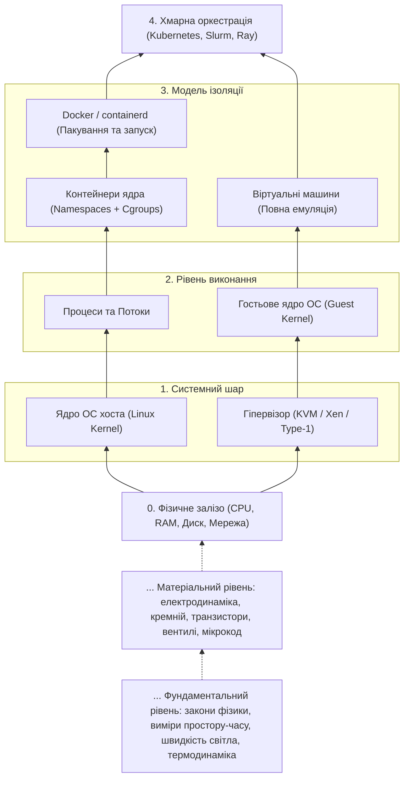
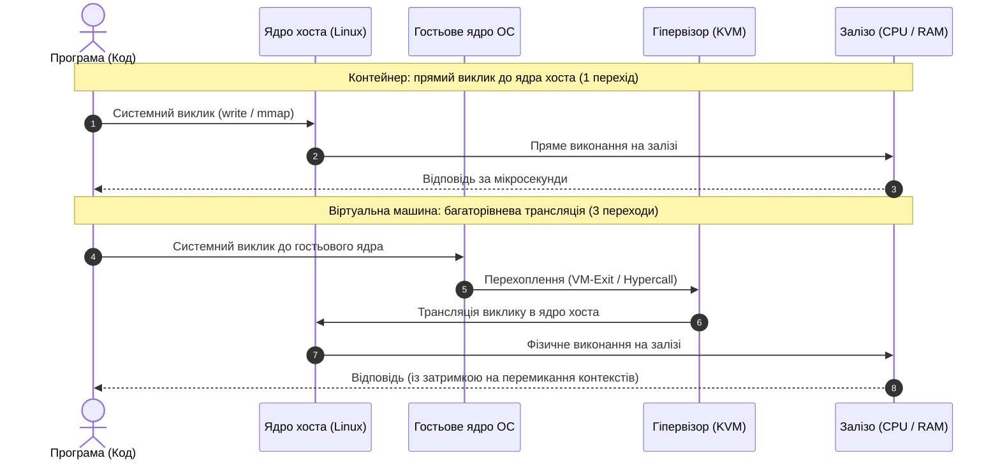
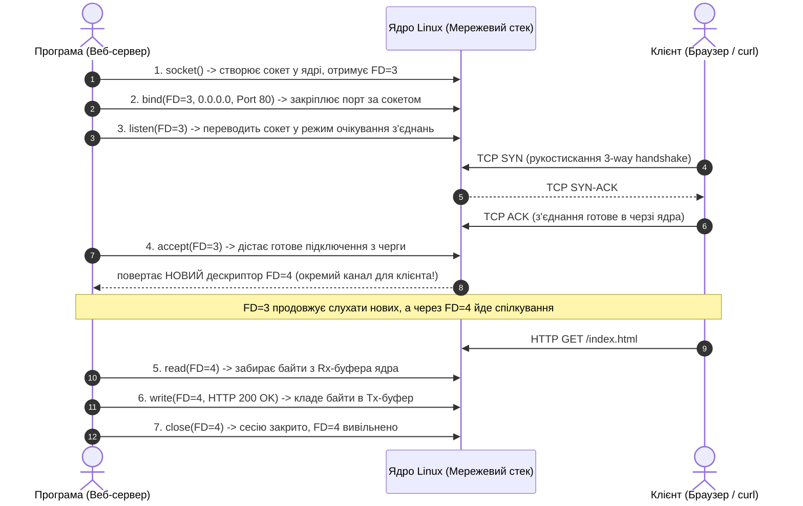

# Пререквізити: Механіка ізоляції — піраміда абстракцій

> **Декларація курсу.** Академічна доброчесність та авторство матеріалів — у [DISCLAIMER.md](DISCLAIMER.md).

---

## Піраміда абстракцій: від кремнію до хмари

Щоб зрозуміти, чому контейнери витіснили віртуальні машини, потрібно бачити, як комп'ютер нарізає абстракції — від фізичних транзисторів до розподілених систем.



---

## 1. Рівень заліза: фізичний комп'ютер

> **Глибші рівні абстракції (за дужками курсу):**
> 1. **Фізика та термодинаміка:** затримка поширення сигналу та відведення тепла.
> 2. **Електродинаміка та напівпровідники:** транзистори як керовані перемикачі двійкових станів (0 та 1).
> 3. **Цифрова схемотехніка та мікрокод:** логічні вентилі (AND, OR, NOT), тригери, арифметико-логічні пристрої (ALU), система команд (ISA: x86-64, ARM).
>
> Ми усвідомлюємо цей фундамент, але для хмарного інженера базовою точкою відліку слугує залізо як цілісний інтерфейс: інструкції CPU, адресний простір RAM та системна периферія.

Фізично комп'ютер складається з трьох ключових компонентів:
* **Процесор (CPU):** обчислювач, що послідовно виконує інструкції з регістрів за тактами генератора частоти (ГГц).
* **Оперативна пам'ять (RAM):** суцільний масив байтів, пронумерованих від нуля до максимуму.
* **Периферія (Диск, Мережева карта):** повільні зовнішні пристрої передачі та зберігання даних.

Якби програми працювали безпосередньо з кремнієм, будь-яка помилка вказівника в коді перетирала б чужі дані або виводила комп'ютер із ладу. Тому потрібен регулювальник.

---

## 2. Рівень ядра ОС: диспетчер ресурсів

**Ядро операційної системи (Kernel)** — головна програма, що має монопольний доступ до заліза.

* Програми ніколи не керують пам'яттю чи диском напряму.
* Щоб виділити пам'ять, записати файл або надіслати байт у мережу, програма звертається до ядра через спеціальні запити — **системні виклики (syscalls)**.
* Ядро вирішує: дозволити операцію чи відмовити через брак прав або ресурсів.

---

## 3. Рівень процесів: ілюзія власного комп'ютера

**Програма на диску** — пасивний бінарний файл (набір скомпільованих інструкцій).

Коли ядро завантажує програму в оперативну пам'ять, виникає **Процес**:
* Ядро виділяє процесу **віртуальний адресний простір**.
* Процес вважає, що вся пам'ять комп'ютера належить лише йому (від адреси `0x0000` до межі). 
* Спроба процесу звернутися за межі виділеного простору перехоплюється залізом (MMU) — ядро миттєво припиняє процес аварією **Segmentation Fault (`SIGSEGV`)**.
* **Головне правило:** процеси за замовчуванням **повністю ізольовані один від одного по пам'яті**.

---

## 4. Рівень потоків (Threads): одиниці виконання

Усередині процесу код хтось має виконувати. Ця одиниця виконання називається **потоком (Thread)**.

* **Процес** — це **ізольований контейнер ресурсів** (виділена пам'ять, відкриті файли, мережеві сокети). Процес володіє ресурсами, але сам по собі код не виконує.
* **Потоки (Threads)** — це **одиниці виконання коду** на CPU. Кілька потоків працюють усередині одного процесу.
* **Фундаментальна різниця:** різні процеси жорстко ізольовані, а потоки всередині одного процесу **ділять спільну пам'ять**. Вони одночасно читають і модифікують ті самі змінні (що створює ризик race conditions).

---

## 5. Розвилка ізоляції: Контейнери vs Віртуальні машини

Коли один потужний сервер потрібно розділити між різними клієнтами, сервісами або командами, індустрія пропонує два різні архітектурні шляхи:

### Шлях А: Віртуальні машини (ізоляція на рівні заліза)
Між залізом і гостьовими системами працює **гіпервізор — це спеціальна програма** (або шар коду ядра, як-от KVM).
* Гіпервізор програмно емулює фізичне залізо (віртуальний CPU, віртуальна пам'ять, диск).
* На це віртуальне залізо встановлюється **повноцінна гостьова ОС зі своїм власним ядром**.
* **Ціна:** кожна ВМ запускає власне ядро ОС, витрачає гігабайти пам'яті на системні потреби та стартує хвилинами.
* **Перевага:** апаратний рівень ізоляції. Збій або падіння ядра всередині ВМ ніяк не зашкодить хосту чи іншим машинам.

### Шлях Б: Контейнери (ізоляція на рівні ядра ОС)
Ми лишаємося на рівні звичайної операційної системи. У ядрі Linux немає сутності «контейнер».
**Контейнер — це звичайний процес Linux**, на який ядро накладає два обмеження:
1. **Namespaces (простори імен — «окуляри»):** що процес може бачити. Процес бачить лише свої власні файли, свої порти й вважає себе `PID 1`.
2. **Cgroups (контрольні групи — «пайок»):** скільки ресурсів йому дозволено з'їсти (наприклад, не більше 2 CPU і 512 МБ RAM).
* **Перевага:** відсутність дублювання ядер. Старт за мілісекунди, нульовий оверхед на пам'ять.
* **Ціна компромісу:** спільне ядро хоста. Якщо уразливість зламає ядро, вона скомпрометує всі контейнери на машині.

### Шлях виконання системного виклику



---

## 6. Фізика ресурсів: стисливість та пам'ять

Під навантаженням ресурси сервера поводяться згідно з фізичними обмеженнями заліза:

* **CPU — стисливий (compressible) ресурс:**
  Процесорний час можна нарізати на мілісекундні кванти. Якщо процес або контейнер виходить за ліміт CPU, ядро не вбиває його, а тимчасово призупиняє видачу процесорного часу (**throttling**). Застосунок сповільнюється, але продовжує працювати.

* **RAM — нестисливий (non-compressible) ресурс:**
  Фізичні комірки пам'яті неможливо розтягнути в часі. Якщо вільна пам'ять вичерпана — новий байт зберегти ніде.

* **Чому SWAP вимикають у хмарах і Kubernetes:**
  Дисковий SWAP у тисячі разів повільніший за кремнієву пам'ять. Якщо під час сплеску трафіку контейнер почне скидати пам'ять на диск, процесор завмре в очікуванні вводу-виводу (I/O wait), а черга запитів паралізує весь вузол.
  Тому в хмарах SWAP вимикають. Замість нього працює **OOM Killer (Out-of-Memory Killer)**: при виході за ліміт пам'яті ядро Linux миттєво вбиває процес сигналом `SIGKILL` (код **137**).

---

## 7. Як працює мережеве з'єднання в ОС: дескриптори, сокети та порти

Мережа в Linux спирається на базовий системний принцип Unix: **«усе є файлом»**. Програма не звертається до мережевої карти напряму — вона працює з абстракціями ядра.

### 1. Файлові дескриптори (File Descriptors, FD)

Для операційної системи файл, термінал, пайп між процесами та мережеве з'єднання — це один і той самий інтерфейс вводу-виводу.

* **Файловий дескриптор (FD)** — це невід'ємне ціле число (`0, 1, 2, 3...`), яке слугує індексом у системній таблиці відкритих файлів процесу.
* Кожен новий процес за замовчуванням отримує три стандартні дескриптори:
  * `0` — **`stdin`** (стандартний потік вводу)
  * `1` — **`stdout`** (стандартний потік виводу)
  * `2` — **`stderr`** (потік діагностики та помилок)
* Будь-який наступний ресурс — відкритий конфігураційний файл на диску чи мережеве з'єднання — отримує черговий вільний номер: `3`, `4`, `5` тощо.
* Програма читає з мережі точно так само, як із файлу: системним викликом `read(fd, buffer)`.

### 2. Мережевий сокет (Socket)

**Сокет** — це точка входу в мережевий стек операційної системи. Для програми він виглядає як звичайний файловий дескриптор, але в пам'яті ядра за ним закріплені системні структури та два кільцеві буфери:
* **Rx Buffer (Receive):** сюди мережева карта записує вхідні пакети через DMA.
* **Tx Buffer (Transmit):** сюди програма складає байти, які мережевий стек упаковує в TCP-сегменти та надсилає в кабель.

### 3. Життєвий цикл TCP-з'єднання на системних викликах

Будь-який мережевий сервер (на Go, Rust, Python чи Node.js) під капотом виконує суворий ланцюжок системних викликів ядра:



> **Архітектурний інсайт:**  
> Слухаючий сокет (`FD 3`) не передає дані конкретного клієнта. Виклик `accept()` створює **новий дескриптор (`FD 4`)**. Завдяки цьому один сервер на одному порті може одночасно вести діалог із десятками тисяч клієнтів — кожен із них має свій окремий дескриптор у таблиці процесу.

### 4. Порти та магія четвірки (4-tuple)

* **Порт (1–65535)** — це 16-бітне число в заголовку TCP/UDP пакетів. IP-адреса адресує конкретний вузол у мережі, а порт дозволяє ядру доставити пакети потрібному сокету всередині ОС.
* Порти від `1` до `1023` є привілейованими (вимагають прав `root` або Linux capability `CAP_NET_BIND_SERVICE`).
* Якщо програма зайняла порт через `bind()`, спроба другого процесу зайняти той самий порт завершиться системною помилкою **`EADDRINUSE (Address already in use)`**.
* **Як один порт `443` витримує 100 000 одночасних клієнтів?**  
  Ядро розрізняє з'єднання не за одним портом, а за комбінацією чотирьох параметрів — **4-tuple**:
  $$\text{TCP Session} = \{\text{Source IP},\ \text{Source Port},\ \text{Destination IP},\ \text{Destination Port}\}$$
  Кожен клієнт звертається з власної комбінації IP та випадкового клієнтського порту. Для ядра всі ці сесії унікальні, тому воно безпомилково розкладає пакети по відповідних файлових дескрипторах.

### 5. Мережева ізоляція в контейнерах (Network Namespace)

Якщо запустити дві копії одного веб-сервера безпосередньо на хості, друга впаде через зайнятий порт.

Контейнеризація вирішує це за допомогою **Network Namespace (netns)**:
* Ядро виділяє кожному контейнеру **власний мережевий стек**:
  1. Персональний віртуальний інтерфейс зворотного зв'язку (`loopback` / `127.0.0.1`).
  2. Персональну віртуальну мережеву карту (`eth0`, підключену через пару `veth` до хостового моста).
  3. Власну таблицю маршрутизації та сокетів.
  4. Повний персональний діапазон портів `1–65535`.
* Усередині двох різних контейнерів два окремі процеси спокійно роблять `bind()` на порт `80` одночасно. Вони не знають про існування один одного, бо живуть у різних мережевих просторах імен.

---

## 8. Де тут Docker: пакувальник і диспетчер

У ядрі Linux немає програми чи команди «контейнер», як немає і сутності «Docker». Docker сам по собі нічого не ізолює — всю ізоляцію виконує виключно ядро операційної системи.

Тоді що робить **Docker**?

**Docker — це пакувальник файлів та автоматизатор запуску процесів:**

1. **Образ (Image) — «заморожена файлова система»:**
   Звичайний архів (набір шарів) із вашим кодом, системними бібліотеками, середовищем виконання (Python, Node.js, JVM) та конфігураціями. Образ незмінний (read-only). Він розв'язує проблему *«на моєму комп'ютері працювало, а на сервері впало»*.
2. **Контейнер (Container) — запущений процес:**
   Звичайний процес Linux, що стартує з файлової системи образу, але запускається ядром через системний виклик `clone()` із прапорцями ізоляції.
3. **Docker Engine (демон `dockerd`):**
   Програма-помічник. Замість того щоб інженер власноруч створював віртуальні мережеві мости, монтував диски та писав правила обмеження в файлову систему `/sys/fs/cgroup/`, команда:
   ```bash
   docker run -d --memory 512m -p 8080:80 nginx
   ```
   робить це автоматично за мілісекунди: завантажує образ, монтує ізольований корінь файлів, налаштовує `cgroups` і `namespaces`, після чого стартує звичайний процес.

> **Формула Docker:**  
> **Docker = Пакувальник файлової системи (Image) + Автоматичний виклик ізоляції ядра (Namespaces + Cgroups).**
