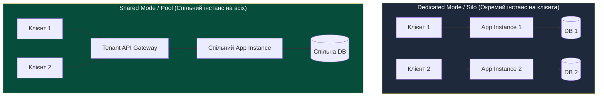
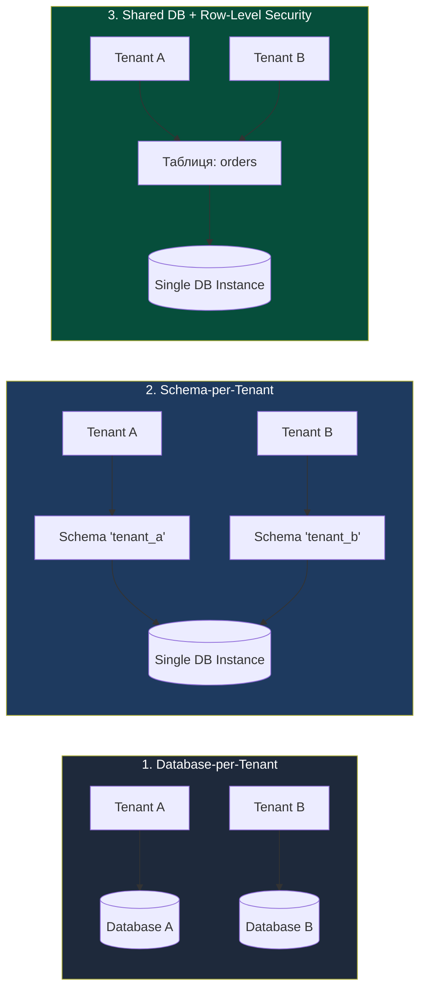
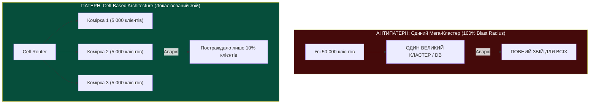

# Лекція 4: Архітектура Multi-Tenant систем (HaaS, IaaS, PaaS, SaaS) & ресурсна конкуренція

> **Декларація курсу.** Академічна доброчесність та авторство матеріалів — у [DISCLAIMER.md](DISCLAIMER.md).

---

## Рекомендовані першоджерела (Reading)

* **Обов'язкова стаття:** Hamilton, James. [*On Designing and Deploying Internet-Scale Services*](https://www.usenix.org/legacy/event/lisa07/tech/full_papers/hamilton/hamilton.pdf) (USENIX LISA 2007).
  * *Фокус під час читання:* Розділи про проектування відмовостійкості, обмеження радіуса ураження (*Blast Radius*), відмову від ручного керування та автоматичне витіснення ненадійних компонентів.
  * *Питання для роздумів:* Чому в масштабованих багатокористувацьких системах наївна спроба «запобігти всім помилкам» коштує дорожче, ніж проектування системи, готової до ізоляції часткових збоїв?
* **Додатковий документ (★):** AWS Whitepaper. [*SaaS Architecture Fundamentals & Multi-Tenant Lens*](https://docs.aws.amazon.com/wellarchitected/latest/saas-lens/welcome.html) (Amazon Web Services).
  * *Фокус під час читання:* Порівняння моделей ізоляції сховищ (Silo vs Pool) та вплив вибору моделі на розрахунок собівартості клієнта (*Cost per Tenant*).

---

## Питання для розминки

**Питання 1: нічний привид у дата-центрі**

Ваш мікросервіс працює у хмарі. О 03:15 ночі за внутрішніми графіками сервіс отримує рівно **нуль клієнтських запитів**. Раптово моніторинг фіксує, що затримка виконання поодиноких фонових задач (P99 latency) стрибає з **12 мс до 850 мс**, а системні виклики запису на диск блокуються. Жодних релізів чи змін конфігурації ви не робили. Що сталося з сервером?

<details markdown="1">
<summary><b>Дізнатися відповідь</b></summary>

**Відбулася апаратна ресурсна конкуренція («ефект Noisy Neighbor»).**

Фізичний сервер, його дисковий контролер або шина пам'яті є спільними для багатьох ізольованих середовищ. О 03:00 інший орендар (tenant), розміщений на тому ж блейд-сервері чи дисковому масиві, запустив плановий бекап, перерахунок аналітики або переіндексацію бази даних.

Сусідній процес вичерпав спільну пропускну здатність дискового каналу чи вимив L3-кеш процесора, змусивши ваші системні виклики чекати в апаратній черзі блокувань.
</details>

**Питання 2: чи врятує `WHERE tenant_id = ?` від витоку даних?**

Ви проектуєте платформу для бухгалтерського обліку. Серед клієнтів — прямі бізнес-конкуренти. Розробник пропонує зберігати всі транзакції в одній спільній таблиці PostgreSQL, розділяючи клієнтів колонкою `tenant_id`: *«ORM автоматично підставляє `WHERE tenant_id = current_tenant` у кожен запит, помилка виключена»*. Чи пройде така архітектура аудит безпеки фінансової організації?

<details markdown="1">
<summary><b>Дізнатися відповідь</b></summary>

**Ні, для критичних фінансових систем таку реалізацію забракують.**

Покладання виключно на логіку коду застосунку (`WHERE tenant_id = ?`) створює критичні вектори компрометації:
1. **Людський фактор:** Один нативний SQL-запит від аналітика або джуніора без умови фільтрації — і звіт покаже транзакції конкурентів.
2. **Баги кешування:** Спільний кеш другого рівня (Redis/Memcached) без жорсткого префікса тенанта віддасть сторінку клієнта А користувачу клієнта Б.
3. **SQL-ін'єкція:** Будь-яка вразливість у параметрах фільтрації ламає логічну межу ізоляції.

Для критичних вимог використовують або окремі фізичні бази (**Database-per-Tenant**), або апаратне розмежування на рівні СУБД (**Row-Level Security / RLS**) під непривілейованим користувачем.
</details>

---

## Архітектурний кейс: «Чорна п'ятниця» на спільному хості

На ранніх етапах розвитку масових хмарних платформ компанії регулярно фіксували падіння сервісів під час чужих розпродажів.

Типовий інцидент: фінтех-стартап розгорнув платіжний шлюз на орендованій віртуальній машині. Навантажувальне тестування підтвердило запас потужності у 300%. Проте в п'ятницю ввечері сервіс почав повертати масові таймаути (HTTP 504 Gateway Timeout).

```
                      ФІЗИЧНИЙ СЕРВЕР (HOST)
 ┌─────────────────────────────────────────────────────────────┐
 │  СПІЛЬНИЙ L3-КЕШ CPU (32 MB) & ШИНА ПАМ'ЯТІ (RAM BUS)       │
 ├──────────────────────────────┬──────────────────────────────┤
 │   ОРЕНДАР А (Інтернет-магазин)│   ОРЕНДАР Б (Фінтех-сервіс)  │
 │   - Старт Black Friday       │   - Штатне навантаження      │
 │   - 50 000 req/sec           │   - 40 req/sec               │
 │   - Вимивання L3-кешу CPU    │   - Постійні Cache Misses    │
 │   - Черга дискового каналу   │   - Затримка I/O: 10ms -> 2s │
 └──────────────────────────────┴──────────────────────────────┘
```

**Розслідування інциденту показало:**
* Процесор і пам'ять самої віртуальної машини фінтех-сервісу були завантажені лише на 15%.
* На тому ж фізичному вузлі працювала віртуальна машина роздрібного магазину з піковим навантаженням.
* Сусідній процес вимив **спільний L3-кеш процесора**: інструкції фінтех-сервісу замість 10 тактів процесора стали очікувати пам'ять по 200 тактів (*CPU Stall Cycles*).
* Черга дискового контролера хоста виявилася забитою операціями запису магазину, що заморозило транзакції сусідів.

Цей прецедент змусив індустрію запровадити апаратне квотування каналів введення-виведення, алгоритми **Rate Limiting** та архітектуру обмеження радіуса ураження (**Blast Radius Reduction**).

---

## 1. Спектр моделей від HaaS до SaaS: Де проходить межа ізоляції?

Багатокористувацька архітектура (**Multi-Tenancy**) означає спільне використання ресурсів декількома незалежними клієнтами (орендарями / tenants). Межа цієї спільності залежить від рівня хмарної моделі:

```
 ┌─────────────────────────────────────────────────────────────┐
 │  SaaS  │ Додаток (Спільний код, процеси та таблиці БД)      │
 ├────────┼────────────────────────────────────────────────────┤
 │  PaaS  │ Платформа (Спільне ядро ОС, контейнери, СУБД)      │
 ├────────┼────────────────────────────────────────────────────┤
 │  IaaS  │ Інфраструктура (Спільне залізо хоста, гіпервізор)   │
 ├────────┼────────────────────────────────────────────────────┤
 │  HaaS  │ Апаратне забезпечення (Окремий фізичний сервер)    │
 └─────────────────────────────────────────────────────────────┘
```

### 1. HaaS (Hardware-as-a-Service / Bare-Metal Cloud)
* **Що орендується:** Фізичний сервер цілком (процесор, материнська плата, локальні диски).
* **Межа ізоляції:** Фізичний корпус сервера та мережевий порт комутатора (ізоляція на рівні VLAN).
* **Ресурсний взаємовплив:** **Нульовий на рівні сервера.** Сусіди не можуть вплинути на процесорні кеші чи оперативну пам'ять. Залишається лише конкуренція за спільні магістральні комутатори стійки (Top-of-Rack Switch).
* **Ціна та застосування:** Найвища вартість. Використовується для високонавантажених СУБД, ультранизької затримки (HFT-трейдинг) та великих HPC-обчислень.

### 2. IaaS (Infrastructure-as-a-Service)
* **Що орендується:** Віртуальна машина (VM), віртуальний блоковий диск та віртуальна мережа (VPC).
* **Межа ізоляції:** Апаратний гіпервізор (KVM, Xen) за підтримки технологій віртуалізації процесора (Intel VT-x, AMD-V, EPT).
* **Ресурсний взаємовплив:** Виникає через ресурси материнської плати, які гіпервізор не може розділити на 100%: спільний L3-кеш процесора, пропускна здатність шини оперативної пам'яті, глибина черги контролера сховища.
* **Відповідальність:** Провайдер гарантує непроникність гіпервізора; клієнт керує своєю гостьовою ОС.

### 3. PaaS (Platform-as-a-Service)
* **Що орендується:** Середовище виконання коду, керована база даних або пул контейнерів.
* **Межа ізоляції:** Ядро операційної системи хоста (механізми Linux namespaces, cgroups v2, seccomp, розібрані в Лекції 3).
* **Ресурсний взаємовплив:** Високий. Контейнери ділять між собою системні структури єдиного ядра: черги мережевих сокетів, таблицю активних з'єднань брандмауера (`conntrack`), пам'ять дискового буферного кешу та файлові дескриптори.
* **Відповідальність:** Провайдер платформи відповідає за безпеку ядра та конфігурацію cgroups.

### 4. SaaS (Software-as-a-Service)
* **Що орендується:** Функціональність готового прикладного програмного забезпечення (CRM, ERP, пошта).
* **Межа ізоляції:** Логіка коду програми (Tenant Middleware, валідація прав доступу, фільтрація запитів до СУБД).
* **Ресурсний взаємовплив:** Максимальний. Усі клієнти використовують спільний пул підключень до бази даних, спільні черги фонових задач і спільні пули веб-потоків. Важкий аналітичний звіт одного клієнта здатний заблокувати обробку запитів для всіх інших.
* **Відповідальність:** Повністю лежить на **розробнику прикладного коду**.

### Порівняльна матриця рівнів хмари

| Рівень моделі | Одиниця оренди | Механізм ізоляції | Де виникає конкуренція? | Собівартість для постачальника |
| :--- | :--- | :--- | :--- | :--- |
| **HaaS** | Фізичний вузол | Фізична шина, комутатор | Мережева фабрика ЦОД | **Найвища** (оплата заліза без оверселінгу) |
| **IaaS** | Віртуальна машина | Апаратний гіпервізор | L3-кеш, Memory Bus, черга SAN | Висока (нарізка ресурсів хоста) |
| **PaaS** | Контейнер / СУБД | Namespaces, cgroups v2 | Системні таблиці ядра, дисковий кеш | Середня (високе ущільнення) |
| **SaaS** | Обліковий запис | Код додатку, RLS у БД | Пул конекцій БД, пам'ять процесу | **Мінімальна** (максимальна утилізація) |

---

## 2. Стратегії розміщення: Shared Tenancy (Pool) vs Dedicated Tenancy (Silo)

При проектуванні сервісу обирають між двома базовими підходами до розподілу компонентів:



### Матриця інженерних компромісів

| Критерій | Shared Mode (Pool) | Dedicated Mode (Silo) |
| :--- | :--- | :--- |
| **Утилізація ресурсів** | **Максимальна** (динамічний розподіл заліза) | Низька (простій виділених серверів) |
| **Собівартість (Cost per Tenant)** | **Мінімальна** (центи на клієнта) | Висока (фіксована ціна окремої інфраструктури) |
| **Радіус відмови (Blast Radius)** | Великий (аварія сервісу зачіпає всіх) | **Мінімальний** (збій клієнта А ізольований) |
| **Оновлення коду** | Атомарне: одна версія розгортається на всіх | Повільне: послідовний rollout сотень систем |
| **Відповідність вимогам (Compliance)**| Складна сертифікація (HIPAA, PCI-DSS) | **Проста** (фізичне розмежування контурів) |

### Роль Tenant API Gateway (Маршрутизація клієнтів)

У гібридних та спільних архітектурах вхідною точкою завжди виступає **Tenant Gateway**:

1. **Ідентифікація орендаря:**
   * **Host-based / Subdomain:** `acme.service.com` $\to$ шлюз витягує префікс `acme`.
   * **Заголовок запиту:** `X-Tenant-ID: 7f8a91` (для внутрішніх міжсервісних викликів).
   * **Криптографічний токен (JWT Claim):** перевірка підпису Bearer-токена `{"tenant": "corp_42"}`.
2. **Динамічна маршрутизація:**
   * Преміум-клієнти спрямовуються на виділений ізольований кластер (**Dedicated Tier**).
   * Базові клієнти (Free Tier) спрямовуються на ущільнений спільний пул (**Shared Pool**).
3. **Контекстна ін'єкція:** додавання ідентифікатора клієнта у внутрішній контекст запиту перед передачею бекенду.

---

## 3. Фізика деградації спільних вузлів: неквотовані ресурси

Чому процеси заважають один одному, навіть коли налаштовано cgroups-ліміти процесора та пам'яті?

Тому що в сучасному сервері є апаратні підсистеми, які **не піддаються прямому квотуванню ядром операційної системи**:

```
 ┌─────────────────────────────────────────────────────────────┐
 │                НЕКВОТОВАНІ РЕСУРСИ СЕРВЕРА                 │
 ├─────────────────────────────────────────────────────────────┤
 │ 1. L3 CPU Cache (Вимивання спільних ліній кешу даних)      │
 │ 2. Memory Bus (Пропускна здатність шини контролера RAM)     │
 │ 3. Storage I/O Queues (Глибина черги апаратного контролера) │
 │ 4. Kernel Conntrack (Таблиця з'єднань мережевого стеку)     │
 └─────────────────────────────────────────────────────────────┘
```

1. **Вимивання кешу L3 (L3 Cache Pollution):**
   Ядра процесора ділять спільний кеш третього рівня (32–64 МБ). Якщо сторонній потік сканує масив розміром 500 МБ, він за частки мілісекунди витісняє з кешу гарячі дані вашого застосунку. Процесор переходить у стан простою (*Stall Cycles*), очікуючи вибірки з повільної RAM.
2. **Пропускна здатність шини пам'яті (Memory Bus Bandwidth):**
   Контролер пам'яті має фізичну межу швидкості (наприклад, 200 ГБ/с). Безперервні операції перемноження матриць або розпакування архівів забивають шину, сповільнюючи доступ до пам'яті для решти процесів хоста.
3. **Переповнення системної таблиці з'єднань (Kernel Conntrack):**
   Мережевий фільтр Linux відстежує активні з'єднання у виділеній таблиці ядра (`nf_conntrack_max`). Якщо сусідній сервіс відкриває сотні тисяч короткоживучих TCP-сесій, ліміт вичерпується — і ядро починає відкидати вхідні пакети всіх процесів вузла.

### NUMA-архітектура та прив'язка ядер (CPU Pinning)

Серверні материнські плати будуються за архітектурою **NUMA (Non-Uniform Memory Access)**:
* Материнська плата містить кілька процесорних сокетів (Socket 0, Socket 1). Кожен сокет має власний інтегрований контролер і локальні планки оперативної пам'яті.
* **Затримка міжсокетового переходу:** Якщо потік виконується на Socket 0, а його виділена пам'ять опинилася в банках Socket 1, процесор прокачує дані крізь міжпроцесорну шину (Intel UPI / AMD Infinity Fabric). Затримка доступу зростає у **2–3 рази**.

```
 [ Socket 0 ] ──(Міжпроцесорна шина: +40ns)── [ Socket 1 ]
      │                                             │
 [Локальна RAM 0]                              [Локальна RAM 1]
```

**Інженерне рішення: закріплення за ядрами (CPU & NUMA Pinning)**

Пряма прив'язка критичного процесу до фізичних ядер та локального банку пам'яті засобами ядра Linux:
```bash
# Прив'язка процесу до ядер 0-3 сокета 0 та локального банку пам'яті 0 через cgroups v2:
echo "0-3" > /sys/fs/cgroup/critical_service/cpuset.cpus
echo "0"   > /sys/fs/cgroup/critical_service/cpuset.mems
```
*У промислових оркестраторах контейнерів (детальну архітектуру яких ми вивчимо в Лекції 7) цей механізм автоматизується політиками планувальника через надання гарантованих виділених ядер без зміни контексту.*

---

## 4. Ізоляція даних: 3 патерни багатокористувацьких сховищ



### 1. Database-per-Tenant (Фізична ізоляція)
* Окремий екземпляр або окрема логічна база для кожного клієнта.
* **Переваги:** Максимальна безпека; резервне копіювання одного клієнта виконується штатною утилітою `pg_dump`; легкий переніс великого клієнта на окремий потужніший сервер.
* **Недоліки:** Оверхед пулів з'єднань (Connection Pool на кожну БД); обмеження на кількість клієнтів (сервер PostgreSQL зазвичай не тримає більше 300–500 активних баз через витрати пам'яті на службові процеси).

### 2. Schema-per-Tenant (Ізоляція на рівні схем)
* Єдина база, де для кожного клієнта створюється власна схема: `tenant_1.orders`, `tenant_2.orders`.
* При обробці запиту застосунок виконує: `SET search_path TO tenant_a, public;`.
* **Переваги:** Спільний пул з'єднань до СУБД; розмежування прав через стандартні SQL GRANT.
* **Архітектурний глухий кут:** Проблема DDL-міграцій. Якщо в системі 3 000 клієнтів, додавання нової колонки вимагає виконання `ALTER TABLE` три тисячі разів. Це переповнює системний каталог СУБД (`pg_class`, `pg_attribute`), блокує словниковий кеш пам'яті та розтягує деплой на години.

### 3. Shared Database + Row-Level Security (RLS)
* Усі дані лежать у спільних таблицях із колонкою `tenant_id UUID NOT NULL`.
* Для захисту від людських помилок у коді застосовують механізм **PostgreSQL Row-Level Security**:
  ```sql
  ALTER TABLE orders ENABLE ROW LEVEL SECURITY;
  
  CREATE POLICY tenant_isolation_policy ON orders
      USING (tenant_id = current_setting('app.current_tenant_id')::uuid);
  ```
* Бекенд встановлює контекст перед початком транзакції:
  ```sql
  SET LOCAL app.current_tenant_id = 'a1b2c3d4-...';
  ```
  Планувальник СУБД автоматично модифікує синтаксичне дерево запиту і додає фільтрацію на рівні рушія.

> [!WARNING]
> **Чи гарантує RLS захист від SQL-ін'єкцій?**
>
> RLS у базовому вигляді блокує випадковий витік через забутий `WHERE` у коді, але **не є абсолютною панацеєю від вразливостей ін'єкцій**:
> 1. Якщо зловмисник впроваджує в запит команду `'; SET LOCAL app.current_tenant_id = 'victim_id'; --`, він підміняє сесійний контекст і обходить політику.
> 2. Якщо бекенд підключається до СУБД під користувачем з правами `SUPERUSER` або власника таблиці (`table owner`), PostgreSQL за замовчуванням **ігнорує політики RLS**.
> 
> **Вимоги безпеки:** Застосунок повинен працювати під непривілейованим користувачем `app_user` з примусовою опцією `ALTER TABLE orders FORCE ROW LEVEL SECURITY;`.

### Enterprise-захист: перевірка доступу до парсингу SQL (Oracle Database Vault & SQL Firewall)

У високозахищених корпоративних СУБД (наприклад, Oracle Database) реалізовано глибший рівень захисту від ін'єкцій та витоків:

* **Життєвий цикл SQL-запиту в ядрі:**
  $$\text{Session Context} \longrightarrow \mathbf{Security\ \&\ Realm\ Check} \longrightarrow \text{Syntax/Semantic Parse} \longrightarrow \text{Execute}$$
* **Блокування до парсингу:** Технології на кшталт **Oracle Database Vault** та **Oracle SQL Firewall** аналізують права, допустимі IP/контексти та структуру запиту **до того, як СУБД почне його парсити та будувати дерево виконання (AST)**.
* **Чому це знешкоджує ін'єкції:** Якщо зловмисник спробує підставити чужий `tenant_id` або виконати нетипову конструкцію, механізм Command Rules / SQL Firewall виявляє аномалію граматики на етапі вхідного мережевого пакета (TNS/SQL-проксі) і аварійно розриває з'єднання. Запит навіть не доходить до інтерпретатора SQL.
* **Oracle Virtual Private Database (VPD):** Автоматично додає предикати безпеки на рівні системного перехоплювача ядра СУБД ще до оптимізації запиту, роблячи код додатку повністю ізольованим від знання про фільтрацію.

---

## 5. Контроль інтенсивності: Rate Limiting & Traffic Shaping

Щоб один клієнт не захопив усі ресурси системи, на межі периметра впроваджують обмеження частоти запитів:

```
 ┌─────────────────────────────────────────────────────────────┐
 │                АЛГОРИТМИ RATE LIMITING                      │
 ├──────────────────────────────┬──────────────────────────────┤
 │ Token Bucket (Маркерне відро)│ Пропускає короткі сплески    │
 ├──────────────────────────────┼──────────────────────────────┤
 │ Leaky Bucket (Діряве відро)  │ Суворо вирівнює темп обробки │
 ├──────────────────────────────┼──────────────────────────────┤
 │ Sliding Window Counter       │ Точний захист без аномалій   │
 └──────────────────────────────┴──────────────────────────────┘
```

* **Token Bucket:** У накопичувач ємністю $B$ регулярно додаються токени зі швидкістю $R$ токенів/сек. Кожен запит забирає 1 токен. Дозволяє легітимні сплески трафіку (*bursts*), якщо клієнт певний час мовчав.
* **Leaky Bucket:** Запити стають у буфер і надходять на обробку з фіксованою швидкістю. Захищає повільні бази даних від раптових імпульсів навантаження, згладжуючи піки.

### Алгоритм атомарного розподіленого лімітера

У розподіленій системі запити клієнта потрапляють на різні вузли API Gateway. Лічильники лімітів виносять у централізоване сховище швидкої пам'яті (In-Memory Datastore).

**Проблема стану гонитви (Race Condition):**
Наївний підхід `Read -> Check -> Write` не працює:
```
Шлюз 1: Читає лічильник (99)  ─── Дозволяє ─── Пише (100)
Шлюз 2: Читає лічильник (99)  ─── Дозволяє ─── Пише (100)  <- Помилка: пропущено 101-й запит!
```

**Алгоритмічна специфікація: Атомарна перевірка та декремент (Atomic Test-and-Decrement)**

Перевірка ліміту та модифікація лічильника повинні виконуватися як **єдина неподільна операція**:

```
Алгоритм: Оцінка запиту клієнта за фіксованим вікном
Вхідні дані: 
  - tenant_key: унікальний ключ клієнта
  - limit: максимальна кількість запитів за вікно
  - window_seconds: розмір вікна в секундах

1. current_count = ATOMIC_INCREMENT(tenant_key, 1)
2. ЯКЩО current_count == 1 ТОДІ
3.     SET_EXPIRATION(tenant_key, window_seconds)
4. КІНЕЦЬ УМОВИ
5. 
6. ЯКЩО current_count > limit ТОДІ
7.     ВІДХИЛИТИ ЗАПИТ (Повернути HTTP 429 Too Many Requests)
8. ІНАКШЕ
9.     ПРОПУСТИТИ ЗАПИТ
10. КІНЕЦЬ УМОВИ
```

> [!IMPORTANT]
> **Шардування та патерн Hash Tag у кластерних сховищах**
>
> Коли сховище лічильників масштабується горизонтально на десятки серверів (шардів), ключі розподіляються за хешем `Hash(key) % N_shards`.
> 
> Якщо операція вимагає одночасного звернення до кількох пов'язаних ключів клієнта (наприклад, лічильник запитів та статус блокування), вони можуть опинитися на різних фізичних серверах. Це призведе до помилки міжвузлових операцій.
> 
> **Архітектурне рішення:** Використання хеш-тегів у ключах — `{tenant_42}:requests` та `{tenant_42}:blocked`. Сховище вираховує шард виключно за текстом усередині `{...}`, гарантуючи розміщення всіх даних клієнта на одному вузлі кластера.

---

## 6. Мінімізація радіуса ураження: Cell-Based Architecture

> [!IMPORTANT]
> **Принцип проектування відмовостійкості Джеймса Гамільтона:**
> Будь-який компонент системи гарантовано зазнає аварії. Завдання архітектора — локалізувати збій так, щоб він зачепив найменшу частку користувачів.

Антипатерн масштабування — **«Єдиний мега-кластер»**: коли десятки тисяч клієнтів зведені в один глобальний контур. Збій конфігурації мережі або падіння центральної бази виводить із ладу всю платформу (100% Blast Radius).



### Принцип коміркової архітектури (Cells)

Замість безперервного нарощування потужності одного ядра інфраструктуру ділять на незалежні модулі — **Комірки (Cells)**:
1. Кожна комірка — самодостатній зліпок системи (власний пул сервісів застосунку, свої черги та власна база даних).
2. Кількість клієнтів у комірці жорстко обмежена (наприклад, не більше 5 000 організацій).
3. **Ізоляція аварій:** Помилка в даних або дефект оновлення в Комірці 2 не впливає на клієнтів у Комірках 1, 3 та 4.
4. **Поетапні релізи (Canary Rollout):** Новий реліз розгортається спочатку лише на одну пілотну комірку. Якщо телеметрія фіксує деградацію затримок, реліз зупиняється; 90% клієнтів залишаються неушкодженими.

---

## 7. Практичний зв'язок із лабораторним практикумом: Емуляція ресурсної конкуренції

Концепції цієї лекції є теоретичною базою для тестування стійкості розподілених обчислень (зокрема задач Монте-Карло, які ми розгортаємо в лабораторному блоці):

1. **Мережеві аномалії через Toxiproxy:** Внесення штучних затримок (+120 мс), тремтіння пакетів (jitter) та втрат зв'язку для перевірки реакції клієнтських таймаутів.
2. **Дроселювання операцій диска через cgroups:** Емуляція перевантаженого дискового накопичувача утилізацією лімітів блокового введення-виведення:
   ```yaml
   # Конфігурація обмеження дискової активності контейнера:
   blkio_config:
     device_write_bps_limit:
       - path: /dev/sda
         rate: '1mb'   # Обмеження запису до 1 МБ/с
     device_write_iops_limit:
       - path: /dev/sda
         rate: 40      # Ліміт на 40 операцій вводу-виводу/сек
   ```
3. **Аналіз P99 затримки:** Порівняння тривалості обчислювальних пакетів у чистому середовищі та в умовах штучного навантаження спільних ресурсів.

---

## Підсумок лекції

1. **Мультитенантність — це баланс вартості та ізоляції:** Спільне використання ресурсів (Pool) мінімізує собівартість обслуговування, але вимагає інженерного захисту від взаємного впливу орендарів.
2. **Неквотовані ресурси спричиняють приховану деградацію:** cgroups не контролюють шину оперативної пам'яті, лінії L3-кешу та системні таблиці сокетів ядра. Для критичних задач застосовують пряму прив'язку до ядер і банків пам'яті (CPU/NUMA Pinning).
3. **Ізоляція даних потребує підтримки рушія СУБД:** Фільтрація виключно в коді програми (`WHERE tenant_id = ?`) несе високий ризик людської помилки. Необхідно застосовувати Row-Level Security або окремі бази даних.
4. **Обмеження радіуса ураження:** Розподіл системи на автономні комірки (Cell-Based Architecture) локалізує аварії та захищає основний масив користувачів від каскадних колапсів.

---

## Контрольні питання

<details markdown="1">
<summary><b>1. Чому для клієнтських користувацьких інтерфейсів частіше обирають алгоритм Token Bucket замість Leaky Bucket?</b></summary>

Користувацький трафік має природний імпульсний характер (*bursty traffic*). Відкриття сторінки браузером викликає пачку одночасних запитів за даними, після чого настає тривала пауза на читання контенту. 

**Token Bucket** накопичує токени за час простою і дозволяє миттєво обслужити легітимний сплеск запитів без затримок. **Leaky Bucket** вирівнює потік із фіксованою швидкістю, що змусило б користувача чекати штучної черги завантаження інтерфейсу (деградація P99).
</details>

<details markdown="1">
<summary><b>2. Яким чином механізм PostgreSQL Row-Level Security запобігає витоку даних, якщо розробник забув додати фільтрацію за орендарем у SQL-запиті?</b></summary>

При активації RLS рушій PostgreSQL перехоплює абстрактне синтаксичне дерево запиту (AST) на етапі планування. 

Навіть якщо у вхідному SQL-тексті запиту умова `WHERE` взагалі відсутня, планувальник бази автоматично модифікує дерево запиту, примусово додаючи предикат перевірки поточної сесії (`tenant_id = current_setting(...)`). Рядки інших орендарів відсікаються ще до вибірки з дискових сторінок та індексів.
</details>

<details markdown="1">
<summary><b>3. Чому підхід «Schema-per-Tenant» перестає масштабуватися, коли кількість клієнтів перевищує кілька тисяч?</b></summary>

Через оверхед DDL-міграцій та системного каталогу СУБД. 

Додавання однієї колонки в таблицю вимагає послідовного або паралельного виконання `ALTER TABLE` у кожній із тисяч схем. Це роздуває системний каталог метаданих СУБД (`pg_class`), спричиняє тривалі блокування таблиць і вичерпує спільну пам'ять словникового кешу бази даних.
</details>

<details markdown="1">
<summary><b>4. Як архітектура комірок (Cell-Based Architecture) спрощує виявлення помилок конфігурації під час релізів нового коду?</b></summary>

Завдяки розділенню на незалежні домени відмов (*Fault Domains*) та канареечному розгортанню (Canary Rollout). 

Оновлення накочується спочатку на одну ізольовану комірку, де розміщено не більше 5–10% клієнтів. Якщо конфігурація містить дефект або спричиняє витік пам'яті, збій локалізується виключно в межах цієї комірки. Пайплайн розгортання зупиняється, а решта 90% клієнтів продовжують працювати без перебоїв.
</details>
