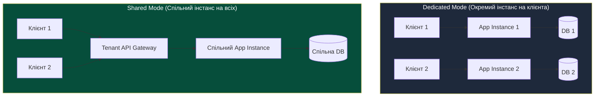
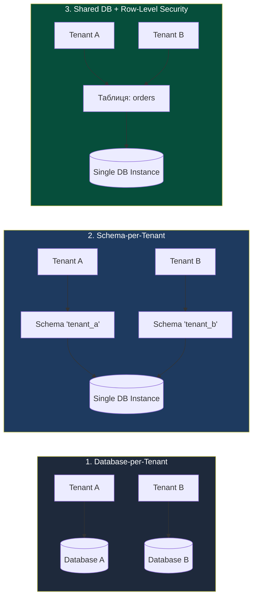
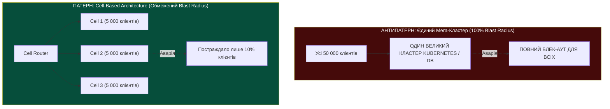

# Лекція 4: Архітектура Multi-Tenant систем (IaaS, PaaS, SaaS) & проблема Noisy Neighbor

> **Декларація курсу.** Академічна доброчесність та авторство матеріалів — у [DISCLAIMER.md](DISCLAIMER.md).

---

## Рекомендовані першоджерела (Reading)

* **Обов'язкова стаття:** Hamilton, James. [*On Designing and Deploying Internet-Scale Services*](https://www.usenix.org/legacy/event/lisa07/tech/full_papers/hamilton/hamilton.pdf) (USENIX LISA 2007).
  * *Фокус під час читання:* Розділи про проектування відмовостійкості, обмеження радіуса вибуху (*Blast Radius*), відмову від ручного керування та автоматичне витіснення ненадійних компонентів.
  * *Питання для роздумів:* Чому автор стверджує, що в масштабованих мультитенантних системах наївна спроба «запобігти всім помилкам» коштує дорожче, ніж проектування системи, готової до ізоляції часткових збоїв?
* **Додатковий документ (★):** AWS Whitepaper. [*SaaS Architecture Fundamentals & Multi-Tenant Lens*](https://docs.aws.amazon.com/wellarchitected/latest/saas-lens/welcome.html) (Amazon Web Services).
  * *Фокус під час читання:* Порівняння моделей ізоляції сховищ (Silo vs Pool) та вплив вибору моделі на розрахунок юніт-економіки (Cost per Tenant).

---

## Питання для розминки

**Питання для розминки 1: нічний привид у дата-центрі**

Ваш мікросервіс працює у публічній хмарі. О 03:15 ночі за внутрішніми графіками трафік на ваш сервіс становить рівно **нуль запитів на секунду**. Раптово система моніторингу фіксує, що затримка обробки поодиноких фонових задач (P99 latency) стрибає з **12 мс до 850 мс**, а дискові операції стають у чергу. Жодних релізів чи змін конфігурації ви не робили. Що сталося з сервером?

<details markdown="1">
<summary><b>Дізнатися відповідь</b></summary>

**Ви стали жертвою проблеми Noisy Neighbor («Галасливого сусіда»).**

Фізичний сервер і його дисковий контролер або мережевий інтерфейс є спільними. О 03:00 інший клієнт (сусідній орендар / tenant), розміщений на тому ж фізичному залізі чи дисковому масиві SAN/NAS, запустив свій плановий нічний бекап, повний перерахунок аналітики або переіндексацію бази даних. 

Сусід вичерпав спільну смугу пропускання шини введення-виведення (I/O bandwidth) або забив L3-кеш процесора, змусивши ваші процеси чекати в черзі апаратних блокувань.
</details>

**Питання для розминки 2: чи врятує `WHERE tenant_id = ?` від тюрми?**

Ви проектуєте SaaS-платформу для бухгалтерського обліку. Серед ваших клієнтів — два жорстких бізнес-конкуренти. Архітектор-початківець пропонує зберігати всі транзакції в одній спільній таблиці PostgreSQL, розділяючи клієнтів колонкою `tenant_id`, і каже: *«ORM автоматично додає `WHERE tenant_id = current_tenant` у кожен запит, помилка неможлива»*. Чи прийме таку систему служба безпеки банку?

<details markdown="1">
<summary><b>Дізнатися відповідь</b></summary>

**Ні, у критичних доменах таку архітектуру забракують одразу.**

Покладання виключно на логіку застосунку (`WHERE tenant_id = ?`) несе критичний ризик витоку даних:
1. **Людський фактор:** Один «сирий» нативний SQL-запит від джуніора або аналітика без `WHERE` — і дані конкурента витекли у відкритий звіт.
2. **Баги в ORM / Кеші:** Загальний кеш другого рівня (Hibernate/Redis) без tenant-префікса може віддати сторінку компанії А користувачу компанії Б.
3. **SQL-ін'єкція:** Будь-яка вразливість у полі фільтрації знімає цей захист.

Для високих вимог безпеки використовують або окремі фізичні бази (**Database-per-Tenant**), або як мінімум окремі схеми БД з мандатним розмежуванням на рівні ядра СУБД (**Row-Level Security / RLS**).
</details>

---

## Архітектурний кейс: «Чорна п'ятниця» чужого інтернет-магазину

У 2012–2015 роках, на ранніх етапах розвитку масових хмарних платформ, компанії регулярно стикалися з незрозумілими падіннями сервісів під час розпродажів.

Типовий сценарій: невелика фінтех-компанія розгорнула свій платіжний шлюз на віртуальній машині в AWS EC2. Вони провели власне навантажувальне тестування і гарантували запас потужності у 300%. Проте в п'ятницю ввечері їхній сервіс перестав відповідати на запити користувачів, отримавши масові таймаути (HTTP 504 Gateway Timeout).

```
                      ФІЗИЧНИЙ СЕРВЕР (HOST)
 ┌─────────────────────────────────────────────────────────────┐
 │  СПІЛЬНИЙ L3-КЕШ CPU (30 MB) & ШИНА ПАМ'ЯТІ (RAM BUS)       │
 ├──────────────────────────────┬──────────────────────────────┤
 │   ТЕHАНТ А (Інтернет-магазин)│   ТЕНАНТ Б (Фінтех-стартап)  │
 │   - Розпродаж Black Friday   │   - Звичайне навантаження    │
 │   - 50 000 req/sec           │   - 50 req/sec               │
 │   - Повне витіснення L3-кешу │   - Постійні Cache Misses    │
 │   - Забита черга диска EBS   │   - Затримка I/O: 15ms -> 2s │
 └──────────────────────────────┴──────────────────────────────┘
```

**Розслідування інциденту показало:**
* Процесор і пам'ять самого фінтех-сервісу були завантажені лише на 15%.
* Проте на тому ж блейд-сервері хостилася віртуальна машина великого роздрібного магазину, де стартував розпродаж Black Friday.
* Магазин генерував такий обсяг випадкових звернень до пам'яті та диска, що:
  1. **Вимив спільний L3-кеш процесора:** Кожна інструкція процесора фінтех-сервісу змушена була ходити в повільну оперативну пам'ять замість надшвидкого кешу CPU.
  2. **Заблокував спільний мережевий інтерфейс гіпервізора:** Пакети фінтех-сервісу ставали в чергу на передачу в ОС хоста.

Цей інцидент змусив хмарних гігантів переглянути підхід: від «добросусідської» довіри до жорсткого апаратного квотування (AWS Nitro System, виділені картки I/O), впровадження алгоритмів **Rate Limiting** та архітектури **Blast Radius Reduction**.

---

## 1. Моделі обслуговування: Де пролягає межа ізоляції?

Розподіл відповідальності за мультитенантність залежить від моделі хмари:

```
 ┌─────────────────────────────────────────────────────────────┐
 │  SaaS  │ Додаток (Multi-Tenant на рівні коду та даних)       │
 ├────────┼────────────────────────────────────────────────────┤
 │  PaaS  │ Платформа (Контейнери, середовище виконання, СУБД) │
 ├────────┼────────────────────────────────────────────────────┤
 │  IaaS  │ Інфраструктура (Віртуальні машини, віртуальні мережі)│
 ├────────┼────────────────────────────────────────────────────┤
 │ On-Prem│ Фізичне залізо (Сервери, свитчі, живлення, охолодження)│
 └─────────────────────────────────────────────────────────────┘
```

| Рівень | Хто такий Tenant? | Хто відповідає за ізоляцію? | Головний інструмент ізоляції |
| :--- | :--- | :--- | :--- |
| **IaaS (AWS EC2, OpenStack)** | Організація або аккаунт, що орендує VM | Хмарний провайдер | **Гіпервізор (KVM/Xen)**, віртуальні мережі (VPC, VXLAN) |
| **PaaS (Heroku, Cloud Foundry)** | Команда, що деплоїть сервіс | Провайдер платформи | **Контейнери (cgroups, namespaces)**, Service Mesh |
| **SaaS (Salesforce, Slack, Jira)** | Кінцевий користувач або компанія-клієнт | **Розробник прикладного софту** | **Код додатку, Tenant Gateway, RLS у базі даних** |

Якщо в IaaS ізоляцію гарантує апаратний гіпервізор, то в **SaaS уся відповідальність лягає на плечі архітектора додатку**. Помилка в коді відкриває чужі дані.

---

## 2. Shared Tenancy vs Dedicated Tenancy

Кожен сервіс у хмарі проектується в одному з двох базових режимів:



### Порівняльна матриця режимів

| Характеристика | Shared Mode (Pool) | Dedicated Mode (Silo) |
| :--- | :--- | :--- |
| **Утилізація ресурсів** | **Максимальна** (динамічний поділ CPU/RAM) | Низька (оплата простою кожного інстансу) |
| **Собівартість (Cost per Tenant)** | **Мінімальна** (центи на користувача) | Висока (фіксована ціна окремої VM/БД) |
| **Ізоляція відмов** | **Слабка** (падіння сервісу кладе всіх тенантів) | **Ідеальна** (збій клієнта А не впливає на клієнта Б) |
| **Оновлення коду** | Атомарне: одна нова версія для всіх | Складне: послідовний rollout сотень інстансів |
| **Кастомізація** | Тільки конфігураційні прапорці в БД | Можливість запуску персональних білдів і версій |

### Роль Tenant API Gateway (Маршрутизація орендарів)

У змішаних та спільних архітектурах вхідною точкою завжди виступає **Tenant Gateway**:

1. **Ідентифікація орендаря:**
   * **Subdomain / Host-based:** `tenant-a.crm.com` $\to$ Gateway витягує `tenant-a`.
   * **Custom Header:** `X-Tenant-ID: 7f8a91` (часто для внутрішніх сервісів).
   * **JWT Claim:** Розшифровка криптографічного токена Bearer Auth: `{"sub": "user123", "tenant": "corp_42"}`.
2. **Маршрутизація (Dynamic Routing Table):**
   * Преміум-клієнти спрямовуються на виділений ізольований кластер (**Dedicated Tier**).
   * Безкоштовні клієнти (Free Tier) спрямовуються на спільний ущільнений пул (**Shared Pool**).
3. **Захист периметра:** Ін'єкція контексту тенанта у внутрішні заголовки запиту перед передачею в Service Mesh.

---

## 3. Анатомія Noisy Neighbor: Війна за невидимі ресурси

Чому процеси заважають один одному, навіть якщо ми задали cgroups-ліміти на процесор і пам'ять?

Тому що в сучасному комп'ютері є ресурси, які **не піддаються жорсткому квотуванню на рівні ядра ОС**:

```
 ┌─────────────────────────────────────────────────────────────┐
 │                НЕКВОТОВАНІ РЕСУРСИ СЕРВЕРА                 │
 ├─────────────────────────────────────────────────────────────┤
 │ 1. L3 CPU Cache (Забруднення кешу інструкцій та даних)     │
 │ 2. Memory Bus (Пропускна здатність шини контролера RAM)     │
 │ 3. Storage I/O Queues (Глибина черги запитів до NVMe/SAN)   │
 │ 4. Linux Kernel Conntrack (Таблиця з'єднань брандмауера)    │
 └─────────────────────────────────────────────────────────────┘
```

1. **L3 Cache Pollution (Забруднення кешу процесора):**
   Всі ядра процесора ділять спільний кеш L3 (зазвичай 32–64 МБ). Якщо «галасливий» сусід сканує масив у 500 МБ, він за частки мілісекунди витісняє з кешу гарячі дані вашого застосунку. Ваші процесори починають простоювати в очікуванні пам'яті (*Stall Cycles*).
2. **Memory Bus Bandwidth:**
   Шина пам'яті має фізичну межу швидкості (наприклад, 200 ГБ/с). Якщо один процес безперервно ганяє важкі матричні обчислення або розпаковує архіви, шина стає «вузьким горлом» для всіх інших ядер.
3. **Kernel Conntrack Table Exhaustion:**
   Підсистема `iptables` / `nftables` у Linux веде таблицю активних мережевих з'єднань (`/proc/sys/net/netfilter/nf_conntrack_max`). Якщо сусід відкриває сотні тисяч дрібних TCP-з'єднань, таблиця переповнюється — і ядро починає просто дропати нові SYN-пакети вашого сервісу.

### Захист від Noisy Neighbor: NUMA-локальність та CPU Pinning

У багатопроцесорних серверних материнських платах діє архітектура **NUMA (Non-Uniform Memory Access)**:
* Материнська плата має кілька фізичних процесорних сокетів (наприклад, Socket 0 та Socket 1), і кожен сокет має свій власний локальний контролер оперативної пам'яті.
* **Проблема крос-сокета:** Якщо потік обчислень вашого контейнера виконується на ядрі Socket 0, а виділена йому пам'ять випадково опинилася в банках пам'яті Socket 1, процесор змушений прокачувати кожен байт крізь міжпроцесорну шину (Intel UPI або AMD Infinity Fabric). Це збільшує затримку звернення до пам'яті у **2–3 рази**!
* Для високоінтенсивних чисельних задач (як наші воркери Монте-Карло) стандартного ліміту `cpu.max` у cgroups v2 недостатньо, тому що планувальник ядра Linux CFS може довільно перекидати нитки між сокетами.

```
 [ Socket 0 ] ──(Intel UPI / Infinity Fabric: +40ns)── [ Socket 1 ]
      │                                                     │
 [RAM Node 0]                                          [RAM Node 1]
```

**Інженерне рішення: CPU & NUMA Pinning:**
Примусова прив'язка контейнера або процесу до конкретних фізичних ядер та локальної NUMA-ноди через cgroups:
```bash
# Прив'язка до фізичних ядер 0-3 сокета 0 та локального банку пам'яті 0:
echo "0-3" > /sys/fs/cgroup/tenant_a/cpuset.cpus
echo "0"   > /sys/fs/cgroup/tenant_a/cpuset.mems
```
У Kubernetes це реалізується через компонент **CPU Manager** з політикою `static` та конфігурацією Guaranteed QoS. Це гарантує воркеру ексклюзивні ядра без перемикання контексту та 100% локальний кеш L1/L2/L3.

---

## 4. Ізоляція даних: 3 патерни Multi-Tenant сховищ

Найдорожча помилка в архітектурі — неправильний вибір стратегії зберігання даних:



### 1. Database-per-Tenant (Повна фізична ізоляція)
* Кожен клієнт має власну фізичну (або логічну у хмарі) базу даних.
* **Переваги:** 100% безпека; бекап і відновлення окремого клієнта робиться командою `pg_restore` за секунди; можливість перенести базу великого клієнта на окремий потужніший сервер.
* **Недоліки:** Колосальний оверхед по підключеннях (Connection Pool на кожну БД); неможливість підтримувати більше ніж 200–500 клієнтів на одному сервері PostgreSQL через ліміти оперативної пам'яті на процеси worker'ів.

### 2. Schema-per-Tenant (Ізоляція на рівні схем)
* Одна база даних, але для кожного клієнта створюється окрема схема: `tenant_1.orders`, `tenant_2.orders`.
* При обробці запиту застосунок виконує: `SET search_path TO tenant_a, public;`.
* **Переваги:** Спільний пул підключень; надійна межа доступу (користувач БД може мати права лише на свою схему).
* **Недоліки:** DDL-міграції (Liquibase/Flyway): якщо у вас 2000 клієнтів, міграція нової колонки повинна виконатися 2000 разів, що призводить до блокування бази та багатогодинних деплоїв.

### 3. Shared Database + Row-Level Security (RLS)
* Усі дані зберігаються в спільних таблицях. Кожен рядок має колонку `tenant_id UUID NOT NULL`.
* **Як захиститися від багів у коді:** Використовувати вбудований у СУБД механізм **PostgreSQL Row-Level Security**:
  ```sql
  ALTER TABLE orders ENABLE ROW LEVEL SECURITY;
  
  CREATE POLICY tenant_isolation_policy ON orders
      USING (tenant_id = current_setting('app.current_tenant_id')::uuid);
  ```
* При кожному запиті бекенд задає контекст поточної сесії:
  ```sql
  SET LOCAL app.current_tenant_id = '8a2b3c...';
  ```
  Після цього навіть помилковий запит `SELECT * FROM orders` поверне виключно рядки поточного орендаря. База даних відфільтрує решту на рівні свого планувальника.
* **Переваги:** Дешевизна; легке масштабування до сотень тисяч дрібних клієнтів; миттєві міграції.
* **Недоліки:** Високий ризик виникнення Noisy Neighbor при аналітичних запитах великих клієнтів.

> [!WARNING]
> **Чи захищає RLS від SQL-ін'єкцій на 100%?**
> 
> Row-Level Security унеможливлює випадковий витік через забутий `WHERE` у штатному коді. Проте **RLS не є абсолютною панацеєю від SQL-ін'єкцій**:
> 1. Якщо зловмисник знаходить вразливість ін'єкції у вхідних параметрах і виконує:
>    ```sql
>    '; SET LOCAL app.current_tenant_id = 'victim_tenant_id'; --
>    ```
>    він успішно підміняє сесійний контекст і обходить RLS.
> 2. Якщо застосунок підключається до СУБД під користувачем з правами `SUPERUSER` або власника таблиці (`table owner`), PostgreSQL за замовчуванням **ігнорує політики RLS**!
> 
> **Як будувати захист правильно:**
> * Застосунок повинен підключатися під непривілейованим юзером `app_user` із примусовим правилом `ALTER TABLE orders FORCE ROW LEVEL SECURITY;` (змушує перевіряти RLS навіть для власника).
> * Сесійні змінні тенанта повинні встановлюватися виключно пулером з'єднань (**PgBouncer** у режимі `pool_mode = transaction`) у закритому транзакційному блоці.

---

## 5. Алгоритми захисту: Rate Limiting & Traffic Shaping

Щоб захистити спільну систему від перевантаження одним клієнтом, використовують алгоритми контролю частоти запитів (**Rate Limiting**).

```
 ┌─────────────────────────────────────────────────────────────┐
 │              АЛГОРИТМИ RATE LIMITING                        │
 ├──────────────────────────────┬──────────────────────────────┤
 │ Token Bucket (Маркерне відро)│ Дозволяє короткочасні сплески│
 ├──────────────────────────────┼──────────────────────────────┤
 │ Leaky Bucket (Діряве відро)  │ Жорстко згладжує потік       │
 ├──────────────────────────────┼──────────────────────────────┤
 │ Sliding Window Counter       │ Точний захист без аномалій   │
 └──────────────────────────────┴──────────────────────────────┘
```

### 1. Token Bucket (Маркерне відро)
* У «відро» ємністю $B$ регулярно (наприклад, 100 токенів на секунду) додаються маркери.
* Кожен вхідний запит вимагає 1 токен. Якщо токенів немає — повертається помилка **HTTP 429 Too Many Requests**.
* **Головна фіча:** Дозволяє легітимні короткочасні сплески (*bursts*). Якщо клієнт мовчав хвилину, накопичилося $B$ токенів, і він може відправити пачку запитів миттєво.

### 2. Leaky Bucket (Діряве відро)
* Запити потрапляють у чергу фіксованої довжини («відро») і витікають на обробку з **суворо постійною швидкістю**.
* Якщо черга переповнена — нові запити відкидаються.
* **Головна фіча:** Ідеально згладжує трафік (*traffic smoothing*). Захищає повільні бази даних від раптових імпульсів.

### 3. Розподілений Rate Limiting у Redis
У кластері з 10 серверів API Gateway локальний підрахунок не працює. Стан лічильників виносять у **Redis**.

Щоб уникнути стану перегонів (Race Condition) між кількома шлюзами, операція перевірки та списання токенів повинна бути **строго атомарною**. Це реалізується за допомогою вбудованого **Lua-скрипта** в Redis:

```lua
-- Атомарне списання ліміту в Redis (Sliding Window / Token Bucket)
local key = KEYS[1]
local limit = tonumber(ARGV[1])
local current = tonumber(redis.call('get', key) or "0")

if current + 1 > limit then
    return 0 -- Відхилено (HTTP 429)
else
    redis.call("INCRBY", key, 1)
    if current == 0 then
        redis.call("EXPIRE", key, 1) -- Скидання через 1 секунду
    end
    return 1 -- Дозволено
end
```

> [!IMPORTANT]
> **Пастка Redis Cluster: Помилка CROSSSLOT та Hash Tags**
> 
> Наведений вище Lua-скрипт бездоганно працює на поодинокому інстансі Redis. Але в промислових хмарах Redis масштабується горизонтально як **Redis Cluster**, де простір із 16 384 хеш-слотів розподілено між десятками фізичних серверів.
> 
> Якщо ваш Lua-скрипт або мульти-команда спробує одночасно звернутися до двох ключів (наприклад, `tenant_a:counter` та `tenant_a:metadata`), які за формулою `CRC16(key) % 16384` потраплять у різні слоти, Redis поверне фатальну помилку:
> `CROSSSLOT Keys in request don't hash to the same slot`
> 
> **Архітектурне рішення — Redis Hash Tags:**
> Обертайте ідентифікатор тенанта у фігурні дужки `{...}`:
> * `{tenant_a}:counter`
> * `{tenant_a}:metadata`
> 
> Коли Redis бачить фігурні дужки, він вираховує хеш-слот **виключно від тексту всередині дужок**. Це гарантує, що абсолютно всі ключі даного тенанта фізично потраплять на один і той самий вузол Redis-кластера, усуваючи помилку CROSSSLOT при атомарних транзакціях.

---

## 6. Мінімізація радіуса вибуху: Blast Radius & Cell-Based Architecture

> [!IMPORTANT]
> **Перше правило масштабування за Джеймсом Гамільтоном:**
> Будь-який сервіс рано чи пізно впаде. Завдання архітектора — зробити так, щоб падіння торкнулося щонайменшої частки клієнтів.

Антипатерн великих систем — **«Єдиний гігантський кластер»** (*Mega-Cluster*): коли 50 000 клієнтів працюють у межах одного великого Kubernetes-кластера або однієї бази даних. Помилка конфігурації DNS, збій etcd або аварія в мережі призводять до повного колапсу всього бізнесу (100% Blast Radius).



### Коміркова архітектура (Cell-Based Architecture)

Замість одного гігантського середовища створюють десятки однакових міні-інфраструктур — **Комірок (Cells)**:
1. Кожна комірка — це повністю автономний, самодостатній зліпок системи (свій API Gateway, свій K8s, своя база даних).
2. Розмір комірки обмежують фіксованою кількістю клієнтів (наприклад, не більше 5 000 тенантів на комірку).
3. **Ізоляція збоїв:** Якщо у комірці 2 сталася критична аварія (падіння БД, OOM CrashLoop), решта 90% клієнтів у комірках 1, 3, 4 продовжують працювати без найменшого збільшення latency.
4. **Прогнозований розмір:** Комірки ніколи не ростуть до нескінченності. Коли приходять нові клієнти — інфраструктурний код Terraform розгортає *нову незалежну комірку*, замість роздування старих.

---

## 7. Практичний місток до лабораторного блоку: Емуляція Noisy Neighbor (Етап 5)

Матеріал цієї лекції є прямою теоретичною базою для **Етапу 5 (Chaos & FinOps)** нашого семестрового курсу:

* **Вимога захисту на КТ 4:** Студенти повинні на практиці довести стійкість свого обчислювального пайплайну Монте-Карло в умовах штучної деградації ресурсів та наявності «галасливого сусіда».
* **Інструменти симуляції Noisy Neighbor для лабораторій:**
  1. **Мережеві аномалії через Toxiproxy:** Штучне створення затримок (+150ms), джитеру та втрати 5% пакетів між API-шлюзом та обчислювальними воркерами для перевірки таймаутів.
  2. **Дроселювання I/O в Docker Compose:** Емуляція перевантаженого сусідського диска через директиву `blkio_config`:
     ```yaml
     services:
       worker:
         image: monte-carlo-worker:v1
         blkio_config:
           device_write_bps_limit:
             - path: /dev/sda
               rate: '1mb'   # Штучне обмеження швидкості запису 1 МБ/с
           device_write_iops_limit:
             - path: /dev/sda
               rate: 50      # Жорсткий ліміт на 50 операцій введення-виведення за секунду
     ```
  3. **Перевірка P99 latency:** Замір різниці в часі завершення партії trials під час чистого бенчмарку та бенчмарку в умовах паралельного I/O-стресу (Noisy Neighbor).

---

## 8. Зведена інженерна матриця компромісів

| Архітектурний шар | Підхід | Вартість ($) | Надійність та SLA | Ризик Noisy Neighbor | Складність експлуатації |
| :--- | :--- | :--- | :--- | :--- | :--- |
| **Compute** | Shared Containers (один под на всіх) | **Мінімальна** | Середня | **Високий** | Низька |
| **Compute** | Dedicated Pods (окремий под під тенанта) | Середня | Висока | Низький (через cgroups) | Середня |
| **Compute** | Dedicated MicroVM / Bare Metal | Висока | **Максимальна** | **Нульовий** | Висока |
| **Storage** | Shared Table + RLS | **Мінімальна** | Середня | **Високий** | Низька |
| **Storage** | Schema-per-Tenant | Середня | Добра | Середній | Висока (міграції DDL) |
| **Storage** | Database-per-Tenant | Висока | **Максимальна** | **Мінімальний** | Дуже висока (пули підключень) |
| **Failover** | Single Multi-Tenant Cluster | Низька | Погана | Критичний (Blast Radius 100%) | Низька |
| **Failover** | Cell-Based Architecture | Вища | **Найвища** | **Локалізований у комірці** | Потребує зрілого DevOps |

---

## Підсумок лекції

1. **Мультитенантність — це мистецтво компромісу:** Ми розмінюємо ізоляцію та надійність (Dedicated / Silo) на високу утилізацію обладнання та дешевизну експлуатації (Shared / Pool).
2. **Noisy Neighbor живе на апаратному рівні:** Навіть ідеально налаштовані cgroups не захищають від боротьби за спільний L3-кеш процесора, пропускну здатність шини пам'яті та системні таблиці ядра Conntrack.
3. **Не покладайтеся на `WHERE`:** Ізоляція даних у спільних базах повинна підтримуватися на рівні рушія СУБД через **Row-Level Security (RLS)** або виноситися в окремі бази даних.
4. **Обмежуйте радіус вибуху:** Промислові хмари відмовляються від єдиних мега-кластерів на користь **Cell-Based Architecture**, локалізуючи аварії в межах окремих ізольованих комірок.

---

## Контрольні питання

<details markdown="1">
<summary><b>1. Чому використання алгоритму Token Bucket є більш бажаним для публічних клієнтських Web API, ніж алгоритм Leaky Bucket?</b></summary>

Тому що користувацький трафік має природну імпульсну природу (bursty traffic). Людина або фронтенд-додаток може відкрити сторінку, яка генерує одразу 10 паралельних запитів для різних блоків інтерфейсу, після чого настає пауза на читання контенту. 

**Token Bucket** дозволяє утилізувати накопичені за час паузи токени і миттєво пропустити цей патерн без затримок. **Leaky Bucket** натомість примусово вирівняв би ці запити в штучну чергу, збільшивши затримку завантаження інтерфейсу (P99 latency), або відкинув би частину з них при перевищенні розміру буфера.
</details>

<details markdown="1">
<summary><b>2. Яким чином механізм PostgreSQL Row-Level Security (RLS) запобігає витоку даних клієнта, якщо розробник бекенду припустився помилки і забув додати фільтр tenant_id у складний аналітичний SQL-запит?</b></summary>

При активації RLS ядро PostgreSQL перехоплює абстрактне синтаксичне дерево запиту (AST) на етапі планування. 

Навіть якщо в сирому SQL-тексті запиту від бекенду секція `WHERE` взагалі відсутня, планувальник СУБД автоматично і невідворотно модифікує дерево запиту, примусово додаючи до нього перевірку політики безпеки (`tenant_id = current_setting(...)`). Рядки інших тенантів просто не будуть зчитані з диска та індексів, що повністю усуває ризик людської помилки розробника.
</details>

<details markdown="1">
<summary><b>3. Чому стратегія «Schema-per-Tenant» у базах даних стає архітектурним глухим кутом, коли кількість клієнтів на платформі перетинає позначку в 2000–3000 організацій?</b></summary>

Через проблему виконання DDL-міграцій (Schema Migrations) та оверхед внутрішнього системного каталогу СУБД. 

При релізі нової версії з додаванням однієї колонки міграційний скрипт повинен виконати команду `ALTER TABLE` по черзі в кожній із 3000 схем. Це викликає блокування таблиць, роздуває системний словник СУБД (PostgreSQL `pg_class`, `pg_attribute`) до гігабайтних розмірів, призводить до вичерпання спільної пам'яті словника (*Shared Buffer Cache*) та перетворює процедуру деплою на багатогодинний ризикований процес.
</details>

<details markdown="1">
<summary><b>4. Як концепція Cell-Based Architecture захищає клієнтів від помилок конфігурації (наприклад, невдалого релізу або поломки авторизаційного шлюзу), розгорнутих автоматичним CI/CD пайплайном?</b></summary>

Завдяки розділенню на незалежні домени відмов (*Fault Domains*) та поетапному розгортанню (Canary Rollout по комірках). 

Оновлення накочується спочатку лише на одну експериментальну комірку (*Cell 1*), де живе не більше 5–10% тенантів. Якщо в конфігурації є критичний дефект, аварія відбувається виключно всередині Cell 1. Моніторинг автоматично блокує подальший пайплайн і відкачує версію. Решта 90–95% клієнтів в інших комірках навіть не відчувають наявності дефекту, оскільки їхній стек повністю ізольований на рівні інфраструктури та даних.
</details>
