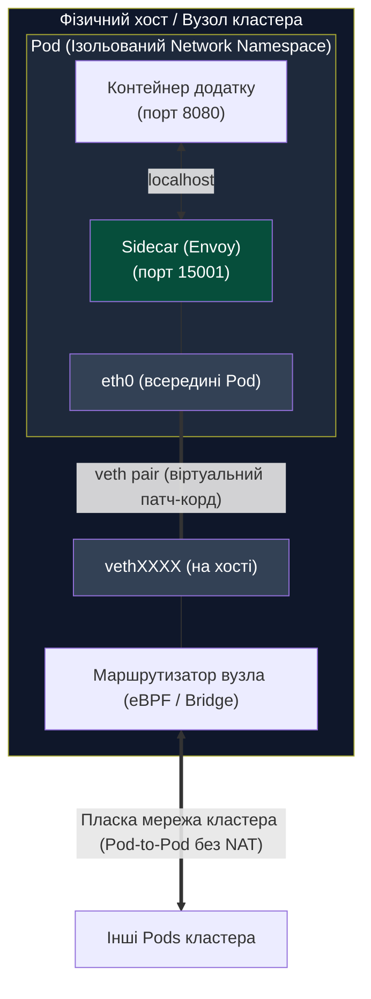
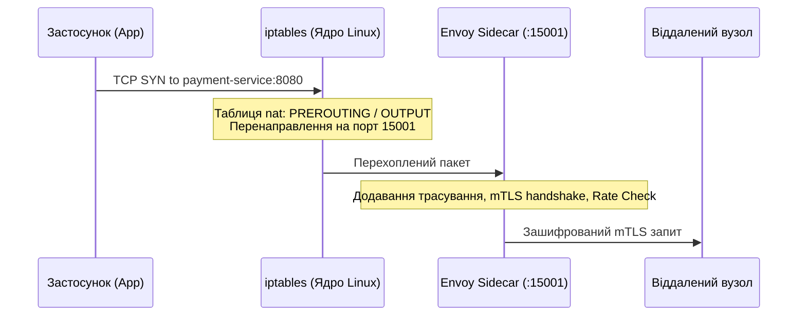
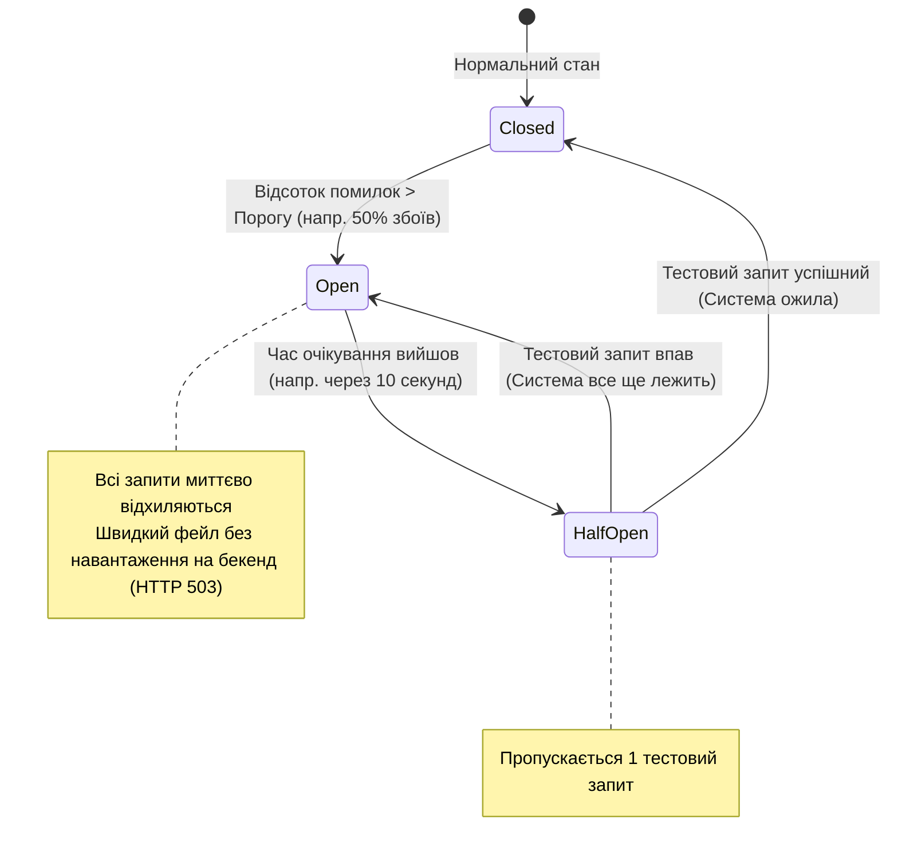

# Лекція 5: Хмарні мережеві абстракції, API Gateways & Service Mesh

> **Декларація курсу.** Академічна доброчесність та авторство матеріалів — у [DISCLAIMER.md](./DISCLAIMER.md).

---

### Обов'язкове читання (Landmark Papers)
* **Burns, B., & Oppenheimer, D. (2016).** *Design Patterns for Container-Based Distributed Systems*. USENIX HotCloud '16. (Фундаментальна стаття про патерни Sidecar, Ambassador та Adapter).
* **Klein, M. (2016).** *Envoy: Retrying, Circuit Breaking, and Observability at the Network Boundary*. Lyft Engineering / CNCF.
* **Фокусне запитання для аналізу:** Чому винесення мережевої логіки (mTLS, retries, tracing) із бізнес-бібліотек додатку (таких як Finagle чи Hystrix) у зовнішній L7-проксі (Sidecar) усунуло проблему гетерогенних мов програмування, але створило новий інженерний компроміс — «податок на затримку» (Latency Tax) та навантаження на процесор?

---

## Питання для розминки

<details markdown="1">
<summary><b>1. Чому два різні контейнери всередині одного Kubernetes Pod можуть спілкуватися через localhost, і що насправді відбувається на рівні Linux-ядра?</b></summary>

Тому що всі контейнери в межах одного пода **ділять один і той самий Network Namespace**. 

Вони мають спільний віртуальний мережевий інтерфейс `lo` (loopback) та спільну таблицю мережевих портів. Трафік між ними взагалі не виходить у фізичну мережу: пакети передаються виключно в пам'яті ядра через механізм loopback зі швидкістю оперативної пам'яті.
</details>

<details markdown="1">
<summary><b>2. Якщо викликати відмовляючий бекенд-сервіс наївним циклом for retry in range(5): request(), чому це гарантовано доб'є аварійний сервіс?</b></summary>

Це породжує катастрофічне явище **Retry Storm (Шторм повторів)** або **Thundering Herd**. 

Якщо сотні клієнтів одночасно отримують помилку через тимчасове перевантаження бекенду і синхронно повторюють запити, навантаження на сервіс стрибкоподібно зростає у $5\times\dots10\times$ разів. Сервіс, який міг би відновитися за кілька секунд, остаточно колапсує. Для запобігання цьому обов'язково використовують **Exponential Backoff з випадковим розсіюванням (Jitter)**.
</details>

---

## Архітектурний кейс: Як розпад моноліту в Lyft створив Envoy

У 2015 році компанія **Lyft** стрімко зростала. Їхній моноліт на PHP почав розпадатися на сотні мікросервісів, написаних різними мовами: Python, Go, Node.js та Java.

```
 ┌─────────────────────────────────────────────────────────────┐
 crisis: "МЕРЕЖЕВИЙ БЛЕК-АУТ" У МІКРОСЕРВІСАХ LYFT (2015)       │
 ├─────────────────────────────────────────────────────────────┤
 │ • Кожна команда писала повтори (retries) власною бібліотекою│
 │ • Сервіси на Python падали через таймаути, які Go ігнорував │
 │ • Під час аварій ніхто не міг зрозуміти, на якому вузлі     │
 │   губиться запит: P99 затримка сягала 15 секунд             │
 │ • Мережа була "темною кімнатою" без наскрізних метрик       │
 └─────────────────────────────────────────────────────────────┘
```

**Інженерне рішення Метта Клайна (Matt Klein):**
Замість того, щоб змушувати розробників інтегрувати десятки розрізнених SDK під кожну мову, мережеву підсистему винесли за межі коду застосунку.

Біля кожного сервісу посадили мікроскопічний, екстремально швидкий C++ проксі-сервер — **Envoy**.
1. **Прозорість (Observability):** Усі вхідні та вихідні байти почали проходити крізь Envoy, давши компанії 100% спостережуваність затримки, відмов та графів викликів.
2. **Уніфікований захист:** Повтори, автоматичні запобіжники (Circuit Breaking) та шифрування mTLS отримали однакову поведінку для будь-якої мови стеку.

Сьогодні Envoy є серцем практично кожного сучасного Service Mesh (включаючи **Istio**) та стандартом CNCF Graduated.

---

## 1. Мережева взаємодія контейнерів: від localhost до пласкої мережі кластера

У моноліті сервіси викликали один одного як функції в пам'яті. У контейнеризованій системі зв'язок будується через поєднання просторів імен ядра Linux та віртуальних інтерфейсів.



### Як контейнер виходить у мережу: пара `veth` (Virtual Ethernet)

У [Лекції 3](./03_isolation_mechanics.md) ми розглядали, що контейнер замкнений у власному **Network Namespace** і за замовчуванням не бачить мережі хоста. Як ядро Linux вирішує цю проблему?

* **`veth pair` — віртуальний кабель із двома кінцями:**  
  Ядро створює пару зв'язаних віртуальних інтерфейсів:
  1. **Внутрішній кінець:** переноситься всередину простору імен Pod-а і стає його інтерфейсом `eth0`.
  2. **Зовнішній кінець:** залишається на хості (має вигляд на кшталт `veth12ab34`) і підключається до віртуального моста (*Linux Bridge*) або обробляється eBPF.
* Будь-який пакет, відправлений програмою в `eth0`, ядро миттєво викидає на зовнішній кінець `veth` на хості без фізичного виходу назовні.

### Три правила мережевої моделі кластера:

1. **Всередині одного Pod — спільний `localhost`:**  
   Всі контейнери одного Pod-а ділять спільний Network Namespace. Вони бачать один одного через `localhost` зі швидкістю оперативної пам'яті ядра (через інтерфейс loopback `lo`).
2. **Між подами — пласка мережа кластера (*Flat Network*):**  
   Фундаментальне правило хмарного кластера: **кожен Pod отримує власну унікальну IP-адресу**. Будь-який Pod може звернутися до іншого Pod-а напряму за його IP без трансляції портів (NAT).
3. **Чому прямої адресації за IP недостатньо (Ефемерність):**  
   IP-адреса Pod-а живе лише до його перезапуску. Звертатися напряму за IP контейнера — антипатерн. Для цього створюють стабільну абстракцію **Service**: незмінну віртуальну IP-адресу та внутрішнє DNS-ім'я (наприклад, `http://worker-service:8080`), яке саме розподіляє трафік між живими екземплярами.

### Еволюція маршрутизації в ядрі: від iptables до eBPF

Коли в кластері працюють тисячі сервісів, постає питання: **як ядро знаходить, на який саме `veth` переслати пакет?**

* **iptables (історичний підхід):** Створює лінійний список правил фільтрації. При 10 000 сервісів перебір стає лінійним $O(N)$, викликаючи оверхед CPU і затримки.
* **IPVS (IP Virtual Server):** Використовує хеш-таблиці ядра Linux. Пошук маршруту виконується за сталий час $O(1)$ незалежно від масштабу кластера.
* **eBPF (сучасний стандарт, наприклад Cilium):** Програми ядра перехоплюють пакети прямо на рівні мережевих сокетів (`sockops`), перекидаючи байти між сокетами **взагалі без проходження важкого мережевого стеку TCP/IP**.

> [!IMPORTANT]
> **Обмеження eBPF на рівні L7 та Sidecarless-модель:**
> 
> eBPF працює всередині ядра Linux, тому він блискавично оперує пакетами L3/L4 (IP, TCP). Проте **ядро не може самостійно виконувати складний аналіз L7**: розшифрування mTLS, перевірку підписів JWT або інспекцію JSON-тіла HTTP-запитів.
> 
> У сучасній безсайдкарній моделі (**Cilium Service Mesh / Ambient Mesh**) для L7-задач eBPF все одно перенаправляє трафік у простір користувача (*user-space*), але не в кожен окремий Pod, а в **Node-level Envoy-проксі** (один спільний екземпляр на фізичну ноду). Це кардинально зменшує оверхед по пам'яті (замість 200 проксі на хості працює лише один), зберігаючи повну функціональність L7.

---

## 2. Межа периметра: API Gateway (North-South Traffic)

Трафік у хмарних системах ділиться на два фундаментальні потоки:
* **North-South (Північ-Південь):** Трафік між зовнішніми користувачами (інтернет) та внутрішньою системою.
* **East-West (Схід-Захід):** Трафік між внутрішніми мікросервісами всередині дата-центру.

```
                    ІНТЕРНЕТ (Клієнти, Мобільні додатки)
                                    │
                                    ▼  [North-South Traffic]
                    ┌───────────────────────────────┐
                    │      CLOUD API GATEWAY        │
                    │ (TLS Termination, Auth, Rate) │
                    └───────────────┬───────────────┘
                                    │
       ┌────────────────────────────┼────────────────────────────┐
       │ [East-West Traffic]        ▼                            │
       │                     ┌─────────────┐                     │
       │                     │ Auth Service│                     │
       │                     └──────┬──────┘                     │
       │                            ▼                            │
       │   ┌──────────────┐  mTLS   ┌──────────────┐             │
       │   │ Order Service│◄───────►│Worker Cluster│             │
       │   └──────────────┘         └──────────────┘             │
       │              ВНУТРІШНІЙ SERVICE MESH                    │
       └─────────────────────────────────────────────────────────┘
```

### Обов'язки API Gateway на вході в систему:
1. **TLS Termination:** Зняття HTTPS-шифрування на периметрі. Внутрішня мережа звільняється від важких операцій криптографії для зовнішніх клієнтів.
2. **Аутентифікація та Валідація JWT:** Шлюз перевіряє криптографічний підпис токена, перш ніж пустити запит далі. Скомпрометований запит відсікається на межі.
3. **Глобальний Rate Limiting:** Захист інфраструктури від DDoS-атак та несумлінних користувачів (Token Bucket).
4. **Маршрутизація версій (Advanced Traffic Routing):**
   * **Canary Deployment:** Спрямування 95% трафіку на стабільну версію `v1`, а 5% — на нову версію `v2` з моніторингом помилок.
   * **Traffic Shadowing (Дзеркалювання):** Дублювання 100% реального живого трафіку на тестову версію `v2` у фоновому режимі. Відповіді `v2` відкидаються, але навантаження тестується без найменшого ризику для користувачів.

---

## 3. Патерн Sidecar: Анатомія перехоплення трафіку

Згідно з класичною статтею Брендана Бернса (USENIX HotCloud 2016), контейнерні системи використовують три фундаментальні композиційні патерни:

```
 ┌─────────────────────────────────────────────────────────────┐
 │            ТРИ МЕРЕЖЕВІ ПАТЕРНИ КОНТЕЙНЕРИЗАЦІЇ             │
 ├─────────────────┬───────────────────────────────────────────┤
 │ 1. Sidecar      │ Розширює основний контейнер (проксі, логи)│
 ├─────────────────┼───────────────────────────────────────────┤
 │ 2. Ambassador   │ Проксіює вихідний трафік (доступ до БД)   │
 ├─────────────────┼───────────────────────────────────────────┤
 │ 3. Adapter      │ Стандартизує інтерфейс сервісу назовні    │
 └─────────────────┴───────────────────────────────────────────┘
```

### Як Sidecar перехоплює трафік без зміни коду?
Основний сервіс нічого не знає про проксі. Він робить звичайний виклик `http://payment-service:8080`.



1. Під час старту Pod запускається тимчасовий `init-container` із привілеєм `NET_ADMIN`.
2. Він виконує системні команди `iptables`:
   ```bash
   iptables -t nat -A PREROUTING -p tcp -j REDIRECT --to-ports 15006
   iptables -t nat -A OUTPUT -p tcp -j REDIRECT --to-ports 15001
   ```
3. Будь-який вихідний або вхідний TCP-пакет прозоро захоплюється ядром і відправляється на сокет локального Envoy-проксі.

### Гонка завершення контейнерів: Connection Draining & preStop

У Sidecar-моделі Pod складається з двох процесів: бізнес-застосунку та проксі Envoy. При видаленні пода чи деплої нової версії (Rolling Update) Kubernetes надсилає обом сигнал `SIGTERM` **одночасно**:

```
 ┌─────────────────────────────────────────────────────────────┐
 │           ГОНКА ЗУПИНКИ (TERMINATION RACE CONDITION)        │
 ├─────────────────────────────────────────────────────────────┤
 │ Варіант А: Envoy вмер раніше за застосунок                   │
 │   └─ Застосунок намагається зберегти стан у БД чи відповісти│
 │      клієнту, але мережа вже перерізана (HTTP 502/503).     │
 │                                                             │
 │ Варіант Б: Застосунок вмер, коли Envoy ще тримає з'єднання  │
 │   └─ Клієнтські запити йдуть у мертвий сокет (Connection    │
 │      Reset by Peer).                                        │
 └─────────────────────────────────────────────────────────────┘
```

**Архітектурне рішення:**
1. **Connection Draining в Envoy:** Переведення проксі в стан дренажу (`/drain_listeners?inboundonly`), коли старі активні запити дообслуговуються, але нові більше не приймаються.
2. **Kubernetes `preStop` хук:** Затримка зупинки через хук життєвого циклу, щоб дати iptables та контролеру K8s Endpoints час вилучити Pod із таблиць балансування до того, як процеси почнуть вмирати:
   ```yaml
   lifecycle:
     preStop:
       exec:
         command: ["/bin/sh", "-c", "sleep 5 && wget -qO- --post-data='' http://127.0.0.1:15000/drain_listeners?inboundonly"]
   ```

---

## 4. Архітектура Service Mesh: Control Plane vs Data Plane

Коли кількість мікросервісів сягає сотень, ручне налаштування проксі стає неможливим. Для цього створюють **Service Mesh** (наприклад, **Istio**, **Linkerd**).

Він складається з двох суворо розділених площин:

```
  ┌───────────────────────────────────────────────────────────┐
  │                 CONTROL PLANE (Istio / Pilot)             │
  │  • Читає K8s CRD (VirtualService, DestinationRule)        │
  │  • Генерує конфігурацію xDS API (LDS, CDS, RDS, EDS)      │
  │  • Видає криптографічні сертифікати (CA)                  │
  └─────────────┬───────────────────────────────┬─────────────┘
                │ xDS (gRPC Streaming)          │
                ▼                               ▼
  ┌───────────────────────────┐   ┌───────────────────────────┐
  │ DATA PLANE (Pod 1)        │   │ DATA PLANE (Pod 2)        │
  │ ┌───────┐     ┌─────────┐ │   │ ┌─────────┐     ┌───────┐ │
  │ │  App  │◄───►│  Envoy  │─┼───┼─│  Envoy  │◄───►│  App  │ │
  │ └───────┘     └────┬────┘ │   │ └────┬────┘     └───────┘ │
  └────────────────────┼──────┘   └──────┼────────────────────┘
                       └────── mTLS ─────┘
```

1. **Data Plane (Площина даних):**
   * Виконується на рівні кожного поду (Envoy Proxy на C++).
   * Безпосередньо пропускає крізь себе кожен байт бізнес-трафіку.
   * Виконує маршрутизацію, шифрування, підрахунок метрик та повтори.
2. **Control Plane (Площина управління):**
   * Виконується окремо (демон `istiod`).
   * **Не бере участі в передачі байтів даних!** Якщо Control Plane повністю впаде — Data Plane продовжує успішно обслуговувати трафік на останній отриманій конфігурації.
   * Динамічно пушить оновлення адрес (Service Discovery) на тисячі Envoy через потоковий протокол **xDS API** по gRPC.

---

## 5. Безпека Zero-Trust та взаємний TLS (mTLS)

Класична помилка безпеки за Пітером Дойчем: **«Мережа безпечна»** (*The Inside Threat*). 

Якщо зловмисник зламав один неважливий сервіс звітів, у відкритій мережі він отримує вільний доступ до платіжного сервісу.

Концепція **Zero-Trust (Нульова довіра)** стверджує: **мережі не можна довіряти за замовчуванням**. Кожен пакет повинен бути зашифрований та аутентифікований.

```
 [Клієнтський Pod]                                 [Серверний Pod]
  ┌────────────┐                                    ┌────────────┐
  │App Worker  │                                    │Billing App │
  └─────┬──────┘                                    └─────▲──────┘
        │ plaintext                                       │ plaintext
        ▼                                                 │
  ┌────────────┐                                    ┌─────┴──────┐
  │Envoy Proxy │═══════════════════════════════════>│Envoy Proxy │
  └────────────┘           Шифрований тунель        └────────────┘
     Сертифікат:              mTLS Handshake           Сертифікат:
  spiffe://cluster/sa/worker   (TLS 1.3)           spiffe://cluster/sa/billing
```

### Механізм mTLS (Mutual TLS):
* У стандартному HTTPS клієнт перевіряє сертифікат сервера.
* У **mTLS** перевірка є **двосторонньою**: сервер також вимагає сертифікат клієнта і перевіряє його криптографічний підпис.
* **Стандарт SPIFFE / SPIRE:** Кожен мікросервіс отримує стандартизований цифровий паспорт:
  `spiffe://prod-cluster.local/ns/finance/sa/payment-service-account`
* **Автоматична ротація ключів:** Sidecar Envoy кожні кілька годин отримує новий короткоживучий сертифікат від Control Plane без переривання роботи застосунку.

---

## 6. Інженерія відмовостійкості: Resilience Patterns

Мережеві збої в розподілених системах — це норма, а не виняток. Service Mesh бере на себе реалізацію критичних патернів надійності:

### 1. Circuit Breaker (Автоматичний запобіжник)
Запобігає поширенню каскадних збоїв (Cascading Failures). Працює як електричний автомат у щитку:



### 2. Exponential Backoff з Full Jitter (Випадковий шум)
Коли сервіс падає, клієнт не повинен робити повтори через фіксовані проміжки часу. Затримка перед повтором повинна зростати експоненціально, плюс до неї додається випадковий шум (Jitter):

$$t_{\text{sleep}} = \text{random}(0, \; \min(M, \; B \times 2^{\text{attempt}}))$$

* $B$ — базова затримка (наприклад, 100 мс).
* $M$ — максимальна стеля затримки (наприклад, 5000 мс).
* **Чому Jitter критичний:** Він розмазує пачку повторів у часі, гарантуючи, що 10 000 клієнтів не вдарять по відновленому серверу в одну й ту саму мілісекунду.

### 3. Наскрізне трасування (Distributed Tracing & W3C Context)
Щоб відстежити шлях запиту крізь ланцюжок із 15 мікросервісів, Envoy автоматично інжектує та зчитує стандартизовані заголовки **W3C Trace Context**:
* `traceparent: 00-4bf92f3577b34da6a3ce929d0e0e4736-00f067aa0ba902b7-01`
  * `4bf92f...` — Trace ID (унікальний ідентифікатор усього клієнтського запиту).
  * `00f067...` — Parent Span ID (ідентифікатор поточного кроку).
* **Обов'язок розробника:** Єдине, що зобов'язаний зробити код бекенду — це **перекласти заголовок `traceparent`** із вхідного HTTP-запиту у всі свої вихідні виклики до сусідніх сервісів. Усю решту телеметрії відправить Envoy.

> [!WARNING]
> **Пастка розгалуження контексту в асинхронному середовищі:**
> 
> За замовчуванням бібліотеки OpenTelemetry зберігають `traceparent` у контексті поточного потоку виконання (**ThreadLocal** у Java або **contextvars** у Python).
> 
> Якщо сервіс породжує асинхронну фонову задачу (скидає завдання у **Thread Pool**, відправляє подію в чергу **Kafka / Celery / RabbitMQ**), контекст автоматично **НЕ копіюється** у новий потік чи віддалений воркер! Ланцюжок наскрізного трасування розривається: у системі моніторингу (Jaeger) обробник черги з'явиться як новий, ізольований «сирітський» запит без зв'язку з діями користувача.
> 
> **Архітектурне правило:** Розробник зобов'язаний **вручну інжектувати W3C Trace Context у метадані (Headers) повідомлень черги** перед відправкою та явно витягувати його у фоновому воркері (`extract_context(msg.headers)`).

---

## 7. Практичний місток: Зв'язок із лабораторним курсом

У нашому семестровому курсі мережеві абстракції є основою лабораторного пайплайну:

* **Етап 3 (Docker Compose):** Ми створюємо ізольовану L2-bridge мережу для зв'язку Web UI та воркерів Монте-Карло, аналізуючи DNS-резолвінг імен контейнерів.
* **Етап 4 (Kubernetes):** Запуск симулятора в Pods демонструє спільний Network Namespace контейнерів та роботу K8s Service (IPVS / iptables балансування).
* **Етап 5 (Chaos & FinOps):** Ми використовуємо **Toxiproxy** та ін'єкцію мережевих затримок саме для перевірки того, чи спрацьовує наш клієнтський Circuit Breaker та чи рятує Exponential Backoff від падіння черги задач.

---

## 8. Зведена інженерна матриця компромісів

| Мережева архітектура | Де виконується логіка? | Додаткова затримка (Latency) | CPU & RAM Overhead | Прозорість для коду | Безпека (Zero-Trust) |
| :--- | :--- | :--- | :--- | :--- | :--- |
| **Direct Library Calls (Finagle, gRPC)** | Всередині процесу додатку | **Мінімальна (~0 мс)** | **Нульовий** (спільна пам'ять) | Погана (прив'язка до мови SDK) | Складна в підтримці |
| **API Gateway (Edge Only)** | На межі кластера (Reverse Proxy) | Низька (+1–2 мс на вході) | Низький (кілька шлюзів) | Відмінна для зовнішніх клієнтів | Лише периметр (всередині plaintext) |
| **Sidecar Mesh (Envoy / Istio)** | L7-проксі біля кожного Pod | **Відчутна (+2–4 мс на кожен хоп)** | **Високий** (100MB RAM + CPU на кожен под) | **100% прозорість** | **Найвища** (mTLS всюди, авто-ротація) |
| **eBPF Mesh (Cilium Service Mesh)** | В ядрі (L3/L4) + Node-level Envoy (L7) | **Мінімальна (+0.2–0.8 мс)** | **Низький** (один спільний проксі на ноду) | **100% прозорість** | **Найвища** (апаратна швидкість ядра) |

---

## Підсумок лекції

1. **Мережа ніколи не є надійною:** Хмарні системи проектуються з розрахунком на те, що пакети губляться, а віддалені вузли відповідають із затримкою.
2. **Sidecar звільнив код від інфраструктури:** Проксі-сервер бере на себе криптографію, трасування та контроль збоїв, залишаючи бізнес-коду лише прикладну логіку.
3. **mTLS перетворює мережу на Zero-Trust:** Навіть скомпрометувавши внутрішній сегмент мережі, атакуючий не може перехопити трафік або підробити ідентичність сервісу.
4. **Resilience — це математика:** Exponential Backoff із випадковим Jitter та Circuit Breaker — єдиний спосіб врятувати систему під час масштабних мережевих коливань.

---

## Контрольні питання

<details markdown="1">
<summary><b>1. Чому використання eBPF для Service Mesh (наприклад, у Cilium) показує суттєво меншу затримку (latency), ніж класичний Sidecar-підхід Istio на базі iptables?</b></summary>

У класичному підході пакет проходить повний мережевий стек ядра Linux двічі: спочатку від застосунку до iptables і локального проксі Envoy, потім від Envoy назад у ядро і у фізичну мережу. Це вимагає багаторазового перемикання контексту ядра/користувача (*context switches*) та копіювання буферів сокетів. 

**eBPF** перехоплює повідомлення прямо на рівні виклику сокета (`sockops` / `sk_msg`) і передає байти безпосередньо в чергу сокета призначення в пам'яті ядра, минаючи важкі шари TCP/IP, правила iptables та зайві копіювання в простір користувача.
</details>

<details markdown="1">
<summary><b>2. Що станеться з працездатністю кластера мікросервісів, якщо Control Plane (наприклад, процес istiod) зазнає повної аварії або вичерпає пам'ять?</b></summary>

**Бізнес-трафік продовжить ходити без збоїв.** 

Control Plane перебуває поза шляхом проходження даних (*Out of Data Path*). Кожен проксі Envoy у Data Plane вже закешував актуальну таблицю маршрутизації та сертифікати mTLS. Допоки Control Plane лежить, не можна буде накатити нові конфігурації маршрутизації або зареєструвати нові сервіси, але вже запущені зв'язки функціонуватимуть у штатному режимі.
</details>

<details markdown="1">
<summary><b>3. Яку критичну проблему вирішує додавання компоненти випадкового шуму (Jitter) до алгоритму Exponential Backoff при повторах невдалих запитів?</b></summary>

Jitter усуває фазову синхронізацію клієнтів (**Thundering Herd Problem**). 

Якщо 1000 клієнтів впали одночасно на одному й тому самому запиті, чистий експоненціальний бекофф ($t = B \times 2^i$) змусить їх усіх почекати рівно 200 мс і **одночасно** вдарити по серверу другою хвилею запитів, потім ще через 400 мс — третьою. Додавання випадкового зсуву розсіює запити рівномірно по часовій шкалі, дозволяючи серверу спокійно обробити чергу без резонансних сплесків.
</details>

<details markdown="1">
<summary><b>4. Чому стандарт SPIFFE використовує для ідентифікації сервісу його ServiceAccount та простір назв, а не його динамічну IP-адресу?</b></summary>

Тому що в динамічному хмарному середовищі (Kubernetes) **IP-адреси є ефемерними та ненадійними**. 

Pod може бути знищений, перезапущений на іншій ноді з новою IP-адресою за секунди, або IP-адреса може бути повторно використана іншим подом. **SPIFFE ID** прив'язується до криптографічно перевіреної ідентичності робочого навантаження (ServiceAccount + Namespace), підписаної локальним центром сертифікації кластера, що гарантує стабільну автентичність незалежно від топології та фізичного розміщення контейнера.
</details>
