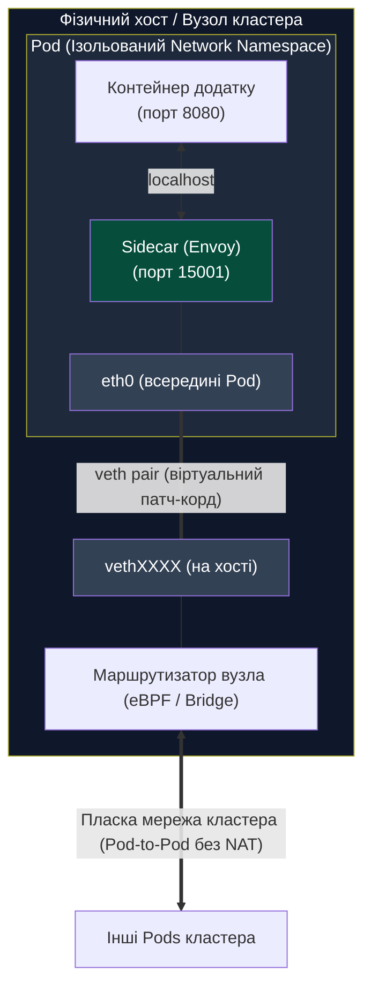
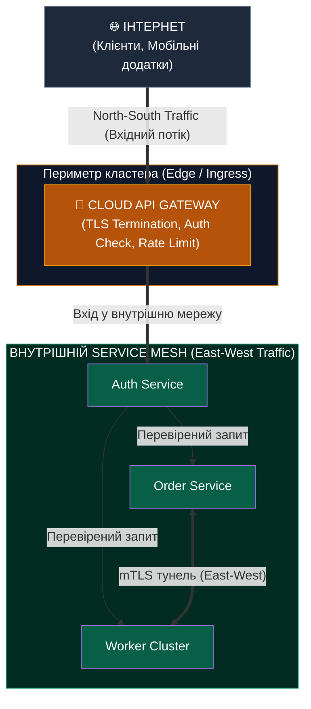
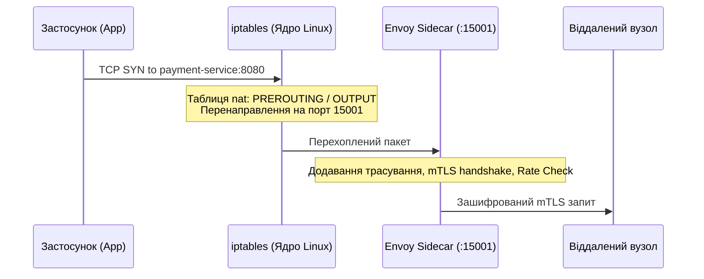
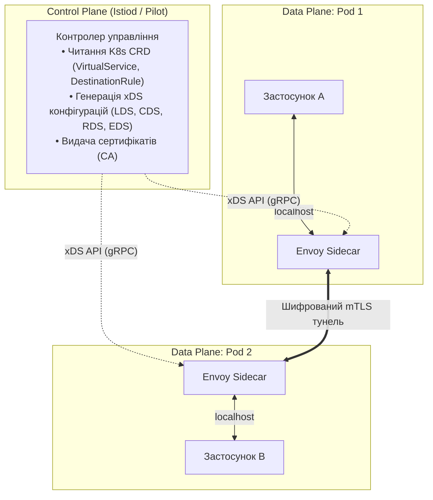
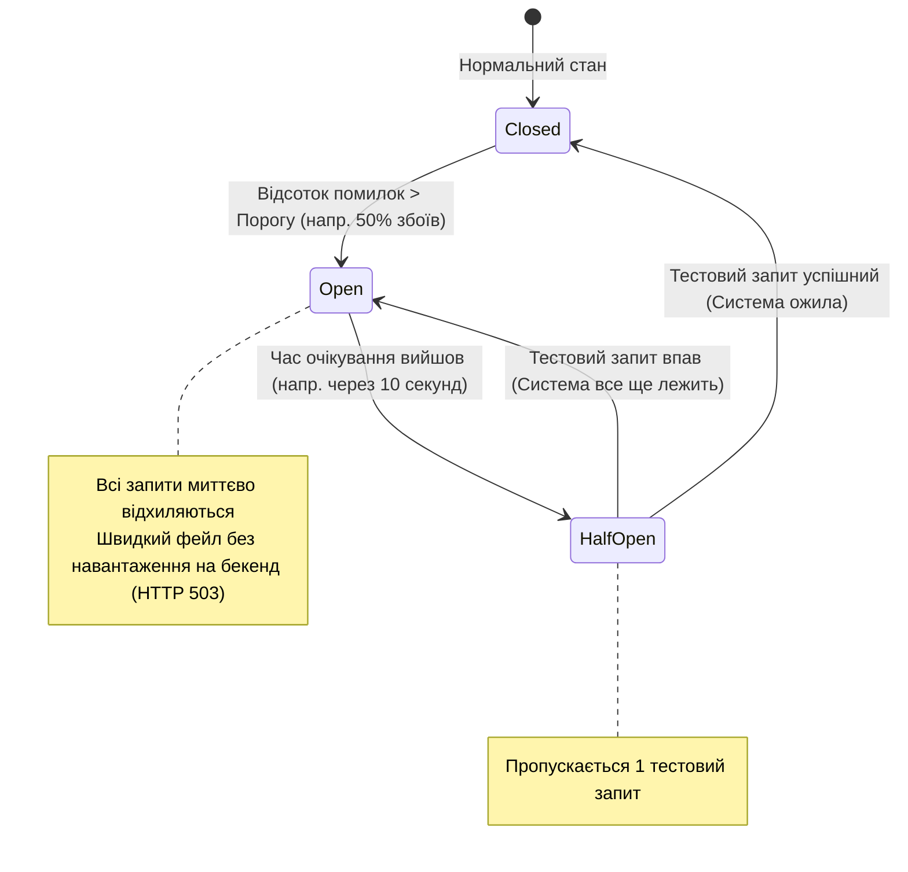

# Лекція 5: Хмарні мережеві абстракції, API Gateways & Service Mesh

> **Декларація курсу.** Академічна доброчесність та авторство матеріалів — у [DISCLAIMER.md](DISCLAIMER.md).

---

### Мета лекції
Опанувати архітектуру хмарних мереж: рух пакетів крізь рівні віртуалізації та простори імен Linux, причини обмежень класичної маршрутизації в розподілених системах, а також реалізацію L7-проксі (Sidecar), Service Mesh і Zero-Trust mTLS для безпеки, балансування та відмовостійкості без модифікації бізнес-коду.

---

### Обов'язкове читання (Landmark Papers)
* **Burns, B., & Oppenheimer, D. (2016).** *Design Patterns for Container-Based Distributed Systems*. USENIX HotCloud '16. (Фундаментальна стаття про патерни Sidecar, Ambassador та Adapter).
* **Klein, M. (2016).** *Envoy: Retrying, Circuit Breaking, and Observability at the Network Boundary*. Lyft Engineering / CNCF.
* **Фокусне запитання для аналізу:** Чому винесення мережевої логіки (mTLS, retries, tracing) із коду застосунку у зовнішній L7-проксі (Sidecar) розв'язало проблему гетерогенного стека технологій, але створило новий інженерний компроміс — додаткову затримку («податок на латентність», Latency Tax) та навантаження на процесор і пам'ять?

---

## Базові пререквізити

Перед вивченням лекції рекомендується опрацювати піраміду мережевих абстракцій (від фізичного сигналу та L2/L3/L4/L7 до NAT, MTU, Reverse Proxy та mTLS):
👉 **[05_networking_mesh_prerequisites.md](05_networking_mesh_prerequisites.md)**

---

## Питання для розминки

<details markdown="1">
<summary>1. Чому два різні контейнери всередині одного Kubernetes Pod можуть спілкуватися через localhost, і що насправді відбувається на рівні Linux-ядра?</summary>

Усі контейнери одного пода **ділять спільний Network Namespace**. 

Вони мають спільний віртуальний інтерфейс `lo` (loopback) та спільну таблицю портів. Трафік не виходить у фізичну мережу: ядро передає пакети виключно в оперативній пам'яті через loopback-буфер зі швидкістю RAM.
</details>

<details markdown="1">
<summary>2. Чому виклик аварійного бекенду наївним циклом for retry in range(5): request() призводить до відмови системи?</summary>

Це породжує лавиноподібне перевантаження — **Retry Storm (шторм повторів)** або **Thundering Herd**. 

Коли сотні клієнтів одночасно отримують помилку й синхронно повторюють запити, навантаження зростає у $5\times\dots10\times$ разів. Сервіс, який міг відновитися за кілька секунд, зазнає колапсу. Для захисту застосовують **Exponential Backoff із випадковим розсіюванням (Jitter)**.
</details>

---

## Архітектурний кейс: Як розпад моноліту в Lyft створив Envoy

У 2015 році компанія **Lyft** стрімко зростала. Їхній моноліт на PHP розпадався на сотні мікросервісів різними мовами: Python, Go, Node.js та Java.

### Передумови мережевої кризи у Lyft (2015)
* **Хаос бібліотек повторів:** кожна команда писала retries власною мовою програмування та зі специфічними багами.
* **Неузгоджені таймаути:** сервіси на Python масово падали через таймаути, які Go-сервіси ігнорували.
* **Каскадні збої:** під час аварій не вдавалося визначити вузол втрати запиту — затримка P99 сягала 15 секунд.
* **Непрозорість:** внутрішня мережа залишалася без наскрізних метрик і трасування.

**Інженерне рішення Метта Клайна (Matt Klein):**  
Замість інтеграції окремих SDK під кожну мову програмування мережеву підсистему винесли за межі коду застосунку.

Поруч із кожним сервісом розгорнули компактний C++ проксі-сервер — **Envoy**.
1. **Спостережуваність (Observability):** Усі вхідні та вихідні байти проходять крізь Envoy, що забезпечило повний контроль затримок, відмов і графів викликів.
2. **Уніфікований захист:** Повтори, автоматичні запобіжники (Circuit Breaking) та шифрування mTLS отримали однакову поведінку для будь-якої мови стеку.

Сьогодні Envoy є серцем практично кожного сучасного Service Mesh (включаючи **Istio**) та стандартом CNCF Graduated.

---

## 1. Мережева взаємодія контейнерів: від localhost до пласкої мережі кластера

У моноліті сервіси викликали один одного як функції в пам'яті. У контейнеризованій системі зв'язок будується через простори імен ядра Linux та віртуальні інтерфейси.


```mermaid
flowchart TD
    subgraph Host ["Фізичний хост / Вузол кластера"]
        subgraph Pod ["Pod (Ізольований Network Namespace)"]
            App["Контейнер додатку<br>(порт 8080)"] <-->|"localhost"| Sidecar["Sidecar (Envoy)<br>(порт 15001)"]
            Sidecar --- ETH0["eth0 (всередині Pod)"]
        end

        ETH0 ===|"veth pair (віртуальний патч-корд)"| VETH["vethXXXX (на хості)"]
        VETH --- Core["Маршрутизатор вузла (eBPF / Bridge)"]
    end

    Core <===>|"Пласка мережа кластера (Pod-to-Pod без NAT)"| OtherPods["Інші Pods кластера"]

    style Host fill:#0f172a,color:#fff
    style Pod fill:#1e293b,color:#fff
    style Sidecar fill:#064e3b,color:#fff
    style ETH0 fill:#334155,color:#fff
    style VETH fill:#334155,color:#fff
```

### Мережевий вихід контейнера через пару `veth` (Virtual Ethernet)

Контейнер ізольований у власному **Network Namespace** і за замовчуванням не має доступу до мережі хоста. Зв'язок забезпечує віртуальна пара інтерфейсів:

* **`veth pair` як віртуальний кабель із двома кінцями:**
  1. **Внутрішній кінець:** переноситься всередину простору імен Pod-а і стає його інтерфейсом `eth0`.
  2. **Зовнішній кінець:** залишається на хості (`vethXXXX`) і підключається до віртуального моста (*Linux Bridge*) або обробляється eBPF.
* Будь-який пакет, відправлений програмою в `eth0`, ядро передає на зовнішній кінець `veth` на хості без фізичного виходу назовні.

### Три правила мережевої моделі кластера:

1. **Всередині одного Pod — спільний `localhost`:**  
   Всі контейнери одного Pod-а ділять спільний Network Namespace. Вони бачать один одного через `localhost` зі швидкістю оперативної пам'яті ядра (через інтерфейс loopback `lo`).
2. **Між подами — пласка мережа кластера (*Flat Network*):**  
   Кожен Pod отримує власну унікальну IP-адресу із виділеного пулу підмереж (**Pod Subnet / Pod CIDR**, типово `10.244.0.0/16` у Flannel/K8s або `172.17.0.0/16` у Docker-мостах). Будь-який Pod звертається до іншого Pod-а напряму за його IP без трансляції портів (NAT).
3. **Обмеження прямої адресації та ефемерність IP:**  
   IP-адреса Pod-а діє лише до його перезапуску. Пряме звернення за IP контейнера є антипатерном. Для стабільного зв'язку використовують абстракцію **Service**: незмінну віртуальну IP-адресу та внутрішнє DNS-ім'я (наприклад, `http://worker-service:8080`), яке розподіляє трафік між активними екземплярами.

### Еволюція маршрутизації в ядрі: від iptables до eBPF

При масштабуванні до тисяч сервісів вибір цільового `veth` вимагає оптимізованих механізмів ядра:

* **iptables (історичний підхід):** Створює лінійний список правил фільтрації. При 10 000 сервісів перебір стає лінійним $O(N)$, що викликає оверхед CPU і зростання затримок.
* **IPVS (IP Virtual Server):** Використовує хеш-таблиці ядра Linux. Пошук маршруту виконується за сталий час $O(1)$ незалежно від масштабу кластера.
* **eBPF (сучасний стандарт, наприклад Cilium):** Програми ядра перехоплюють пакети безпосередньо на рівні сокетів (`sockops`), передаючи байти між сокетами без проходження повного мережевого стеку TCP/IP.

> [!IMPORTANT]
> **Обмеження eBPF на рівні L7 та дві моделі розміщення проксі:**
> 
> eBPF працює всередині ядра Linux і блискавично обробляє пакети L3/L4 (IP, TCP). Проте ядро не виконує складний аналіз L7: розшифрування mTLS, перевірку підписів JWT або інспекцію JSON-тіла HTTP-запитів. Для L7-задач трафік спрямовується в простір користувача (*user-space*), де застосовують два підходи:
> 
> * **Класичний Sidecar (на кожен Pod):** окремий проксі-контейнер Envoy запускається **всередині кожного Pod-а** поруч із додатком (якщо на ноді 200 подів — працює 200 окремих процесів Envoy).
> * **Безсайдкарний підхід (Node-level, 1 на Worker Node):** у сучасних **Cilium Service Mesh** або **Istio Ambient Mesh** eBPF перенаправляє L7-трафік на **один спільний Envoy-проксі на всю Worker Node**. Це суттєво зменшує оверхед по пам'яті (замість 200 проксі на хості працює лише один) при збереженні повної функціональності L7.

---

## 2. Межа периметра: API Gateway (North-South Traffic)

Трафік у хмарних системах розділений на два основні потоки:
* **North-South (Північ-Південь):** Трафік між зовнішніми користувачами (інтернет) та внутрішньою системою.
* **East-West (Схід-Захід):** Трафік між внутрішніми мікросервісами всередині дата-центру.


```mermaid
flowchart TD
    INET["🌐 ІНТЕРНЕТ<br>(Клієнти, Мобільні додатки)"]

    INET ==>|"North-South Traffic (Вхідний потік)"| GW

    subgraph EDGE ["Периметр кластера (Edge / Ingress)"]
        GW["🚪 CLOUD API GATEWAY<br>(TLS Termination, Auth Check, Rate Limit)"]
    end

    subgraph MESH ["ВНУТРІШНІЙ SERVICE MESH (East-West Traffic)"]
        AUTH["Auth Service"]
        ORDER["Order Service"]
        WORKER["Worker Cluster"]

        AUTH -->|"Перевірений запит"| ORDER
        AUTH -->|"Перевірений запит"| WORKER
        ORDER <===>|"mTLS тунель (East-West)"| WORKER
    end

    GW ==>|"Вхід у внутрішню мережу"| AUTH

    style INET fill:#1e293b,stroke:#64748b,color:#fff
    style EDGE fill:#0f172a,stroke:#d97706,color:#fff
    style GW fill:#b45309,stroke:#f59e0b,color:#fff
    style MESH fill:#022c22,stroke:#059669,color:#fff
    style AUTH fill:#065f46,color:#fff
    style ORDER fill:#065f46,color:#fff
    style WORKER fill:#065f46,color:#fff
```

### Задачі API Gateway на вході до системи:
1. **TLS Termination:** Зняття HTTPS-шифрування на периметрі. Внутрішня мережа звільняється від витрат CPU на криптографію для зовнішніх клієнтів.
2. **Автентифікація та валідація JWT:** Шлюз перевіряє криптографічний підпис токена до пропуску запиту всередину периметра.
3. **Глобальний Rate Limiting:** Обмеження частоти запитів для захисту інфраструктури від перевантажень (алгоритм Token Bucket).
4. **Керування маршрутизацією (Advanced Traffic Routing):**
   * **Canary Deployment:** Спрямування 95% трафіку на стабільну версію `v1` і 5% — на нову версію `v2` з контролем помилок.
   * **Дзеркалювання трафіку (Traffic Shadowing):** Дублювання повного потоку реального трафіку на тестову версію `v2` у фоновому режимі. Відповіді `v2` ігноруються, що дозволяє безпечно перевірити стабільність під реальним навантаженням.

---

## 3. Патерн Sidecar: Анатомія перехоплення трафіку

Контейнерні архітектури використовують три базові композиційні патерни (Бернс і Оппенгеймер, USENIX HotCloud 2016):

* **1. Sidecar (домінує в хмарних архітектурах):**
  * **Призначення:** розширює основний контейнер, працюючи у спільному просторі імен (спільні сокети, порти та дискові томи).
  * **Коли застосовувати:** інфраструктурні задачі (безпека, шифрування, збір телеметрії), які мають виконуватися прозоро для бізнес-коду.
  * **Приклад:** проксі **Envoy** у Service Mesh (mTLS-шифрування, інжекція трасування, circuit breaking) або агент **Fluentbit**, що зчитує логи зі спільного тома й передає їх у кластер моніторингу.
* **2. Ambassador (посол):**
  * **Призначення:** проксіює **вихідний** трафік застосунку. Код звертається до локального сервісу на `localhost`, а Ambassador забезпечує зв'язок зі складною зовнішньою системою.
  * **Коли застосовувати:** клієнтська маршрутизація до шардованих баз даних, зовнішніх SaaS API чи брокерів повідомлень.
  * **Приклад:** бізнес-код пише в `localhost:6379`, а контейнер-Ambassador (наприклад, Twemproxy) обчислює хеш-кільце, знаходить потрібний шард Redis-кластера й обробляє повтори.
* **3. Adapter (адаптер):**
  * **Призначення:** стандартизує вихідні інтерфейси сервісу для загальнокластерних систем моніторингу та управління.
  * **Коли застосовувати:** інтеграція стороннього чи успадкованого ПЗ у сучасний стек спостережуваності без зміни коду.
  * **Приклад:** сервіс віддає внутрішні метрики у форматі JMX чи XML; контейнер-адаптер (Prometheus JMX Exporter) вичитує їх локально і транслює назовні як стандартний ендпоінт `/metrics` у форматі OpenMetrics.

### Механізм прозорого перехоплення трафіку Sidecar-проксі
Основний сервіс виконує стандартний виклик `http://payment-service:8080`, не маючи інформації про наявність проксі:


```mermaid
sequenceDiagram
    participant App as Застосунок (App)
    participant Net as iptables (Ядро Linux)
    participant Envoy as Envoy Sidecar (:15001)
    participant Remote as Віддалений вузол

    App->>Net: TCP SYN to payment-service:8080
    Note over Net: Таблиця nat: PREROUTING / OUTPUT<br/>Перенаправлення на порт 15001
    Net->>Envoy: Перехоплений пакет
    Note over Envoy: Додавання трасування, mTLS handshake, Rate Check
    Envoy->>Remote: Зашифрований mTLS запит
```

1. Під час старту Pod запускається тимчасовий `init-container` із привілеєм `NET_ADMIN`.
2. Він налаштовує правила `iptables` у просторі імен пода та спрямовує весь вхідний і вихідний TCP-трафік на локальні порти Envoy (`15006` та `15001`).
3. Ядро ОС прозоро перехоплює пакети й передає їх на сокети локального проксі без змін у коді застосунку.

### Стан гонки при зупинці контейнерів: Connection Draining & preStop

У Sidecar-моделі Pod об'єднує два незалежні процеси: бізнес-застосунок та проксі Envoy. Під час видалення пода або оновлення версії (Rolling Update) Kubernetes надсилає сигнал `SIGTERM` обом процесам одночасно. Це спричиняє стан гонки (*Termination Race Condition*):

* **Envoy зупинився раніше за застосунок:** сервіс надсилає фінальні відповіді клієнтам або стан у базу даних, проте локальний проксі вже закрив сокети, що викликає сплеск помилок `HTTP 502/503`.
* **Застосунок зупинився раніше за Envoy:** проксі приймає нові запити від балансувальника, але спроби передати їх у закритий сокет завершуються помилкою `Connection Reset by Peer`.

**Архітектурне рішення:**
1. **Connection Draining в Envoy:** Переведення проксі в стан дренажу (`/drain_listeners?inboundonly`), де активні запити завершуються, а нові більше не приймаються.
2. **Kubernetes `preStop` хук:** Затримка зупинки через хук життєвого циклу, що дає час вилучити Pod із таблиць балансування до завершення процесів:
   ```yaml
   lifecycle:
     preStop:
       exec:
         command: ["/bin/sh", "-c", "sleep 5 && wget -qO- --post-data='' http://127.0.0.1:15000/drain_listeners?inboundonly"]
   ```

---

## 4. Архітектура Service Mesh: Control Plane vs Data Plane

При масштабуванні до сотень мікросервісів керування проксі автоматизує **Service Mesh** (зокрема **Istio**, **Linkerd**).

Він складається з двох чітко розділених площин:


```mermaid
flowchart TD
    subgraph CP["Control Plane (Istiod / Pilot)"]
        CP_Core["Контролер управління<br/>• Читання K8s CRD (VirtualService, DestinationRule)<br/>• Генерація xDS конфігурацій (LDS, CDS, RDS, EDS)<br/>• Видача сертифікатів (CA)"]
    end

    subgraph Pod1["Data Plane: Pod 1"]
        App1["Застосунок A"] <-->|"localhost"| Envoy1["Envoy Sidecar"]
    end

    subgraph Pod2["Data Plane: Pod 2"]
        Envoy2["Envoy Sidecar"] <-->|"localhost"| App2["Застосунок B"]
    end

    CP_Core -.->|"xDS API (gRPC)"| Envoy1
    CP_Core -.->|"xDS API (gRPC)"| Envoy2
    Envoy1 <==>|Шифрований mTLS тунель| Envoy2
```

1. **Data Plane (Площина даних):**
   * Виконується на рівні кожного поду (Envoy Proxy на C++).
   * Безпосередньо пропускає крізь себе кожен байт бізнес-трафіку.
   * Виконує маршрутизацію, шифрування, підрахунок метрик та повтори.
2. **Control Plane (Площина управління):**
   * Працює як окремий контролер (демон `istiod`).
   * **Перебуває поза шляхом проходження даних (*Out of Data Path*).** Падіння Control Plane не зупиняє роботу Data Plane: проксі продовжують обслуговувати трафік за збереженою конфігурацією.
   * Динамічно передає оновлення адрес (Service Discovery) та правила маршрутизації на всі екземпляри Envoy через потоковий протокол **xDS API** по gRPC.

---

## 5. Безпека Zero-Trust та взаємний TLS (mTLS)

Класична помилка проектування за Пітером Дойчем: **«Мережа безпечна»** (*The Inside Threat*). 

Компрометація другорядного сервісу у відкритій мережі відкриває прямий доступ до критичних компонентів (білінгу чи баз даних).

Концепція **Zero-Trust (нульова довіра)** базується на постулаті: **внутрішня мережа за замовчуванням є скомпрометованою**. Кожен пакет підлягає шифруванню та автентифікації.

### Механізм mTLS (Mutual TLS):
* У стандартному HTTPS клієнт перевіряє сертифікат сервера.
* У **mTLS** перевірка є **двосторонньою**: сервер також вимагає сертифікат клієнта та валідує його цифровий підпис.
* **Стандарт SPIFFE / SPIRE:** Кожен мікросервіс отримує стандартизований цифровий паспорт:
  `spiffe://prod-cluster.local/ns/finance/sa/payment-service-account`
* **Автоматична ротація ключів:** Envoy регулярно отримує оновлені короткоживучі сертифікати від Control Plane без переривання з'єднань.

---

## 6. Інженерія відмовостійкості: Resilience Patterns

Мережеві збої є штатним станом розподіленої системи. Service Mesh бере на себе реалізацію ключових патернів надійності:

### 1. Circuit Breaker (Автоматичний запобіжник)
Запобігає каскадним збоям (*Cascading Failures*). Працює за принципом захисного автомата:


```mermaid
stateDiagram-v2
    [*] --> Closed: Нормальний стан

    Closed --> Open: Відсоток помилок > Порогу (напр. 50% збоїв)
    note right of Open: Всі запити миттєво відхиляються<br/>Швидкий фейл без навантаження на бекенд (HTTP 503)

    Open --> HalfOpen: Час очікування вийшов (напр. через 10 секунд)
    note right of HalfOpen: Пропускається 1 тестовий запит

    HalfOpen --> Closed: Тестовий запит успішний (Система ожила)
    HalfOpen --> Open: Тестовий запит впав (Система все ще лежить)
```

### 2. Exponential Backoff з Full Jitter (Випадковий шум)
При збоях сервісу клієнт збільшує інтервал між повторними запитами експоненціально, додаючи до кожного значення випадковий шум (Jitter):

$$t_{\text{sleep}} = \text{random}(0, \; \min(M, \; B \times 2^{\text{attempt}}))$$

* $B$ — базова затримка (наприклад, 100 мс).
* $M$ — максимальна стеля затримки (наприклад, 5000 мс).
* **Призначення Jitter:** Розподіляє повторні запити в часі, запобігаючи одночасному навантаженню тисяч клієнтів на відновлений сервер.

### 3. Наскрізне трасування (Distributed Tracing & W3C Context)
Щоб відстежити шлях запиту крізь ланцюжок мікросервісів, Envoy автоматично інжектує та зчитує стандартизовані заголовки **W3C Trace Context**:
* `traceparent: 00-4bf92f3577b34da6a3ce929d0e0e4736-00f067aa0ba902b7-01`
  * `4bf92f...` — Trace ID (унікальний ідентифікатор усього клієнтського запиту).
  * `00f067...` — Parent Span ID (ідентифікатор поточного кроку).
* **Обов'язок застосунку:** Код сервісу копіює заголовок `traceparent` із вхідного запиту у вихідні виклики. Подальшу телеметрію збирає та відправляє Envoy.

> [!WARNING]
> **Пастка розгалуження контексту в асинхронному середовищі:**
> 
> За замовчуванням бібліотеки OpenTelemetry зберігають `traceparent` у контексті поточного потоку виконання (**ThreadLocal** у Java або **contextvars** у Python).
> 
> При створенні асинхронних фонових задач (скидання у **Thread Pool**, відправка події в чергу **Kafka / Celery / RabbitMQ**) контекст **не копіюється автоматично** у новий потік чи віддалений воркер. Це розриває ланцюжок трасування: у системі моніторингу (Jaeger) обробник черги фіксується як новий ізольований запит без прив'язки до дій клієнта.
> 
> **Архітектурне правило:** Інженер зобов'язаний явно додавати W3C Trace Context у метадані повідомлень черги перед відправкою та витягувати його у фоновому воркері (`extract_context(msg.headers)`).

---

## 7. Практичний місток: Зв'язок із лабораторним курсом

У нашому семестровому курсі мережеві абстракції є основою лабораторного пайплайну:

* **Етап 3 (Docker Compose):** Ми створюємо ізольовану L2-bridge мережу для зв'язку Web UI та воркерів Монте-Карло, аналізуючи DNS-резолвінг імен контейнерів.
* **Етап 4 (Kubernetes):** Запуск симулятора в Pods демонструє спільний Network Namespace контейнерів та роботу K8s Service (IPVS / iptables балансування).
* **Етап 5 (Chaos & FinOps):** Ми використовуємо **Toxiproxy** та ін'єкцію мережевих затримок саме для перевірки того, чи спрацьовує наш клієнтський Circuit Breaker та чи рятує Exponential Backoff від падіння черги задач.

---

## 8. Зведена інженерна матриця компромісів

| Мережева архітектура | Рівень виконання | Додаткова затримка (Latency) | CPU & RAM Overhead | Прозорість для коду | Безпека (Zero-Trust) |
| :--- | :--- | :--- | :--- | :--- | :--- |
| **Direct Library Calls (Finagle, gRPC)** | Всередині процесу додатку | **Мінімальна (~0 мс)** | **Нульовий** (спільна пам'ять) | Погана (прив'язка до мови SDK) | Складна в підтримці |
| **API Gateway (Edge Only)** | На межі кластера (Reverse Proxy) | Низька (+1–2 мс на вході) | Низький (кілька шлюзів) | Відмінна для зовнішніх клієнтів | Лише периметр (всередині plaintext) |
| **Sidecar Mesh (Envoy / Istio)** | L7-проксі біля кожного Pod | **Відчутна (+2–4 мс на кожен хоп)** | **Високий** (100MB RAM + CPU на кожен под) | **100% прозорість** | **Найвища** (mTLS всюди, авто-ротація) |
| **eBPF Mesh (Cilium Service Mesh)** | В ядрі (L3/L4) + Node-level Envoy (L7) | **Мінімальна (+0.2–0.8 мс)** | **Низький** (один спільний проксі на ноду) | **100% прозорість** | **Найвища** (апаратна швидкість ядра) |

---

## Підсумок лекції

1. **Мережа за замовчуванням є ненадійною:** Хмарні системи проектуються з розрахунком на втрату пакетів і коливання затримок.
2. **Sidecar ізолює інфраструктурну складність:** Проксі бере на себе криптографію, трасування та контроль збоїв без модифікації бізнес-коду.
3. **mTLS реалізує концепцію Zero-Trust:** Навіть у разі компрометації внутрішнього сегмента зловмисник позбавлений можливості перехопити відкриті дані чи підробити ідентичність сервісу.
4. **Надійність спирається на алгоритми:** Exponential Backoff з випадковим Jitter та Circuit Breaker стабілізують систему під час масових мережевих збоїв.

---

## Контрольні питання

<details markdown="1">
<summary>1. Чому використання eBPF для Service Mesh (наприклад, у Cilium) показує суттєво меншу затримку (latency), ніж класичний Sidecar-підхід Istio на базі iptables?</summary>

У класичному підході пакет проходить повний мережевий стек ядра Linux двічі: спочатку від застосунку до iptables і локального проксі Envoy, потім від Envoy назад у ядро і у фізичну мережу. Це вимагає багаторазового перемикання контексту ядра/користувача (*context switches*) та копіювання буферів сокетів. 

**eBPF** перехоплює повідомлення прямо на рівні виклику сокета (`sockops` / `sk_msg`) і передає байти безпосередньо в чергу сокета призначення в пам'яті ядра, минаючи важкі шари TCP/IP, правила iptables та зайві копіювання в простір користувача.
</details>

<details markdown="1">
<summary>2. Що станеться з працездатністю кластера мікросервісів, якщо Control Plane (наприклад, процес istiod) зазнає повної аварії або вичерпає пам'ять?</summary>

**Бізнес-трафік продовжує обслуговуватися без збоїв.** 

Control Plane перебуває поза шляхом проходження даних (*Out of Data Path*). Кожен проксі Envoy у Data Plane закешував актуальну таблицю маршрутизації та сертифікати mTLS. У разі падіння Control Plane оновлення маршрутів та реєстрація нових сервісів блокуються, проте вже запущені з'єднання продовжують працювати без перерв.
</details>

<details markdown="1">
<summary>3. Яку проблему вирішує додавання компоненти випадкового шуму (Jitter) до алгоритму Exponential Backoff при повторах невдалих запитів?</summary>

Jitter усуває фазову синхронізацію клієнтів (**Thundering Herd Problem**). 

Якщо сотні клієнтів одночасно отримують помилку, фіксований експоненціальний бекофф ($t = B \times 2^i$) змусить їх одночасно надіслати повторні запити, викликаючи резонансні піки навантаження. Додавання випадкового зсуву розподіляє запити рівномірно в часі, дозволяючи серверу відновити штатну роботу.
</details>

<details markdown="1">
<summary>4. Чому для ідентифікації сервісу стандарт SPIFFE використовує ServiceAccount і Namespace замість динамічної IP-адреси?</summary>

У динамічному середовищі Kubernetes **IP-адреси є ефемерними**. 

Pod може бути перестворений на іншому вузлі з новою IP-адресою за секунди, або адреса може перейти іншому сервісу. **SPIFFE ID** закріплює криптографічно перевірену ідентичність робочого навантаження (ServiceAccount + Namespace), підписану локальним CA кластера, що гарантує стабільну автентифікацію незалежно від мережевої топології.
</details>
