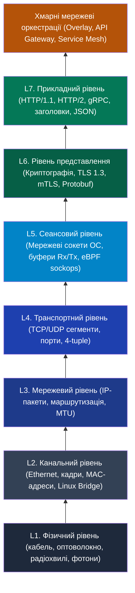
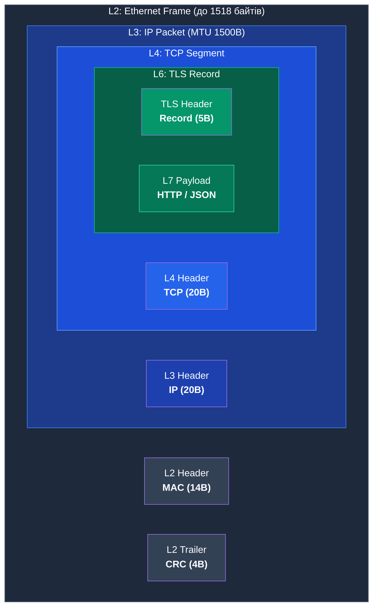
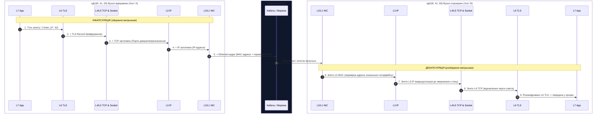
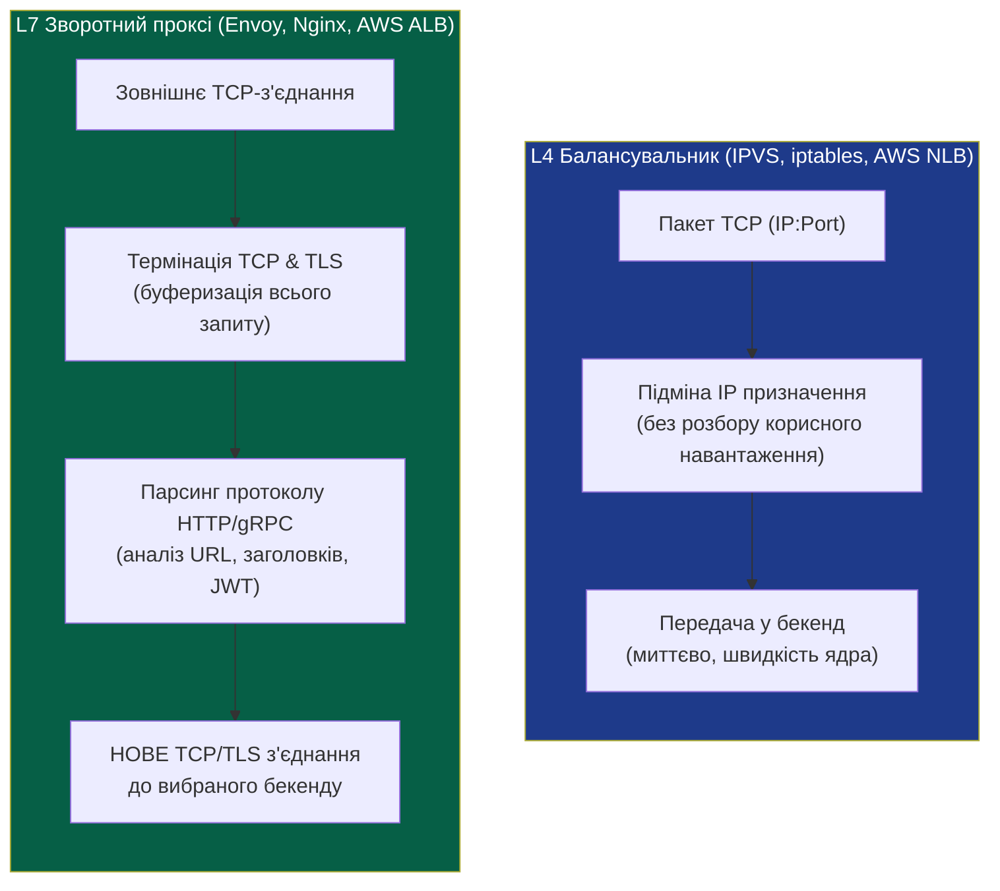
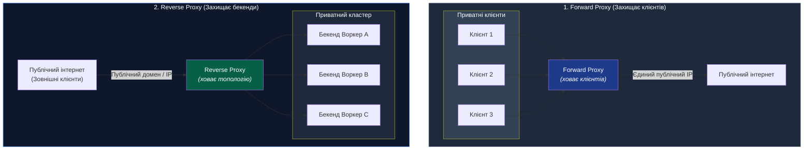
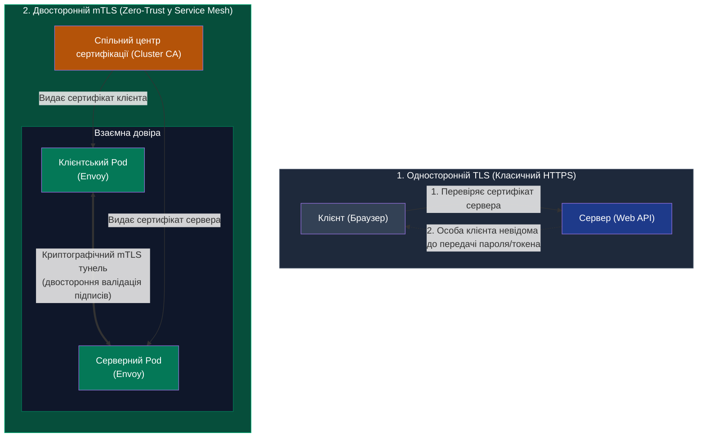

# Пререквізити: Мережеві поняття та піраміда мережевих абстракцій

> **Декларація курсу.** Академічна доброчесність та авторство матеріалів — у [DISCLAIMER.md](DISCLAIMER.md).

---

## Піраміда мережевих абстракцій: від фізичного сигналу до Service Mesh

Розподілені системи базуються на обміні повідомленнями через фізичне середовище. Еволюція хмарної інфраструктури від статичних IP-адрес до Sidecar-проксі та eBPF вимагає розуміння кожного рівня мережевої моделі.

Кожен вищий рівень додає власні правила і службову інформацію, приховуючи від інженера деталі нижчих рівнів.

---

## 1. Механізм інкапсуляції: мережа як принцип матрьошки

Програма ніколи не передає сирий бізнес-об'єкт напряму в кабель. Дані проходять крізь мережевий стек ядра зверху вниз та отримують службові заголовки (**інкапсуляція**).

### 1. Анатомія кадру в пам'яті (Вкладена «матрьошка»)

### 2. Динаміка передачі: шлях крізь мережевий стек

---

## 2. L2 (Канальний рівень): MAC-адреси, комутатори та Linux Bridge

Канальний рівень забезпечує пряму доставку даних між пристроями у спільному середовищі передачі в межах одного домену широкомовлення (*Broadcast Domain*).

* **MAC-адреса (48 біт):** Унікальний апаратний номер мережевого інтерфейсу, записаний виробником (наприклад, `52:54:00:12:34:56`).
* **Комутатор (Switch) або віртуальний міст (Linux Bridge):** 
  Модуль комутації ядра або комутатор вивчає таблицю комутації (FDB) — відповідність MAC-адрес портам інтерфейсів (`switch ports`). Він скеровує кадр безпосередньо адресату та усуває надлишкове навантаження на інші вузли.
* **Масштабування L2 та широкомовні шторми:**
  Для пошуку невідомої MAC-адреси вузол транслює широкомовний ARP-запит усім машинам сегмента. Об'єднання тисяч серверів у спільний L2 породжує широкомовний шторм (*Broadcast Storm*) та виводить мережу з ладу.

---

## 3. L3 (Мережевий рівень): IP-адресація, маршрутизація та MTU

Мережевий рівень забезпечує доставку між незалежними мережами через ланцюжок проміжних маршрутизаторів.

### 1. IP-адреса та маршрутизація
* **IP-адреса (IPv4: 32 біти, IPv6: 128 біт):** Логічна адреса вузла, структурована на підмережі через маску (наприклад, `/24` — перші 24 біти задають мережу, останні 8 — конкретний хост).
* **Таблиця маршрутизації (Routing Table):** 
  Кожен сервер і маршрутизатор має таблицю правил. Для кожного пакета ядро шукає правило з найдовшим збігом префікса (**Longest Prefix Match**):
  * Якщо адреса локальна — відправити через відповідний інтерфейс.
  * Якщо адреса зовнішня — переслати на адресу шлюзу за замовчуванням (**Default Gateway**).

### 2. MTU (Maximum Transmission Unit) та ціна тунелювання
**MTU (Maximum Transmission Unit)** визначає максимальний розмір корисного блоку даних (без L2-заголовка), який мережевий інтерфейс передає без фрагментації.

* Стандартний MTU для Ethernet: **1500 байтів**.
* Перевищення ліміту змушує маршрутизатор дробити пакет на частини (**фрагментація**, яка навантажує CPU) або відкидати його з прапорцем *Packet Too Big*.
* **Оверхед оверлейних мереж (VXLAN / Geneve):**
  Оверлейні CNI-плагіни Kubernetes (Flannel, Calico, VXLAN) пакують трафік контейнера всередину зовнішнього UDP-пакета хоста. Цей заголовок забирає близько 50 байтів, тому MTU контейнерів зменшують до **1450 байтів** для запобігання втратам пакетів.

---

## 4. L4 (Транспортний рівень): TCP проти UDP, порти та 4-tuple

Протокол IP не гарантує доставку: дейтаграми можуть губитися, затримуватися або змінювати черговість. Транспортний рівень перетворює цей потік на керований зв'язок між процесами.

### 1. TCP (Transmission Control Protocol): надійність ціною затримок
* **Гарантії:** Контроль доставки, відновлення втрачених пакетів, упорядкування байтів та контроль перевантаження мережі (*Congestion Control*).
* **3-Way Handshake (Потрійне рукостискання):**
  Перед передачею першого байта програми узгоджують сесію:
  $$\text{Клієнт} \xrightarrow{\text{SYN}} \text{Сервер} \xrightarrow{\text{SYN-ACK}} \text{Клієнт} \xrightarrow{\text{ACK}} \text{Сервер}$$
  Це створює обов'язкову затримку в **1 RTT (Round Trip Time)** до початку передачі будь-яких корисних даних.

### 2. UDP (User Datagram Protocol): мінімалізм і швидкість
* Передає дейтаграми без попереднього встановлення сесії, квитування доставки та відновлення втрачених пакетів.
* Застосовується для чутливих до затримок сервісів: DNS, стрімінгу та сучасного транспорту **HTTP/3 (QUIC)**.

### 3. Логічні порти L4 (TCP/UDP) та четвірка 4-tuple

> [!NOTE]
> **Термінологічна відмінність: Порт L2 проти Порту L4**
> * **Порт L2 (Switch / Bridge Port):** фізичний роз'єм комутатора або мережевий інтерфейс хоста (`veth`, `eth0`), до якого під'єднано дріт або віртуальний патч-корд.
> * **Порт L4 (TCP/UDP Port):** 16-бітне число (`80`, `443`, діапазон `1–65535`) у заголовку транспортного пакета, що адресує конкретний сокет процесу всередині операційної системи.

IP-адреса доставляє пакет до конкретного комп'ютера. **Логічний порт L4 (1–65535)** спрямовує байти з мережевого стеку ядра до потрібного сокета програми.

Ядро ідентифікує кожну сесію через унікальну комбінацію чотирьох значень (**4-tuple**):
$$\text{Session} = \{\text{Source IP},\ \text{Source Port},\ \text{Destination IP},\ \text{Destination Port}\}$$

Завдяки цьому веб-сервер на єдиному порті `443` утримує мільйони паралельних з'єднань, бо клієнтські IP-адреси та порти відрізняються.

---

## 5. L5 (Сеансовий рівень): Сокети операційної системи та eBPF sockops

Транспортний рівень L4 оперує сегментами та номерами логічних портів. **Рівень сесій L5** пов'язує ці дані з конкретним процесом через системну абстракцію **мережевого сокета**.

### 1. Структура мережевого сокета в ядрі Linux
Для програми сокет виглядає як звичайний файловий дескриптор (`fd = 3, 4...`). У ядрі за ним закріплена системна структура `struct sock`, що містить:
* **Rx/Tx кільцеві буфери (Ring Buffers):** область пам'яті, куди ядро складає вхідні байти з мережевої карти або байти застосунку, готові до відправки.
* **Черга очікування (Listen Backlog):** список з'єднань, що завершили TCP handshake і очікують обробки сервером.

### 2. Роль L5 у механіці Sidecar та eBPF
* **Перехоплення трафіку Sidecar:**  
  Коли застосунок виконує виклик `connect()` до віддаленої бази чи API, правила `iptables` ядра перехоплюють сесію та спрямовують її на сокет локального проксі Envoy (`localhost:15001`). Застосунок працює зі стандартним сокетом і не фіксує підміну маршруту.
* **Прискорення через eBPF (`sockops` та `sk_msg`):**  
  У класичній моделі пакети між застосунком та Sidecar проходять повний мережевий стек ядра. Програми eBPF перехоплюють виклики на рівні сокетів L5 і передають байти безпосередньо у вхідний буфер сокета Envoy в оперативній пам'яті ядра.

---

## 6. Розвилка балансування: L4 проти L7

Усі хмарні балансувальники навантаження (AWS ALB/NLB, Nginx, HAProxy, Envoy) принципово діляться на два табори:

| Параметр | L4 Балансування (Transport Layer) | L7 Проксіювання (Application Layer) |
| :--- | :--- | :--- |
| **Об'єкт аналізу** | Лише IP-адреси та TCP/UDP порти | Заголовки HTTP, шляхи URL, Cookies, JWT, gRPC-методи |
| **Робота з TCP** | Пропускає пакети транзитом (з DNAT) | Повністю розриває TCP: два незалежних з'єднання |
| **Робота з TLS** | Маршрутизує шифрований потік без інспекції | Виконує TLS Termination, аналізує розшифроване тіло |
| **Session Stickiness** | На основі Source IP Hash (ризик Hot Spot через NAT) | На основі Cookie або JWT (стабільно за NAT) |
| **Затримка (Latency)** | Мікросекунди ($< 0.1$ мс) | Мілісекунди ($1.0 - 5.0$ мс) |
| **Споживання пам'яті** | Мінімальне (таблиця зв'язків у ядрі) | Помітне (буферизація запитів у user-space) |
| **Приклади рішень** | IPVS, Linux iptables, AWS NLB | Envoy, Nginx, Traefik, AWS ALB |

### Проблема прив'язки сесій (Session Stickiness / Affinity)

**Прив'язка сесій (Session Stickiness)** скеровує повторні запити клієнта на той самий екземпляр бекенду для збереження локального кешу в RAM, сесійного стану або відкритих WebSocket-з'єднань.

1. **Обмеження реалізації на L4:**
   * **Єдиний критерій — Source IP:** Балансувальник не має доступу до HTTP-заголовків і хешує виключно IP-адресу клієнта.
   * **Проблема великих NAT / CGNAT (Hot Spot):** Якщо тисячі користувачів виходять через спільний корпоративний шлюз або мобільного оператора (SNAT/CGNAT), вони мають однаковий Source IP. L4-балансувальник спрямовує весь цей трафік на один сервер, викликаючи його перевантаження (*Hot Spot*), поки інші вузли простоюють.
   * **Дрейф мобільних IP:** Зміна IP-адреси клієнта (наприклад, при перемиканні смартфона з Wi-Fi на стільникову мережу) миттєво розриває прив'язку L4 та спрямовує запити на інший вузол.

2. **Реалізація прив'язки на L7 (Cookie-Based Affinity):**
   * L7-проксі (Envoy, ALB, Nginx) інспектує HTTP-трафік і додає сесійну куку (наприклад, `Set-Cookie: SERVERID=worker-04`).
   * Навіть за спільною IP-адресою NAT кожен браузер надсилає свій персональний Cookie.
   * Проксі спрямовує клієнтів індивідуально, що забезпечує рівномірне навантаження незалежно від змін IP-адрес.

---

## 7. Зворотний проксі (Reverse Proxy) проти прямого (Forward Proxy)

Напрямок проксіювання визначає сторону, яку захищає посередник:

* **Forward Proxy (Прямий проксі):** 
  Стоїть перед групою клієнтів. Забезпечує вихід в інтернет через єдину точку з фільтрацією вихідного трафіку та кешуванням. Зовнішній сервер фіксує виключно IP-адресу проксі.
* **Reverse Proxy (Зворотний проксі):** 
  Стоїть перед групою серверів. Клієнт звертається до єдиного публічного домену (наприклад, `api.service.com`), а проксі розподіляє запити між десятками внутрішніх вузлів.
  * **Завдання:** балансування навантаження, **термінація TLS** (розшифрування зовнішнього HTTPS на межі кластера), кешування відповідей та ізоляція внутрішньої структури бекендів від зовнішнього світу.

---

## 8. Трансляція мережевих адрес (NAT): DNAT, SNAT та conntrack

**NAT (Network Address Translation)** змінює заголовки IP-пакетів під час їх проходження крізь маршрутизатор.

* **SNAT (Source NAT / Masquerading):** 
  Замінює адресу **відправника**. Дозволяє багатьом вузлам із приватними IP виходити в інтернет через спільну публічну IP-адресу шлюзу.
* **DNAT (Destination NAT / Port Forwarding):** 
  Замінює адресу **призначення**. Маршрутизатор приймає пакети на зовнішньому порту та передає їх на внутрішню IP-адресу конкретного контейнера (механізм `docker run -p 8080:80`).
* **Вузьке місце — таблиця `conntrack` у ядрі Linux:**  
  Ядро фіксує кожну трансляцію у системній пам'яті (`nf_conntrack`). Коли кількість одночасних з'єднань перевищує ліміт таблиці, ядро відкидає нові пакети (*table full*), що спричиняє мережеву аварію.
  > [!NOTE]
  > **Причина використання Flat Network у Kubernetes:**  
  > Щоб не перевантажувати таблиці `conntrack` надлишковими правилами SNAT/DNAT, у Kubernetes кожен Pod отримує унікальну IP-адресу та взаємодіє з іншими вузлами через пряму маршрутизацію.

---

## 9. Служба доменних імен (DNS): механіка пошуку адрес

**DNS (Domain Name System)** є розподіленою базою даних типу ключ-значення, яка зіставляє символьні доменні імена з IP-адресами.

* **Основні типи записів:**
  * **`A`:** Відображає ім'я на IPv4-адресу (`service.internal -> 10.244.1.15`).
  * **`AAAA`:** Відображає ім'я на IPv6-адресу.
  * **`CNAME`:** Канонічний псевдонім (вказує на інше DNS-ім'я).
  * **`SRV`:** Запис для виявлення сервісів (Service Discovery). Містить ім'я хоста, **номер порту**, **пріоритет** та **вагу** для розподілу трафіку.
* **TTL (Time To Live) та пастка DNS-кешування:**
  Кожна DNS-відповідь містить TTL (час життя запису в секундах). Клієнти кешують отриману відповідь локально.
  * Якщо сервіс аварійно перезапустився з новою IP-адресою, клієнти продовжують надсилати запити на застарілу адресу до вичерпання TTL.
  * Тому DNS не використовують як динамічний L7-балансувальник для короткоживучих контейнерів.

---

## 10. L6: Рівень представлення та криптографії (TLS 1.3 та mTLS)

Відкритий мережевий трафік L4/L7 може бути перехоплений або підроблений будь-яким проміжним маршрутизатором у дата-центрі (**Man-in-the-Middle, MitM**).

1. **Односторонній TLS (класичний HTTPS):**
   * Сервер пред'являє сертифікат, підписаний довіреним центром сертифікації (**Certificate Authority, CA**).
   * Клієнт перевіряє ланцюжок довіри (*Trust Chain*) і шифрує трафік симетричним сесійним ключем.
   * Клієнт переконується у справжності сервера, тоді як клієнт залишається анонімним для сервера до передачі прикладних даних.
2. **mTLS (Mutual TLS, взаємна автентифікація):**
   * Клієнт і сервер володіють власними сертифікатами, виданими спільним CA.
   * Під час рукостискання обидві сторони взаємно валідують цифрові підписи.
   * З'єднання встановлюється лише за умови двосторонньої верифікації.
   * **Фундамент Zero-Trust:** Навіть якщо зловмисник отримає фізичний доступ до комутатора в дата-центрі, він зафіксує лише зашифрований потік і не зможе виконати виклик від імені легітимного сервісу.

---

## 11. Зведена шпаргалка понять перед вивченням Лекції 5

| Поняття | Суть концепції | Застосування в Лекції 5 |
| :--- | :--- | :--- |
| **`localhost` / `lo`** | Віртуальний loopback-інтерфейс у пам'яті ядра (`127.0.0.1`) | Взаємодія сервісу з локальним Sidecar (Envoy) |
| **`veth pair`** | Віртуальний кабель із двома кінцями | Зв'язує простір імен пода з мережею фізичного хоста |
| **Linux Bridge** | Віртуальний програмний L2-комутатор на хості | Об'єднує інтерфейси `veth` контейнерів одного хоста |
| **CNI** | Мережевий драйвер кластера (Container Network Interface) | Виділення IP-адрес і організація маршрутизації Pods |
| **Мережевий сокет (L5)** | Системна структура в ядрі (`struct sock`) | Перехоплення трафіку через iptables або eBPF |
| **iptables** | Модуль ядра Linux для фільтрації та NAT-пакетів | Прозоре перенаправлення трафіку пода в порт Envoy |
| **eBPF** | Безпечне виконання байткоду в ядрі Linux | Пряме перекидання даних між сокетами без оверхеду TCP/IP |
| **API Gateway** | Централізований L7 зворотний проксі на межі кластера | Обробка вхідного North-South трафіку |
| **Service Mesh** | Мережа розподілених проксі біля кожного сервісу | Контроль, спостережуваність і шифрування East-West трафіку |
| **Control Plane** | Керуючий модуль системи (наприклад, `istiod`) | Динамічна генерація маршрутів і роздача сертифікатів |
| **Data Plane** | Виконавчий шар проксі (Envoy на C++) | Безпосереднє обслуговування кожного байта бізнес-трафіку |
| **mTLS** | Двостороннє криптографічне шифрування та автентифікація | Автоматична ідентифікація сервісів за принципом Zero-Trust |

