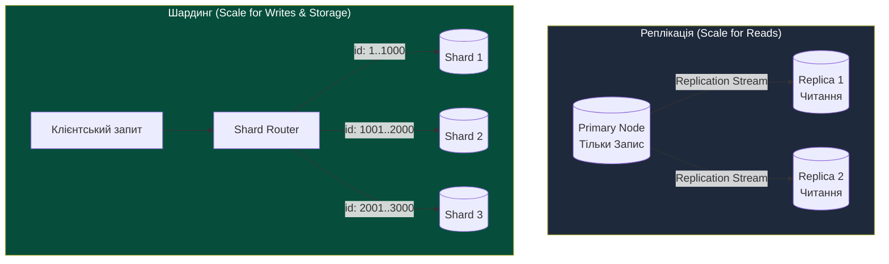
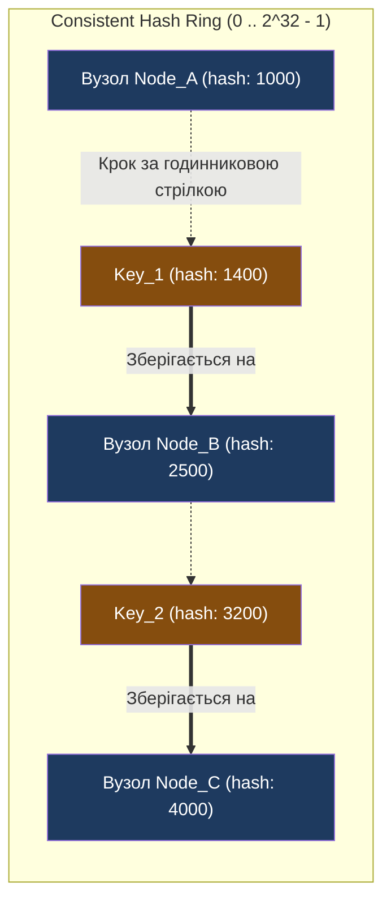
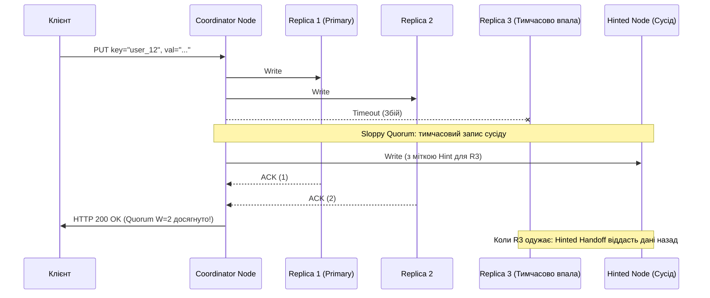

# Лекція 6: Архітектура розподіленого зберігання даних & Consistent Hashing

> **Декларація курсу.** Академічна доброчесність та авторство матеріалів — у [DISCLAIMER.md](./DISCLAIMER.md).

---

### Обов'язкове читання (Landmark Papers)
* **DeCandia, G. et al. (2007).** *Dynamo: Amazon's Highly Available Key-value Store*. ACM SIGOPS Operating Systems Review (SOSP '07). (Фундаментальна стаття, що ввела у промислову практику Consistent Hashing з віртуальними нодами, Sloppy Quorum та Hinted Handoff).
* **Karger, D. et al. (1997).** *Consistent Hashing and Random Trees: Distributed Caching Protocols for Relieving Hot Spots on the World Wide Web*. ACM STOC '97.
* **Фокусне запитання для аналізу:** Чому наївна формула шардингу $\text{hash}(key) \pmod N$ призводить до міграції майже 100% даних при додаванні одного нового сервера, і як концепція кільцевого хешування (Consistent Hash Ring) зводить обсяг переміщуваних даних до $O(K/N)$?

---

## Питання для розминки

<details markdown="1">
<summary><b>1. Чому об'єктні сховища (AWS S3, MinIO) не дозволяють дозаписати кілька байтів у середину існуючого файлу (in-place append/seek), як звичайна файлова система (ext4/NTFS)?</b></summary>

Тому що об'єктні сховища побудовані на принципі **незмінності (Immutability / WORM: Write Once, Read Many)**. 

Об'єкт розглядається як єдиний атомарний бінарний блоб. Відмова від підтримки блокувань окремих байтів (byte-range locks) та складних файлових дескрипторів POSIX дозволила позбутися транзакційних оверхедів і досягти необмеженого горизонтального масштабування до екзабайтів даних із тисячами паралельних читачів.
</details>

<details markdown="1">
<summary><b>2. Якщо в кластері з 4 серверів шардинг розраховується як hash(id) % 4, скільки відсотків ключів доведеться перемістити на інші вузли при додаванні 5-го сервера?</b></summary>

**Близько 80% усіх ключів!** 

Математично при переході від ділення на $N$ до $N+1$ змінюється значення залишку від ділення для переважної більшості чисел. Лише $\frac{1}{N+1}$ (тобто $20\%$) ключів випадково залишаться на своєму попередньому сервері. Для великої бази це означає масове переписування терабайтів даних та миттєвий відказ мережі (Thundering Migration).
</details>

---

## Архітектурний кейс: Чорна п'ятниця Amazon та народження Dynamo

У середині 2000-х років інженери Amazon зіткнулися з фундаментальним обмеженням класичних реляційних СУБД (Oracle):
Під час пікових розпродажів клієнти клали товари до кошика (**Shopping Cart**), генеруючи сотні тисяч записів на секунду.

```
 ┌─────────────────────────────────────────────────────────────┐
 ПАСТКА НАЇВНОГО ШАРДИНГУ КЕШУ / БАЗИ ДАНИХ (AMAZON, 2006)     │
 ├─────────────────────────────────────────────────────────────┤
 │ 1. База шардується формулою: Server = hash(user_id) % N     │
 │ 2. Один сервер виходить із ладу (N зменшується на 1)        │
 │ 3. Залишок % (N-1) змінюється для 85% користувачів          │
 │ 4. Усі клієнти одночасно отримують Cache Miss               │
 │ 5. Лавина запитів пробиває кеш і кладе бекенд (Cache Stampede)│
 └─────────────────────────────────────────────────────────────┘
```

Вернер Фогельс (Werner Vogels, CTO Amazon) сформулював нову вимогу: **кошик клієнта ніколи не повинен повертати помилку запису**. Навіть якщо дата-центри палають або рветься зв'язок — запис має прийнятися.

Для цього було створено **Dynamo** — повністю децентралізоване сховище без єдиної точки відмови (Masterless), засноване на кільці узгодженого хешування (**Consistent Hash Ring**). Сьогодні ця архітектура лежить в основі **Amazon DynamoDB**, **Apache Cassandra**, **Riak** та систем розподіленого кешування.

---

## 1. Три кити зберігання: Block vs File vs Object Storage

У хмарі поняття «диск» перестало означати фізичний накопичувач. Зберігання розділилося на три різні архітектурні рівні:

```
                  ХМАРНІ АБСТРАКЦІЇ ДАНИХ
     ┌──────────────────┬──────────────────┬──────────────────┐
     │  BLOCK STORAGE   │   FILE STORAGE   │  OBJECT STORAGE  │
     │  (EBS, Ceph RBD) │   (NFS, EFS)     │  (S3, MinIO, GCS)│
     ├──────────────────┼──────────────────┼──────────────────┤
     │  Блоки по 4 КБ   │  Файли й папки   │  Пласкі об'єкти  │
     │  (Сектори диска) │  (Ієрархія POSIX)│  (Key + Payload) │
     ├──────────────────┼──────────────────┼──────────────────┤
     │  ReadWriteOnce   │  ReadWriteMany   │  REST API        │
     │  (1 сервер/VM)   │  (Сотні серверів)│  (HTTP GET/PUT)  │
     └──────────────────┴──────────────────┴──────────────────┘
```

### 1. Block Storage (Блочне сховище: AWS EBS, Ceph RBD, NVMe-oF)
* Операційна система бачить його як сирий блочний пристрій: `/dev/xvdf`.
* ОС самостійно форматує його у файлову систему (ext4, xfs).
* **Головні переваги:** Екстремально низька затримка (субмілісекунди) та високий IOPS.
* **Обмеження:** Режим доступу **ReadWriteOnce (RWO)** — блок може бути примонтований лише до однієї віртуальної машини одночасно. Ідеально підходить для **СУБД** (PostgreSQL, MySQL, Redis).

### 2. File Storage (Файлове сховище: NFS, AWS EFS, CephFS)
* Мережева файлова система з повною підтримкою стандарту **POSIX** (`open`, `seek`, `read`, `write`).
* **Головні переваги:** Режим **ReadWriteMany (RWX)** — тисячі контейнерів і VM можуть одночасно читати і писати в спільну директорію `/shared/data`.
* **Обмеження:** Складні розподілені блокування файлів (file locks). При високому паралелізмі затримка різко зростає.

### 3. Object Storage (Об'єктне сховище: AWS S3, MinIO, GCS, Ceph RGW)
* Повна відмова від ієрархії каталогів. Простір абсолютно плаский: `Bucket` + `Object Key`.
* Доступ виключно через мережевий протокол HTTP/S REST API:
  `GET https://s3.amazonaws.com/my-bucket/models/reactor_v1.parquet`
* **Незмінність (Immutability):** Файл не можна змінити «частково». Щоб змінити 1 байт у файлі розміром 5 ГБ, необхідно перезалити всі 5 ГБ наново.
* **Масштаб:** Практично нескінченна місткість та надійність 99.999999999% (11 дев'яток) за рахунок гео-реплікації та Erasure Coding (кодів Ріда-Соломона).

> [!NOTE]
> **Еволюція узгодженості в AWS S3 (Strong Consistency з грудня 2020):**
> 
> Історично об'єктні сховища працювали за моделлю Eventual Consistency: операція перезапису або видалення об'єкта могла призвести до того, що наступний `GET` повертав стару версію або помилку 404 (через затримку поширення метаданих по кластеру). Інженерам доводилося створювати спеціальні черги чи сторонні бази (як-от Netflix s3mper) для перевірки появи об'єкта.
> 
> **Індустріальний злам (грудень 2020):** AWS S3 офіційно перейшов на **Strong Read-After-Write Consistency** для всіх операцій `PUT` та `DELETE` нових або перезаписаних об'єктів у всіх регіонах. Клієнт гарантовано читає найновішу версію одразу після успішної відповіді `HTTP 200 OK`, без жодної втрати продуктивності чи додаткової вартості.

---

## 2. Масштабування сховищ: Реплікація vs Шардинг

Коли обсяг даних перевищує фізичну місткість одного сервера, постає питання архітектурного масштабування:



* **Реплікація:** Усі вузли мають 100% копію даних. Масштабує **тільки операції читання**. Запис усе одно впирається в ліміти одного Primary-сервера.
* **Шардинг (Партиціонування):** Дані розрізаються на неперетинні частини (**шарди**). Кожен сервер відповідає лише за свій шматочок таблиці. Масштабує як пам'ять, так і **пропускну здатність запису**.

> [!WARNING]
> **Пастка Replication Lag та застарілого читання (Stale Reads):**
> 
> У 95% продакшн-систем реплікація з Primary на Read-репліки налаштовується **асинхронно** заради швидкості запису на Primary.
> 
> **Сценарій збою очікувань:**
> 1. Користувач оновлює свій профіль (`POST /profile` $\to$ Primary DB).
> 2. Бекенд повертає успіх і перенаправляє браузер на оновлену сторінку.
> 3. Фронтенд робить `GET /profile`, який балансувальник спрямовує на найменш завантажену **Replica DB**.
> 4. Через **Replication Lag** (навіть у 50–200 мс) репліка ще не встигла накатити транзакцію з журналу WAL.
> 5. Користувач бачить старі дані, панікує, що зміни не збереглися, і починає повторно відправляти запит.
> 
> **Архітектурне рішення — Read-Your-Own-Writes Consistency:**
> Для сесії клієнта, який щойно виконав мутацію даних, наступні операції читання протягом $T = 5\dots10$ секунд примусово маршрутизуються на **Primary**, або вимагається перевірка позиції журналу реплікації (PostgreSQL LSN / MySQL GTID).

### Пастки вибору ключа шардингу (Shard Key):
1. **Монотонний автоінкремент (`id = 1, 2, 3...`):**
   * Всі нові записи потрапляють виключно на останній шард. Виникає **Hotspot** (перегрів однієї ноди), тоді як інші шарди простоюють.
2. **Випадковий UUID (`uuid_v4`):**
   * Ідеально розмазує записи по всіх нодах.
   * **Проблема:** Неможливо виконати вибірку по діапазону (`WHERE created_at BETWEEN ...`) без розсилання запиту на всі шарди кластера (**Scatter-Gather Query**), що вбиває швидкість.

---

## 3. Механіка Consistent Hashing (Узгоджене хешування)

Як розподілити терабайти ключів між $N$ серверами так, щоб додавання або видалення сервера не вимагало переміщення всієї бази?

### Кільце узгодженого хешування (Consistent Hash Ring)
1. Обирається хеш-функція (наприклад, MurmurHash3 або MD5), яка відображає будь-яке значення у фіксований діапазон: від $0$ до $2^{32} - 1$.
2. Цей діапазон умовно замикається в **кільце**: значення $2^{32}-1$ з'єднується з $0$.



### Алгоритм пошуку сервера для ключа:
1. Рахуємо хеш фізичних серверів: `hash("server-1")`, `hash("server-2")`. Розставляємо їхні точки на кільці.
2. Коли надходить ключ `user_42`, рахуємо його хеш: `pos = hash("user_42")`.
3. Рухаємося по кільцю **за годинниковою стрілкою**, доки не зустрінемо перший фізичний сервер. Цей сервер і є володарем ключа.

### Що стається при додаванні нового сервера?
При додаванні сервера `Node_D` між `Node_A` та `Node_B`:
* Лише частина ключів із сегмента між `Node_A` та `Node_D` мігрує на новий вузол.
* **Усі інші сервери та 90% ключів на кільці взагалі не рухаються!** Обсяг міграції становить лише $O(K/N)$.

---

## 4. Проблема нерівномірності та Віртуальні Вузли (Virtual Nodes)

Якщо на кільці розмістити лише 3–4 фізичні сервери, хеш-функція розкидає їх нерівномірно. 

Один сервер може отримати 70% площі кільця, а інший — лише 5%. Виникає критичний перекіс навантаження (**Hotspot**).

```
  [ БЕЗ ВІРТУАЛЬНИХ НОД: ДИСБАЛАНС ]      [ З ВІРТУАЛЬНИМИ НОДАМИ (VNODES) ]
         Node A (10% дуги)                         A#1      B#2
              /    \                               /    \   /   \
   Node C (20%) ── Node B (70% ДАНИХ!)           C#1    A#2   C#2
                                                   \    /   \   /
                                                    B#1      A#3
```

### Інженерне рішення: Віртуальні Вузли (Vnodes)
Замість однієї точки для сервера `Node_A`, ми генеруємо для нього **100–256 віртуальних точок** на кільці:
* `hash("Node_A#1")`
* `hash("Node_A#2")`
* `...`
* `hash("Node_A#256")`

### Переваги концепції Vnodes:
1. **Статистична однорідність:** Кільце розбивається на дрібні сектори. Навантаження між серверами балансується з математичною похибкою менше ніж $\pm 3\%$.
2. **Врахування гетерогенного заліза:** Потужному серверу на 64 ядра можна виділити 500 віртуальних нод, а слабкому на 16 ядер — 100 нод.
3. **Швидке паралельне відновлення:** Якщо нода вмирає, її дані розпорошені по всьому кільцю. Їх починають одночасно вичитувати та копіювати **всі вцілілі ноди кластера одразу**, уникаючи перевантаження одного сусіда.

---

## 5. Реплікація, Sloppy Quorum & Hinted Handoff

Для відмовостійкості ключ повинен зберігатися не на одному сервері, а дублюватися (фактор реплікації $N$, зазвичай $N = 3$).

Ключ записується не лише на першу ноду за годинниковою стрілкою, а й на **$N-1$ наступних фізичних серверів** на кільці.



### Формула строгого кворуму (Strict Quorum):
$$R + W > N$$
* $N$ — фактор реплікації (наприклад, 3).
* $W$ — кількість підтверджень запису (Write Quorum, наприклад, 2).
* $R$ — кількість підтверджень читання (Read Quorum, наприклад, 2).

Якщо $R + W > N$, множини читачів і записувачів обов'язково перетинаються хоча б на одному вузлі. Це гарантує повернення найсвіжішої версії даних (**Strong Consistency**).

### Нестрогий кворум (Sloppy Quorum) та Hinted Handoff:
Якщо одна з основних реплік недоступна (мережевий поділ або перезавантаження), Dynamo не відхиляє запис.
1. Запис приймає наступний здоровий сусід на кільці (**Sloppy Quorum**).
2. Цей сусід зберігає запис у спеціальній базі із міткою: *«Ці дані призначені для Ноди 3, коли вона одужає»* (**Hinted Handoff**).
3. Як тільки Нода 3 повертається в стрій, сусід перекачує їй збережені дані.

---

## 6. Битва парадигм: ACID vs BASE

Розподілені сховища розділилися на два непримиренні філософські табори:

```
  ┌───────────────────────────────┐     ┌───────────────────────────────┐
  │        ACID (RDBMS)           │     │         BASE (NoSQL)          │
  ├───────────────────────────────┤     ├───────────────────────────────┤
  │ • Atomicity (Атомарність)     │     │ • Basically Available         │
  │ • Consistency (Узгодженість)  │     │   (Базова доступність)        │
  │ • Isolation (Ізольованість)   │     │ • Soft state (М'який стан)    │
  │ • Durability (Довговічність)  │     │ • Eventual consistency        │
  │                               │     │   (Узгодженість у кінцевому   │
  │ Жорсткі транзакції, блокування│     │   підсумку)                   │
  └───────────────────────────────┘     └───────────────────────────────┘
```

### Eventual Consistency та вирішення конфліктів:
У системах BASE під час розриву мережі два різні клієнти можуть одночасно змінити один і той самий об'єкт на різних нодах кільця. Як вирішити конфлікт?

1. **Last-Write-Wins (LWW):** Перемагає запис із більшим timestamp.
   * **Пастка:** Якщо годинники на серверах розсинхронізовані навіть на 20 мс (NTP Skew), новіший запис може бути стертий старішим.
2. **Векторні годинники (Vector Clocks):** Зберігають причинно-наслідковий зв'язок версій $[Node_A: 1, Node_B: 2]$. Дозволяють виявити конкурентні конфлікти і передати їх на вирішення бізнес-логіці клієнта (як це робив Amazon Shopping Cart, об'єднуючи обидва кошики).

> [!IMPORTANT]
> **Проблема розростання векторних годинників (Vector Clock Explosion) та Pruning:**
> 
> Якщо об'єкт живе роками і оновлюється сотнями різних вузлів та клієнтів, векторний годинник перетворюється на нескінченний масив пар $[Node_1: v_1, Node_2: v_2, \dots, Node_{1000}: v_{1000}]$. Метадані версій починають важити **більше, ніж корисне навантаження (payload)**, роздуваючи пам'ять та мережевий трафік.
> 
> **Архітектурне рішення (Dynamo Pruning Threshold):**
> З кожним записом у векторі зберігається мітка часу останнього оновлення. Коли довжина вектора перевищує фіксований ліміт (наприклад, 10–20 записів), найстаріші записи автоматично відсікаються (**Vector Clock Pruning**). Це захищає сховище від деградації пам'яті ціною мізерного ризику помилкового визначення паралелізму версій.

3. **CRDT (Conflict-free Replicated Data Types):** Спеціальні структури даних (лічильники, множини), які математично зливаються без конфліктів за комутативними законами.

---

## 7. Практичний місток: Зв'язок із лабораторним курсом

У нашому семестровому курсі вибір моделей зберігання безпосередньо впливає на архітектуру симулятора:

* **Чому воркери Монте-Карло не пишуть у PostgreSQL:** Якби 100 паралельних воркерів на кожному кроці робили `INSERT/UPDATE` у спільну реляційну таблицю, черга блокувань транзакцій (Row-level Locks) та Connection Pool затримали б обчислення в $50\times$ разів.
* **Патерн Object Storage у практиці:** Воркери зберігають стан генерації часток чи напруг IEEE-118 локально в пам'яті, а фінальні зрізи скидають у **MinIO / S3** як імутабельні об'єкти (файли `.parquet` або `.json.gz`).
* **Consistent Hashing у розподілі ліній електропередач:** Коли ми розпаралелюємо перевірку $N-1$ аварійних відключень мережі IEEE-118 між воркерами Ray/K8s, ми використовуємо узгоджене хешування `hash(branch_id)`, щоб при падінні одного обчислювального вузла перезапускати розрахунок лише для його частки гілок графа.

---

## 8. Зведена інженерна матриця компромісів

| Тип сховища | Одиниця даних | Режим доступу | Затримка (P99) | Масштабованість | Модель узгодженості |
| :--- | :--- | :--- | :--- | :--- | :--- |
| **Block Storage (EBS)** | Блок (4–64 КБ) | RWO (1 хост) | **Екстремально низька (<1 мс)** | Обмежена розміром диска (до 64 ТБ) | **Strong Consistency** |
| **File Storage (EFS/NFS)**| Файл (POSIX) | RWX (Багато хостів)| Середня (3–10 мс) | Десятки терабайтів | **Strong Consistency** (з блокуваннями) |
| **Object Storage (S3)** | Об'єкт (Key/Blob) | REST API (HTTP) | Вища (20–50 мс на First Byte) | **Практично нескінченна (Екзабайти)** | **Read-After-Write (Strong у S3)** |
| **Sharded RDBMS** | Реляційний рядок | SQL (ACID) | Низька (1–5 мс) | Складна (обмежена шардингом) | **Strict ACID (Транзакції)** |
| **Consistent Hash KV (Dynamo/Cassandra)** | Ключ-значення / Wide-column | NoSQL API | **Низька та стабільна (2–5 мс)** | **Лінійна горизонтальна (тисячі нод)** | **Eventual Consistency / Tunable Quorum** |

---

## Підсумок лекції

1. **Диски померли, живуть абстракції:** У хмарах обирають між швидкістю та RWO (Block), спільним доступом POSIX (File) та нескінченним масштабом WORM (Object).
2. **Наївне хешування руйнує кластери:** Формула `hash % N` викликає масову міграцію даних при зміні кількості вузлів.
3. **Consistent Hashing мінімізує міграцію:** Кільцеве хешування локалізує переміщення даних у межах $O(K/N)$, а віртуальні ноди (Vnodes) усувають небезпеку дисбалансу та «гарячих точок».
4. **Кворум контролює узгодженість:** Правило $R + W > N$ гарантує строгу узгодженість у розподіленому середовищі ціною блокування при глибоких аваріях мережі.

---

## Контрольні питання

<details markdown="1">
<summary><b>1. Яким чином використання віртуальних вузлів (Virtual Nodes / Vnodes) прискорює відновлення даних після аварійного виходу з ладу одного фізичного сервера?</b></summary>

Якщо сервер має лише одну точку на кільці, всі його дані після падіння змушений перебирати та копіювати виключно один наступний сусід за годинниковою стрілкою, створюючи ризик каскадної відмови через перевантаження мережі та диску. 

При використанні **Vnodes** (наприклад, 256 точок) дані мертвого сервера рівномірно розпорошені по всьому периметру кільця. Після збою реплікацією та відновленням даних починають паралельно займатися **всі інші фізичні сервери кластера одночасно**, зменшуючи час реплікації в десятки разів.
</details>

<details markdown="1">
<summary><b>2. Чому при записі в системі з фактором реплікації N=3 та конфігурацією кворуму R=2, W=2 клієнт завжди гарантовано прочитає останнє записане значення?</b></summary>

Згідно з принципом Діріхле, якщо $R + W > N$ ($2 + 2 = 4 > 3$), множина з $W$ вузлів, на які успішно записано дані, та множина з $R$ вузлів, з яких зчитуються дані, **обов'язково перетинаються щонайменше на одному спільному вузлі**. 

Клієнт або координатор отримує відповіді з версіями (timestamps чи vector clocks) від двох вузлів. Хоча б один із них міститиме найновіший запис, що дозволяє координатору обрати найсвіжішу версію та віддати її клієнту.
</details>

<details markdown="1">
<summary><b>3. У чому полягає фундаментальна небезпека застосування стратегії Last-Write-Wins (LWW) для вирішення конфліктів у розподілених базах даних?</b></summary>

LWW спирається на фізичний час серверів (*Wall-Clock Time / NTP*). 

У реальних мережах годинники різних серверів неминуче мають розсинхронізацію (**Clock Skew** та **Clock Drift**), яка може сягати десятків і сотень мілісекунд. Сервер із годинником, що поспішає, згенерує мітку часу з «майбутнього». Його запис невідворотно зітре пізніший та актуальніший бізнес-запис із сервера, чий годинник відставав, спричинивши тиху втрату фінансових чи клієнтських транзакцій.
</details>

<details markdown="1">
<summary><b>4. Чому об'єктне сховище (S3) демонструє значно вищу затримку часу до першого байту (TTFB ~20-50 мс), ніж блочне сховище (EBS ~0.5-2 мс)?</b></summary>

EBS підключається через спеціалізовану апаратну шину введення-виведення (NVMe-over-Fabrics на виділених чіпах AWS Nitro) з прямим доступом до секторів без оверхеду прикладних протоколів. 

**Object Storage (S3)** працює через повний прикладний стек **HTTP/HTTPS**: клієнт виконує DNS-запит, встановлює TCP-з'єднання, робить TLS 1.3 рукостискання, передає HTTP-заголовки з сигнатурою аутентифікації (AWS SigV4), після чого шлюз S3 перевіряє права доступу в IAM, визначає вузол у метаданих і лише потім починає віддавати байти.
</details>
