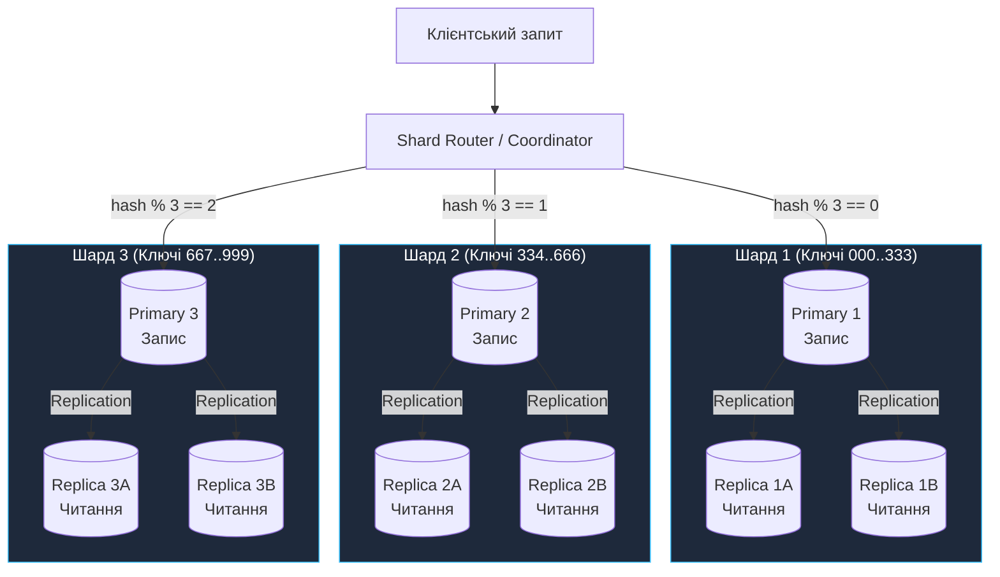
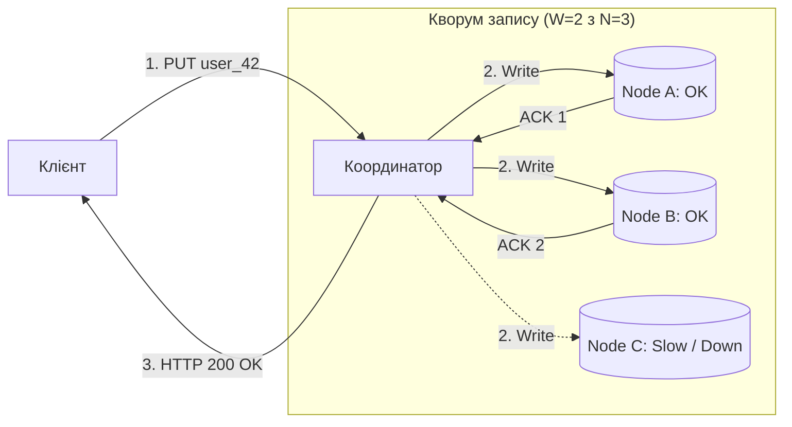

# Лекція 6: Архітектура розподіленого зберігання даних & Consistent Hashing

> **Декларація курсу.** Академічна доброчесність та авторство матеріалів — у [DISCLAIMER.md](./DISCLAIMER.md).

---

### Обов'язкове читання (Landmark Papers)
* **DeCandia, G. et al. (2007).** *Dynamo: Amazon's Highly Available Key-value Store*. ACM SIGOPS Operating Systems Review (SOSP '07). (Фундаментальна стаття, що ввела у промислову практику Consistent Hashing з віртуальними нодами, Sloppy Quorum та Hinted Handoff).
* **Karger, D. et al. (1997).** *Consistent Hashing and Random Trees: Distributed Caching Protocols for Relieving Hot Spots on the World Wide Web*. ACM STOC '97.
* **Фокусне запитання для аналізу:** Чому наївна формула шардингу $\text{hash}(key) \pmod N$ призводить до міграції майже 100% даних при додаванні одного нового сервера, і як концепція кільцевого хешування (Consistent Hash Ring) зводить обсяг переміщуваних даних до $O(K/N)$?

---

## Питання для розминки

<b>1. Чому об'єктні сховища (AWS S3, MinIO) не дозволяють дозаписати кілька байтів у середину існуючого файлу (in-place append/seek), як звичайна файлова система (ext4/NTFS)?</b>

Тому що об'єктні сховища побудовані на принципі **незмінності (Immutability / WORM: Write Once, Read Many)**. 

Об'єкт розглядається як єдиний атомарний бінарний блоб. Відмова від підтримки блокувань окремих байтів (byte-range locks) та складних файлових дескрипторів POSIX дозволила позбутися транзакційних оверхедів і досягти необмеженого горизонтального масштабування до екзабайтів даних із тисячами паралельних читачів.

<b>2. Якщо в кластері з 4 серверів шардинг розраховується як hash(id) % 4, скільки відсотків ключів доведеться перемістити на інші вузли при додаванні 5-го сервера?</b>

**Близько 80% усіх ключів!** 

Математично при переході від ділення на $N$ до $N+1$ змінюється значення залишку від ділення для переважної більшості чисел. Лише $\frac{1}{N+1}$ (тобто $20\%$) ключів випадково залишаться на своєму попередньому сервері. Для великої бази це означає масове переписування терабайтів даних та миттєвий відказ мережі (Thundering Migration).

---

## Архітектурний кейс: Чорна п'ятниця Amazon та народження Dynamo

У середині 2000-х років інженери Amazon зіткнулися з фундаментальним обмеженням класичних реляційних СУБД (Oracle):
Під час пікових розпродажів клієнти клали товари до кошика (**Shopping Cart**), генеруючи сотні тисяч записів на секунду.

**Пастка наївного шардингу кешу / бази даних (Amazon, 2006):**
1. База шардується формулою: `Server = hash(user_id) % N`.
2. Один сервер виходить із ладу ($N$ зменшується на 1).
3. Залишок `% (N - 1)` змінюється для ~85% користувачів.
4. Усі клієнти одночасно отримують **Cache Miss**.
5. Лавина запитів пробиває кеш і кладе бекенд (**Cache Stampede**).

Вернер Фогельс (Werner Vogels, CTO Amazon) сформулював нову вимогу: **кошик клієнта ніколи не повинен повертати помилку запису**. Навіть якщо дата-центри палають або рветься зв'язок — запис має прийнятися.

Для цього було створено **Dynamo** — повністю децентралізоване сховище без єдиної точки відмови (Masterless), засноване на кільці узгодженого хешування (**Consistent Hash Ring**). Сьогодні ця архітектура лежить в основі **Amazon DynamoDB**, **Apache Cassandra**, **Riak** та систем розподіленого кешування.

---

## 1. Три кити зберігання: Block vs File vs Object Storage

У хмарі поняття «диск» перестало означати фізичний накопичувач. Зберігання розділилося на три різні архітектурні рівні:

| Рівень та властивість | Block Storage (Блочне) | File Storage (Файлове) | Object Storage (Об'єктне) |
| :--- | :--- | :--- | :--- |
| **Рівень абстракції** | **Низький** (Рівень блоків / Raw Block Device) | **Середній** (Рівень ОС / POSIX-ієрархія) | **Високий** (Прикладний рівень / REST API) |
| **Одиниця даних** | Блоки фіксованого розміру (наприклад, 4 КБ) | Файли та каталоги у дереві | Незмінні об'єкти (Key + Metadata + Payload) |
| **Протокол доступу** | iSCSI, NVMe-oF, драйвер ядра (EBS, RBD) | NFS, SMB/CIFS, виклики POSIX (`open`, `read`) | HTTP/S (REST: `GET`, `PUT`, `DELETE`, S3 API) |
| **Режим монтування** | **ReadWriteOnce (RWO)** (1 VM одночасно) | **ReadWriteMany (RWX)** (сотні клієнтів) | Не монтується (доступ за URL через мережу) |
| **Модифікація даних** | Довільна (in-place перезапис секторів) | Довільна або дописування (in-place / append) | Тільки повний перезапис об'єкта (**Immutable**) |
| **Швидкодія / Latency** | Субмілісекундна затримка, максимальний IOPS | Низька затримка, деградація при lock contention | Затримка десятків мілісекунд, високий Throughput |
| **Приклади рішень** | AWS EBS, Ceph RBD, GCP Persistent Disk | NFS, AWS EFS, CephFS, Azure Files | AWS S3, MinIO, Google Cloud Storage, Ceph RGW |
| **Головний Use Case** | СУБД (PostgreSQL, MySQL, Redis), диски ОС | Спільні каталоги, CMS (WordPress), скрипти | Data Lake, медіа, бекапи, ваги ML-моделей |

### 1. Block Storage (Блочне сховище: AWS EBS, Ceph RBD, NVMe-oF)
* Операційна система бачить його як сирий блочний пристрій: `/dev/xvdf`.
* ОС самостійно форматує його у файлову систему (ext4, xfs).
* **Головні переваги:** Екстремально низька затримка (субмілісекунди) та високий IOPS.
* **NVMe-oF (*NVMe over Fabrics*):** Стандарт доступу до віддалених блоків через мережі (RDMA / TCP). На відміну від застарілого iSCSI з однією чергою, підтримує до 64 000 паралельних черг команд із затримкою на рівні мікросекунд.
* **Обмеження:** Режим доступу **ReadWriteOnce (RWO)** — блок може бути примонтований лише до однієї віртуальної машини одночасно. Ідеально підходить для **СУБД** (PostgreSQL, MySQL, Redis).

### 2. File Storage (Файлове сховище: NFS, AWS EFS, CephFS)
* Мережева файлова система з повною підтримкою стандарту **POSIX** (`open`, `seek`, `read`, `write`).
* **Головні переваги:** Режим **ReadWriteMany (RWX)** — тисячі контейнерів і VM можуть одночасно читати і писати в спільну директорію `/shared/data`.
* **Обмеження:** Складні розподілені блокування файлів (file locks). При високому паралелізмі затримка різко зростає.

### 3. Object Storage (Об'єктне сховище: AWS S3, MinIO, GCS, Ceph RGW)
* Повна відмова від ієрархії каталогів. Простір абсолютно плаский: `Bucket` + `Object Key`.
* Доступ виключно через мережевий протокол HTTP/S REST API:
  `GET https://s3.amazonaws.com/my-bucket/models/reactor_v1.parquet`
* **Незмінність (Immutability):** Файл не можна змінити «частково». Щоб змінити 1 байт у файлі розміром 5 ГБ, необхідно перезалити всі 5 ГБ наново.
* **Масштаб:** Практично нескінченна місткість та надійність 99.999999999% (11 дев'яток) за рахунок гео-реплікації та Erasure Coding (кодів Ріда-Соломона).

> [!NOTE]
> **Модель узгодженості в Object Storage (кейс AWS S3):**
> 
> * **Історично (до грудня 2020 року — Eventual Consistency):** Операція перезапису або видалення об'єкта не гарантувала негайного читання нової версії. Наступний `GET` міг повернути стару версію або `404 Not Found`. Інженерам доводилося будувати зовнішні індекси (наприклад, Netflix s3mper) для перевірки появи об'єкта.
> * **Сучасний стан (Strong Consistency):** AWS S3 перейшов на строгу узгодженість (**Strong Read-After-Write Consistency**) для всіх операцій `PUT` та `DELETE`. Одразу після відповіді `200 OK` клієнт гарантовано отримує найактуальнішу версію у всіх регіонах без додаткової затримки.

---

## 2. Масштабування сховищ: Шардинг + Реплікація у реальному продакшені

У розподілених системах шардинг і реплікація — це не взаємовиключні підходи, а дві взаємодоповнюючі осі, які **завжди працюють одночасно**:

* **Шардинг (Scale for Writes & Storage):** розрізає весь масив даних на неперетинні частини (**шарди**). Кожен шард відповідає лише за свій діапазон ключів. Це масштабує пам'ять і **пропускну здатність запису**.
* **Реплікація (High Availability & Scale for Reads):** дублює кожен окремий шард на декілька серверів. Гарантує збереження даних при падінні нод і масштабує **операції читання**.

```mermaid
flowchart TD
    CLIENT["Клієнтський запит"] --> ROUTER["Shard Router / Coordinator"]

    subgraph SHARD1 ["Шард 1 (Ключі 000..333)"]
        P1[(Primary 1<br>Запис)] -->|Replication| R1A[(Replica 1A<br>Читання)]
        P1 -->|Replication| R1B[(Replica 1B<br>Читання)]
    end

    subgraph SHARD2 ["Шард 2 (Ключі 334..666)"]
        P2[(Primary 2<br>Запис)] -->|Replication| R2A[(Replica 2A<br>Читання)]
        P2 -->|Replication| R2B[(Replica 2B<br>Читання)]
    end

    subgraph SHARD3 ["Шард 3 (Ключі 667..999)"]
        P3[(Primary 3<br>Запис)] -->|Replication| R3A[(Replica 3A<br>Читання)]
        P3 -->|Replication| R3B[(Replica 3B<br>Читання)]
    end

    ROUTER -->|hash % 3 == 0| P1
    ROUTER -->|hash % 3 == 1| P2
    ROUTER -->|hash % 3 == 2| P3

    style SHARD1 fill:#1e293b,stroke:#38bdf8,color:#fff
    style SHARD2 fill:#1e293b,stroke:#38bdf8,color:#fff
    style SHARD3 fill:#1e293b,stroke:#38bdf8,color:#fff
```

> [!IMPORTANT]
> **Золоте правило архітектури:** Шардинг без реплікації неприпустимий, оскільки аварія одного сервера призводить до втрати $1/N$ частини всієї системи. Реплікація без шардингу обмежена місткістю одного Primary. Тому в продакшені (MongoDB Replica Sets, Cassandra, CockroachDB, Redis Cluster) кожен шард — це самостійний відмовостійкий реплікасет.

> [!WARNING]
> **Пастка Replication Lag та застарілого читання (Stale Reads):**
> 
> У 95% продакшн-систем реплікація з Primary на Read-репліки налаштовується **асинхронно** заради швидкості запису на Primary.
> 
> **Сценарій збою очікувань:**
> 1. Користувач оновлює свій профіль (`POST /profile` $\to$ Primary DB).
> 2. Бекенд повертає успіх і перенаправляє браузер на оновлену сторінку.
> 3. Фронтенд робить `GET /profile`, який балансувальник спрямовує на найменш завантажену **Replica DB**.
> 4. Через **Replication Lag** (навіть у 50–200 мс) репліка ще не встигла накатити транзакцію з журналу WAL.
> 5. Користувач бачить старі дані, панікує, що зміни не збереглися, і починає повторно відправляти запит.
> 
> **Архітектурне рішення — Read-Your-Own-Writes Consistency:**
> Для сесії клієнта, який щойно виконав мутацію даних, наступні операції читання протягом $T = 5\dots10$ секунд примусово маршрутизуються на **Primary**, або вимагається перевірка позиції журналу реплікації (PostgreSQL LSN / MySQL GTID).

### Пастки вибору ключа шардингу (Shard Key):
1. **Монотонний автоінкремент (`id = 1, 2, 3...`):**
   * Всі нові записи потрапляють виключно на останній шард. Виникає **Hotspot** (перегрів однієї ноди), тоді як інші шарди простоюють.
2. **Випадковий UUID (`uuid_v4`):**
   * Ідеально розмазує записи по всіх нодах.
   * **Проблема:** Неможливо виконати вибірку по діапазону (`WHERE created_at BETWEEN ...`) без розсилання запиту на всі шарди кластера (**Scatter-Gather Query**), що вбиває швидкість.

---

## 3. Механіка Consistent Hashing (Узгоджене хешування)

Як розподілити терабайти ключів між $N$ серверами так, щоб додавання або видалення сервера не вимагало переміщення всієї бази?

### Кільце узгодженого хешування (Consistent Hash Ring)
1. Обирається хеш-функція (наприклад, MurmurHash3 або MD5), яка відображає будь-яке значення у фіксований діапазон: від $0$ до $2^{32} - 1$.
2. Цей діапазон умовно замикається в **кільце**: значення $2^{32}-1$ з'єднується з $0$.

**Приклад маршрутизації на числовому кільці:**
* **Вузли кластера:** `Node_A` (хеш `1000`), `Node_B` (хеш `2500`), `Node_C` (хеш `4000`).
* **Ключ `Key_1` (хеш `1400`):** рухаючись за годинниковою стрілкою, перший зустрічний вузол — `Node_B` $\to$ зберігається на **`Node_B`**.
* **Ключ `Key_2` (хеш `3200`):** перший вузол за годинниковою стрілкою — `Node_C` $\to$ зберігається на **`Node_C`**.
* **Ключ `Key_3` (хеш `4500`):** перевищує значення останньої ноди, тому переходить через нуль кільця і потрапляє на перший вузол — **`Node_A`**.

### Алгоритм пошуку сервера для ключа:
1. Рахуємо хеш фізичних серверів: `hash("server-1")`, `hash("server-2")`. Розставляємо їхні точки на кільці.
2. Коли надходить ключ `user_42`, рахуємо його хеш: `pos = hash("user_42")`.
3. Рухаємося по кільцю **за годинниковою стрілкою**, доки не зустрінемо перший фізичний сервер. Цей сервер і є володарем ключа.

### Що стається при додаванні нового сервера?
При додаванні сервера `Node_D` між `Node_A` та `Node_B`:
* Лише частина ключів із сегмента між `Node_A` та `Node_D` мігрує на новий вузол.
* **Усі інші сервери та 90% ключів на кільці взагалі не рухаються!** Обсяг міграції становить лише $O(K/N)$.

---

## 4. Проблема нерівномірності та Віртуальні Вузли (Virtual Nodes)

Якщо на кільці розмістити лише кілька фізичних серверів, хеш-функція розкидає їх нерівномірно:

* **Без віртуальних вузлів (дисбаланс):** випадковий розподіл 3–4 точок утворює нерівні сектори. Наприклад, `Node A` отримує 10% дуги кільця, `Node C` — 20%, а на `Node B` припадає **70% усіх ключів і трафіку** (**Hotspot**), що призводить до падіння перевантаженого вузла.
* **З віртуальними вузлами (Vnodes):** кожен фізичний сервер представлений десятками або сотнями точок (`A#1`, `B#1`, `C#1`, `A#2`...), що чергуються по всьому кільцю. Завдяки закону великих чисел сектори перемішуються, і кожен сервер отримує свою чесну частку навантаження ($1/N$).

### Інженерне рішення: Віртуальні Вузли (Vnodes)
Кожен фізичний сервер отримує множину токенів (зазвичай 100–256 віртуальних імен): `Node_A#1...256`, `Node_B#1...256`, `Node_C#1...256`. 

Оскільки хеш-функція розкидає їх псевдовипадково, віртуальні точки різних серверів **перемішуються на кільці у шаховому порядку**:

`... → [ Node_A#12 ] → [ Node_B#84 ] → [ Node_C#3 ] → [ Node_A#99 ] → [ Node_B#01 ] → [ Node_C#45 ] → ...`

Замість трьох величезних нерівних шматків кільце розбивається на сотні крихітних секторів, що чергуються між собою.

### Переваги концепції Vnodes:
1. **Статистична однорідність:** Кільце розбивається на дрібні сектори. Навантаження між серверами балансується з математичною похибкою менше ніж $\pm 3\%$.
2. **Врахування гетерогенного заліза:** Потужному серверу на 64 ядра можна виділити 500 віртуальних нод, а слабкому на 16 ядер — 100 нод.
3. **Швидке паралельне відновлення:** Якщо нода вмирає, її дані розпорошені по всьому кільцю. Їх починають одночасно вичитувати та копіювати **всі вцілілі ноди кластера одразу**, уникаючи перевантаження одного сусіда.

---

## 5. Реплікація на кільці, Кворуми (N, W, R) та Hinted Handoff

Узгоджене хешування вирішує лише одне завдання — **куди саме маршрутизувати ключ**. Але знайти один сервер замало. 
У хмарі залізо деградує постійно: збоїть мережа, вмирають SSD, перевантажується процесор. Записати дані лише на один вузол — це гарантована їх втрата. 

Щоб дані жили вічно, поверх кільця вмикається **реплікація**.

### 1. Preference List: які сервери зберігають копії
Коли ключ потрапляє на кільце:
1. Перший вузол за годинниковою стрілкою стає **Координатором (Coordinator)** запису.
2. Координатор не тримає дані сам, а дублює їх на **$N$ наступних фізичних серверів** на кільці (список реплік називається **Preference List**). Зазвичай фактор реплікації $N = 3$.

### 2. Математика кворумів: чому не чекають усіх ($R + W > N$)
Якщо для збереження чекати відповіді від усіх $N = 3$ серверів, база стане повільною, а падіння хоча б одного вузла зупинить усю систему. Тому використовують **кворуми**:

* **$N$ (Replication Factor):** на скільки серверів розсилаються копії (наприклад, 3).
* **$W$ (Write Quorum):** скільки вузлів мають підтвердити запис, щоб клієнт отримав успіх `200 OK` (наприклад, 2).
* **$R$ (Read Quorum):** зі скількох вузлів ми вичитуємо дані при читанні (наприклад, 2).

> [!TIP]
> **Формула строгої узгодженості (Strict Quorum):**  
> $$R + W > N$$  
> Якщо $W=2$ і $R=2$ при $N=3$, то $2 + 2 = 4 > 3$.  
> Це математично гарантує, що серед опитаних на читання вузлів **завжди буде хоча б один**, який щойно отримав найсвіжіший запис.

```mermaid
flowchart LR
    C[Клієнт] -->|1. PUT user_42| Coord[Координатор]
    
    subgraph Quorum ["Кворум запису (W=2 з N=3)"]
        Coord -->|2. Write| R1[(Node A: OK)]
        Coord -->|2. Write| R2[(Node B: OK)]
        Coord -.->|2. Write| R3[(Node C: Slow / Down)]
    end

    R1 -->|ACK 1| Coord
    R2 -->|ACK 2| Coord
    Coord -->|3. HTTP 200 OK| C
```

### 3. Що робити, якщо вузол впав? (Sloppy Quorum & Hinted Handoff)
Пам'ятаєте вимогу Amazon до кошика товарів: *«жодна помилка запису неприпустима»*? Якщо одна з трьох призначених нод впала або не відповідає:

1. **Sloppy Quorum (Нестрогий кворум):** координатор тимчасово відправляє третю копію першому здоровому **сусідньому серверу** на кільці (`Node D`), щоб не зривати кворум $W = 2$.
2. **Hinted Handoff (Передача за підказкою):** `Node D` зберігає ці дані у спеціальному буфері з позначкою: *«Я тримаю це тимчасово. Віддати вузлу Node C, щойно той одужає»*.
3. **Самовідновлення:** коли `Node C` повертається в онлайн, `Node D` непомітно для клієнтів передає йому накопичені дані.

---

## 6. Битва парадигм: ACID vs BASE

Вимоги до транзакцій та доступності розділили сховища на два фундаментальні архітектурні підходи:

* **ACID (Класичні RDBMS: PostgreSQL, Oracle, MySQL):**
  * **Atomicity (Атомарність):** транзакція виконується або повністю, або відкочується без сліду.
  * **Consistency (Узгодженість):** база переходить лише з одного валідного стану в інший з дотриманням усіх обмежень.
  * **Isolation (Ізольованість):** паралельні операції не бачать проміжних змін одна одної (через блокування рядків/таблиць).
  * **Durability (Довговічність):** зафіксовані дані гарантовано записані на енергонезалежний носій.
  * *Ціна компромісу:* блокування та розподілені транзакції (2PC) катастрофічно сповільнюють систему при горизонтальному масштабуванні на сотні вузлів.

* **BASE (Розподілені NoSQL: DynamoDB, Cassandra, Riak):**
  * **Basically Available (Базова доступність):** кластер завжди повертає відповідь на запис чи читання, навіть якщо окремі вузли впали або розділені мережею.
  * **Soft State (М'який стан):** дані на репліках можуть тимчасово розходитися без гарантії миттєвої синхронності.
  * **Eventual Consistency (Узгодженість у кінцевому підсумку):** копії на всіх вузлах обов'язково зійдуться до одного значення через певний проміжок часу.
  * *Вигода компромісу:* екстремальна доступність і практично безмежне горизонтальне масштабування.

### Eventual Consistency та вирішення конфліктів:
У системах BASE під час розриву мережі два різні клієнти можуть одночасно змінити один і той самий об'єкт на різних нодах кільця. Як вирішити конфлікт?

1. **Last-Write-Wins (LWW):** Перемагає запис із більшим timestamp.
   * **Пастка:** Якщо годинники на серверах розсинхронізовані навіть на 20 мс (NTP Skew), новіший запис може бути стертий старішим.
2. **Векторні годинники (Vector Clocks):** Замість ненадійного фізичного часу кожен сервер веде простий числовий лічильник своїх змін. До даних додається список ревізій вигляду `{Node_A: 1, Node_B: 2}`.
   * Якщо лічильники однієї версії більші за всіма вузлами — вона однозначно новіша і перезаписує стару.
   * Якщо лічильники розійшлися (наприклад, перша версія має `{Node_A: 2, Node_B: 1}`, а друга — `{Node_A: 1, Node_B: 2}`), база фіксує паралельний конфлікт гілок. Вона не вгадує результат, а повертає додатку обидві версії.
   * *Кейс Amazon Shopping Cart:* додаток отримує обидва варіанти кошика і просто об'єднує товари з обох списків, гарантуючи, що покупець не втратить жодної доданої речі.

> [!IMPORTANT]
> **Проблема розростання векторних годинників (Vector Clock Explosion) та Pruning:**
> 
> Якщо запис живе довго і оновлюється через сотні різних вузлів, список ревізій `{Node_1: 1, Node_2: 4, ..., Node_500: 2}` неконтрольовано росте. Метадані версій починають важити **більше, ніж корисні дані**, забиваючи пам'ять і мережевий канал.
> 
> **Архітектурне рішення (Dynamo Pruning Threshold):**
> З кожною парою у векторі зберігається час останнього оновлення. Коли довжина вектора перевищує фіксований поріг (наприклад, 10–20 записів), найстаріші елементи відсікаються (**Vector Clock Pruning**). Це захищає пам'ять від витоку ціною мізерного ризику помилкового конфлікту.

3. **CRDT (Conflict-free Replicated Data Types):** Спеціальні структури даних (лічильники, множини), які математично зливаються без конфліктів за комутативними законами.

---

## 7. Практичний місток: Зв'язок із лабораторним курсом

У нашому семестровому курсі вибір моделей зберігання безпосередньо впливає на архітектуру симулятора:

* **Чому воркери Монте-Карло не пишуть у PostgreSQL:** Якби 100 паралельних воркерів на кожному кроці робили `INSERT/UPDATE` у спільну реляційну таблицю, черга блокувань транзакцій (Row-level Locks) та Connection Pool затримали б обчислення в $50\times$ разів.
* **Патерн Object Storage у практиці:** Воркери зберігають стан генерації часток чи напруг IEEE-118 локально в пам'яті, а фінальні зрізи скидають у **MinIO / S3** як імутабельні об'єкти (файли `.parquet` або `.json.gz`).
* **Consistent Hashing у розподілі ліній електропередач:** Коли ми розпаралелюємо перевірку $N-1$ аварійних відключень мережі IEEE-118 між воркерами Ray/K8s, ми використовуємо узгоджене хешування `hash(branch_id)`, щоб при падінні одного обчислювального вузла перезапускати розрахунок лише для його частки гілок графа.

---

## 8. Зведена інженерна матриця компромісів

| Тип сховища | Одиниця даних | Режим доступу | Затримка (P99) | Масштабованість | Модель узгодженості |
| :--- | :--- | :--- | :--- | :--- | :--- |
| **Block Storage (EBS)** | Блок (4–64 КБ) | RWO (1 хост) | **Екстремально низька (<1 мс)** | Обмежена розміром диска (до 64 ТБ) | **Strong Consistency** |
| **File Storage (EFS/NFS)**| Файл (POSIX) | RWX (Багато хостів)| Середня (3–10 мс) | Десятки терабайтів | **Strong Consistency** (з блокуваннями) |
| **Object Storage (S3)** | Об'єкт (Key/Blob) | REST API (HTTP) | Вища (20–50 мс на First Byte) | **Практично нескінченна (Екзабайти)** | **Read-After-Write (Strong у S3)** |
| **Sharded RDBMS** | Реляційний рядок | SQL (ACID) | Низька (1–5 мс) | Складна (обмежена шардингом) | **Strict ACID (Транзакції)** |
| **Consistent Hash KV (Dynamo/Cassandra)** | Ключ-значення / Wide-column | NoSQL API | **Низька та стабільна (2–5 мс)** | **Лінійна горизонтальна (тисячі нод)** | **Eventual Consistency / Tunable Quorum** |

---

## Підсумок лекції

1. **Диски померли, живуть абстракції:** У хмарах обирають між швидкістю та RWO (Block), спільним доступом POSIX (File) та нескінченним масштабом WORM (Object).
2. **Наївне хешування руйнує кластери:** Формула `hash % N` викликає масову міграцію даних при зміні кількості вузлів.
3. **Consistent Hashing мінімізує міграцію:** Кільцеве хешування локалізує переміщення даних у межах $O(K/N)$, а віртуальні ноди (Vnodes) усувають небезпеку дисбалансу та «гарячих точок».
4. **Кворум контролює узгодженість:** Правило $R + W > N$ гарантує строгу узгодженість у розподіленому середовищі ціною блокування при глибоких аваріях мережі.

---

## Контрольні питання

<b>1. Яким чином використання віртуальних вузлів (Virtual Nodes / Vnodes) прискорює відновлення даних після аварійного виходу з ладу одного фізичного сервера?</b>

Якщо сервер має лише одну точку на кільці, всі його дані після падіння змушений перебирати та копіювати виключно один наступний сусід за годинниковою стрілкою, створюючи ризик каскадної відмови через перевантаження мережі та диску. 

При використанні **Vnodes** (наприклад, 256 точок) дані мертвого сервера рівномірно розпорошені по всьому периметру кільця. Після збою реплікацією та відновленням даних починають паралельно займатися **всі інші фізичні сервери кластера одночасно**, зменшуючи час реплікації в десятки разів.

<b>2. Чому при записі в системі з фактором реплікації N=3 та конфігурацією кворуму R=2, W=2 клієнт завжди гарантовано прочитає останнє записане значення?</b>

Згідно з принципом Діріхле, якщо $R + W > N$ ($2 + 2 = 4 > 3$), множина з $W$ вузлів, на які успішно записано дані, та множина з $R$ вузлів, з яких зчитуються дані, **обов'язково перетинаються щонайменше на одному спільному вузлі**. 

Клієнт або координатор отримує відповіді з версіями (timestamps чи vector clocks) від двох вузлів. Хоча б один із них міститиме найновіший запис, що дозволяє координатору обрати найсвіжішу версію та віддати її клієнту.

<b>3. У чому полягає фундаментальна небезпека застосування стратегії Last-Write-Wins (LWW) для вирішення конфліктів у розподілених базах даних?</b>

LWW спирається на фізичний час серверів (*Wall-Clock Time / NTP*). 

У реальних мережах годинники різних серверів неминуче мають розсинхронізацію (**Clock Skew** та **Clock Drift**), яка може сягати десятків і сотень мілісекунд. Сервер із годинником, що поспішає, згенерує мітку часу з «майбутнього». Його запис невідворотно зітре пізніший та актуальніший бізнес-запис із сервера, чий годинник відставав, спричинивши тиху втрату фінансових чи клієнтських транзакцій.

<b>4. Чому об'єктне сховище (S3) демонструє значно вищу затримку часу до першого байту (TTFB ~20-50 мс), ніж блочне сховище (EBS ~0.5-2 мс)?</b>

EBS підключається через спеціалізовану апаратну шину введення-виведення (NVMe-over-Fabrics на виділених чіпах AWS Nitro) з прямим доступом до секторів без оверхеду прикладних протоколів. 

**Object Storage (S3)** працює через повний прикладний стек **HTTP/HTTPS**: клієнт виконує DNS-запит, встановлює TCP-з'єднання, робить TLS 1.3 рукостискання, передає HTTP-заголовки з сигнатурою аутентифікації (AWS SigV4), після чого шлюз S3 перевіряє права доступу в IAM, визначає вузол у метаданих і лише потім починає віддавати байти.

