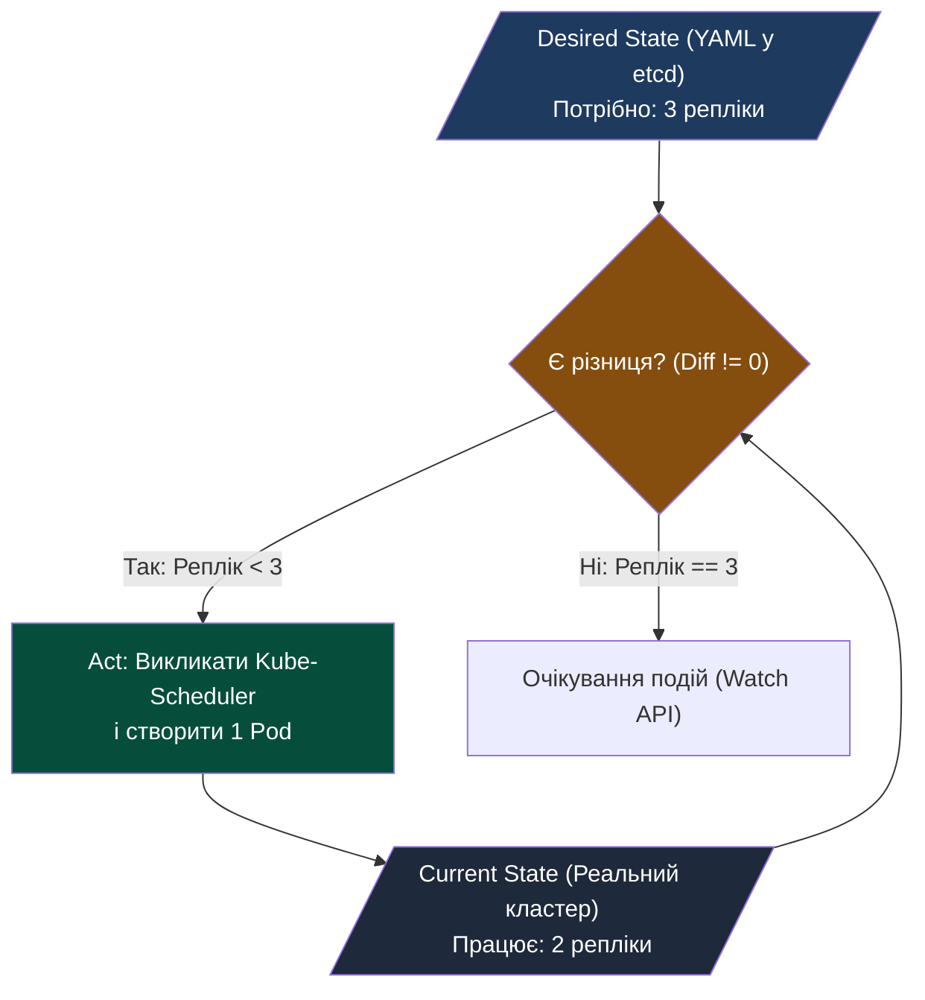
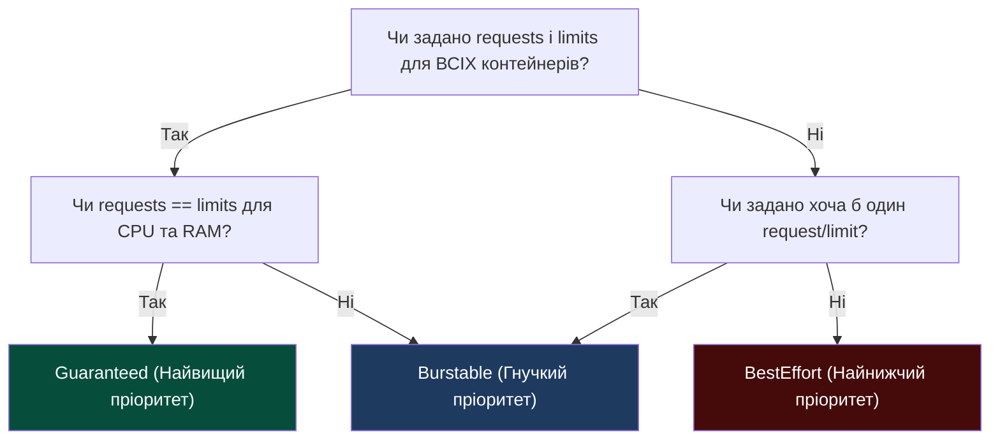

# Лекція 7: Декларативна оркестрація (Kubernetes Control Plane) & ресурсна модель

> **Декларація курсу.** Академічна доброчесність та авторство матеріалів — у [DISCLAIMER.md](./DISCLAIMER.md).

---

### Обов'язкове читання (Landmark Papers)
* **Burns, B., Grant, B., Oppenheimer, D., Brewer, E., & Wilkes, J. (2016).** *Borg, Omega, and Kubernetes: Lessons learned from three container-management systems over a decade*. Communications of the ACM / ACM Queue. (Фундаментальна стаття Google про еволюцію систем оркестрації та переваги декларативного API над імперативним).
* **Kubernetes Architecture Design Docs.** *Principles of Kubernetes Design: Declarative State Reconciliation and Level-Triggered Control Loops*.
* **Фокусне запитання для аналізу:** Чому декларативна модель з безперервним циклом узгодження (Reconciliation Loop) є значно стійкішою до часткових збоїв мережі, ніж імперативні сценарії розгортання (Bash, Ansible), але вимагає від архітектора суворої ідемпотентності та тонкого налаштування класів QoS для уникнення ланцюгових виселень (Eviction Storms)?

---

## Питання для розминки

<details markdown="1">
<summary><b>1. Що станеться, якщо адміністратор підключиться по SSH до робочої ноди Kubernetes і примусово вб'є процес контейнера через kill -9 &lt;PID&gt;?</b></summary>

Контейнер миттєво перезапуститься, і система продовжить працювати. 

Локальний демон **Kubelet** безперервно відстежує стан процесів через підсистему PLEG (Pod Lifecycle Event Generator) та сокет CRI (Container Runtime Interface). Помітивши зникнення процесу, Kubelet звіряє поточний стан із бажаним (*Desired State*), бере образ і піднімає новий ідентичний контейнер за лічені мілісекунди.
</details>

<details markdown="1">
<summary><b>2. Чому конфігурація resources.limits.cpu у маніфесті може викликати різке падіння продуктивності веб-сервісу (CFS Throttling), навіть якщо процесори ноди завантажені лише на 25%?</b></summary>

Тому що ядра процесора не діляться «фізично» — вони діляться на **кванти часу (CPU Quota)** у межах періоду (за замовчуванням 100 мс). 

Якщо ваш багатопотоковий сервіс використовує ліміт `1000m` (1 CPU), але запускає 10 паралельних потоків, які одночасно беруть роботу, вони спалять доступну квоту в 100 мс усього за **10 мс реального часу**. Решту 90 мс ядро Linux примусово заморожує потоки (*CPU Throttling*), викликаючи катастрофічний стрибок P99 затримки.
</details>

---

## Архітектурний кейс: Шторм виселень (Eviction Storm) у Чорну П'ятницю

У листопаді великий ритейлер розгорнув свій мікросервісний стек у Kubernetes. Щоб зекономити кошти, інженери запустили сервіси рекомендацій та аналітики без вказання гарантованих ресурсів (`resources.requests`), розраховуючи на спільний пул пам'яті.

```
 ┌─────────────────────────────────────────────────────────────┐
 КАСКАДНИЙ КОЛАПС КЛАСТЕРА (EVICTION STORM)                    │
 ├─────────────────────────────────────────────────────────────┤
 │ 1. Пік покупців: сервіс рекомендацій починає жерти RAM      │
 │ 2. На Node 1 спрацьовує поріг memory.available < 100Mi      │
 │ 3. Kubelet виселяє (Evict) 15 подів із Node 1               │
 │ 4. Планувальник перекидає ці 15 подів на сусідню Node 2     │
 │ 5. Node 2 миттєво перевантажується і виселяє вже свої поди  │
 │ 6. Доміно: за 3 хвилини всі ноди кластера входять у NotReady│
 └─────────────────────────────────────────────────────────────┘
```

**Чому це сталося:** Відсутність розуміння ресурсної моделі Kubernetes (класів QoS та порогів Node Pressure) перетворила механізм самовідновлення (*Self-Healing*) на зброю самознищення.

---

## 1. Імперативна vs Декларативна модель: Зміна філософії

Історично розгортанням керували імперативні скрипти (Bash, Fabric, старі плейбуки Ansible):

```
 ІМПЕРАТИВНИЙ ПІДХІД (Кроки виконання)
 "Створи VM ──> Встанови Docker ──> Скачай образ ──> Запусти контейнер"
 (Якщо на кроці 3 пропала мережа — система лишається в напівзламаному стані)

 ДЕКЛАРАТИВНИЙ ПІДХІД (Бажаний стан у YAML)
 "У системі ЗАВЖДИ має працювати рівно 5 реплік контейнера реактора v1"
 (Оркестратор сам знаходить різницю і виконує будь-які дії для її усунення)
```

### Принцип Reconciliation Loop (Цикл узгодження)
В основі Kubernetes лежить неперервний нескінченний цикл:

$$\text{Observe (Спостереження)} \longrightarrow \text{Diff (Аналіз різниці)} \longrightarrow \text{Act (Дія)}$$



* **Level-Triggered контролери:** Оркестратор реагує не на «команди» чи «переходи станів», а на **поточний факт розбіжності**. Якщо контролер перезавантажився під час аварії, після старту він просто дивиться на поточний стан і продовжує виправлення.

---

## 2. Анатомія Control Plane & Роль etcd

Кластер Kubernetes розділений на **Площину управління (Control Plane)** та **Робочі вузли (Worker Nodes)**:

```
 ┌─────────────────────────────────────────────────────────────┐
 │                KUBERNETES CONTROL PLANE                     │
 │                                                             │
 │   ┌──────────────┐       gRPC        ┌──────────────────┐   │
 │   │  Kube-API    │◄─────────────────►│      etcd        │   │
 │   │    Server    │                   │(Raft Consensus,  │   │
 │   └──────▲───────┘                   │ Single Source    │   │
 │          │                           │ of Truth)        │   │
 │          ├──────────────────┐        └──────────────────┘   │
 │          ▼                  ▼                               │
 │   ┌──────────────┐   ┌──────────────┐                       │
 │   │Kube-Scheduler│   │ Kube-Control │                       │
 │   │ (Фільтрація  │   │   Manager    │                       │
 │   │  та Скоринг) │   │(Reconcilers) │                       │
 │   └──────────────┘   └──────────────┘                       │
 └──────────┼──────────────────────────────────────────────────┘
            │ HTTPS / TLS
            ▼
 ┌──────────────────────────────────────┐
 │             WORKER NODE              │
 │   ┌──────────────┐  CRI   ┌───────┐  │
 │   │   Kubelet    │◄──────►│Runtime│  │
 │   └──────▲───────┘ (gRPC) └───────┘  │
 │          │ PLEG                      │
 │   ┌──────┴───────┐                   │
 │   │  Kube-Proxy  │ (iptables/IPVS)   │
 │   └──────────────┘                   │
 └──────────────────────────────────────┘
```

### 1. etcd: Єдине джерело правди
* Розподілена key-value база даних на алгоритмі консенсусу **Raft**.
* Зберігає повний стан кластера. **Жоден компонент, окрім API Server, не має прямого доступу до etcd!**
* **Вимога до заліза:** etcd вимагає непарної кількості нод (3 або 5) і надзвичайно чутливий до затримок запису на диск (`fsync` < 10 мс). Повільний диск розриває Raft-консенсус і заморожує весь кластер.

### 2. Kube-API Server: Брама системи
* Єдиний stateless-компонент площини управління. Масштабується горизонтально за балансувальником.
* Виконує перевірку сертифікатів (AuthN), прав доступу RBAC (AuthZ) та запускає хуки валідації/мутації (**Admission Controllers**).

### 3. Kube-Scheduler: Інтелект розміщення
Призначає створеному поду конкретну ноду за два кроки:
1. **Filtering (Фільтрація / Predicates):** Відсікає ноди, де бракує CPU/RAM, де є конфлікт портів або не підходять `nodeSelector` / `taints`.
2. **Scoring (Скоринг / Priorities):** Ранжує вцілілі ноди за критеріями (рівномірне розмазування подів одного Deployment, наявність закешованого образу). Перемагає нода з найвищим балом.

### 4. Kubelet: Господар вузла
* Агент, що працює як системний демон (`systemd`) безпосередньо на кожній робочій машині.
* Спілкується з рушієм контейнерів (containerd, CRI-O) через стандартизований gRPC-протокол **CRI (Container Runtime Interface)**.
* Моніторить стан сокетів та процесів через **PLEG (Pod Lifecycle Event Generator)**.

---

## 3. Життєвий цикл Pod (Pod Lifecycle & Probes)

Pod — це неподільний атом розгортання в Kubernetes.

```
 [ Pending ] ──> [ ContainerCreating ] ──> [ Running ] ──> [ Terminating ]
      │                   │                     │                │
 Пошук ноди        Витягування образу      Старт app &         preStop хук,
 планувальником    та старт initContainers  успішні проби       SIGTERM (30s)
```

### Проби здоров'я (Health Probes):
Найнебезпечніша помилка — плутати призначення трьох видів перевірок:

| Тип проби | Що перевіряє? | Дія при збої | Типовий сценарій |
| :--- | :--- | :--- | :--- |
| **Startup Probe** | Чи запустився застосунок? | Блокує інші проби; при перевищенні таймауту — **рестарт** | Довга ініціалізація (прогрів кешу Java / вантаження моделі) |
| **Liveness Probe** | Чи живий процес? (Deadlock?) | **Вбиває контейнер і перезапускає його** (`restartPolicy`) | Зависання ниток у блокуванні, витік пам'яті |
| **Readiness Probe** | Чи готовий приймати трафік? | **Вилучає Pod із K8s Service / Endpoints** (без рестарту!) | Сервіс тимчасово захлинувся або підключається до БД |

> [!CAUTION]
> **Смертельний антипатерн Liveness та Readiness Probes:**
> 1. **Liveness Probe:** Ніколи не пінгуйте зовнішні залежності (БД, Redis). При збої БД Kubelet масово перезапускатиме контейнери, викликаючи **CrashLoopBackOff**.
> 2. **Readiness Probe:** Не перевіряйте важким запитом працездатність СУБД у 100 репліках безстанового API! Якщо база даних тимчасово уповільниться, Readiness Probes одночасно знімуть **всі 100 подів із балансування Endpoints**. Тимчасова повільність БД миттєво перетвориться на **100% блек-аут сервісу (HTTP 503)** для користувачів, хоча самі поди здорові.
> 
> **Архітектурне рішення — Graceful Degradation:** Readiness Probe перевіряє виключно локальну працездатність контейнера (чи піднявся HTTP-порт, чи не переповнені внутрішні черги), повертаючи `HTTP 200 OK`. Якщо база даних недоступна, прикладний код самостійно обробляє помилку (Circuit Breaker, кешована відповідь або черга повторів).

---

## 4. Ресурсна модель: Requests vs Limits

У маніфесті Pod ресурси вказуються двома директивами:

```yaml
resources:
  requests:
    cpu: "500m"      # 0.5 ядра процесора (гарантія планування)
    memory: "512Mi"  # 512 Мегабайт RAM
  limits:
    cpu: "2000m"     # Максимум 2 ядра (стеля тротлінгу)
    memory: "1Gi"    # Максимум 1 Гігабайт (стеля OOMKilled)
```

```
 ┌─────────────────────────────────────────────────────────────┐
 │             МЕХАНІКА ОБРОБКИ ДЕФІЦИТУ РЕСУРСІВ              │
 ├──────────────────────────────┬──────────────────────────────┤
 │  ПАМ'ЯТЬ (Нестисливий ресурс)│ ПРОЦЕСОР (Стисливий ресурс)  │
 ├──────────────────────────────┼──────────────────────────────┤
 │ При перевищенні limits:      │ При перевищенні limits:      │
 │ Негайний розстріл ядра:      │ Процес НЕ вбивається!        │
 │ OOMKilled (Exit Code 137)    │ Вмикається CFS Throttling    │
 │                              │ (урізання процесорних квантів)│
 └──────────────────────────────┴──────────────────────────────┘
```

1. **Requests (Резервування):** Враховується **виключно Kube-Scheduler**. Планувальник знаходить ноду, де сума існуючих `requests` + новий запит не перевищує місткість ноди.
2. **Limits (Жорсткий ліміт):** Забезпечується ядром Linux через механізми **cgroups v2**:
   * Для пам'яті: пишеться в `memory.max`. Перевищення $\to$ ядро викликає OOM Killer.
   * Для CPU: пишеться в `cpu.max` (CFS Quota). Перевищення $\to$ планувальник CFS забирає процесорний час.

> [!TIP]
> **Вимкнення CFS Quota для чисельних High-Performance обчислень:**
> 
> У HPC/Batch кластерах для розрахунків Монте-Карло чи машинного навчання штучний тротлінг процесора є неприпустимим.
> 
> У конфігурації демона Kubelet можна глобально вимкнути тротлінг за допомогою прапорця:
> ```yaml
> cpuCFSQuota: false
> ```
> У такому режимі Kubernetes використовує `requests.cpu` для резервування місця планувальником, але **повністю відключає обмеження `cpu.max` ядра Linux**. Обчислювальні воркери отримують змогу вільно утилізувати всі надлишкові («зайві») цикли процесорів ноди без штучних 100-мілісекундних зупинок CFS.

---

## 5. Класи якості обслуговування (QoS Classes)

Kubernetes автоматично присвоює кожному поду один із трьох класів **QoS (Quality of Service)** на основі співвідношення requests та limits:



### Порівняльна таблиця класів QoS:

| Клас QoS | Умова надання | Оцінка OOM (`oom_score_adj`) | Кого вбивають першим при збої? |
| :--- | :--- | :--- | :--- |
| **Guaranteed** | `requests == limits` (для CPU та RAM) | **-997** (Майже невразливий) | Вбивається лише в останню чергу |
| **Burstable** | `requests < limits` або задано лише одне | **$1000 - \frac{\text{request}}{\text{node\_capacity}}$** | Вбивається другим, якщо перевищив request |
| **BestEffort** | requests і limits **взагалі відсутні** | **1000** (Абсолютна мішень) | **Вбивається миттєво при першому дефіциті** |

---

## 6. Тиск на вузол (Node Pressure) та каскадні виселення

Коли на фізичній машині закінчуються ресурси, Kubelet переходить у режим **Node Pressure** (`MemoryPressure`, `DiskPressure`):

```
  ХОСТОВА ПАМ'ЯТЬ ЗАКІНЧУЄТЬСЯ (memory.available < 100Mi)
                            │
                            ▼
      Kubelet обирає жертву на виселення (Eviction)
      ┌──────────────────────────────────────────────┐
      │ 1. Спочатку виселяються всі BestEffort       │
      │ 2. Потім Burstable, які перевищили request   │
      │ 3. В останню чергу — Burstable в межах request│
      │    та Guaranteed                             │
      └──────────────────────────────────────────────┘
```

### Захист хоста на рівні ОС: Node Allocatable Architecture

Найгірший сценарій деградації ноди — коли через дефіцит оперативної пам'яті фізичний kernel OOM-killer операційної системи вбиває сам процес `kubelet`, `containerd` чи `systemd`, перетворюючи весь вузол на «зомбі» (`NodeNotReady`), перш ніж Kubelet взагалі встигне застосувати механізм виселення подів за класами QoS.

Для запобігання колапсу хоста Kubelet резервує ресурси за формулою:

$$\text{Node Allocatable} = \text{Node Capacity} - \text{kube-reserved} - \text{system-reserved} - \text{eviction-threshold}$$

```
 ┌─────────────────────────────────────────────────────────────┐
 │                ФІЗИЧНА ЄМНІСТЬ НОДИ (Node Capacity)        │
 ├─────────────────────────────────────────────────────────────┤
 │ 1. System-Reserved (--system-reserved): OS (systemd, sshd)  │
 │ 2. Kube-Reserved   (--kube-reserved):   kubelet, containerd │
 │ 3. Eviction-Threshold (--eviction-hard): Буфер захисту 100Mi │
 ├─────────────────────────────────────────────────────────────┤
 │ 4. Node Allocatable: Доступний пул для подів користувача    │
 └─────────────────────────────────────────────────────────────┘
```

Якщо параметри `--system-reserved` та `--kube-reserved` не налаштовані, планувальник Kube-Scheduler вважатиме доступними 100% пам'яті заліза, що гарантовано призведе до падіння хостової ОС під час сплесків навантаження.

### Як запобігти каскадним штормам виселень:
1. **PodDisruptionBudget (PDB):** Гарантує, що під час планових оновлень або евікшенів завжди буде живою мінімальна кількість реплік:
   ```yaml
   apiVersion: policy/v1
   kind: PodDisruptionBudget
   metadata:
     name: reactor-pdb
   spec:
     minAvailable: 80%
   ```
2. **PriorityClass:** Задає бізнес-важливість подів. Критичний платіжний воркер витіснить другорядний лог-колектор.
3. **LimitRange та ResourceQuota:** Адміністративні заборони розгортати контейнери без зазначення `requests/limits` у просторі назв.

---

## 7. Практичний місток: Зв'язок із лабораторним курсом

У нашому семестровому курсі ці механізми прямо визначають виконання **Етапу 4 (Kubernetes Orchestration)**:

* **Ресурсне забезпечення воркерів (Guaranteed QoS):** Обчислювальні воркери Монте-Карло на Етапі 4 повинні запускатися виключно з класом **Guaranteed QoS** (`requests == limits` як по CPU, так і по RAM). 
  1. Це надає процесам максимальний імунітет від виселення ($oom\_score\_adj = -997$) під час раптового сплеску споживання пам'яті сусідніми контейнерами.
  2. Це дозволяє активувати компонент **CPU Manager** у режимі `static`. Воркери отримують виділені фізичні процесорні ядра хоста (CPU Pinning), що повністю усуває системний оверхед на перемикання контексту та забезпечує 100% локальність кешу L1/L2/L3.
* **Запобігання CFS Throttling:** Для чисельних воркерів неприпустимо використовувати занижені `limits.cpu`. Якщо кластер адмініструється для High-Performance обчислень, використовується або прапорець `cpuCFSQuota: false`, або цілочисельний паритет ядер у Guaranteed-маніфестах.
* **Розподіл типів робочих навантажень:** 
  * Веб-інтерфейс симулятора реактора розгортається як **Deployment** (довгоживучий stateless-сервіс із Readiness Probe на базі локального стану без пінгів СУБД).
  * Пакетні розрахунки відключень $N-1$ у мережі IEEE-118 розгортаються як **Job / CronJob** (ідемпотентні задачі з фіксованим життєвим циклом, де завершення процесу з кодом 0 сигналізує про готовність артефакту симуляції).

---

## 8. Зведена інженерна матриця компромісів

| Архітектурний аспект | Рішення | Переваги | Ціна компромісу (Trade-off) |
| :--- | :--- | :--- | :--- |
| **Ресурсний клас** | **Guaranteed QoS** | 100% захист від виселення, стабільний L3-кеш | Низька утилізація ноди (не можна овербукати залізо) |
| **Ресурсний клас** | **Burstable QoS** | Висока щільність пакування (Overcommit) | Ризик раптового OOMKilled та CFS Throttling |
| **Ресурсний клас** | **BestEffort QoS** | Безкоштовний запуск дрібних утиліт | Нульові гарантії існування під навантаженням |
| **Стеля процесора** | **Строгий limits.cpu** | Захищає сусідів від голодування (Noisy Neighbor) | Стрибки P99 затримки через тротлінг ядра CFS |
| **Стеля процесора** | **Тільки requests.cpu** | Максимальна швидкість чисельних розрахунків | Воркер може розігнати кулери ноди до 100% CPU |
| **Перевірка Liveness**| **TCP / HTTP endpoint** | Автоматичний рестарт при зависанні | Ризик CrashLoop при перевантаженні бази даних |

---

## Підсумок лекції

1. **Декларативність — основа стабільності:** Ми не кажемо «як робити», ми описуємо «що має бути». Reconciliation loop робить систему самовідновлюваною.
2. **etcd — серце системи:** Втрата консенсусу etcd паралізує Control Plane. Він вимагає найшвидших NVMe-дисків та непарної кількості нод.
3. **Requests — для планувальника, Limits — для ядра:** Requests гарантують місце на ноді, Limits стримують апетити через cgroups.
4. **Не всі поди рівні перед законом:** Класи QoS (Guaranteed, Burstable, BestEffort) визначають порядок страти процесів у моменти кризи ресурсів.

---

## Контрольні питання

<details markdown="1">
<summary><b>1. Чому кластер etcd вимагає строго непарної кількості вузлів (3 або 5) і що станеться, якщо створити кластер із 4 вузлів?</b></summary>

Кластер із 4 вузлів **не додає жодної відмовостійкості** порівняно з кластером із 3 вузлів, але створює більший мережевий оверхед на реплікацію. 

Формула кворуму в алгоритмі Raft: $Q = \lfloor N/2 \rfloor + 1$. 
* Для $N=3$ кворум дорівнює 2 (система витримує падіння **1 ноди**).
* Для $N=4$ кворум дорівнює 3 (система теж витримує падіння лише **1 ноди**, оскільки втрата двох залишає 2 ноди, чого недостатньо для більшості). 

Крім того, парна кількість нод при розриві мережі навпіл (2 і 2) створює нерозв'язний стан паритету (*Split-Brain*), повністю паралізуючи можливість обрання лідера.
</details>

<details markdown="1">
<summary><b>2. Чому некоректно налаштована Readiness Probe може спричинити «каскадне відключення» всіх реплік мікросервісу під високим трафіком?</b></summary>

Якщо під час сплеску трафіку мікросервіс починає відповідати повільніше за таймаут Readiness Probe (наприклад, більше 1 секунди), оркестратор вважає його не готовим і **вилучає зі списку Endpoints**. 

У результаті цей трафік миттєво перерозподіляється між рештою реплік. Навантаження на них зростає, вони також перестають встигати відповідати на проби, і Kubelet почергово відключає всі поди сервісу один за одним. Система отримує 100% блек-аут, хоча процеси все ще працюють.
</details>

<details markdown="1">
<summary><b>3. Що являє собою механізм CFS Throttling і чому моніторинг використання CPU у відсотках (CPU Usage %) часто не відображає наявність цієї проблеми?</b></summary>

Планувальник Linux CFS обмежує процес квотою часу на фіксованому вікні (наприклад, 100 мс). Якщо ліміт вичерпано за перші 20 мс, потік примусово блокується на наступні 80 мс. 

Метрика `CPU Usage %`, агрегована за інтервал 1 або 5 хвилин (Prometheus), покаже усереднене навантаження (наприклад, лише 40%), згладивши мікросплески. Проте користувачі стикатимуться з 80-мілісекундними зависаннями запитів. Єдина метрика, що розкриває проблему — це лічильник ядра `container_cpu_cfs_throttled_periods_total`.
</details>

<details markdown="1">
<summary><b>4. Яким чином об'єкт PodDisruptionBudget (PDB) захищає продакшн-сервіс під час виконання інженером операції kubectl drain &lt;node&gt;?</b></summary>

Команда `drain` намагається одночасно виселити (Evict) абсолютно всі поди з ноди для проведення регламентних робіт. 

Перед виселенням Eviction API запитує контролер PDB. Якщо конфігурація вимагає `minAvailable: 2`, а виселення пода призведе до того, що тимчасово залишиться лише 1 живий под, **API Server блокує операцію drain** і повертає помилку. Виселення відкладається доти, доки нова репліка пода не підніметься на іншій вільній ноді та не пройде перевірку Readiness Probe.
</details>
