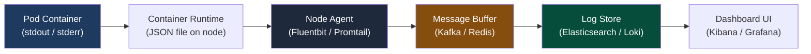

# Лекція 8: Системна спостережуваність (Observability) & troubleshooting розподілених відмов

> **Декларація курсу.** Академічна доброчесність та авторство матеріалів — у [DISCLAIMER.md](./DISCLAIMER.md).

---

### Обов'язкове читання (Landmark Papers)
* **Sigelman, B. H. et al. (2010).** *Dapper, a Large-Scale Distributed Systems Tracing Infrastructure*. Google Technical Report. (Фундаментальна робота Google, що започаткувала сучасне розподілене трасування: OpenTelemetry, W3C Trace Context та Jaeger).
* **Majors, C., Fong-Jones, L., & Miranda, G. (2022).** *Observability Engineering: Achieving Production Excellence*. O'Reilly Media.
* **Фокусне запитання для аналізу:** Чому перехід від «середньої затримки» (Mean Latency) до перцентилів (P95, P99, P99.9) став головним інженерним зрушенням у моніторингу хмарних систем, і як знайти баланс між 100% збором телеметрії та «податком на спостережуваність» (Observability Tax), який може з'їдати до 30% мережевого каналу та процесорного часу?

---

## Питання для розминки

<details markdown="1">
<summary><b>1. Чому веб-сервіс із чудовою середньою затримкою (Mean) у 20 мс може одночасно змушувати кожного десятого клієнта чекати відповіді понад 3 секунди?</b></summary>

Тому що розподіл затримок у мережевих системах підпорядковується не закону Гаусса (дзвоноподібній кривій), а має **важкий хвіст (Long Tail)**. 

Одиничні важкі запити, паузи Garbage Collector, мережеві колізії чи очікування блокувань у базі даних розмиваються у загальному обсязі мільйонів швидких запитів. Середнє арифметичне ховає катастрофу: єдиний адекватний спосіб оцінки користувацького досвіду — це перцентилі **P95, P99 та P99.9**.
</details>

<details markdown="1">
<summary><b>2. Якщо Pod у Kubernetes перейшов у стан CrashLoopBackOff, чому команда kubectl logs &lt;pod&gt; часто повертає абсолютно порожній вивід?</b></summary>

Тому що за замовчуванням `kubectl logs` читає вивід **поточного запущеного контейнера**, який міг щойно рестартнути і ще не встиг написати жодного рядка. 

Щоб побачити логи аварійно завершеного попереднього екземпляра (який і впав), необхідно виконати команду з прапорцем попереднього запуску:
`kubectl logs <pod> --previous`
</details>

---

## Архітектурний кейс: «Таємнича деградація P99» під час розпродажу

О 14:00 під час великої акції ключовий сервіс оформлення замовлень почав періодично зависати. Моніторинг процесора показував 35% CPU, пам'ять була в нормі, середня затримка (Mean) становила пристойні 45 мс.

Проте затримка **P99 підскочила до 14 секунд**! Користувачі з великими кошиками не могли завершити оплату.

```
 ┌─────────────────────────────────────────────────────────────┐
 АНАТОМІЯ КРИЗИ: РОЗПОДІЛЕНА ПАСТКА МІКРОСЕРВІСІВ               │
 ├─────────────────────────────────────────────────────────────┤
 │ • 100 мікросервісів пишуть звичайні логи в розрізнені файли│
 │ • У логах немає наскрізного trace_id                        │
 │ • Інженери 2 години вручну зіставляють таймстемпи логів    │
 │ • РЕАЛЬНА ПРИЧИНА: другорядний сервіс розрахунку бонусів    │
 │   викликав сторонній API платіжки, який зависав на таймауті │
 │   в 15 секунд, блокуючи весь спільний HTTP Connection Pool │
 └─────────────────────────────────────────────────────────────┘
```

**Висновок:** Без наскрізного розподіленого трасування (Distributed Tracing) діагностика ланцюгових затримок у мікросервісній системі перетворюється на нескінченне ворожіння.

---

## 1. Три стовпи спостережуваності (The Three Pillars)

Спостережуваність (**Observability**) — це здатність зрозуміти внутрішній стан складної системи виключно на основі аналізу її зовнішніх вихідних сигналів.

```
                  ТРИ СТОВПИ СПОСТЕРЕЖУВАНОСТІ
     ┌──────────────────┬──────────────────┬──────────────────┐
     │     METRICS      │       LOGS       │      TRACES      │
     │   (Prometheus)   │  (Elastic/Loki)  │  (Jaeger/Tempo)  │
     ├──────────────────┼──────────────────┼──────────────────┤
     │ Числові ряди в   │ Текстові записи  │ Граф проходження │
     │ часі (Агрегація) │ конкретних подій │ запиту крізь     │
     │                  │ (JSON Context)   │ мікросервіси     │
     ├──────────────────┼──────────────────┼──────────────────┤
     │ «Щось зламалося» │ «Чому саме воно  │ «Де саме виникла │
     │ (Швидкий алерт)  │ зламалося»       │ затримка/обрив»  │
     └──────────────────┴──────────────────┴──────────────────┘
```

1. **Метрики (Metrics):**
   * Числові значення, оптимізовані для агрегації та збереження в Time-Series DB.
   * Типи: **Counter** (лічильник помилок, тільки росте), **Gauge** (температура CPU, пам'ять), **Histogram** (розподіл часу запитів по кошиках/buckets).
   * **Перевага:** Дешевизна збереження; ідеально для формування дашбордів і автоматичних тригерів сповіщень (Alertmanager).
   * **Катастрофа високої кардинальності (Cardinality Explosion):**
     * *Системна сутність:* Кожна унікальна комбінація міток (Labels) породжує новий часовий ряд (Time Series) у пам'яті. Якщо розробник запише в мітку динамічний параметр (`user_id`, `trace_id` чи сирий запит `http_requests_total{user_id="12345"}`), Prometheus згенерує мільйони унікальних рядів. Це призводить до вичерпання RAM і падіння сервера моніторингу через OOM за лічені хвилини.
     * *Архітектурне правило:* Метрики повинні мати лише низьку, фіксовану кардинальність (`http_status`, `method`, `environment`). Усі висококардинальні ID зберігаються виключно в **структурованих логах або спанах трасування**, оптимізованих для індексації тексту.
2. **Логи (Logs):**
   * Деталізований текстовий запис конкретної події з таймстепом.
   * **Проблема Plain-Text:** Текстовий рядок `User 42 failed to pay` неможливо фільтрувати.
   * **Стандарт:** **Структуровані JSON-логи** із метаданими (`trace_id`, `user_id`, `http_status`).
3. **Трасування (Distributed Traces):**
   * Єдиний інструмент, що зв'язує докупи клік у браузері з викликами 20 бекенд-сервісів, запитами до бази даних та повідомленнями в Kafka.

---

## 2. Математика затримки: Чому середнє арифметичне бреше

Розподіл затримок у хмарних додатках ніколи не є симетричним. Він має довгий шлейф аномалій (**Long Tail Latency**):

```
Кількість
запитів
  │       P50 (Медіана: 15 мс)
  │        ▼
  │      ┌───┐
  │     ┌┘   └┐
  │    ┌┘     └┐           P95 (120 мс)     P99 (2.5 секунди!)
  │   ┌┘       └──┐             ▼                ▼
  └───┴───────────┴─────────────┴────────────────┴────────────► Час (ms)
```

### Перцентилі (Quantiles):
* **P50 (Медіана):** 50% запитів обробляються швидше за це значення. Показує типовий досвід у тепличних умовах.
* **P95 / P99:** 95% чи 99% запитів швидші за це значення. Показує досвід користувачів під час пікових навантажень або збігів мережевих затримок.
* **P99.9 (Три дев'ятки):** Досвід одного з тисячі клієнтів. Зазвичай це клієнти з найбільшими замовленнями, складними профілями або найвищою бізнес-цінністю.

### Прокляття мікросервісного ланцюжка:
Уявіть, що для формування однієї веб-сторінки бекенд робить паралельні виклики до **$N = 50$ мікросервісів**, кожен із яких має ймовірність деградації $P99 = 1\% (0.01)$:

$$P(\text{хоча б один сервіс дасть затримку P99}) = 1 - (1 - 0.01)^{50} = 1 - (0.99)^{50} \approx \mathbf{39.5\%}$$

**Математичний парадокс:** Навіть якщо кожен окремий мікросервіс працює стабільно в 99% випадків, **майже 40% усіх кінцевих користувачів зіткнуться з гальмуванням системи**!

---

## 3. Анатомія розподіленого трасування (Distributed Tracing)

Розподілене трасування розбиває шлях запиту на ієрархічне дерево елементарних операцій:

```mermaid
gantt
    title Життєвий шлях запиту (Trace ID: 4bf92f...)
    dateFormat X
    axisFormat %s ms

    section API Gateway
    HTTP POST /order           :0, 100
    section Auth Service
    JWT Validation             :5, 25
    section Order Service
    Create Order Record        :30, 95
    section PostgreSQL
    INSERT INTO orders         :35, 60
    section Payment Service
    Charge Credit Card         :65, 90
```



### Ключові терміни:
1. **Trace (Трейс):** Повний шлях запиту крізь усі сервіси від старту до відповіді. Має єдиний глобальний `TraceID`.
2. **Span (Спан):** Окремий відрізок роботи всередині конкретного сервісу. Містить:
   * Назву операції (наприклад, `SELECT FROM users`).
   * Час початку та тривалість.
   * **Tags / Attributes:** Метадані (`http.status_code = 200`, `db.statement = ...`).
   * **Logs / Events:** Локальні події всередині спану (помилки, винятки).
3. **SpanContext:** Метадані, які передаються крізь мережу для збереження причинно-наслідкового зв'язку:
   * **W3C Trace Context:** Стандартизований HTTP-заголовок `traceparent`:
     `traceparent: 00-4bf92f3577b34da6a3ce929d0e0e4736-00f067aa0ba902b7-01`
   * **Baggage Items:** Довільні користувацькі мітки (наприклад, `tenant_id=enterprise_42`), які автоматично копіюються крізь усі спани графа викликів.

### Стратегії семплювання (Sampling Strategies):
Збір 100% трейсів у системі з 100 000 RPS заб'є мережу та переповнить диски гігабайтами телеметрії (**Telemetry Tax**). Тому застосовують семплювання:

* **Head-based Sampling:** Рішення приймається на вході в API Gateway (наприклад, випадкові 2% запитів).
  * *Мінус:* Рідкісні помилки, що сталися у глибині кластера на несемпльованих запитах, губляться назавжди.
* **Tail-based Sampling:** Трейси тимчасово буферизуються в пам'яті колектора (OpenTelemetry Collector). Рішення про збереження приймається **після завершення всього виклику**:
  * Якщо статус `HTTP 5xx` або затримка $> 2000$ мс $\to$ зберігаємо 100% трейсів.
  * Якщо успішний `HTTP 200` $\to$ зберігаємо лише 0.1%.

### Аномалія Clock Skew (Дрейф системних годинників):
У розподіленому кластері сервери ніколи не мають абсолютно синхронного часу навіть за наявності демона NTP (дрейф може складати кілька мілісекунд):
* **Системна сутність:** Якщо сервіс А (нода 1) надсилає RPC-виклик до сервісу Б (нода 2), дочірній спан із ноди 2 може передати до сховища позначку початку, яка є *ранішою* за час старту батьківського спану на ноді 1 (парадокс «негативної затримки» або виклику з майбутнього).
* **Рішення:** Сервери агрегації трейсів (Jaeger/Tempo) використовують математичні алгоритми коригування часу на основі мережевого RTT (Round-Trip Time), проте сувора синхронізація через NTP/PTP на хостах залишається фундаментом детермінізму спостережуваності.

---

## 4. Централізоване логування: Шлях від файлу до пошуку

Логування у розподілених системах кардинально відрізняється від традиційного `app.log`.



### Чому контейнери зобов'язані писати в stdout/stderr:
Згідно з принципами **12-Factor App**, застосунок у контейнері не повинен самостійно турбуватися про ротацію файлів чи відправку логів по мережі:
1. Застосунок пише структуровані логи в стандартний вивід `stdout`.
2. Демон `containerd` перехоплює потік і пише його у локальний файл на ноді (`/var/log/pods/...`).
3. Агент **Fluentbit** (розгорнутий як DaemonSet) читає файл, збагачує запис метаданими Kubernetes (назва пода, неймспейс, мітки) і батчами відправляє в централізоване сховище.

### Ефект «Noisy Neighbor» у логуванні & Write Backpressure:
У філософії 12-Factor App приховано серйозний ризик деградації продуктивності:
* **Системна сутність:** Виклик `print()` у Python або `log.info()` у Java під капотом виконує системний виклик ядра `write(1, ...)` до файлового дескриптора stdout. Якщо агент збору логів (Fluentbit/Promtail) не встигає відправляти дані або на ноді виникло дискове перевантаження (`DiskPressure`), буфер сокета чи FIFO-pipe `containerd` переповнюється.
* **Наслідок:** Системний виклик `write()` переходить у **синхронне блокування (Blocking State)**. Воркери Монте-Карло, замість паралельних обчислень, «висять» у простої ядра в очікуванні, поки ОС звільнить буфер виводу логів.
* **Архітектурне рішення:** У високопродуктивних системах логування має бути повністю **асинхронним і неблокуючим (Non-blocking Ring Buffer у пам'яті)**. Якщо черга переповнена, надлишкові логи дропаються, зберігаючи стабільний час відповіді бізнес-транзакцій.

---

## 5. Довідник траблшутингу Kubernetes: Анатомія статусів подів

Коли сервіс не працює, першим кроком є аналіз стану Pod через `kubectl describe pod <name>`:

| Статус у Kubernetes | Першопричина (Root Cause) | Алгоритм діагностики та виправлення |
| :--- | :--- | :--- |
| **ImagePullBackOff** | Kubelet не може завантажити образ контейнера | Перевірити друкарські помилки в тезі; перевірити наявність секрету авторизації `imagePullSecrets` для приватного Docker Registry. |
| **CrashLoopBackOff** | Процес усередині контейнера завершується аварійно (Exit Code != 0) | Запустити `kubectl logs <pod> --previous`. Перевірити змінні оточення, відсутні конфігураційні файли або падіння підключення до бази даних при старті. |
| **OOMKilled (Exit 137)** | Споживання RAM перевищило директиву `resources.limits.memory` | Перевірити `kubectl describe pod` (шукати статус `OOMKilled: true`). Збільшити memory limit або знайти витік пам'яті (Memory Leak) у коді. |
| **Pending** | Kube-Scheduler не може знайти ноду для розміщення пода | Запустити `kubectl describe pod` і дивитися блок `Events`. Зазвичай бракує вільних CPU/RAM на нодах під `requests`, або є конфлікт `NodeSelector`/`Taints`. |
| **Node NotReady** | Kubelet перестав відправляти серцебиття (heartbeats) Control Plane | Перевірити фізичну доступність ноди. Перевірити, чи не забитий диск (`DiskPressure`) або чи не завис PLEG через перевантаження сокета containerd. |

---

## 6. Практичний місток: Зв'язок із лабораторним курсом

Матеріали цієї лекції є прямою інструкцією до виконання **Етапу 5 (Chaos & FinOps)** нашого курсу:

* **Впровадження OpenTracing / W3C Headers у симулятор:**
  * Студенти модифікують воркери Монте-Карло, прокидаючи `traceparent` заголовок від API-шлюзу до обчислювальних потоків реактора та розрахунків ліній IEEE-118.
  * У **Jaeger UI** візуалізується повний граф: розбиття загального часу симуляції на генерацію випадкових чисел, розрахунок матриць та серіалізацію результатів.
* **Трасування крізь процесорну межу в Python (`multiprocessing.Pool`):**
  * *Системний бар'єр:* Для обходу GIL симулятор використовує процеси (`multiprocessing.Pool`). Бібліотеки OpenTelemetry за замовчуванням тримають `SpanContext` у контекстних змінних (`contextvars` / ThreadLocal). При виклику `Pool.map` нові процеси ОС створюються через `fork()`: пам'ять копіюється, проте зв'язок трасування втрачається автоматично.
  * *Рішення для лабораторного коду:* Функція воркера `simulate_trials_chunk` повинна приймати `traceparent` як явний строковий аргумент у кортежі `args`. Всередині воркера виконується ручне відновлення контексту:
    ```python
    from opentelemetry.trace.propagation.tracecontext import TraceContextTextMapPropagator

    # Ручна десеріалізація контексту в ізольованому процесі воркера
    context = TraceContextTextMapPropagator().extract(carrier={"traceparent": traceparent_str})
    ```
  * Тільки після цього спани, створені воркерами на ядрах CPU, відобразяться в Jaeger як дочірні вузли головного запиту від API Gateway.
* **Бенчмаркінг перцентилів у стрес-тестах:**
  * При ін'єкції збоїв (через **Toxiproxy** або генерацію високого I/O навантаження Noisy Neighbor) студенти фіксують не середній час розрахунку, а графіки **P50 vs P99 latency**.
  * Оцінюється ефект впливу «важкого хвоста» на загальну пропускну здатність (Throughput) кластера.

---

## 7. Зведена інженерна матриця компромісів

| Сигнал телеметрії | Головна перевага | Оверхед на CPU / RAM | Навантаження на диск і мережу | Для чого незамінний? |
| :--- | :--- | :--- | :--- | :--- |
| **Метрики (Metrics)** | Агрегація, висока швидкість | **Мінімальний (<1%)** | **Мінімальне** (кілька байт на семпл) | Сповіщення (Alerting), моніторинг трендів |
| **Структуровані логи (JSON)** | Повний текстовий контекст | Низький (2–5%) | **Високе** (терабайти на добу) | Розбір конкретних помилок та аудит |
| **Трасування (Distributed Tracing)** | Видимість зв'язків між сервісами | Середній (3–8%) | **Високе** (вимагає семплювання) | Пошук вузьких місць і розслідування P99 |
| **Continuous Profiling (eBPF)** | Аналіз стеку викликів коду в ядрі | Низький (1–2%) | Помірне | Пошук неоптимальних функцій та CPU/RAM спайків |

---

## Підсумок лекції

1. **Середнє арифметичне бреше:** Тільки аналіз перцентилів (**P95, P99, P99.9**) відображає реальний біль користувачів у розподілених системах із довгим хвостом затримок.
2. **Один повільний сервіс уповільнює всіх:** Через ефект ланцюжка з 50 мікросервісів клієнт зіткнеться з P99 затримкою у майже 40% випадків.
3. **W3C Trace Context об'єднує поліглотний стек:** Стандартизований заголовок `traceparent` дозволяє зв'язати кліки користувача у веб-браузері з фоновими нитками обчислювальних воркерів.
4. **Траблшутинг починається з describe:** Розуміння життєвого циклу контейнера та кодів завершення (Exit Code 137 OOM vs CrashLoopBackOff) усуває 90% паніки під час продакшн-інцидентів.

---

## Контрольні питання

<details markdown="1">
<summary><b>1. Чому використання Tail-based Sampling у великих системах вважається значно ефективнішим за Head-based Sampling?</b></summary>

При **Head-based Sampling** система обирає, чи записувати трейс, на самому початку (на рівні API Gateway), коли ще невідомо, чи завершиться запит успішно. Якщо ймовірність збою становить 0.01%, при 1% вибірці більшість критичних помилок ніколи не потрапить у моніторинг. 

**Tail-based Sampling** тимчасово тримає спани в оперативній пам'яті колектора до повного завершення ланцюжка викликів. Це дозволяє зберегти **100% усіх повільних запитів (P99) та запитів із помилками (HTTP 500)**, одночасно відкидаючи 99.9% одноманітних успішних викликів, мінімізуючи навантаження на сховище.
</details>

<details markdown="1">
<summary><b>2. Як відрізнити за системними метриками поступовий витік пам'яті (Memory Leak) від раптового короткочасного сплеску навантаження перед тим, як контейнер вб'є OOM-killer (Exit Code 137)?</b></summary>

При **Memory Leak** графік споживання пам'яті (`container_memory_working_set_bytes`) формує характерну монотонно зростаючу «пилкоподібну» криву (Sawtooth pattern), яка не повертається до базового рівня навіть у періоди нічного спаду активності користувачів. 

При **раптовому сплеску навантаження** лінія пам'яті є рівною і стабільною, після чого виникає практично вертикальний стрибок за кілька секунд, що корелює з одночасним зростанням лічильника вхідних запитів (`http_requests_total`).
</details>

<details markdown="1">
<summary><b>3. Що являють собою Baggage Items у стандарті OpenTelemetry / W3C і чому безконтрольне їх використання може призвести до деградації мережі?</b></summary>

**Baggage** — це пари ключ-значення (контекстні дані, наприклад `account_type=vip`), які прикріплюються до трейсу і автоматично прокидаються в HTTP/gRPC-заголовках крізь **усі наступні мікросервіси в ланцюжку**. 

Якщо розробники починають запихати в Baggage великі структури даних (наприклад, токени користувача, кошики товарів чи важкі контексти), розмір HTTP-заголовків зростає до десятків кілобайтів. Оскільки ці заголовки передаються на кожному міжсервісному виклику, мережевий оверхед мультиплікується, викликаючи падіння пропускної здатності та помилки переповнення буферів серверів (`HTTP 431 Request Header Fields Too Large`).
</details>

<details markdown="1">
<summary><b>4. Чому при виникненні CrashLoopBackOff перевірка коду повернення процесу (Exit Code) є найшвидшим способом визначити напрям пошуку проблеми?</b></summary>

Тому що Exit Code чітко розмежовує апаратні, системні та прикладні помилки:
* **Exit Code 0:** Процес успішно завершив роботу (контейнер був створений як Job замість Deployment, або завершився через відсутність foreground-процесу).
* **Exit Code 1 / 2:** Помилка в прикладному коді (неперехоплений Exception, синтаксична помилка, падіння скрипту ініціалізації).
* **Exit Code 137 ($128 + 9$):** Процес вбито сигналом SIGKILL через вичерпання ліміту пам'яті (**OOMKilled**).
* **Exit Code 143 ($128 + 15$):** Процес штатно прибито сигналом SIGTERM від Kubelet під час виселення чи деплою.
* **Exit Code 139 ($128 + 11$):** Помилка сегментації пам'яті (**Segmentation Fault** у бінарному C/C++ коді).
</details>
