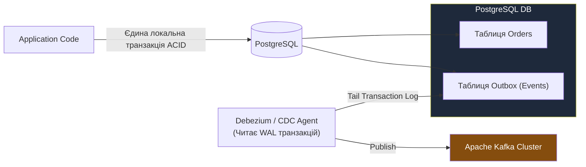
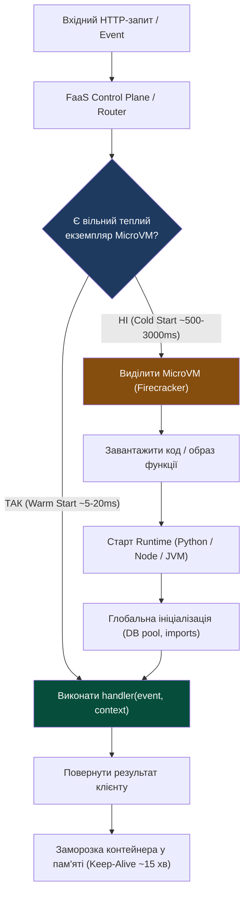

# Лекція 9: Безстановість (Stateless), Event-Driven Architecture & Serverless (FaaS)

> **Декларація курсу.** Академічна доброчесність та авторство матеріалів — у [DISCLAIMER.md](./DISCLAIMER.md).

---

### Обов'язкове читання (Landmark Papers)
* **Kreps, J., Narkhede, N., & Rao, J. (2011).** *Kafka: a Distributed Messaging System for Log Processing*. NetDB '11. (Фундаментальна стаття інженерів LinkedIn, що ввела концепцію розподіленого розподіленого незмінного логу подій як серця архітектури даних).
* **Agache, A. et al. (2020).** *Firecracker: Lightweight Virtualization for Serverless Applications*. USENIX NSDI '20. (Дослідження інженерів AWS про створення Rust-орієнтованого VMM Firecracker для безпечного та блискавичного FaaS).
* **Фокусне запитання для аналізу:** Чому прагнення до «Exactly-Once Delivery» на рівні мережевого транспорту є математично неможливим згідно з парадоксом двох генералів, і як сучасна індустрія перенесла розв'язання цієї проблеми з мережевих протоколів на рівень бізнес-логіки (Ідемпотентність + Outbox Pattern)?

---

## Питання для розминки

<details markdown="1">
<summary><b>1. Чому збереження HTTP-сесії користувача в оперативній пам'яті (In-Memory Session) веб-сервера повністю руйнує хмарне горизонтальне масштабування?</b></summary>

Тому що це робить екземпляр сервера **становим (Stateful)**.

Балансувальник навантаження змушений використовувати неефективний механізм **Sticky Sessions** (прив'язка користувача до конкретної ноди за IP або cookie). Якщо нода впаде або Kubernetes приб'є її для автомасштабування (Scale Down), усі сесії користувачів миттєво зникнуть, змушуючи їх логінитися наново. 

Хмарний стандарт — це **Stateless**: сервери не тримають стану, а сесії зберігаються у зовнішньому розподіленому сховищі (Redis) або передаються клієнтом у криптографічному токені (JWT).
</details>

<details markdown="1">
<summary><b>2. Якщо функція в AWS Lambda виконує розрахунок усього за 15 мілісекунд, чому перший запит користувача з мобільного додатку іноді зависає на 3.5 секунди?</b></summary>

Через феномен **холодного старту (Cold Start)**.

Коли функція викликається вперше або після періоду повного простою (Scale-to-Zero), хмарний провайдер повинен з нуля:
1. Виділити фізичний слот та ініціалізувати легковажну віртуальну машину (MicroVM Firecracker).
2. Завантажити образ або ZIP-архів функції з Amazon S3.
3. Запустити середовище виконання (Node.js, Python або важку JVM).
4. Виконати глобальну ініціалізацію коду (підключення до БД, завантаження бібліотек).

Тільки після цього стартує виконання власне 15-мілісекундного хендлера.
</details>

---

## Архітектурний кейс: «Подвійне списання $10 000 000 у Чорну П'ятницю»

Під час розпродажу сервіс оформлення замовлень відправив HTTP POST запит до банківського платіжного шлюзу на суму $100. 

Через сплеск трафіку мережевий пакет відповіді від банку затримався на 5.1 секунди. Тайм-аут клієнта у сервісі замовлень був налаштований рівно на 5.0 секунд.

```
  Сервіс замовлень                            Банківський шлюз
         │                                            │
         │──── HTTP POST /charge ($100) ─────────────►│ (Гроші списано!)
         │                                            │
         │     [Тайм-аут 5.0с спрацював!]             │
         │     «Помилка мережі! Роблю Retry...»        │
         │                                            │
         │──── HTTP POST /charge ($100) [Retry] ─────►│ (ЩЕ РАЗ СПИСАНО!)
         │                                            │
         │◄─── HTTP 200 OK (за перший запит) ─────────┤ (Прийшов запізнілий пакет)
         │◄─── HTTP 200 OK (за другий запит) ─────────┤
```

### Наслідки:
* Сервіс замовлень автоматично повторив запит (**Retry**).
* Банківський шлюз не мав перевірки ідемпотентності й успішно виконав транзакцію **двічі**.
* За одну годину пікового навантаження 100 000 клієнтів зазнали подвійного списання коштів на загальну суму понад 10 мільйонів доларів.

**Висновок:** У розподілених мережах не існує надійного способу дізнатися, чи впав віддалений сервер, чи просто загубилася відповідь. Будь-який повтор запиту без унікального **ключа ідемпотентності (Idempotency Key)** гарантовано призведе до катастрофічного дублювання даних.

---

## 1. Філософія безстановості (Stateless vs Stateful)

Фундаментальний принцип хмарної еластичності сформульовано у методології **12-Factor App (Factor VI: Processes)**:
> *«Процеси застосунку повинні бути повністю безстановими та розділяти ресурси за моделлю Share-Nothing».*

```
       STATEFUL (Антипатерн для Web)                 STATELESS (Хмарний стандарт)
   ┌───────────────────────────────────┐        ┌───────────────────────────────────┐
   │ App Instance A   App Instance B   │        │ App Instance A   App Instance B   │
   │ ┌──────────────┐ ┌──────────────┐ │        │ ┌──────────────┐ ┌──────────────┐ │
   │ │Session Memory│ │Session Memory│ │        │ │   Без стану  │ │   Без стану  │ │
   │ └──────────────┘ └──────────────┘ │        │ └──────┬───────┘ └──────┬───────┘ │
   │         ▲              ▲          │        └────────┼────────────────┼─────────┘
   │         │ Sticky       │ Sticky   │                 ▼                ▼
   │      Client 1       Client 2      │        ┌───────────────────────────────────┐
   │                                   │        │  External State Store (Redis / S3)│
   └───────────────────────────────────┘        └───────────────────────────────────┘
```

### Чому Stateful вбиває хмару:
1. **Неможливість швидкого Auto-scaling:** Не можна миттєво знищити 10 екземплярів при падінні навантаження, якщо на них відкриті локальні сокети чи пам'ять сесій.
2. **Нерівномірний розподіл трафіку:** Клієнти прив'язуються до «своїх» серверів. Якщо один клієнт починає генерувати 90% навантаження, відповідна нода згорає, тоді як інші простоюють.
3. **Катастрофічний blast radius:** Падіння контейнера знищує всі дані, накопичені в його пам'яті.

### Патерн Externalized State:
У безстановому застосунку будь-який вхідний запит може бути успішно оброблений **абсолютно будь-яким екземпляром сервісу**. 

Весь стан системи виноситься у спеціалізовані зовнішні системи:
* **Ефемерний стан (Сесії, кеш):** Розподілена In-Memory база даних (**Redis Cluster**).
* **Постійний стан (Транзакційні дані):** Реляційні або NoSQL СУБД (**PostgreSQL, DynamoDB**).
* **Незмінні артефакти (Файли, звіти):** Об'єктне сховище (**AWS S3, MinIO**).

---

## 2. Семантики доставки подій (Delivery Guarantees)

Коли сервіси спілкуються через асинхронні події, критично важливо розуміти контракт доставки брокера:

```
               СПЕКТР ГАРАНТІЙ ДОСТАВКИ В РОЗПОДІЛЕНИХ МЕРЕЖАХ
    ┌──────────────────────┬──────────────────────┬──────────────────────┐
    │     AT-MOST-ONCE     │    AT-LEAST-ONCE     │   «EXACTLY-ONCE»     │
    │ (Щонайбільше один)   │  (Щонайменше один)   │    (Рівно один)      │
    ├──────────────────────┼──────────────────────┼──────────────────────┤
    │ Відправив і забув    │ Обов'язковий ACK     │ Математичний міф на  │
    │ (Fire-and-forget)    │ з повторами (Retry)  │ рівні транспорту     │
    ├──────────────────────┼──────────────────────┼──────────────────────┤
    │ Втрата: МОЖЛИВА      │ Втрата: НЕДОПУСТИМА  │ Досягається ТІЛЬКИ   │
    │ Дублікати: НІ        │ Дублікати: НЕМИНУЧІ  │ через ІДЕМПОТЕНТНІСТЬ│
    └──────────────────────┴──────────────────────┴──────────────────────┘
```

### 1. At-most-once (Щонайбільше один раз)
* Продюсер відправляє повідомлення і не чекає підтвердження. Або консюмер фіксує прочитання (Commit Offset) **до** того, як фактично обробив бізнес-логіку.
* **Результат:** Повідомлення ніколи не дублюються, але легко губляться при мережевих збоях чи аварії процесу.
* **Застосування:** Метрики телеметрії, логи, GPS-трекінг авто (якщо один координатний пакет втрачено — наступний за секунду його перекриє).

### 2. At-least-once (Щонайменше один раз) — Індустріальний стандарт
* Продюсер повторює відправку до отримання підтвердження (ACK). Консюмер комітить оффсет **тільки після** успішного збереження результату в БД.
* **Результат:** Жодне повідомлення не загубиться, але **дублікати гарантовано виникнуть** (наприклад, якщо база записала дані, але мережа обірвалася до відправки ACK продюсеру).

### 3. «Exactly-once» та патерн Ідемпотентності
Згідно з **теоремою про двох генералів (Two Generals' Problem)**, гарантувати рівно одну доставку по ненадійному каналу зв'язку математично неможливо.

Сучасні системи вирішують це формулою:
$$\text{Exactly-Once Semantics} = \text{At-Least-Once Transport} + \text{Idempotent Consumer}$$

```
                          ПАТЕРН ІДЕМПОТЕНТНОГО СПОЖИВАЧА
                                 (Deduplication Table)
                                          │
                                 Повідомлення з брокера
                                 (Idempotency-Key: "tx_991")
                                          │
                                          ▼
                                ┌───────────────────┐
                                │ Перевірити ключ   │
                                │ у таблиці processed_keys
                                └─────────┬─────────┘
                                          │
                         ┌────────────────┴────────────────┐
                         ▼ Існує?                          ▼ Не існує?
                 [ДУБЛІКАТ!]                     [НОВА ОПЕРАЦІЯ]
                 • Ігнорувати виконання          • Виконати списання грошей
                 • Повернути успішний ACK        • Записати ключ в processed_keys
                                                 • Відправити ACK брокеру
```

### Керування пам'яттю таблиць ідемпотентності (TTL & Eviction):
Зберігати всі унікальні ключі ідемпотентності в Redis назавжди неможливо — це призведе до вичерпання RAM (**RAM Exhaustion**):
* **Час життя ключа (TTL):** Для кожного `Idempotency-Key` встановлюється суворий TTL, що дорівнює **максимальному вікну повторів клієнтів** (зазвичай 24–48 годин). Після цього клієнтський retry вважається недійсним і відхиляється.
* **Політика витіснення (Eviction Policy):** У конфігурації Redis обов'язково встановлюється `maxmemory-policy volatile-lru` (витісняються лише ключі з простроченим або найстарішим TTL) або `noeviction` (повертати помилку при переповненні RAM). Категорично заборонено використовувати `allkeys-lru`: інакше Redis може непомітно витіснити свіжий ключ ідемпотентності, відкривши шлюз для подвійного списання!

### Уточнення: Exactly-Once у Apache Kafka (Транзакційні продюсери)
Починаючи з версії 0.11, Apache Kafka підтримує **Exactly-Once Semantics (EOS)** усередині власного контуру:
* **Механізм:** Використовує транзакційний координатор, двофазний комміт (2PC) між партиціями та системний топік `__transaction_state` для атомарного зв'язку «читання з вхідного топіка $\to$ запис у вихідний топік $\to$ комміт оффсету».
* **Межа застосовності:** EOS у Kafka працює **виключно за моделлю Kafka-to-Kafka**! Якщо під час обробки повідомлення воркер робить зовнішній виклик (HTTP POST до банку або надсилання email), транзакційний менеджер Kafka не може відкотити зовнішній світ при збої. Тому **ідемпотентність споживача залишається абсолютно обов'язковою**.

### Патерн Transactional Outbox:
Як надійно зберегти стан у базі даних і гарантовано відправити подію в брокер без ризику розриву транзакції (Dual-Write Problem)?



Замість прямого запису в чергу, застосунок записує подію в спеціальну таблицю `outbox` у тій самій транзакції, що й бізнес-сутності. Окремий процес (**Debezium CDC**) читає журнал транзакцій бази (WAL) і надійно публікує події в Kafka.

### Пастка Outbox Replication Lag (Затримка реплікації проекцій):
Оскільки CDC-агент вичитує WAL та пересилає події в Kafka асинхронно, виникає часова затримка (**Outbox Lag**):
* **Проблема невідповідності читання:** Клієнт створює замовлення (`POST /orders`). Запис успішно потрапляє в PostgreSQL та таблицю `outbox`. Але якщо клієнтський фронтенд наступної ж мілісекунди виконує `GET /orders` до мікросервісу пошуку/проекцій (CQRS Read Model), Debezium ще може не встигнути доставити подію в Kafka. Клієнт бачить порожній екран (**Eventual Consistency**) і вважає, що сталася помилка.
* **Архітектурні патерни компенсації:**
  1. **Оптимістичне оновлення інтерфейсу (Optimistic UI):** Фронтенд негайно домальовує створений об'єкт локально, не чекаючи відповіді від Read Model.
  2. **Read-Your-Own-Writes гарантія:** Після мутації наступне швидке читання робиться напряму з транзакційної Master-БД, або клієнту повертається версія/ETag, за якою Read Model очікує підтягування реплікації перед поверненням результату.

---

## 3. Брокери повідомлень: Log-based (Kafka) vs Queue-based (RabbitMQ)

Два діаметрально протилежні підходи до архітектури брокерів:

| Критерій | Queue-Based: **RabbitMQ** | Log-Based: **Apache Kafka** |
| :--- | :--- | :--- |
| **Архітектурна модель** | «Smart Broker, Dumb Consumer» | «Dumb Broker, Smart Consumer» |
| **Збереження повідомлень** | **Ефемерне:** повідомлення видаляється відразу після отримання ACK | **Незмінний лог (Append-only):** повідомлення зберігаються днями/місяцями |
| **Модель читання** | **Push:** брокер сам проштовхує повідомлення в консюмери | **Pull:** консюмери самі запитують батчі даних на своїй швидкості |
| **Порядок (Ordering)** | Гарантується тільки для одного консюмера в простій черзі | Строго гарантується **всередині кожної партиції (Partition)** |
| **Replay (Перепрослуховування)** | **Неможливий:** прочитані дані зникають | **Штатна операція:** зміна оффсету назад відтворює історію подій |
| **Пропускна здатність** | Десятки тисяч повідомлень/сек | **Мільйони подій/сек** за рахунок батчингу та Zero-Copy OS read |
| **Ідеальний Use-Case** | Складний роутинг завдань (AMQP), фонові важкі воркери | Потокова обробка подій, аналітика, Event Sourcing |

```
        RABBITMQ (Queue-Based)                      APACHE KAFKA (Log-Based)
     ┌─────────────────────────────┐           ┌───────────────────────────────────┐
     │ Producer                    │           │ Producer (Key: User_42)           │
     │      │                      │           │      │                            │
     │      ▼                      │           │      ▼                            │
     │  [Exchange] ──Routing Key── │           │  [Partition 0] [0][1][2][3][4]... │
     │      │                      │           │                                   │
     │      ▼                      │           │  Consumer A (Offset: 2) ──► [2]   │
     │  [Queue] ──Push──► Worker   │           │  Consumer B (Offset: 4) ──► [4]   │
     │  (Повідомлення видаляється) │           │  (Події зберігаються назавжди)    │
     └─────────────────────────────┘           └───────────────────────────────────┘
```

### Механіка Kafka Partitions & Consumer Groups:
1. **Топік розбивається на партиції (Partitions):** Це одиниця паралелізму.
2. **Ключ партиціонування (Message Key):** Повідомлення з однаковим ключем (наприклад, `reactor_id=3`) **завжди потрапляють в одну й ту саму партицію**.
3. **Consumer Group:** Кожна партиція читається **лише одним консюмером** із групи в кожен момент часу. Це усуває стан гонки (Race Condition) і гарантує суворий порядок обробки без блокувань.

---

## 4. Архітектура Serverless & FaaS (Function-as-a-Service)

**Serverless** — це модель хмарних обчислень, у якій розробник пише виключно атомарні бізнес-функції, а провайдер бере на себе 100% турбот про виділення серверів, патчинг ОС, маршрутизацію та масштабування.

### Парадигма Scale-to-Zero:
У класичній архітектурі (EC2 або K8s) ви платите за зарезервовану пам'ять і процесори **24/7**, навіть якщо вночі на сайт ніхто не заходить.

У моделі FaaS (AWS Lambda, Google Cloud Functions):
* Якщо запитів немає — активних процесів **0**, і вартість інфраструктури становить **$0.00**.
* При раптовому напливі 10 000 клієнтів платформа миттєво піднімає паралельні інстанси.
* Оплата нараховується за точні **мілісекунди роботи пам'яті (Gigabyte-Seconds)**.



### Технологічний прорив: AWS Firecracker MicroVM
Чому AWS відмовилася від запуску Lambda у традиційних Docker-контейнерах на користь MicroVM?
* **Проблема безпеки (Multi-Tenancy):** Контейнери ділять одне ядро Linux. У публічній хмарі вразливість нульового дня в ядрі дозволила б шкідливому коду одного клієнта прочитати пам'ять іншого.
* **Проблема традиційних VM (QEMU):** Повноцінна віртуальна машина важить сотні мегабайт і стартує десятки секунд.
* **Рішення — Firecracker:**
  * Написаний на **Rust** мікрогіпервізор на базі Linux KVM.
  * Викидає всю зайву емуляцію заліза (немає шини PCI, відеокарт, контролерів IDE).
  * **Холодний запуск: менше 5 мілісекунд!**
  * Споживання пам'яті: менше **5 МБ RAM** на віртуальну машину.
  * Дозволяє розміщувати тисячі ізольованих клієнтських функцій на одному фізичному сервері з ізоляцією рівня апаратного гіпервізора (Type-1 style hardware protection).

---

## 5. Анатомія Cold Start: як інженери борються за мілісекунди

Затримка холодного старту (Cold Start) — головний ворог інтерактивних API у безсерверній архітектурі.

### З чого складається Cold Start:
1. **Виділення слота MicroVM:** ~5–30 мс (завдяки Firecracker майже непомітно).
2. **Завантаження артефакту коду:** залежить від розміру бандла. Образ у 500 МБ вантажиться 2 секунди; ZIP-архів у 5 МБ — 50 мс.
3. **Старт мовного runtime:**
   * Go / Rust (Native binary): **~10–20 мс**
   * Node.js / Python: **~50–150 мс**
   * Java / .NET (JVM JIT-компіляція): **~800–3000 мс** (Найважчий старт)
4. **Виконання глобального контексту (User Init Code):** Імпорт великих важких бібліотек (`import torch`, `import pandas`), відкриття TCP-з'єднань до бази.

### Стратегії ліквідації Cold Start у продакшні:
1. **Provisioned Concurrency:** Хмара тримає постійно «підігрітими» $N$ екземплярів функцій у пам'яті (усуває холодний старт, але скасовує безкоштовний Scale-to-Zero).
2. **Мінімізація залежностей (Bundle Tree-Shaking):** Видалення непотрібних бібліотек, перехід від монструозних SDK до легких спеціалізованих HTTP-викликів.
3. **Винесення клієнтів за межі Handler:**
   ```python
   # ПРАВИЛЬНО: клієнт ініціалізується один раз при Cold Start
   # і перевикористовується між теплими викликами
   import redis
   redis_client = redis.Redis(host="redis-cluster", socket_timeout=1)

   def lambda_handler(event, context):
       # Цей код виконується миттєво під час теплого старту
       val = redis_client.get(event["user_id"])
       return {"status": 200, "data": val}
   ```
4. **Адаптація компільованих середовищ:** Використання **GraalVM Native Image** для Java, що компілює байткод у машинний бінарник AOT (Ahead-of-Time), знижуючи час старту JVM з 3 секунд до 15 мс.

---

## 6. Практичний місток: Зв'язок із чисельним симулятором курсу

Архітектурні патерни Лекції 9 безпосередньо трансформують наш навчальний розрахунковий комплекс на фінальних етапах:

* **Декомпозиція симулятора на безстанові воркери (Task-Based FaaS):**
  * Головний API-сервіс приймає запит студента на симуляцію енергомережі **PowerGraph (IEEE-118)** на 100 000 випробувань.
  * Замість локального блокування процесу, API розбиває задачу на 100 незалежних чанків по 1000 випробувань і публікує події в чергу (**RabbitMQ / Kafka**).
  * Пул ефемерних безстанових воркерів розбирає повідомлення, виконує обчислення паралельно на сотнях ядер і скидає підсумкові матриці в спільний об'єктний стор (S3/MinIO).
* **Ідемпотентність чисельного розрахунку:**
  * Якщо під час симуляції 42-го чанку воркер раптово вбивається ядром ОС, брокер перевиставляє повідомлення іншому воркеру (**At-least-once**).
  * Завдяки фіксації зерна генератора випадкових чисел (**Pseudo-random Seed**) та унікального ID чанку, повторний розрахунок повертає ідентичний результат без викривлення математичного розподілу Монте-Карло.

---

## 7. Зведена інженерна матриця архітектурних стилів

| Архітектурний підхід | Керування інфраструктурою | Модель масштабування | Вартість під час простою | Затримка першого відгуку | Де найкраще застосовувати? |
| :--- | :--- | :--- | :--- | :--- | :--- |
| **Stateful Monolith (VM)** | Ручне / Конфігураційне (Ansible) | Вертикальне (більша VM) | **100% (Постійна плата за залізо)** | Мінімальна (усе прогріто в пам'яті) | Legacy-системи, низьконавантажені внутрішні утиліти |
| **Stateless Containers (K8s)** | Декларативне (YAML, Horizontal Pod Autoscaler) | Горизонтальне за метриками CPU/RAM (хвилини) | Висока (мінімальний резерв нод кластера) | Низька (поди вже запущені) | Високонавантажені API, постійний передбачуваний трафік |
| **Event-Driven (Kafka / AMQP)** | Оркестрація брокера + воркерів | За довжиною черги або лагом партицій (KEDA) | Помірна (плата за кластер брокера) | Асинхронна (відкладена обробка) | Фінансові транзакції, обробка потоків телеметрії, ETL |
| **Serverless FaaS (Lambda)** | **Повністю відсутнє (NoOps)** | **Автоматичне, вибухове (Scale-to-Zero за секунди)** | **$0.00 (Нуль витрат у простої)** | Варіативна (**Cold Start оверхед**) | Спайковий трафік, вебхуки, фонові обчислювальні задачі |

---

## Підсумок лекції

1. **Безстановість — перепустка у хмару:** Винесення сесій та даних у Redis і S3 дозволяє знищувати та створювати сотні контейнерів щохвилини без шкоди для користувачів.
2. **Мережевий Exactly-Once — небезпечна ілюзія:** Надійні системи будуються на базі гарантії **At-least-once** у зв'язці з суворою **ідемпотентністю споживачів** (Idempotency Key / Outbox Pattern).
3. **Kafka зберігає історію, RabbitMQ координує завдання:** Вибирайте log-based Kafka для реплею та мільйонних потоків подій; використовуйте queue-based RabbitMQ для складної маршрутизації незалежних робіт.
4. **FaaS перемагає в економіці простою:** Завдяки технологіям на зразок AWS Firecracker MicroVM безсерверні обчислення забезпечують ізоляцію заліза та нульову вартість без навантаження, вимагаючи натомість боротьби з Cold Start.

---

## Контрольні питання

<details markdown="1">
<summary><b>1. Чому за теоремою про двох генералів (Two Generals' Problem) неможливо гарантувати доставку «рівно один раз» виключно засобами мережевого транспорту?</b></summary>

Тому що будь-який протокол підтвердження (ACK) сам по собі є мережевим повідомленням, яке може бути втрачене. 

Якщо відправник не отримав ACK, він не може розрізнити два стани:
1. Запит не дійшов до сервера (операція не виконана).
2. Запит успішно виконано, але загубився сам пакет із підтвердженням ACK.

Щоб запобігти втраті даних, відправник змушений повторити спробу (Retry), що автоматично перетворює гарантію на **At-Least-Once** і створює ризик дублювання. Єдиний спосіб розв'язати проблему — забезпечити ідемпотентність на боці приймача.
</details>

<details markdown="1">
<summary><b>2. Чому в Apache Kafka суворий порядок повідомлень гарантується лише в межах однієї партиції (Partition), а не для всього топіка загалом?</b></summary>

Тому що топік у Kafka — це логічна абстракція, фізично розділена на кілька незалежних файлів логів (партицій), які можуть зберігатися на **різних фізичних серверах (брокерах)** і читатися паралельно різними воркерами.

Спроба забезпечити глобальний порядок між різними серверами вимагала б централізованого розподіленого блокування (Distributed Lock) на кожен запис, що миттєво знищило б головну перевагу Kafka — горизонтальне масштабування та пропускну здатність у мільйони операцій на секунду. 

Тому розробник обирає бізнес-ключ (наприклад, `user_id` чи `order_id`), хеш від якого спрямовує всі події конкретної сутності в одну й ту саму партицію.
</details>

<details markdown="1">
<summary><b>3. Яку проблему вирішує патерн Transactional Outbox і чому наївний підхід «спочатку записати в БД, а потім відправити в Kafka» є небезпечним антипатерном?</b></summary>

Наївний підхід страждає від проблеми **подвійного запису (Dual-Write Problem)**: неможливо атомарно зафіксувати транзакцію в базі даних і відправити повідомлення в чергу без важкого двофазного комміту (2PC), який різко знижує доступність системи:
* Якщо спочатку записати в БД, а при виклику `kafka.send()` впаде мережа — подія загубиться, і зовнішні сервіси ніколи про неї не дізнаються.
* Якщо спочатку відправити в Kafka, а транзакція в БД відкотиться через конфлікт констрейнтів — система опублікує фантомну подію про операцію, якої насправді не відбулося.

**Transactional Outbox** вирішує це елегантно: повідомлення записується у спеціальну таблицю `outbox` **у тій самій локальній ACID-транзакції бази даних**, що й основні сутності. Спеціальний фоновий агент (Debezium через читання бінарного журналу WAL) гарантовано вичитує ці записи й доставляє їх у брокер без жодного ризику розсинхронізації.
</details>

<details markdown="1">
<summary><b>4. Завдяки яким архітектурним рішенням MicroVM AWS Firecracker забезпечує час холодного старту менше ніж 5 мілісекунд, порівняно з традиційними віртуальними машинами QEMU?</b></summary>

1. **Мінімалістичний VMM на Rust:** Firecracker викинув понад 95% коду емуляції заліза QEMU. У ньому немає емуляції застарілих шин PCI, флоппі-дисководів, контролерів ACPI, USB чи графічних прискорювачів.
2. **Тільки віртуальні пристрої VirtIO:** Доступні лише базові мережеві адаптери (`virtio-net`), блокові диски (`virtio-block`), таймер та мінімальний послідовний порт для консолі.
3. **Пряме завантаження ядра Linux:** Firecracker не виконує повільний код BIOS або UEFI. Він завантажує попередньо скомпільоване нестиснене ядро Linux безпосередньо у виділену віртуальну пам'ять і миттєво передає керування точці входу ядра.
4. **Використання KVM ядра:** Віртуалізація виконується напряму апаратними інструкціями процесора (Intel VT-x / AMD-V) з мінімальним оверхедом у користувацькому просторі.
</details>
