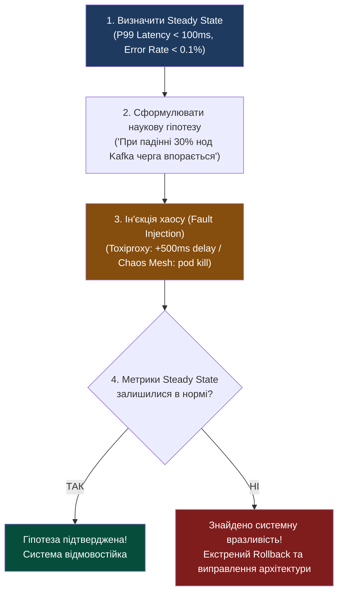

# Лекція 10: FinOps, Resilience Engineering (Chaos) & підсумковий архітектурний синтез

> **Декларація курсу.** Академічна доброчесність та авторство матеріалів — у [DISCLAIMER.md](./DISCLAIMER.md).

---

### Обов'язкове читання (Landmark Papers)
* **Basiri, A. et al. (2016).** *Chaos Engineering: Building confidence in system behavior through experiments*. IEEE Software, 33(3), 35-41. (Маніфест інженерів Netflix про принципи Chaos Engineering, автоматичну ін'єкцію відмов та Simian Army).
* **Storment, J. R., & Fuller, M. (2020).** *Cloud FinOps: Collaborative, Real-Time Cloud Financial Management*. O'Reilly Media. (Фундаментальне керівництво FinOps Foundation про подолання розриву між інженерними рішеннями та фінансовими витратами хмари).
* **Фокусне запитання для аналізу:** Чому боротьба за «п'ять дев'яток» доступності (99.999% SLA) експоненційно роздуває хмарний бюджет компанії, і як регулярне навмисне знищення вузлів у продакшні (Chaos Engineering) дозволяє побудувати надійну систему за втричі менші гроші?

---

## Питання для розминки

<details markdown="1">
<summary><b>1. Чому бізнес платить публічним хмарам (AWS/GCP/Azure) у 2–3 рази більше, ніж коштувала б оренда власних серверів у датацентрі, і коли повернення до «заліза» (Cloud Repatriation) стає вигідним?</b></summary>

Тому що хмара продає не «залізо», а **еластичність, швидкість виходу на ринок (Time to Market)** та перетворення капітальних витрат (**CapEx**) на операційні (**OpEx**). 

Ви не купуєте сервери за $100 000 на 5 років наперед — ви орендуєте ресурси на 10 хвилин і сплачуєте за фактом. 

Проте коли компанія досягає гігантського, стабільного та передбачуваного навантаження 24/7 (як Basecamp чи Dropbox), 300% націнка хмарного провайдера перевищує зарплати власної інфраструктурної команди. У цій точці **репатріація на власне залізо економить мільйони доларів на рік**.
</details>

<details markdown="1">
<summary><b>2. Якщо мета інженерії хаосу — перевірити стійкість кластера до раптових відмов, чому Chaos Engineering суворо заборонено проводити вночі чи на вихідних?</b></summary>

Тому що Chaos Engineering — це **науковий експеримент, а не диверсія**.

Головне правило хаос-тестування: **ін'єкція збоїв проводиться виключно в робочі години**, коли вся інженерна команда знаходиться на робочих місцях, уважно стежить за графіками моніторингу і має під рукою кнопку аварійної зупинки експерименту (**Emergency Rollback**). 

Мета тесту — перевірити, як автоматика (K8s, Circuit Breakers, Auto-scaling) впорається з відмовою, а не розбудити чергового інженера о 3-й годині ночі.
</details>

---

## Архітектурний кейс: «Рахунок на $65 000 за вихідні через рекурсивний FaaS»

Один AI-стартап розгорнув подієво-орієнтований пайплайн: користувач завантажує документ в S3, це викликає AWS Lambda, функція генерує векторні ембеддинги та записує результат у той самий S3-бакет.

У п'ятницю о 18:00 джуніор-інженер закомітив незначне виправлення фільтрації префіксів файлів.

```
                  РЕКУРСИВНИЙ ШТОРМ У БЕЗСЕРВЕРНІЙ ХМАРІ
      ┌─────────────────────────────────────────────────────────┐
      │   1. Файл завантажено в S3/bucket/data.pdf              │
      │   2. S3 Event тригерить Lambda-функцію                  │
      │   3. Lambda пише результат у S3/bucket/data_out.pdf     │
      │   4. [БАГ!] Новий запис ЗНОВУ тригерить ту саму Lambda! │
      │   5. Експоненційний вибух: 1 -> 10 -> 1000 -> 10 000    │
      └─────────────────────────────────────────────────────────┘
```

### Що сталося за 48 годин:
* **Регіональні ліміти та шторм Cold Start:** У реальних хмарах (AWS) діють жорсткі обмеження на швидкість розширення (**Burst Concurrency Limits** — старт із 500–3000 інстансів залежно від регіону, з приростом не більше +500 нових функцій щохвилини). Тому перші години шторм супроводжувався масовим дроселюванням (**Throttling / HTTP 429**) та хвилями затримок холодного старту (Cold Start).
* Проте навіть із тротлінгом черга запитів безупинно зростала, і за вихідні функції встигли виконати **понад 800 мільйонів викликів**, невпинно закидаючи мільйони файлів у сховище.
* У понеділок вранці CTO виявив у панелі AWS Billing рахунок на **$65 420**, що спалив увесь місячний бюджет компанії.

**Висновок:** Хмарна еластичність за відсутності жорстких фінансових лімітів (**Hard Budget Caps & Anomaly Alerts**) перетворюється на фінансову катастрофу, а ліміти паралелізму лише розтягують агонію в часі, не рятуючи від накопичення боргу.

---

## 1. Хмарна економіка (FinOps): Від інтуїції до фінансового детермінізму

**FinOps (Financial Operations)** — це інженерна культура та операційна модель, яка покладає відповідальність за хмарні витрати безпосередньо на розробників архітектури.

```
                          МОДЕЛІ ЗАКУПІВЛІ ХМАРНИХ РЕСУРСІВ
      ┌──────────────────────┬──────────────────────┬──────────────────────┐
      │      ON-DEMAND       │  RESERVED / SAVINGS  │   SPOT / PREEMPTIBLE │
      ├──────────────────────┼──────────────────────┼──────────────────────┤
      │ Оплата за секунди    │ Зобов'язання на 1-3  │ Вільні надлишки дата-│
      │ роботи. Максимальна  │ роки стабільного     │ центру. Знижка:      │
      │ гнучкість, але       │ споживання. Знижка:  │ **до 80–90%!**       │
      │ **найвища ціна**.    │ **40–70%**.          │                      │
      ├──────────────────────┼──────────────────────┼──────────────────────┤
      │ Спайкові непередба-  │ Базове цілодобове    │ Безстанові воркери   │
      │ чувані навантаження  │ навантаження (Core)  │ Монте-Карло, батчі   │
      └──────────────────────┴──────────────────────┴──────────────────────┘
```

### Механіка Spot / Preemptible Instances:
Датацентри гігантів (Amazon, Google, Microsoft) будуються з розрахунком на світові піки навантаження, тому від 20% до 50% фізичних серверів щомиті простоюють без діла. Провайдери продають їх за копійки (зі знижкою до 90%), але з однією жорсткою умовою:
> *«Якщо повноцінний клієнт забажає купити цей сервер за On-Demand ціною, хмара надішле сигнал попередження і через **30–120 секунд силоміць приб'є вашу віртуальну машину**».*

### Інженерна стратегія міксу ресурсів (Portfolio Allocation):
Ідеальний виробничий кластер комбінує всі три моделі:

$$\text{Total Capacity} = \underbrace{\text{Reserved (60\%)}}_{\text{Базове 24/7 навантаження}} + \underbrace{\text{Savings Plans / On-Demand (20\%)}}_{\text{Денні бізнес-піки}} + \underbrace{\text{Spot Instances (20\%)}}_{\text{Пакетні обчислення та розрахунки MC}}$$

* **Воркери Монте-Карло на Spot:** Чисельні симуляції реактора чи мережі IEEE-118 переносяться на Spot-ноди. Економія становить $10 000+ на місяць.
* **Вимога до коду:** Щоб нода не загинула з втратою результатів за 120-секундне вікно, алгоритм зобов'язаний підтримувати періодичне збереження стану (**Checkpointing**) у зовнішній S3/Redis.

### Податок на збереження стану («Checkpointing Tax»):
Наївне бажання зберігати проміжний стан кожну секунду призводить до інженерної пастки:
1. **I/O & CPU оверхед:** Серіалізація великих матриць стану перевантажує шину пам'яті та дисковий I/O, знижуючи швидкість чисельних розрахунків на 30–50%.
2. **FinOps-пастка S3 API:** Кожен виклик `PUT` до Amazon S3 тарифікується окремо ($0.005 за 1000 запитів). 1000 воркерів із посекундними чекпоінтами спалять понад $13 000 на місяць лише на викликах API сховища!

**Математичне правило оптимального інтервалу (Формула Янга/Дейлі):**
Оптимальний період збереження чекпоінта $\tau$ розраховується з балансу часу збереження $\delta$ та середнього часу між виселеннями нод (Mean Time Between Evictions, $M$):

$$\tau \approx \sqrt{2 \cdot \delta \cdot M}$$

*Якщо запис матриці в S3 триває $\delta = 10$ секунд, а середня тривалість життя Spot-ноди становить $M = 2$ години (7200 с), оптимальний інтервал чекпоінта становить $\tau \approx \sqrt{2 \cdot 10 \cdot 7200} \approx 380\text{ секунд}$ (~6 хвилин).*

---

## 2. Інженерія хаосу (Chaos Engineering)

**Chaos Engineering** — це дисципліна проведення експериментів над розподіленою системою для перевірки її здатності витримувати непередбачені збої в умовах реального продакшну.



### Принципи інженерії хаосу (Principles of Chaos):
1. **Базовий нормальний стан (Steady State):** Неможливо тестувати хаос, якщо ви не знаєте, як система поводиться в нормі. Необхідно зафіксувати метрики бізнес-успіху: кількість замовлень за хвилину, перцентилі затримки P99, частку 5xx помилок.
2. **Мінімальний радіус ураження (Blast Radius):** Експеримент починається з 1% трафіку або одного некритичного контейнера. Лише після успіху радіус розширюється.
3. **Emergency Stop (Червона кнопка) & пастка затримки TSDB:**
   * Будь-який хаос-тест повинен мати автоматичний тригер негайного згортання (**Abort Condition**), якщо бізнес-метрики просіли більше ніж на допустимий поріг (наприклад, >1% помилок).
   * **Пастка Scrape Interval у Prometheus:** Традиційний збір метрик відбувається раз на 15–30 секунд. Разом із часом обчислення правил у Prometheus/Grafana аварійний аборт може запізнитися на 1–2 хвилини, за які тисячі клієнтів отримають помилки.
   * **Рішення — швидкі ковзні метрики:** Для Abort-тригерів використовуються високочастотні **10-секундні ковзні вікна (Sliding Window P99 Latency)** прямо на рівні зворотного проксі (Envoy / NGINX Gateway) або потоковий моніторинг частоти 5xx помилок через стримінг логів (Fluentbit/Loki), що забезпечує реакцію менш ніж за 1 секунду.

### Інструменти ін'єкції збоїв:
* **Toxiproxy (Shopify):** TCP-проксі для симуляції мережевих аномалій (Latency, Jitter, Packet Loss, Bandwidth Throttling). Ідеальний для локального тестування стійкості мікросервісів.
* **Chaos Mesh / LitmusChaos:** Cloud-Native інструменти для Kubernetes. Дозволяють декларативно вбивати поди (`PodChaos`), забивати CPU хоста (`StressChaos`), підміняти час ядра (`TimeChaos`) та симулювати ізоляцію мережі (`NetworkChaos`).
* **Chaos Monkey (Netflix):** Демон, що випадковим чином прибиває екземпляри віртуальних машин у продакшн-кластері в робочі години, змушуючи розробників проектувати сервіси з розрахунком на неминучу смерть будь-якого вузла.

---

## 3. Шаблони стійкості (Resilience Architecture Patterns)

Як проектувати системи, які не вмирають каскадно при збоях сусідніх компонентів:

```
                          АНАТОМІЯ СИСТЕМНОГО ЗАХИСТУ
   ┌──────────────────────┬──────────────────────┬──────────────────────┐
   │       BULKHEAD       │   CIRCUIT BREAKER    │ GRACEFUL DEGRADATION │
   │ (Ізоляція відсіків)  │ (Автоматичний вимикач│ (М'яка деградація)   │
   ├──────────────────────┼──────────────────────┼──────────────────────┤
   │ Роздільні пули       │ Миттєвий обрив       │ Показ кешованого або │
   │ потоків і пам'яті    │ викликів до мертвого │ заглушкового контенту│
   │ під різні завдання   │ сервісу без очіку-   │ замість білого       │
   │                      │ вання таймаутів      │ екрана помилки 500   │
   └──────────────────────┴──────────────────────┴──────────────────────┘
```

1. **Bulkhead (Водонепроникні відсіки корабля):**
   * Якщо один відсік затоплено, корабель залишається на плаву.
   * *У коді:* Окремі HTTP Connection Pools для критичних і другорядних викликів. Зависання аналітики чи генерації аватарів не повинно вичерпати з'єднання до платіжного шлюзу.
2. **Circuit Breaker з Exponential Backoff & Jitter:**
   * Запобігає шторму повторних запитів (**Retry Storm**), коли 10 000 клієнтів одночасно довблять сервіс, що тільки-но намагається оговтатися після перезавантаження.
3. **Graceful Degradation (М'яка відмова):**
   * Якщо рекомендаційний ML-сервіс впав або не вкладається у 200 мс — віддаємо клієнту статичний список топ-10 товарів за замовчуванням. Користувач навіть не помітить аварії в датацентрі.

---

## 4. Великий архітектурний синтез: Подорож крізь 5 етапів курсу

Цей курс розкрив фундаментальну еволюцію обчислювальних систем — від фізичного транзистора до планетарних хмар. Кожен етап розв'язував фундаментальний інженерний біль попереднього:

```
                            ВЕЛИКИЙ СИНТЕЗ КУРСУ
 ┌─────────────────────────────────────────────────────────────────────────────┐
 │ ЕТАП 1: Низькорівневе ядро (C/Python)                                       │
 │ • Залізо: Архітектура фон Неймана, кеш L1/L2/L3, вирівнювання пам'яті       │
 │ • Алгоритм: SISD -> SIMD векторизація, чисельний Монте-Карло                │
 ├─────────────────────────────────────────────────────────────────────────────┤
 │ ЕТАП 2: Паралелізм & Стан (MIMD)                                            │
 │ • Проблема: Блокування GIL у Python, Shared Mutable State, Deadlocks        │
 │ • Рішення: Багатопроцесорність, обмін повідомленнями, сесійний менеджер      │
 ├─────────────────────────────────────────────────────────────────────────────┤
 │ ЕТАП 3: Ізоляція & Контейнеризація                                          │
 │ • Проблема: Конфлікти залежностей, атака Noisy Neighbor, крадіжка CPU/RAM   │
 │ • Рішення: Linux Namespaces, cgroups v2, Docker, NUMA Pinning               │
 ├─────────────────────────────────────────────────────────────────────────────┤
 │ ЕТАП 4: Декларативна оркестрація (Kubernetes & Mesh)                        │
 │ • Проблема: Ручне керування парком сотень серверів, нестабільна мережа      │
 │ • Рішення: K8s Control Plane (etcd Raft), QoS класи, Service Mesh (mTLS)    │
 ├─────────────────────────────────────────────────────────────────────────────┤
 │ ЕТАП 5: Хмарна безстановість, FinOps & Хаос                                 │
 │ • Проблема: Астрономічні рахунки за хмару, каскадні блекаути, Scale-to-Zero │
 │ • Рішення: Event-Driven Kafka, FaaS Firecracker, Spot-ноди, Chaos Mesh      │
 └─────────────────────────────────────────────────────────────────────────────┘
```

### Як ці концепції взаємодіють у промисловому рішенні:
* Швидкість чисельного ядра (**Етап 1**) множиться на паралелізм ядер (**Етап 2**).
* Пакується в безпечний ізольований контейнер (**Етап 3**).
* Розгортається декларативно у 1000 реплік через Kubernetes (**Етап 4**).
* Запускається на дешевих Spot-інстансах з асинхронними чергами та тестується ін'єкціями хаосу (**Етап 5**).

---

## 5. Практичний місток: Захист фінального проєкту курсу

Матеріали Лекції 10 формують основу захисту курсового проєкту (**PowerGraph IEEE-118 & Neutron Reactor**):

* **FinOps-обґрунтування архітектури:**
  * Студенти розраховують підсумкову вартість розрахунку 1 000 000 випробувань Монте-Карло: монолітний інстанс On-Demand проти пулу ефемерних Spot-воркерів.
  * Оцінюється TCO (Total Cost of Ownership) системи та економія від переходу до безстанової моделі обчислень.
* **Стійкість симулятора під хаос-тестом Toxiproxy:**
  * Під час фінального демо інструктор інжектує 30% пакетлосу та 1.5 секунди джитеру на мережевий міст між веб-інтерфейсом та воркерами.
  * Студентська система повинна продемонструвати бездоганну роботу: відсутність зависань UI, збереження ідемпотентності розрахунків та стабільний перцентиль P99.

---

## 6. Зведена інженерна матриця компромісів курсу

| Інженерна дилема | Варіант А | Варіант Б | Фундаментальний Trade-off |
| :--- | :--- | :--- | :--- |
| **Надійність vs Вартість** | Доступність 99.9% (Три дев'ятки: простій 8.7 год/рік) | Доступність 99.999% (П'ять дев'яток: простій 5 хв/рік) | **Експоненційне зростання TCO:** кожна наступна «дев'ятка» подвоює витрати на реплікацію та резервування |
| **Модель закупівлі** | On-Demand (Гарантована наявність) | Spot Instances (Знижка 85%) | **Стабільність vs Ризик:** Spot вимагає чекпоінтів та готовності до термінації ноди за 120 секунд |
| **Тестування надійності** | Синтетичні Unit/Integration тести у Staging | Chaos Engineering у продакшні | **Безпечний затишок vs Реальна готовність:** тільки хаос у продакшні виявляє приховані каскадні відмови |
| **Зв'язність сервісів** | Синхронний REST / gRPC | Асинхронний Event-Driven (Kafka) | **Простота розуміння vs Відмовостійкість:** черги прибирають блокування, але вносять Eventual Consistency |

---

## Підсумок лекції

1. **FinOps повертає інженерів до реальності:** Хмара дає безмежні ресурси, але без фінансових квот (Hard Caps) та використання Spot-інстансів бізнес збанкрутує раніше, ніж встигне масштабуватися.
2. **Хаос — єдиний шлях до впевненості:** Якщо ви самі регулярно не ламаєте свій кластер у контрольованих умовах у робочий день, продакшн обов'язково зламається сам у неконтрольованих умовах у новорічну ніч.
3. **Resilience будується з відсіків:** Патерни Bulkhead, Circuit Breaker та Graceful Degradation гарантують, що аварія одного мікросервісу не викличе ланцюгової реакції загибелі всієї платформи.
4. **Архітектура — це мистецтво компромісу:** Не існує «найкращої» технології; є лише інженерні компроміси між продуктивністю, надійністю, швидкістю розробки та вартістю заліза.

---

## Контрольні питання

<details markdown="1">
<summary><b>1. Чому закон спадної віддачі (Law of Diminishing Returns) перетворює спробу підвищення доступності з 99.9% (три дев'ятки) до 99.999% (п'ять дев'яток) на фінансову прірву?</b></summary>

Тому що різниця між 99.9% (допустимий простій ~8.7 годин на рік) та 99.999% (допустимий простій лише **5 хвилин на рік**) вимагає повної відмови від людського фактора та кардинальної зміни архітектури:
1. **Multi-Region активне дублювання:** Необхідно тримати паралельні гарячі кластери на різних континентах (Multi-Region Active-Active), сплачуючи подвійну або потрійну вартість інфраструктури та дорогий міжрегіональний трафік.
2. **Складна синхронна реплікація:** Підтримка консистентності даних крізь океани впирається у швидкість світла в оптоволокні, що катастрофічно сповільнює операції запису.
3. **Автоматичне перемикання (Failover):** Будь-яка помилка в автоматиці перемикання DNS чи BGP-маршрутів сама по собі може спричинити глобальний збій. 

Для 99% компаній витрати на «п'ять дев'яток» у десятки разів перевищують можливі бізнес-збитки від кількох годин простою на рік.
</details>

<details markdown="1">
<summary><b>2. Чому використання Spot-інстансів для обчислювальних воркерів Монте-Карло вважається зразковим FinOps-рішенням, але є абсолютно неприйнятним для зберігання Stateful-баз даних (наприклад, etcd або Primary PostgreSQL)?</b></summary>

Тому що Spot-нода може бути вилучена хмарою будь-якої миті з попередженням усього за 30–120 секунд:
* **Для воркерів Монте-Карло:** Обчислення є безстановими (**Stateless**) та ідемпотентними. Якщо нода раптово помре, завдання повертається в чергу і просто перераховується іншим воркером на сусідньому сервері без втрати цілісності системи.
* **Для etcd чи PostgreSQL:** База даних повинна скидати брудні сторінки пам'яті на диск, координувати кворум Raft та завершувати транзакції. Раптове відключення ноди в момент пікового навантаження може призвести до розриву кворуму, пошкодження файлів таблиць або катастрофічного Split-Brain. Stateful-ядро кластера розміщується **виключно на стабільних On-Demand або Reserved нодах**.
</details>

<details markdown="1">
<summary><b>3. Що таке Steady State у парадигмі Chaos Engineering і чому без його суворого визначення неможливо проводити жодні експерименти з відмовостійкості?</b></summary>

**Steady State (Базовий нормальний стан)** — це вимірюваний набір системних та бізнес-метрик, що підтверджують нормальне функціонування сервісу в штатному режимі (наприклад: *«Кількість успішних замовлень > 500/хв, P99 затримка < 120 мс, частка помилок HTTP 5xx < 0.05%»*).

Без фіксації Steady State експеримент втрачає науковий сенс:
1. Ви не зможете визначити, чи справила ін'єкція збою негативний вплив на систему.
2. Автоматика не знатиме, коли саме спрацював критичний поріг і потрібно негайно застосувати аварійне згортання (**Abort / Rollback**), щоб урятувати продакшн від реального краху.
</details>

<details markdown="1">
<summary><b>4. Як синтез методів оптимізації процесорного кешу (Етап 1) та конфігурації класів Guaranteed QoS у Kubernetes (Етап 4) усуває непередбачуваність затримок (Jitter) у високопродуктивних хмарних обчисленнях?</b></summary>

1. **На рівні процесора (Етап 1):** Оптимізація алгоритму під розмір L1/L2 кешу та вирівнювання структур даних гарантує максимальний Cache Hit Ratio, усуваючи простої процесорного конвеєра через очікування повільної оперативної пам'яті RAM.
2. **На рівні операційної системи та K8s (Етап 4):** Встановлення класу **Guaranteed QoS** (`requests == limits`) у поєднанні з `CPU Manager policy: static` змушує ядро Linux виконати **CPU Pinning** (прив'язку контейнера до виділених фізичних ядер) через `cpuset`.
3. **Синергетичний ефект:** Воркер позбавляється переривань від планувальника Linux CFS, а його дані не вимиваються з L3-кешу процесу іншими «галасливими сусідами» (Noisy Neighbors). Затримка обчислень стає **строго детермінованою**.
</details>
