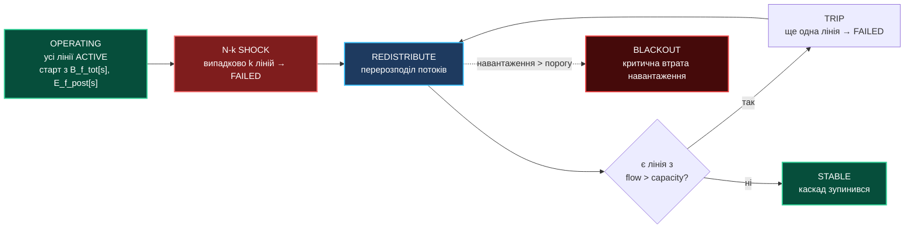
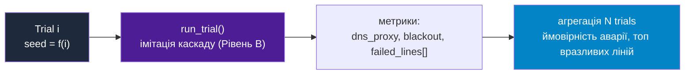
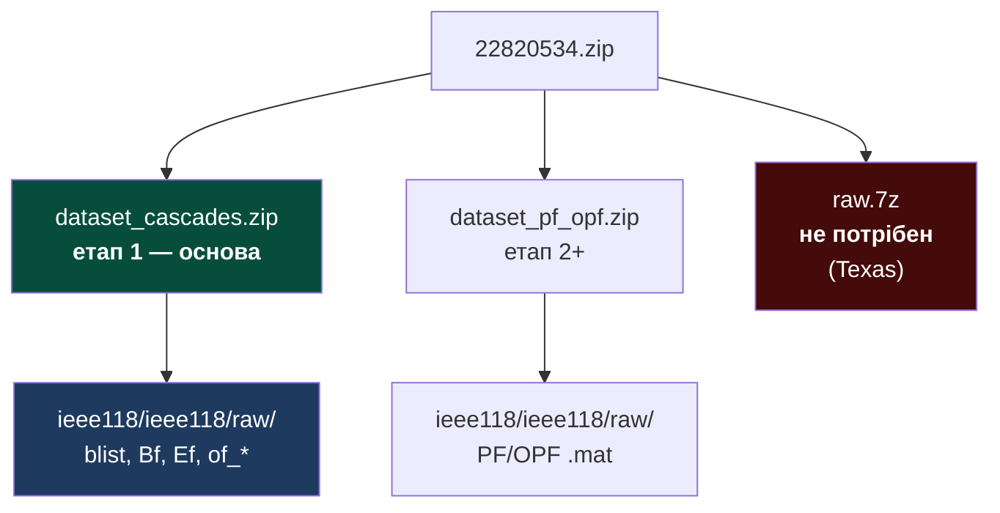
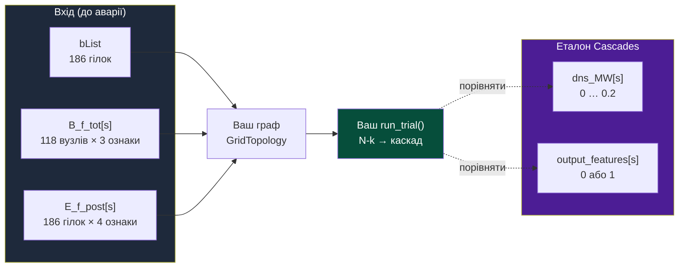
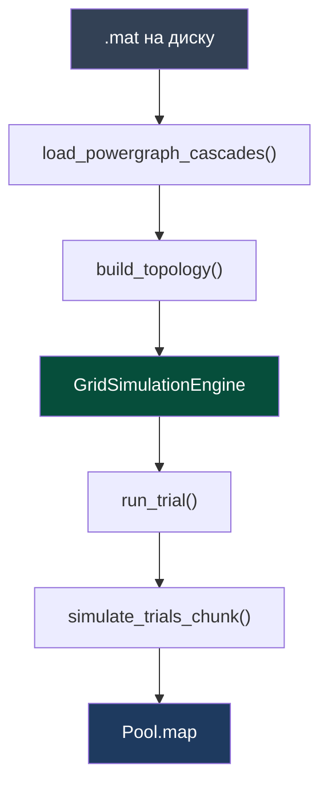

# Наскрізний проєкт: Симуляція стійкості енергосистеми IEEE-118 методом Монте-Карло

> **Декларація курсу.** Академічна доброчесність та авторство матеріалів — у [DISCLAIMER.md](DISCLAIMER.md).

Наскрізний семестровий проєкт веде від локального однопотокового скрипта до розподіленого хмарного кластера. Кожна практична робота є кроком з нарощування обчислювальної складності.

Архітектурний каркас наслідує рішення з [Практичної роботи 1](./p01_neutron_monte_carlo.md#3-вихідний-код-та-архітектура-mimd): місце ядерного реактора тут займає високовольтна енергосистема.

---

## 1. Архітектурний кейс та фізична задача

### Кейс інциденту: Піренейський блекаут (28 квітня 2025 року)

Масштабна системна аварія в Іспанії та Португалії 28 квітня 2025 року (офіційний звіт ENTSO-E опубліковано у 2026 році) стала найбільшим блекаутом у Західній Європі за останні 20 років:

1. **Початковий тригер і лавиноподібний каскад:** через неконтрольовані високоамплітудні коливання напруги та втрату зв'язку на ключових транзитних підстанціях (400 кВ) захист відключив інтерконектори між Іспанією та Францією. Піренейський півострів миттєво опинився в ізольованому стані.
2. **Аварійне скидання базової генерації:** стрибок напруги та розсинхронізація призвели до втрати **31 ГВт навантаження** (понад 60% попиту країни). Усі діючі іспанські атомні електростанції (зокрема Almaraz, Ascó, Cofrentes, Trillo, Vandellós — загалом 7 енергоблоків) втратили зовнішнє живлення і штатно заглушили реактори, перейшовши на аварійні дизель-генератори.
3. **Фрагментація енергосистеми:** мережа розпалася на несинхронізовані острови з глибоким дефіцитом потужності, що знеструмило транспортні вузли, аеропорти та промислові центри.
4. **Процедура Black Start та відновлення:** первинне заживлення критичної інфраструктури зайняло понад 10 годин, а повне підняття системи "з нуля", повторна синхронізація енергоблоків АЕС та стабілізація частоти тривали **майже 2 доби (48 годин)**.

Цей інцидент наочно демонструє головний закон системної інженерії: **енергосистема руйнується не через одночасну втрату всіх станцій, а через ланцюгову реакцію від вибивання лічених критичних вузлів або ліній**. Прогнозування таких каскадів (N-k аналіз) є ключовою задачею нашого симулятора.

**Об'єкт дослідження:** еталонна тестова модель **IEEE-118** з [датасету PowerGraph](https://figshare.com/articles/dataset/PowerGraph/22820534) — **118 вузлів** і **186 гілок**.

**Термінологія** (стандарт **IEEE 118-bus test system**, формат **MATPOWER** — відкритого пакету для моделювання енергосистем і розрахунку потокорозподілу Power Flow / OPF):

- **Вузол (bus)** є абстрактною **вершиною графа** мережі з числовим ідентифікатором (1…118). Замість координат стан вузла визначають електричні параметри: активне навантаження $P$, повна потужність $S$ та напруга $V$. У датасеті вони згруповані у вектор `B_f_tot` (**B**us **f**eatures **tot**al). У фізичній топології за вершиною закріплена підстанція або генератор, проте в моделі це розрахунковий вузол із числовим навантаженням.
- **Гілка (branch)** є **ребром графа** між двома вузлами (лінія електропередачі або силовий трансформатор). Її фіксують парою індексів `(from, to)` у списку `bList` (**b**ranch **list**). Характеристики активного потоку $P_{ij}$ та межі нагріву/перевантаження $lr_{ij}$ (line rating) зберігаються в масиві `E_f_post` (**E**dge **f**eatures **post**-contingency, тобто стан ребер після встановлення режиму).
- **Аварія (відмова елемента)** полягає у **виході гілки з експлуатації** через аварійне відключення захистом або пошкодження. Струм перерозподіляється між суміжними лініями. Якщо сусідні ділянки зазнають перевантаження, автоматика вимикає і їх, що породжує **каскадну відмову** аж до відчутного дефіциту потужності (DNS, demand not served).

Симуляція працює з **графом мережі**: вершини позначають підстанції, а ребра — лінії електропередач із фізичними лімітами потужності. Датасет PowerGraph дає готову структуру цієї мережі та еталонний розрахунок аварій. Двигун симуляції проєкту запускає поверх графа метод Монте-Карло, оцінюючи стійкість системи до випадкових відключень ліній.

> [!IMPORTANT]
> **Методологічний вибір: топологічна евристика замість розв'язання рівнянь Кірхгофа**
> 
> У промислових пакетах (MATPOWER, Cascades, PSS/E) розрахунок кожного кроку аварії спирається на нелінійну систему рівнянь балансу потужностей (**AC Power Flow**, метод Ньютона-Рафсона) або на лінеаризоване матричне наближення (**DC Power Flow** через інверсію матриці провідностей $\mathbf{B}$ та метрики лінійної чутливості **LODF / PTDF** — коефіцієнти розподілу аварійних перетоків). Через хвильову природу змінного струму відключення однієї ділянки в реальній енергосистемі здатне миттєво перевантажити лінію за десять вузлів від епіцентру.
> 
> Наш курс фокусується на **проєктуванні масштабованих розподілених систем (MIMD, Ray, Docker, Kubernetes, FinOps)** над графовими структурами. Повний розрахунок AC-PF на кожному кроці для $10^6$ траєкторій у Python забрав би години процесорного часу та перетворив би лабораторний практикум на курс чисельних методів.
> 
> З цієї причини проєкт спирається на **топологічний евристичний проксі-симулятор**: локальний перерозподіл потужностей між суміжними лініями за їхньою вільною ємністю ($capacity - flow$) відтворює лавинний каскадний процес і водночас швидко виконується на процесорних ядрах.

### Фізика каскадної відмови (Blackout Scenario)
1. **Початковий шок (N-k аварія):** випадково відключаються $k$ ліній (див. §1.4 — $k$ обмежений).
2. **Перерозподіл навантаження (проксі-модель):** потік з відключених ліній переходить на активні суміжні гілки.
3. **Каскадна реакція:** якщо $\text{flow} > \text{capacity}$ — лінія вимикається захистом; цикл повторюється.

### 1.4. Параметр $k$ (N-k): обмеження

N-k збурення означає одночасне вимкнення рівно $k$ ліній на старті кожного випробування. У топології IEEE-118 налічується лише 186 гілок, тому параметр $k$ має чіткі фізичні межі.

| $k$ | Фізичний зміст |
| :--- | :--- |
| **1** | Стандарт **N-1** — поодинока аварія; **базовий режим** у практичних роботах |
| **2** | **N-2** — подвійна незалежна або суміжна відмова |
| **3…5** | Стрес-тест стійкості топології (для порівняльних серій) |
| **$\gg 5$** (напр. $k=50$) | Одномоментне знищення понад чверті мережі; колапс стає майже неминучим ($P(\text{blackout}) \to 1$) |

**Фізичні обмеження параметра $k$:**
При великих значеннях $k$ (зокрема $k=50$) вибірка вироджується: майже кожна траєкторія веде до тотального колапсу. Статистика Монте-Карло в такому разі перестає розрізняти критичні магістралі серед рядових. Метод покликаний виявляти саме **тонкі вразливості при малому збуренні** ($k=1$ або $k=2$), коли стійкість системи визначається тим, які конкретно лінії потрапили під удар.

**Вимоги до коду (етап 1):**

- Значення за замовчуванням: `k_fault = 1`;
- Параметр CLI `--k` із валідацією: `1 ≤ k ≤ min(5, n_branches // 10)` (для 186 ліній максимум становить **5**);
- У звіті наводяться значення $P(\text{blackout})$ для $k=1$ та (опційно) для $k=2$.


### 1.5. «Листові» гілки та вибір ліній для збурення

**Листова гілка** веде до периферійного вузла мережі (радіальний відвід до кінцевого споживача). Її відключення має суто локальний вплив: активних суміжних ліній для перерозподілу немає або потік незначний (§2.9), а ланцюгова реакція не виникає. Якщо генерувати N-k збурення **рівномірним випадковим відбором по всіх 186 гілках**, більшість випробувань завершиться ізоляцією одного вузла без розвитку каскаду.

| Підхід | Принцип роботи |
| :--- | :--- |
| Рівномірний випадковий (наївний) | Часто потрапляє на периферійні відгалуження: каскад згасає, $P(\text{blackout}) \approx 0$ |
| **Зважений вибір** (рекомендовано) | Ймовірність відмови пропорційна коефіцієнту завантаження `flow / capacity` (удар по напружених лініях) |
| **Фільтр магістралей** (опційно) | Вибір ліній лише серед тих, де принаймні один вузол має степінь зв'язності $\geq 3$ |

**Метрики випробування:** Окрім прапорця `blackout`, фіксуйте величину `cascade_trips` (кількість ліній, що відключилися автоматикою *після* первинного N-k шоку). Випробування з `cascade_trips = 0` є локальними: їх не включають до списку системних аварій.

**Особливості візуалізації:** Схеми в §2.5 відображають **вихідний операційний стан мережі** з датасету до аварії (навантаження вузлів $P_{net}$ з `B_f_tot[s]` та завантаження ліній $P/lr$ з `E_f_post[s]`). На демонстраційному дашборді (етап 3) первинне N-k збурення позначається одним кольором, а вторинні каскадні вимкнення — іншим. Для перевірки роботи інтерфейсу обирайте згенеровані симулятором випробування (`trial`), де каскад реально розвинувся (`cascade_trips > 0`).

### 1.1. Стани системи та «матриця переходів»

Як у [p01, §2.1](./p01_neutron_monte_carlo.md#21-ймовірнісний-граф-станів-нейтрона) для нейтрона — фіксуємо **стани** і **переходи**. Тут три рівні:

**Рівень A — одна лінія (гілка):**

| Стан | Означення |
| :--- | :--- |
| `ACTIVE` | Лінія працює, несе потік |
| `FAILED` | Лінія відключена (N-k шок або спрацював захист) |

| З стану | Подія | В стан |
| :--- | :--- | :--- |
| `ACTIVE` | N-k шок (лінія в списку аварійних) | `FAILED` |
| `ACTIVE` | $flow > capacity$ після перерозподілу | `FAILED` |
| `FAILED` | — | *(термінальний для цієї лінії в межах trial)* |

**Рівень B — одна MC-траєкторія (каскад):**



**Рівень C — метод Монте-Карло (багато незалежних trial):**



Один **trial** — це одне повне моделювання каскаду за станами з **Рівня B** (від початкового збурення до стабілізації або колапсу). **$N$ trials** — незалежні повтори з різними випадковими N-k відключеннями (MIMD-паралелізм, як `update_neutrons_chunk` у p01).

### 1.2. Дві модифікації Монте-Карло в межах єдиного MIMD-патерну

Метод Монте-Карло в лабораторному курсі представлений у **двох варіаціях**. Їх поєднує спільний інженерний базис (`Pool.map`, чанкування задач, бенчмарк `run_headless_benchmark()`, збереження метрик у JSON), тоді як предмет моделювання та структура зовнішнього циклу відрізняються.

Код [`app.py`](https://github.com/vplanto/cloud_grid/tree/main/source/mimd-pc) з першої практики демонструє паралелізм **всередині одного часового кроку**. Наскрізний проєкт енергомережі фокусується на іншій задачі — накопиченні статистики **тисяч незалежних випадкових сценаріїв**.

| Параметр | **p01 — ядерний реактор** | **n01 — енергетична мережа** |
| :--- | :--- | :--- |
| Одиниця паралелізму | ~500k **нейтронів** на **один** крок часу | **$N$** незалежних **траєкторій** (каскадів) |
| Зовнішній цикл | ~30 часових кроків `step()` | $10^5$–$10^7$ викликів функції `run_trial()` |
| Джерело стохастики | Рулетка фізичних взаємодій нейтрона | Випадковий вибір аварійного набору ліній N-k |
| Цільова метрика | Коефіцієнт $k$, число поділів, темп (частинки/с) | $P(\text{blackout})$, недовідпуск DNS, рейтинг вразливостей |
| Мета масштабування | Завантажити обчислювальні ядра єдиним кроком | Зібрати вибірку для рідкісної аварійної події |

### 1.3. Обґрунтування обсягу вибірки $N = 10^5 \dots 10^7$

У вихідному коді [`source/mimd-pc/app.py`](https://github.com/vplanto/cloud_grid/tree/main/source/mimd-pc) відсутній зовнішній цикл на $10^5$ окремих симуляцій: там паралельний пул обробляє масив частинок. У наскрізному проєкті змінюється точка прикладання MIMD-шаблону:

| Характеристика | `app.py` (реактор) | Наскрізний проєкт (мережа) |
| :--- | :--- | :--- |
| Об'єкт у пам'яті | ~**500 000** швидких + **150 000** повільних нейтронів | **$N$** незалежних випробувань (кожне моделює каскад) |
| Робочий крок | ~**30** ітерацій `step()` у headless-бенчмарку | Кожне випробування містить цикл перерозподілу потоків |
| Рівень паралелізму | `Pool.map(update_neutrons_chunk)` за масивом часток | `Pool.map(simulate_trials_chunk)` за списком траєкторій |

**Взаємозв'язок:** Архітектурний шаблон лишається незмінним (незалежні однотипні задачі транслюються у воркери через `Pool.map`), проте фізична мета інша:
- у реакторі обчислюється **стан популяції за одиницю часу**;
- в енергомережі оцінюється **ймовірність рідкісного аварійного колапсу** через множину стохастичних збурень.

Якщо ймовірність колапсу складає $P(\text{blackout}) \approx 0.001$, то вибірка $N = 1000$ зафіксує лише близько однієї події, що дає неприпустимо високу статистичну похибку. Вибірка $N = 10^5$ забезпечує близько 100 аварійних випадків і стабілізує оцінку. Значення $N = 10^7$ є цільовим орієнтиром для **етапу 4** (розподілений кластер), де формується високоточний рейтинг п'яти найбільш небезпечних ліній.

| Етап розробки | Орієнтовне $N$ | Мета прогону |
| :--- | :--- | :--- |
| 1 (ПК, зневадження) | $10^3 \dots 10^5$ | Валідація алгоритму, оцінка прискорення (speedup), первинний розподіл |
| 4 (хмарний кластер) | $10^6 \dots 10^7$ | Підсумкова аналітика, стабільний топ критичних ділянок |

Масив із **122 500 сценаріїв PowerGraph** фіксує каталог попередньо розрахованих режимів мережі $s$. Симуляція обирає один або серію базових режимів $s$ і проводить всередині них власні стохастичні серії з $N$ випробувань.

### Задача методу Монте-Карло (еталон курсу)
Провести $N = 10^5 \dots 10^7$ випадкових випробувань комбінацій початкових аварій для:
- оцінки ймовірності настання тотального блек-ауту;
- визначення найбільш уразливих («критичних») ліній та підстанцій;
- розрахунку показника стійкості мережі за умов різного рівня споживання.

### Аналогія з `app.py` (практика 1)

| Практика 1 (реактор) | Наскрізний проєкт (мережа) |
| :--- | :--- |
| `ReactorSimulationEngine` | `GridSimulationEngine` — стан мережі, лічильники каскаду |
| `reset_params()` | `load_scenario()` / `reset_params()` — завантаження графа + параметри MC ($N$, $k$, seed) |
| `step()` | `run_trial()` — одна MC-траєкторія (N-k шок → каскад до стабілізації) |
| `update_neutrons_chunk()` | `simulate_trials_chunk()` — пакет незалежних траєкторій у воркері |
| `get_state()` | `get_snapshot()` — знімок для UI (активні лінії, відключені вузли, метрики) |
| `run_headless_benchmark()` | `run_headless_benchmark()` — CLI без браузера, JSON-метрики |
| `ReactorHandler` + `HTML_PAGE` | *(етап 3)* `GridHandler` + dashboard — вебсервер та інтерфейс візуалізації графа IEEE-118 у браузері |

Кожна **MC-траєкторія** моделює один незалежний сценарій каскадної аварії. Воркери масштабують обчислення за випробуваннями, а не за внутрішніми кроками каскаду (аналогічно до розподілу частинок у `update_neutrons_chunk`).

---

## 2. Датасет PowerGraph — з чого почати

### 2.0. Базові орієнтири для роботи з датасетом

1. **Автономність від середовища MATLAB:** Файли формату `.mat` обробляють готові Python-скрипти з каталогу `source/dataset_scripts/`:

| Скрипт | Призначення | Точка виклику |
| :--- | :--- | :--- |
| `inspect_powergraph.py` | Перевіряє структуру каталогу, виводить список MATLAB-змінних і розмірності масивів | Первинна діагностика після розпакування архіву |
| `load_powergraph_cascades.py` | Завантажує дані в масиви `numpy`; містить функції `load_powergraph_cascades()`, `build_topology()` | Імпорт у симулятор та валідація зчитування |
| `powergraph_mat.py` | Низькорівневе читання версії v7.3 / cell arrays | Викликається службовими модулями |
| `visualize_powergraph.py` | Побудова графіків розподілу DNS та навантаження (PNG) | Аналітичні звіти за результатами моделювання |
| `visualize_grid_graph.py` | Візуалізація топологічного графа (118 вузлів / 186 гілок) | Графічний аналіз структури мережі |

2. **Пакетний характер 122 500 станів:** Довжина масиву `dns_MW` у файлі `of_reg.mat` становить 122 500 записів. Кожен числовий індекс $s = 0 \dots 122499$ відповідає зафіксованому робочому режиму мережі та еталонному результату Cascades. Дані призначені для алгоритмічного парсингу.

   Прапорець **`--samples`** утиліти `load_powergraph_cascades.py` приймає стандартний зріз Python (`slice`) для вибіркового зчитування:
   - `--samples 0:10` — швидке завантаження перших десяти сценаріїв (зручно для налагодження коду);
   - `--samples 0:1000` — вибірка першої тисячі записів;
   - запуск без параметра `--samples` зчитує повний масив (потребує близько 1.5 ГБ RAM).

   На першому етапі розробки використовуйте діапазон `--samples 0:10` або `0:1000`.

3. **Розподіл ролей між датасетом і кодом:** Датасет PowerGraph постачає **топологічну структуру** та **еталонні результати**. Студентський проєкт реалізує **незалежний стохастичний рушій** для розрахунку аварійних ланцюгів:

| Компонент | PowerGraph (вхідні дані та еталон) | Студентський симулятор (розроблюваний код) |
| :--- | :--- | :--- |
| Топологія мережі | `bList` — 186 пар індексів гілок | Клас `GridTopology` |
| Початковий операційний режим | `B_f_tot[s]`, `E_f_post[s]` | Метод `load_scenario()` |
| Контрольні показники каскаду | `dns_MW[s]`, `output_features[s]` | Валідація точності евристики |
| Масовий стохастичний експеримент | 122 500 детермінованих розрахунків | Генерація $10^5 \dots 10^7$ випробувань поверх обраного стану |

> **Суть експерименту простими словами:**  
> У датасеті збережено **122 500 різних робочих режимів мережі** (комбінацій споживання міст та генерації станцій). Будь-який режим $s$ можна взяти як вихідну точку. Симулятор проєкту фіксує конкретний стан (наприклад, $s = 42$), запускає поверх нього $10^5 \dots 10^7$ випадкових N-k аварій методом Монте-Карло й отримує статистику: ймовірність блек-ауту $P(\text{blackout})$ та рейтинг найбільш уразливих ліній.

### 2.1. Швидкий старт (≈5 хвилин)

```bash
cd cloud_grid
python -m venv .venv && source .venv/bin/activate
pip install -r requirements.txt

# 1) Перевірити, що файли на місці
python source/dataset_scripts/inspect_powergraph.py --quick --data Datasets

# 2) Завантажити 10 зразків (швидко, ~секунди)
python source/dataset_scripts/load_powergraph_cascades.py --data Datasets --samples 0:10

# 3) Картинки для звіту (опційно)
python source/dataset_scripts/visualize_powergraph.py --data Datasets
```

**Як читати вивід кроку 2:**

```text
blist: (186, 2)
of_reg (dns_MW): (10,) min=0 max=0
of_bi (output_features): (10,) unique=[0.]
Bf: (10, 118, 3)  Ef: (10, 186, 4)
buses=118 branches=186
```

- **`blist: (186, 2)`** — перелік 186 ліній мережі: пари індексів вузлів `(from_bus, to_bus)`.
- **`of_reg (dns_MW): (10,) min=0 max=0`** — **числовий показник недовідпуску** (*output features regression*, DNS). Для перших 10 сценаріїв ($s = 0\dots9$) аварія в Cascades не призвела до відключення споживачів ($min = 0, max = 0$). Це нормальний робочий стан: більшість режимів витримують малі збурення без системного дефіциту. Щоб перевірити ненульовий дефіцит, вкажіть інший зріз, наприклад `--samples 1000:1010`.
- **`of_bi (output_features): (10,) unique=[0.]`** — **бінарна мітка блек-ауту** (*output features binary*). `0` — блек-ауту немає, `1` — стався колапс. Список `[0.]` показує, що в перших 10 зразках системної аварії не сталося.
- **`Bf: (10, 118, 3)`** — матриці 118 вузлів (3 параметри: активне $P$ та повне $S$ навантаження, напруга $V$) для 10 зразків.
- **`Ef: (10, 186, 4)`** — матриці 186 гілок (4 параметри: потік $P$, реактивний потік $Q$, реактанс $X$, рейтинг $lr$) для 10 зразків.

### 2.2. Звідки беруться файли

Після розпакування [Figshare-архіву](https://figshare.com/articles/dataset/PowerGraph/22820534):



| Архів | Статус | Призначення |
| :--- | :--- | :--- |
| `dataset_cascades.zip` | **Обов'язковий** | Топологія та результати каскадів IEEE-118 |
| `dataset_pf_opf.zip` | Опційний (етап 2+) | Матриці PF/OPF |
| `raw.7z` | Не використовується | Сирі траєкторії мережі Texas |

> Файли формату `.mat` мають значний обсяг (~2 ГБ на конфігурацію). Не додавайте їх до git-репозиторію; зберігайте локально у теці `Datasets/` (яка додана до `.gitignore`).

### 2.3. Один зразок `s` — головна модель у голові

У датасеті збережено **122 500** незалежних сценаріїв (довжина `dns_MW` у `of_reg.mat`, індекси `s = 0 … 122499`). Кожен запис `s` — це готовий статичний знімок навантаження мережі до аварії (наприклад, зимовий вечірній пік) разом із відомим еталонним результатом розрахунку Cascades.

Для моделювання ми обираємо будь-який стан (наприклад, `s = 42`), завантажуємо його навантаження вузлів і потоки ліній у `GridTopology`, а далі запускаємо навколо нього масові стохастичні випробування `run_trial()`.



**Ознаки вузла** (`B_f_tot[s]`, розмірність `118 × 3`, де 118 вузлів мають по 3 параметри):

| Індекс | Поле | Сенс | Роль у симуляторі |
| :---: | :--- | :--- | :--- |
| **0** | $P_{net}$ | активне навантаження вузла | **Єдиний робочий параметр** → `buses[j].load` |
| 1 | $S_{net}$ | повна потужність | Не потрібен для проксі-моделі (лише для AC-PF) |
| 2 | $V$ | напруга | Не потрібен для проксі-моделі (лише для AC-PF) |

> Для нашого проксі-симулятора з трьох ознак практичний сенс несе **лише 1 параметр — $P_{net}$ (індекс 0)**: активне навантаження, яке скидається в недовідпуск (DNS) у разі аварійного відсікання вузла від мережі.

**Ознаки гілки** (`E_f_post[s]`, розмірність `186 × 4`, де 186 ліній мають по 4 параметри):

| Індекс | Поле | Сенс | Роль у симуляторі |
| :---: | :--- | :--- | :--- |
| **0** | $P_{ij}$ | активний потік по лінії | **Робочий потік** → `branches[i].flow` |
| 1 | $Q_{ij}$ | реактивний потік | Не потрібен для проксі-моделі |
| 2 | $X_{ij}$ | реактивний опір (реактанс) | Не потрібен для проксі-моделі |
| **3** | $lr_{ij}$ | граничний нагрів (line rating) | **Межа пропускної здатності** → `branches[i].capacity` |

> Для розрахунку перевантажень із чотирьох ознак лінії значущими є **лише 2 параметри**: початковий потік $P_{ij}$ (індекс 0) та ліміт стійкості $lr_{ij}$ (індекс 3).

### 2.4. Файли в `dataset_cascades/ieee118/ieee118/raw/`

| Файл | Змінна в MATLAB | Етап 1 | Що це |
| :--- | :--- | :---: | :--- |
| `blist.mat` | `bList` | **так** | топологія: пари вузлів `(from, to)` |
| `Bf.mat` | `B_f_tot` | **так** | ознаки вузлів (cell × 122 500) |
| `Ef.mat` | `E_f_post` | **так** | ознаки гілок (cell × 122 500) |
| `of_reg.mat` | `dns_MW` | **так** | еталон DNS (щільний масив) |
| `of_bi.mat` | `output_features` | **так** | еталон: був блек-аут чи ні |
| `of_mc.mat` | `category` | ні | клас тяжкості каскаду |
| `Ef_nc.mat` | `E_f_kenza` | ні | варіант без каскаду |
| `exp.mat` | `explainations` | ні | XAI-структури різної форми (для симулятора не потрібні) |

**Формат даних:** Усі файли конфігурації IEEE-118 збережені у форматі MATLAB v7.3 (HDF5). Змінні `Bf`, `Ef` та `of_bi` структуровані як **cell arrays** (по 122 500 посилань), тоді як `dns_MW` є суцільним масивом дійсних чисел `float64`. Модуль `source/dataset_scripts/powergraph_mat.py` повністю забезпечує операції зчитування цих даних.

### 2.5. Візуалізації

**Граф мережі** (топологія з `bList`):

```bash
pip install matplotlib networkx
# три різні сценарії (індекси 0, 1, 2 у датасеті):
python source/dataset_scripts/visualize_grid_graph.py --data Datasets --samples 0,1,2
# один сценарій:
python source/dataset_scripts/visualize_grid_graph.py --data Datasets --sample 0
# лише топологія (без Bf/Ef):
python source/dataset_scripts/visualize_grid_graph.py --data Datasets --sample -1
```

Файли: `ieee118_scenario_01.png` … `03.png` у `docs/assets/powergraph/`. Колір вузла — навантаження, колір лінії — близькість до перевантаження. Одна й та сама розкладка вузлів для порівняння сценаріїв.

> Графічні матеріали відображають **базовий робочий стан системи** до виникнення аварійного збурення. Периферійні лінії несуть невелике навантаження, тому на схемі вони мають блідий колір, а локальне пошкодження на них не призводить до помітного перерозподілу потужностей (§1.5).

| Сценарій | Файл |
| :--- | :--- |
| 1-й у датасеті | `ieee118_scenario_01.png` |
| 2-й | `ieee118_scenario_02.png` |
| 3-й | `ieee118_scenario_03.png` |

**Сценарій 1** — перший операційний стан у PowerGraph (`s=0`):


**Сценарій 2** — інший розподіл навантаження (`s=1`):


**Сценарій 3** — ще один варіант (`s=2`):


**Статистика датасету** — після `python source/dataset_scripts/visualize_powergraph.py --data Datasets`:

| Файл | Що показує |
| :--- | :--- |
| `dns_histogram.png` | розподіл `dns_MW` по всіх 122 500 сценаріях |
| `blackout_bar.png` | скільки сценаріїв з DNS = 0 і з DNS ≠ 0 |
| `branch_flow_vs_capacity.png` | потік vs рейтинг ліній (один зразок) |
| `node_loads.png` | навантаження вузлів (один зразок) |


> Якщо у клонованому репозиторії зображення відсутні, згенеруйте їх локально командами з §2.1.

### 2.6. Що читати в коді репозиторію

Таблиця скриптів — у **§2.0**. Мінімальний приклад у Python:

```python
from pathlib import Path
import sys
sys.path.insert(0, "source/dataset_scripts")
from load_powergraph_cascades import load_powergraph_cascades, build_topology

pg = load_powergraph_cascades("Datasets", sample_index=slice(0, 10))
topo = build_topology(pg.blist, pg.Ef[0], pg.Bf[0])
print(len(topo["buses"]), len(topo["branches"]))  # 118 186
```

Команди завантаження:

```bash
# розробка: 10 зразків
python source/dataset_scripts/load_powergraph_cascades.py --data Datasets --samples 0:10

# тільки мітки + топологія (секунди)
python source/dataset_scripts/load_powergraph_cascades.py --data Datasets --no-large

# повний набір (~1.5 ГБ RAM)
python source/dataset_scripts/load_powergraph_cascades.py --data Datasets
```

### 2.7. Пайплайн у вашому проєкті



Перевірки після `build_topology()`:

```text
assert n_buses == 118
assert n_branches == 186
assert blist.shape == (186, 2)
```

Внутрішня структура `GridTopology` — аналог `self.neutrons` у реакторі:

| Структура | Поля |
| :--- | :--- |
| `buses[]` | `id`, `load`, `voltage` |
| `branches[]` | `id`, `from_bus`, `to_bus`, `flow`, `capacity`, `active` |
| `adjacency` | списки сусідів для redistribution |

### 2.8. PF/OPF (етап 2+, можна пропустити)

Тека `dataset_pf_opf/ieee118/ieee118/raw/`: `edge_index.mat`, `X.mat`, `Y_polar.mat` та OPF-варіанти. На **етапі 1** не потрібна.

### 2.9. Модель симуляції каскаду в `run_trial()` (на пальцях)

Одне випробування (`trial`) моделює розвиток аварії після раптового збурення:

1. **Старт:** Завантажуємо базовий стан $s$ (усі 186 ліній увімкнені, мають початковий потік `flow` і ліміт `capacity`).
2. **Первинний шок (N-k):** Випадково вимикаємо $k$ ліній ($k = 1$ або $2$).
3. **Ланцюгова реакція (перерозподіл потоків):**
   - Потік кожної вимкненої лінії переходить на активні сусідні лінії (інцидентні до тих самих вузлів).
   - Кожна сусідня лінія бере частку навантаження пропорційно своєму вільному резерву (`capacity - flow`): чим менше лінія навантажена, тим більше струму вона приймає.
   - Якщо лінія живила тупиковий вузол (радіальний відвід) і він повністю відсікається від мережі — його базове навантаження споживання $P_{net}$ (`buses[v].load`) знеструмлюється і додається до втрат.
   - Перевіряємо мережу: якщо на будь-якій лінії потік перевищив ліміт (`flow > capacity`), спрацьовує релейний захист і лінія вимикається. Процес перерозподілу повторюється.
4. **Зупинка:** Каскад завершується, коли перевантаження зникли або вичерпано ліміт ітерацій `max_steps`.

**Результати одного випробування:**
- **`cascade_trips`** — скільки ліній відключилося *ланцюжком після* первинного удару. Якщо `cascade_trips == 0`, аварія згасла локально.
- **`dns_proxy`** — частка втраченої потужності: `(навантаження знеструмлених вузлів) / (сумарне навантаження всіх 118 вузлів)`. Лежить у діапазоні 0…0.2, що в точності відповідає шкалі `dns_MW` датасету.
- **`blackout`** — прапорець системного колапсу (`True`, якщо недовідпуск `dns_proxy` перевищив заданий поріг системної аварії, наприклад > 5%).

> **Контрольне порівняння (Sanity-check):** Гістограма розрахованого показника `dns_proxy` зіставляється з еталонним розподілом `dns_MW` із датасету PowerGraph на спільних вихідних режимах $s$.

### 2.10. Інженерні нюанси реалізації

- **Співвідношення вибірок:** 122 500 записів датасету є фіксованими робочими режимами генерації та споживання. Симулятор проєкту обирає базові режими $s$ і запускає поверх них від $10^5$ до $10^7$ випадкових випробувань N-k комбінацій.
- **Номенклатура змінних у MATLAB:** На файловій системі файл зветься `blist.mat`, а внутрішній масив у HDF5 збережено як `bList`. Готові допоміжні скрипти автоматично транслюють ці поля.
- **Шкала DNS:** Значення `dns_MW` лежить у діапазоні від 0 до 0.2, оскільки виражає нормалізовану частку недовідпущеної енергії, а не абсолютну потужність у мегаватах. Розраховані метрики проєкту узгоджуються з цим масштабом.
- **Оптимізація пам'яті:** Повне зчитування 122 500 станів потребує близько 1.5 ГБ оперативної пам'яті та тривалого розбору cell-масивів. Для швидкого налагодження алгоритму використовуйте прапорець `--samples 0:100`.
- **Вибір параметра $k$:** При $k \gg 5$ руйнування топології стає детермінованим і втрачає інформативність. Робочий режим обмежується значеннями $k=1$ або $k=2$.
- **Особливості візуалізації:** Зображення розділу §2.5 ілюструють нормальний режим роботи мережі до аварії. Для перевірки UI обирайте згенеровані симулятором випробування (`trial`) зі зваженим збуренням (§1.5) та позитивним значенням `cascade_trips > 0`.

---

## 3. Еволюція проєкту за етапами курсу


---

### Етап 1. Локальне розпаралелювання на CPU (MIMD на ПК)

**Референс:** структура [`source/mimd-pc`](https://github.com/vplanto/cloud_grid/tree/main/source/mimd-pc) і опис у [p01, §3](./p01_neutron_monte_carlo.md#3-вихідний-код-та-архітектура-mimd).

- **Мета:** перенести патерн MIMD з практики 1 на симуляцію каскадів IEEE-118; виміряти speedup на `multiprocessing.Pool`.

- **Очікувана структура репозиторію студента** (етап 1):

| Блок | Файл / символ | Призначення |
| :--- | :--- | :--- |
| Завантаження даних | `load_powergraph_cascades()` + `build_topology()` | `.mat` → `GridTopology` (див. §2.6–2.7) |
| Двигун | `class GridSimulationEngine` | Стан мережі, параметри MC, агрегація статистики |
| Воркер | `simulate_trials_chunk(args)` | Пакет незалежних MC-траєкторій (функція модуля для `Pool.map`) |
| Бенчмарк | `run_headless_benchmark(...)` | CLI-прогін, `benchmark_results_mimd_grid.json` |
| Точка входу | `main()` + `argparse` | `--headless`, `--trials`, `--workers`, `--k` (1…5, default 1), `--data`, `--out` |

- **Очікувані методи `GridSimulationEngine`** (аналог p01 §3.2):

| Метод | Що робить | Хто викликає |
| :--- | :--- | :--- |
| `__init__()` | Дефолтні параметри, порожня статистика | створення `engine` |
| `load_scenario(topology, params)` | Приймає підготовлений граф + `n_trials`, `k_fault` (1…5), `num_workers`, `seed` | `__init__`; CLI; майбутній `POST /api/reset` |
| `run_trial(seed)` | Одна MC-траєкторія: випадковий N-k → каскад → `{blackout, failed_lines, steps}` | `simulate_trials_chunk()` |
| `run_batch()` | Розбиває діапазон ідентифікаторів випробувань на чанки, виконує `Pool.map(simulate_trials_chunk)` та агрегує підсумкову статистику | `run_headless_benchmark()`; майбутній крок симуляції в UI |
| `get_snapshot()` | Знімок для візуалізації (без повного перерахунку) | *(етап 3)* dashboard |

- **Задачі студента:**
  1. Реалізувати `load_powergraph_cascades()` / `build_topology()` — перевірити 118 вузлів, 186 гілок (§2.6–2.7).
  2. Реалізувати **однопотоковий** `run_trial()` — спрощений каскад (§2.9).
  3. Винести пакет траєкторій у `simulate_trials_chunk()`; паралелити через `Pool.map` у `run_batch()`.
  4. Додати `run_headless_benchmark()`: час, trials/sec, частка блек-аутів, топ гілок; порівняти з `of_reg` PowerGraph.
  5. Побудувати графік speedup vs `num_workers` (Закон Амдала).

- **Результат:** `source/grid-mimd/app.py` (або аналог) + `benchmark_results_mimd_grid.json` + короткий звіт з графіком speedup.

---

### Етап 2. Векторизація та SIMD-оптимізація (NumPy / Matrix Operations)

- **Мета:** прискорити **перерозподіл потоків** і батчеву перевірку перевантажень через `NumPy` (не обов'язково весь граф у GPU).

- **Задача:**
  - Замінити внутрішні цикли в `run_trial()` / кроці каскаду на векторизовані операції над масивами `flow[]`, `capacity[]`, `active[]`.
  - Реалізувати **batch** MC: кілька траєкторій одночасно там, де це можливо без зміни фізики.
  - Порівняти throughput (траєкторій/сек) з етапом 1.
  - *(Опціонально)* Colab + CuPy/PyTorch для матричного кроку.

- **Результат:** звіт «скаляр vs вектор» + оновлений `benchmark_results_*.json`.

---

### Етап 3. Контейнеризація та сервіси

- **Мета:** той самий каркас, що p01 §3.4 (веб + headless), але для мережі.

- **Очікувана структура** (розширення етапу 1):

| Блок | Аналог з p01 | Призначення |
| :--- | :--- | :--- |
| `GridHandler` | `ReactorHandler` | `GET /` — dashboard; `POST /api/reset`, `POST /api/step` або `/api/run_batch` |
| `HTML_PAGE` / окремий фронт | `HTML_PAGE` | Граф IEEE-118, підсвітка відключених ліній |
| Worker service | — | обчислювальний контейнер з `GridSimulationEngine` |
| Redis / черга | — | асинхронні довгі прогони ($10^6$+ trials) |
| FastAPI gateway | — | REST API для параметрів симуляції |

- **Результат:** Конфігурація `docker-compose.yml` з повною інфраструктурою та автоматизованим запуском.

---

### Етап 4. Грід-обчислення та Хмарна Оркестрація (Ray / Kubernetes)
- **Мета:** Запустити масштабовану симуляцію на кластері з багатьох вузлів.
- **Задача:**
  - Розгорнути обчислювальний пайплайн на розподіленому кластері (Ray Cluster або Kubernetes Jobs).
  - Реалізувати відмовостійкість: якщо один вузол кластера падає під час симуляції, задача перерозподіляється на інші.
  - Провести підсумковий розрахунок $10^7$ траєкторій для визначення топ-5 найнебезпечніших ліній електромережі.
- **Результат:** Хмарний запуск, підсумкова аналітична панель та фінальний захист проєкту.

---

## 4. Фінальні критерії оцінювання проєкту

Кожен етап оцінюється окремо під час відповідної лабораторної роботи, а наприкінці семестру студент презентує **комплексну систему**:

1. **GitHub-репозиторій:** Чиста структура коду, історія коммітів, інструкція із запуску.
2. **Docker / Docker Compose:** Відтворюване підняття середовища та запуск симуляції єдиною командою (`docker compose up`).
3. **Бенчмарки та аналітика:** Порівняльна таблиця продуктивності (1 CPU vs N CPU vs GPU vs Distributed Cluster).
4. **Аргументація та володіння матеріалом:** Здатність детально пояснити архітектурні вибори, механіку евристики та захистити інженерні рішення.

---

## Додаток A. Приклади викликів `source/dataset_scripts/`

Скрипти зчитування та візуалізації PowerGraph IEEE-118. Датасет зберігається локально у каталозі `Datasets/` (див. §2.2); нижче `--data Datasets`.

```bash
cd cloud_grid
source .venv/bin/activate
pip install -r requirements.txt
```

| Скрипт | Призначення |
| :--- | :--- |
| `inspect_powergraph.py` | Перевірка `.mat`: ключі HDF5, розміри, cell arrays |
| `load_powergraph_cascades.py` | Завантаження в NumPy + `build_topology()` |
| `visualize_grid_graph.py` | Топологічний граф мережі → PNG |
| `visualize_powergraph.py` | Гістограми DNS, блек-аут, потоки/навантаження → PNG |
| `powergraph_mat.py` | Низькорівневе читання MATLAB v7.3 (імпорт, не CLI) |

### A.1. `inspect_powergraph.py`

**Швидка перевірка** (секунди):

```bash
python source/dataset_scripts/inspect_powergraph.py --quick --data Datasets
```

```text
cascades raw: .../dataset_cascades/ieee118/ieee118/raw

--- quick summary ---
blist.mat ['bList'] (186, 2) float64
Bf.mat ['B_f_tot'] cells=122500 cell0=(3, 118) float64
Ef.mat ['E_f_post'] cells=122500 cell0=(4, 186) float64
of_reg.mat ['dns_MW'] (1, 122500) float64
```

**Повний огляд** усіх файлів у `raw/` (ключі, розміри, тип cell):

```bash
python source/dataset_scripts/inspect_powergraph.py --data Datasets
```

Очікувані файли: `blist.mat` (0.00 MB), `Bf.mat` (~392 MB), `Ef.mat` (~774 MB), `of_bi.mat`, `of_reg.mat`, `of_mc.mat`, `exp.mat`. У кожному — MATLAB-змінна (`bList`, `B_f_tot`, `E_f_post`, `dns_MW` тощо), формат v7.3 (HDF5); `Bf`/`Ef` — cell array з 122 500 записів.

### A.2. `load_powergraph_cascades.py`

**Лише топологія та мітки** (`--no-large`, без Bf/Ef):

```bash
python source/dataset_scripts/load_powergraph_cascades.py \
  --data Datasets --no-large
```

```text
raw_dir: .../dataset_cascades/ieee118/ieee118/raw
blist: (186, 2)
of_reg (dns_MW): (122500,) min=0 max=0.2047
of_bi (output_features): (122500,) unique=[0. 1.]
```

**10 зразків для розробки** (рекомендований режим):

```bash
python source/dataset_scripts/load_powergraph_cascades.py \
  --data Datasets --samples 0:10
```

```text
raw_dir: .../dataset_cascades/ieee118/ieee118/raw
blist: (186, 2)
of_reg (dns_MW): (10,) min=0 max=0
of_bi (output_features): (10,) unique=[0.]
Bf: (10, 118, 3)  Ef: (10, 186, 4)
buses=118 branches=186
```

> Перші 10 індексів `s` у датасеті мають `dns_MW = 0` — це нормально; для перевірки ненульового DNS оберіть інший діапазон, напр. `--samples 1000:1010`.

**Повний набір** (~1.5 ГБ RAM, хвилини):

```bash
python source/dataset_scripts/load_powergraph_cascades.py --data Datasets
```

```text
blist: (186, 2)
of_reg (dns_MW): (122500,) min=0 max=0.2047
of_bi (output_features): (122500,) unique=[0. 1.]
Bf: (122500, 118, 3)  Ef: (122500, 186, 4)
buses=118 branches=186
```

### A.3. `visualize_grid_graph.py`

Три операційні стани (`s = 0, 1, 2`):

```bash
python source/dataset_scripts/visualize_grid_graph.py \
  --data Datasets --samples 0,1,2
```

```text
Saved: .../docs/assets/powergraph/ieee118_scenario_01.png
Saved: .../docs/assets/powergraph/ieee118_scenario_02.png
Saved: .../docs/assets/powergraph/ieee118_scenario_03.png
  buses: 118, branches: 186
```

Підписи на PNG — англійською (заголовки, colorbar). Зображення — у `docs/assets/powergraph/` (див. §2.5).

### A.4. `visualize_powergraph.py`

```bash
python source/dataset_scripts/visualize_powergraph.py --data Datasets
```

```text
Loading labels (fast, without Bf/Ef)...
  -> .../docs/assets/powergraph/dns_histogram.png
  -> .../docs/assets/powergraph/blackout_bar.png
Loading sample s=0 for branch/bus plots...
  -> .../docs/assets/powergraph/branch_flow_vs_capacity.png
  -> .../docs/assets/powergraph/node_loads.png
Done.
```

| Файл | Зміст |
| :--- | :--- |
| `dns_histogram.png` | розподіл `dns_MW` по 122 500 сценаріях |
| `blackout_bar.png` | лічильники `output_features` (0 / 1) |
| `branch_flow_vs_capacity.png` | потік vs рейтинг ліній, зразок `s=0` |
| `node_loads.png` | `P_net` по вузлах, зразок `s=0` |
