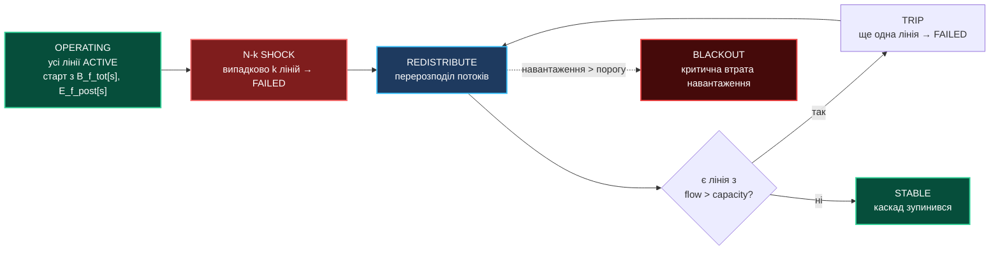
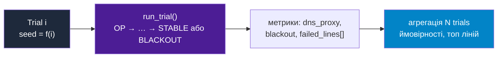
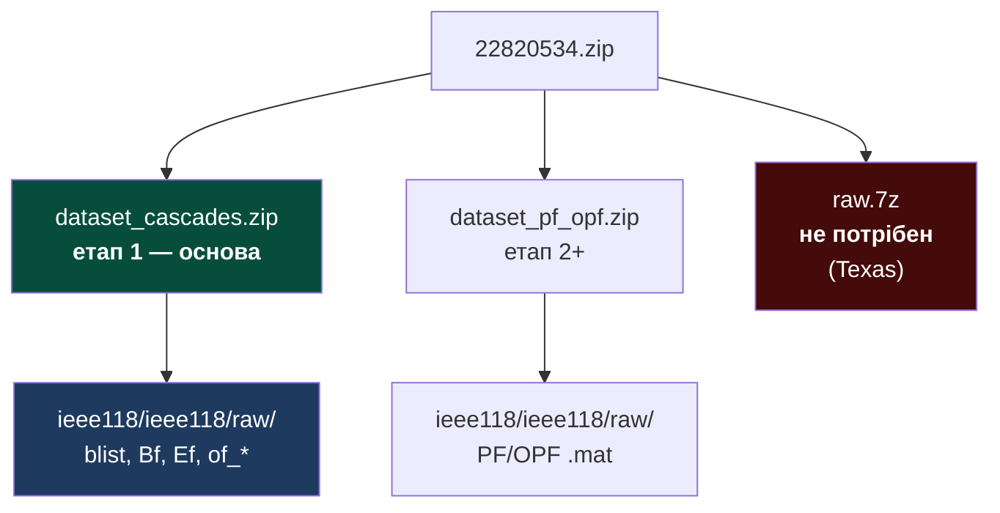
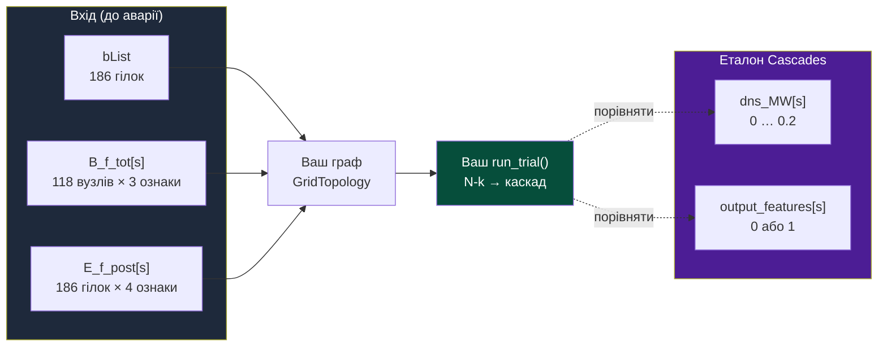
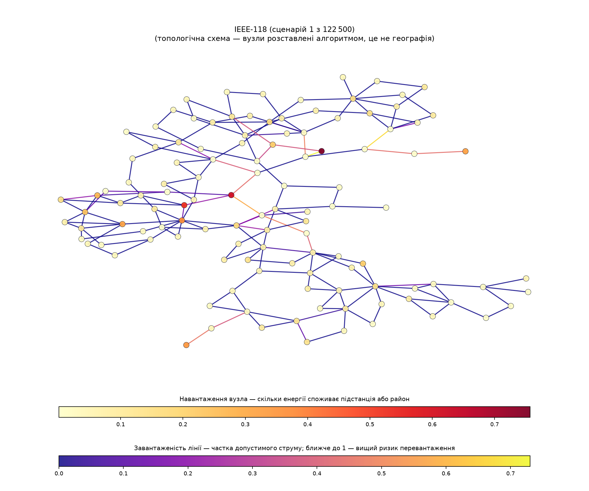
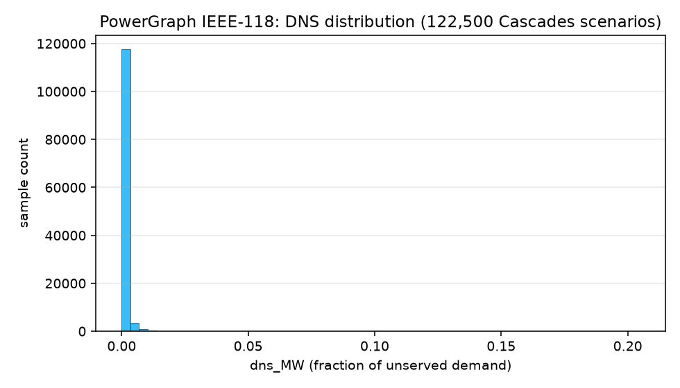
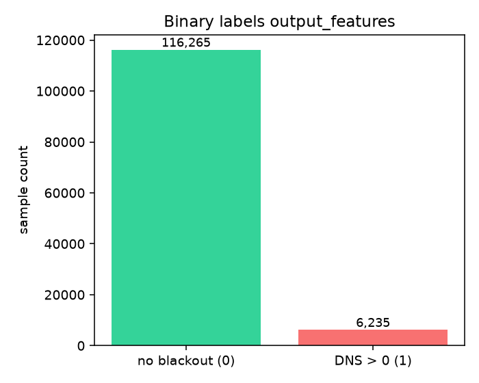
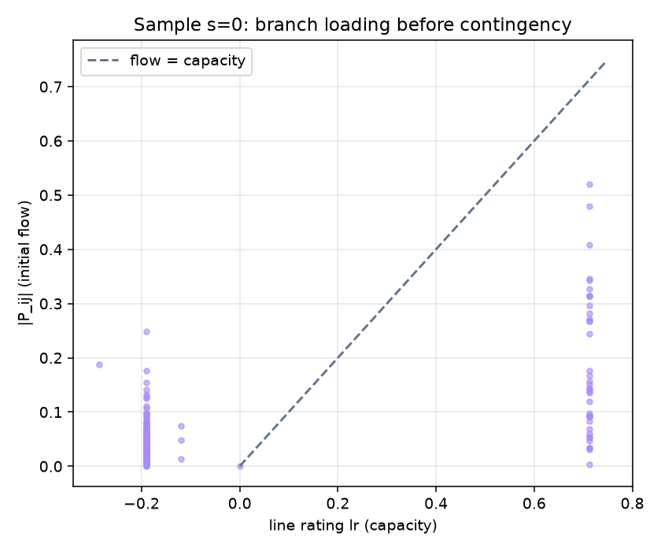
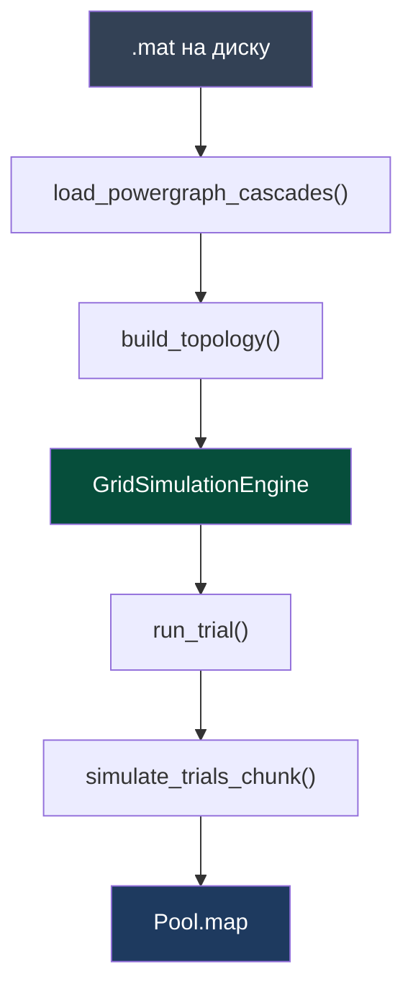
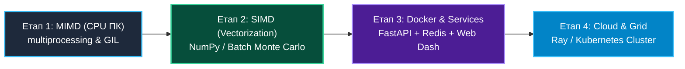

# Наскрізний проєкт: Симуляція стійкості енергосистеми IEEE-118 методом Монте-Карло

> **Декларація курсу.** Академічна доброчесність та авторство матеріалів — у [DISCLAIMER.md](DISCLAIMER.md).

Цей документ описує **наскрізний проєкт** на весь семестр. Кожна практика — крок від скрипта на ноутбуці до хмарного кластера.

Каркас коду — як у [Практичній роботі 1](./p01_neutron_monte_carlo.md#3-вихідний-код-та-архітектура-mimd), тільки замість реактора — енергомережа.

---

## 1. Архітектурний кейс та фізична задача

**Об'єкт дослідження:** еталонна тестова модель **IEEE-118** з [датасету PowerGraph](https://figshare.com/articles/dataset/PowerGraph/22820534) — **118 вузлів** і **186 гілок**.

**Термінологія** (стандарт **IEEE 118-bus test system**, формат **MATPOWER**):

- **Вузол (bus)** — абстрактна **вершина графа** мережі, не географічна точка на карті. У датасеті немає широти/довготи: вузол ідентифікується **цілим номером** (1…118) і описується **електричними величинами** — активне навантаження $P$, напруга $V$ тощо (у PowerGraph: `B_f_tot`). Фізично це може відповідати підстанції, генератору або вузлу навантаження, але в моделі це лише вузол зі станом.
- **Гілка (branch)** — **ребро графа** між двома вузлами: лінія електропередачі або трансформатор. Задається парою номерів `(from, to)` у `bList` і параметрами потоку $P_{ij}$, рейтингу $lr_{ij}$ (межа перевантаження) у `E_f_post`.
- **Аварія (відмова елемента)** — **вихід гілки з експлуатації** (розмикання лінії захистом або пошкодження). Потік перерозподіляється на інші гілки; при перевантаженні вони теж відключаються — **каскадна відмова** до значної втрати живлення (DNS, demand not served).

Модель — **топологічний граф** (зв'язність + електричні параметри), а не GIS-карта. Датасет PowerGraph дає цей граф і еталонні результати симулятора Cascades; ваш код моделює наслідки випадкових відмов методом Монте-Карло.

### Фізика каскадної відмови (Blackout Scenario)
1. **Початковий шок (N-k аварія):** випадково відключаються $k$ ліній (див. §1.4 — $k$ обмежений).
2. **Перерозподіл навантаження:** потік з відключених ліній переходить на активні.
3. **Каскадна реакція:** якщо $\text{flow} > \text{capacity}$ — лінія вимикається захистом; цикл повторюється.

### 1.4. Параметр $k$ (N-k): обмеження

N-k означає: на початку trial **одночасно** відключають рівно $k$ ліній. У IEEE-118 усього **186** гілок — $k$ не може бути довільно великим.

| $k$ | Сенс |
| :--- | :--- |
| **1** | стандарт **N-1** — одна випадкова аварія; **режим за замовчуванням** на курсі |
| **2** | **N-2** — рідші подвійні відмови |
| **3…5** | стрес-тест; лише для експериментів |
| **$\gg 5$** (напр. $k=50$) | одразу знімається $\approx 27\%$ мережі → каскад майже неминучий, $P(\text{blackout}) \to 1$ → **MC без сенсу** |

**Чому $k=50$ «і все»:** при великому $k$ усі trials схожі (масовий блек-аут), статистика не відрізняє критичні лінії від випадкових. Мета MC — оцінити **рідкісні** наслідки при **малому** $k$, коли результат залежить від *яких саме* ліній позбавилися.

**Рекомендація для коду (етап 1):**

- `k_fault = 1` за замовчуванням;
- CLI `--k` з валідацією: `1 ≤ k ≤ min(5, n_branches // 10)` (для 186 гілок — максимум **5**);
- у звіті окремо: $P(\text{blackout})$ при $k=1$ і (опційно) при $k=2$.

### 1.5. «Листові» гілки та вибір ліній для шоку

**Листова гілка** — лінія до периферійного вузла (радіальний відвід, локальне навантаження). Її відмова часто **локальна**: мало перерозподілу, каскад не розгортається. Якщо N-k шок — **рівномірний random по всіх 186 гілках**, більшість trials «тривіальні»: на графі червона риска на краю, без подальших tripів — **мало навчальної цінності**.

| Підхід | Що робить |
| :--- | :--- |
| Рівномірний random (наївний) | часто потрапляє на листя → $P(\text{blackout}) \approx 0$, нудні картинки |
| **Зважений вибір** (рекомендовано) | ймовірність пропорційна `flow / capacity` — аварії на напружених лініях |
| **Фільтр бекбону** (опційно) | вибір лише з гілок, де хоча б один кінець має ступінь $\geq 3$ |

**Метрики trial:** окрім `blackout` рахуйте `cascade_trips` (скільки ліній відключилось *після* N-k шоку). Trial з `cascade_trips = 0` — тривіальний; у топ критичних ліній його не включати.

**Візуалізація:** картинки в §2.5 — **операційний стан до аварії** (навантаження вузлів, завантаженість ліній), **не** карта відмов. Карта аварії (етап 3 UI): початковий N-k шок — один колір, каскадні tripи — інший; для демо обирайте trial з `cascade_trips > 0`, інакше на графі «нічого не сталося» — і це очікувано для листя.

### 1.1. Стани системи та «матриця переходів»

Як у [p01, §2.1](./p01_neutron_monte_carlo.md#21-ймовірнісний-граф-станів-нейтрона) для нейтрона — фіксуємо **стани** і **переходи**. Тут два рівні.

**Рівень A — одна лінія (гілка):**

| Стан | Означення |
| :--- | :--- |
| `ACTIVE` | Лінія працює, несе потік |
| `FAILED` | Лінія відключена (N-k шок або спрацював захист) |

| З стану | Подія | В стан |
| :--- | :--- | :--- |
| `ACTIVE` | N-k шок (лінія в списку аварійних) | `FAILED` |
| `ACTIVE` | $flow > capacity$ після перерозподілу | `FAILED` |
| `FAILED` | — | *(термінальний для цієї лінії в межах trial)* |

**Рівень B — одна MC-траєкторія (каскад):**



**Рівень C — метод Монте-Карло (багато незалежних trial):**



Один **trial** = один повний прохід графа зверху (рівень B). **$N$ trials** — незалежні повтори з новим випадковим N-k набором; паралелізм — як `update_neutrons_chunk` у p01.

### 1.2. Два типи MC — один MIMD-патерн

Метод Монте-Карло в курсі зустрічається у **двох формах**. Інженерія одна (`Pool.map`, chunk-и, headless benchmark, JSON), фізика і зовнішній цикл — різні. [`app.py`](../source/mimd-pc/app.py) **не переробляємо**: p01 навчає паралелізму **всередині одного кроку**, наскрізний проєкт — статистиці **багатьох незалежних сценаріїв**.

| | **p01 — реактор** | **n01 — мережа** |
| :--- | :--- | :--- |
| Що паралелимо | ~500k **нейтронів** на **один** крок часу | **$N$** незалежних **trials** (каскадів) |
| Зовнішній цикл | ~30 кроків `step()` | $10^5$–$10^7$ викликів `run_trial()` |
| Звідки випадковість | рулетка на кожній взаємодії нейтрона | випадковий N-k набір ліній на trial |
| Метрика | $k$, fissions, throughput (частинки/с) | $P(\text{blackout})$, DNS, топ ліній |
| Навіщо масштаб | навантажити CPU **одним** кроком | набрати статистику **рідкісної** події |

Спільне — лише **інженерія**: `Pool.map`, chunk-и, `run_headless_benchmark()`, JSON. Фізика і цикл різні — і це нормально.

### 1.3. Чому $N = 10^5 \dots 10^7$ trials? Зв'язок з `app.py`

У [`source/mimd-pc/app.py`](../source/mimd-pc/app.py) **немає** циклу на $10^5$ окремих експериментів. Там інша масштабна величина:

| `app.py` (реактор) | Наскрізний проєкт (мережа) |
| :--- | :--- |
| ~**500 000** швидких + **150 000** повільних нейтронів на крок | **$N$** незалежних **trials** (кожен = один каскад) |
| ~**30** кроків `step()` у headless-бенчмарку | один trial = кілька кроків REDISTRIBUTE…TRIP |
| Паралелізм: `Pool.map(update_neutrons_chunk)` по нейтронах | Паралелізм: `Pool.map(simulate_trials_chunk)` по trials |

**Зв'язок:** той самий **MIMD-патерн** (багато незалежних однотипних обчислень → `Pool.map`), але предмет інший:

- у реакторі рахуємо **частинки за один часовий крок**;
- у мережі рахуємо **ймовірність рідкісної події** (блек-аут) через багато випадкових N-k.

Якщо $P(\text{blackout}) \approx 0.001$, то з $N = 1000$ ви побачите ~1 подію — статистика шумна. З $N = 10^5$ — ~100 подій, оцінка стабільніша. $10^7$ — ціль **етапу 4** (кластер), коли потрібна точна оцінка для топ-5 небезпечних ліній.

| Етап | Орієнтовне $N$ | Навіщо |
| :--- | :--- | :--- |
| 1 (ПК, debug) | $10^3 \dots 10^5$ | перевірити код, speedup, перші гістограми |
| 4 (хмара) | $10^6 \dots 10^7$ | фінальна аналітика, топ критичних ліній |

**122 500 сценаріїв PowerGraph** — це **не** $N$ для вашого MC. Це різні операційні стани `s` у датасеті. Ви обираєте один (або кілька) `s` і всередині нього ганяєте свої $N$ trials.

### Задача методу Монте-Карло (еталон курсу)
Провести $N = 10^5 \dots 10^7$ випадкових випробувань комбінацій початкових аварій для:
- оцінки ймовірності настання тотального блек-ауту;
- визначення найбільш уразливих («критичних») ліній та підстанцій;
- розрахунку показника стійкості мережі за умов різного рівня споживання.

### Аналогія з `app.py` (практика 1)

| Практика 1 (реактор) | Наскрізний проєкт (мережа) |
| :--- | :--- |
| `ReactorSimulationEngine` | `GridSimulationEngine` — стан мережі, лічильники каскаду |
| `reset_params()` | `load_scenario()` / `reset_params()` — завантаження графа + параметри MC ($N$, $k$, seed) |
| `step()` | `run_trial()` — одна MC-траєкторія (N-k шок → каскад до стабілізації) |
| `update_neutrons_chunk()` | `simulate_trials_chunk()` — пакет незалежних траєторій у воркері |
| `get_state()` | `get_snapshot()` — знімок для UI (активні лінії, відключені вузли, метрики) |
| `run_headless_benchmark()` | `run_headless_benchmark()` — CLI без браузера, JSON-метрики |
| `ReactorHandler` + `HTML_PAGE` | *(етап 3)* `GridHandler` + dashboard графа IEEE-118 |

Одна **MC-траєкторія** = один незалежний сценарій каскаду. Паралелізм — по траєкторіях, не по кроках одного каскаду (як нейтрони в `update_neutrons_chunk`).

---

## 2. Датасет PowerGraph — з чого почати

Джерело: [PowerGraph на Figshare](https://figshare.com/articles/dataset/PowerGraph/22820534). Це реальна модель енергомережі **IEEE-118** (118 вузлів, 186 ліній), згенерована в **MATPOWER** і прогнана через фізичний симулятор каскадів **Cascades**.

### 2.0. Три речі, які знімають страх

1. **MATLAB вам не потрібен.** Файли `.mat` читають готові скрипти в `source/dataset_scripts/`:

| Файл | Що робить | Коли запускати |
| :--- | :--- | :--- |
| `inspect_powergraph.py` | Перевіряє шлях до даних, виводить імена MATLAB-змінних і розміри масивів | Перший раз після розпакування архіву |
| `load_powergraph_cascades.py` | Завантажує дані в `numpy`; функції `load_powergraph_cascades()`, `build_topology()` | У своєму коді та для перевірки завантаження |
| `powergraph_mat.py` | Низькорівневе читання v7.3 / cell arrays (викликається іншими скриптами) | Зазвичай не запускають напряму |
| `visualize_powergraph.py` | Гістограми DNS, навантаження (PNG) | Для звіту, опційно |
| `visualize_grid_graph.py` | **Топологічний граф** 118 вузлів / 186 гілок (PNG) | Щоб «побачити» мережу |

2. **122 500** — це кількість **готових сценаріїв** у файлі `of_reg.mat` (змінна `dns_MW`). Таку довжину показує `inspect_powergraph.py --quick` після розпакування; ми перевірили на ieee118. Кожен індекс `s = 0, 1, …, 122499` — один попередньоаварійний стан мережі + еталонний результат Cascades. **Вручну** їх переглядати не треба.

   Прапорець **`--samples`** у `load_powergraph_cascades.py` — це **зріз Python** (`slice`): які індекси `s` завантажити в пам'ять. Приклади:
   - `--samples 0:10` — лише сценарії з індексами 0…9 (швидко, для розробки);
   - `--samples 0:1000` — перша тисяча;
   - без `--samples` — усі 122 500 (повільно, ~1.5 ГБ RAM).

   На етапі 1 достатньо `--samples 0:10` або `0:1000`, щоб переконатися, що код працює.

3. **Ви не «перераховуєте PowerGraph».** Датасет дає **топологію графа** і **еталон** (що вийшло в Cascades). Ваш код — **власний** MC-симулятор N-k аварій (як `update_neutrons_chunk` у p01).

| Хто що робить | PowerGraph (готове) | Ваш проєкт (пишете ви) |
| :--- | :--- | :--- |
| Топологія | `bList` — 186 гілок | `GridTopology` |
| Стартовий стан | `B_f_tot[s]`, `E_f_post[s]` | `load_scenario()` |
| Результат каскаду | `dns_MW[s]`, `output_features[s]` | порівняння / sanity-check |
| Масовий перерахунок | уже зроблено (122 500 разів) | **ваш** MC: $10^5 \dots 10^7$ trials |

### 2.1. Швидкий старт (≈5 хвилин)

```bash
cd cloud_grid
python -m venv .venv && source .venv/bin/activate
pip install numpy scipy h5py matplotlib

# 1) Перевірити, що файли на місці
python source/dataset_scripts/inspect_powergraph.py --quick --data ~/Downloads/dataset

# 2) Завантажити 10 зразків (швидко, ~секунди)
python source/dataset_scripts/load_powergraph_cascades.py --data ~/Downloads/dataset --samples 0:10

# 3) Картинки для звіту (опційно)
python source/dataset_scripts/visualize_powergraph.py --data ~/Downloads/dataset
```

Очікуваний вивід кроку 2: `blist: (186, 2)`, `Bf: (10, 118, 3)`, `Ef: (10, 186, 4)`, `buses=118 branches=186`.

### 2.2. Звідки беруться файли

Після розпакування [Figshare-архіву](https://figshare.com/articles/dataset/PowerGraph/22820534):



| Архів | Потрібен? | Навіщо |
| :--- | :--- | :--- |
| `dataset_cascades.zip` | **Так** | топологія + каскади IEEE-118 |
| `dataset_pf_opf.zip` | пізніше | PF/OPF для етапу 2+ |
| `raw.7z` | **Ні** | сирі траєкторії Texas |

> `.mat`-файли великі (~2 ГБ на bus) — **не комітити** в git. Тримайте локально в `~/Downloads/dataset/`.

### 2.3. Один зразок `s` — головна модель у голові

У датасеті **122 500** незалежних сценаріїв (довжина `dns_MW` у `of_reg.mat`, див. §2.0). Кожен `s` — це «знімок» мережі **до** каскаду + **відомий результат** Cascades:



**Ознаки вузла** (`B_f_tot[s]`, індекси `j = 0…117`):

| Індекс | Поле | Сенс |
| :---: | :--- | :--- |
| 0 | $P_{net}$ | активне навантаження вузла → `buses[j].load` |
| 1 | $S_{net}$ | повна потужність |
| 2 | $V$ | напруга |

**Ознаки гілки** (`E_f_post[s]`, індекси `i = 0…185`):

| Індекс | Поле | Сенс |
| :---: | :--- | :--- |
| 0 | $P_{ij}$ | потік по лінії → `branches[i].flow` |
| 1 | $Q_{ij}$ | реактивний потік |
| 2 | $X_{ij}$ | реактивність |
| 3 | $lr_{ij}$ | **рейтинг лінії** → `branches[i].capacity` |

### 2.4. Файли в `dataset_cascades/ieee118/ieee118/raw/`

| Файл | Змінна в MATLAB | Етап 1 | Що це |
| :--- | :--- | :---: | :--- |
| `blist.mat` | `bList` | **так** | топологія: пари вузлів `(from, to)` |
| `Bf.mat` | `B_f_tot` | **так** | ознаки вузлів (cell × 122 500) |
| `Ef.mat` | `E_f_post` | **так** | ознаки гілок (cell × 122 500) |
| `of_reg.mat` | `dns_MW` | **так** | еталон DNS (щільний масив) |
| `of_bi.mat` | `output_features` | **так** | еталон: був блек-аут чи ні |
| `of_mc.mat` | `category` | ні | клас тяжкості каскаду |
| `Ef_nc.mat` | `E_f_kenza` | ні | варіант без каскаду |
| `exp.mat` | `explainations` | ні | XAI, різна форма — не чіпати |

**Формат:** усі файли ieee118 — MATLAB v7.3 (HDF5). `Bf`/`Ef`/`of_bi` — **cell arrays** (122 500 посилань); `dns_MW` — звичайний масив `float64`. Читання — у `source/dataset_scripts/powergraph_mat.py` (вам не треба це переписувати на етапі 1).

### 2.5. Візуалізації

**Граф мережі** (топологія з `bList`):

```bash
pip install matplotlib networkx
# три різні сценарії (індекси 0, 1, 2 у датасеті):
python source/dataset_scripts/visualize_grid_graph.py --data ~/Downloads/dataset --samples 0,1,2
# один сценарій:
python source/dataset_scripts/visualize_grid_graph.py --data ~/Downloads/dataset --sample 0
# лише топологія (без Bf/Ef):
python source/dataset_scripts/visualize_grid_graph.py --data ~/Downloads/dataset --sample -1
```

Файли: `ieee118_scenario_01.png` … `03.png` у `docs/assets/powergraph/`. Колір вузла — навантаження, колір лінії — близькість до перевантаження. Одна й та сама розкладка вузлів для порівняння сценаріїв.

> **Це не карта аварій.** PNG показують **нормальний робочий стан** до N-k шоку. Периферійні (листові) лінії часто мають низьку завантаженість — на схемі вони «бліді», і відмова на них не дасть драматичної картинки каскаду (див. §1.5).

| Сценарій | Файл |
| :--- | :--- |
| 1-й у датасеті | `ieee118_scenario_01.png` |
| 2-й | `ieee118_scenario_02.png` |
| 3-й | `ieee118_scenario_03.png` |

**Сценарій 1** — перший операційний стан у PowerGraph (`s=0`):



**Сценарій 2** — інший розподіл навантаження (`s=1`):


**Сценарій 3** — ще один варіант (`s=2`):


**Статистика датасету** — після `python source/dataset_scripts/visualize_powergraph.py --data ~/Downloads/dataset`:

| Файл | Що показує |
| :--- | :--- |
| `dns_histogram.png` | розподіл `dns_MW` по всіх 122 500 сценаріях |
| `blackout_bar.png` | скільки сценаріїв з DNS = 0 і з DNS ≠ 0 |
| `branch_flow_vs_capacity.png` | потік vs рейтинг ліній (один зразок) |
| `node_loads.png` | навантаження вузлів (один зразок) |







> Якщо картинок ще немає — запустіть скрипти з §2.1. У git-клоні без датасету зображення можуть бути відсутні — це нормально.

### 2.6. Що читати в коді репозиторію

Таблиця скриптів — у **§2.0**. Мінімальний приклад у Python:

```python
from pathlib import Path
import sys
sys.path.insert(0, "source/dataset_scripts")
from load_powergraph_cascades import load_powergraph_cascades, build_topology

pg = load_powergraph_cascades("~/Downloads/dataset", sample_index=slice(0, 10))
topo = build_topology(pg.blist, pg.Ef[0], pg.Bf[0])
print(len(topo["buses"]), len(topo["branches"]))  # 118 186
```

Команди завантаження:

```bash
# розробка: 10 зразків
python source/dataset_scripts/load_powergraph_cascades.py --data ~/Downloads/dataset --samples 0:10

# тільки мітки + топологія (секунди)
python source/dataset_scripts/load_powergraph_cascades.py --data ~/Downloads/dataset --no-large

# повний набір (~1.5 ГБ RAM)
python source/dataset_scripts/load_powergraph_cascades.py --data ~/Downloads/dataset
```

### 2.7. Пайплайн у вашому проєкті



Перевірки після `build_topology()`:

```text
assert n_buses == 118
assert n_branches == 186
assert blist.shape == (186, 2)
```

Внутрішня структура `GridTopology` — аналог `self.neutrons` у реакторі:

| Структура | Поля |
| :--- | :--- |
| `buses[]` | `id`, `load`, `voltage` |
| `branches[]` | `id`, `from_bus`, `to_bus`, `flow`, `capacity`, `active` |
| `adjacency` | списки сусідів для redistribution |

### 2.8. PF/OPF (етап 2+, можна пропустити)

Тека `dataset_pf_opf/ieee118/ieee118/raw/`: `edge_index.mat`, `X.mat`, `Y_polar.mat` та OPF-варіанти. На **етапі 1** не потрібна.

### 2.9. Спрощена фізика для `run_trial()`

PowerGraph = повна модель **Cascades**. На курсі — **спрощений** каскад:

1. **Старт:** зразок `Bf[s]`, `Ef[s]`; усі 186 гілок активні.
2. **N-k шок:** випадково $k$ гілок → `active = False`. Обмеження $k$: §1.4. Вибір ліній — **зважений** за `flow/capacity`, не рівномірний по всіх 186 (§1.5).
3. **Перерозподіл:** потік відключених гілок на активні сусідні (пропорційно вільній ємності $capacity - flow$).
4. **Каскад:** поки $flow > capacity$ — відключити гілку, повторити крок 3.
5. **Стоп:** немає перевантажень / блек-аут (> X% навантаження) / `max_steps`.
6. **Метрики** (див. нижче): `cascade_trips`, `cascade_steps`, `failed_branch_ids[]`; наслідок — `dns_proxy`, `blackout`.

**Що саме вимірюємо.** Об'єкт дослідження — **каскадна аварія** (ланцюг tripів після N-k шоку), а не «вимкнулось світло в одному районі». Локальна відмова на листовій гілці може залишити один вузол без живлення, але **без каскаду** — такий trial для MC майже нецікавий (`cascade_trips = 0`).

| Рівень | Метрика | Сенс |
| :--- | :--- | :--- |
| **Процес** (головне) | `cascade_trips`, `cascade_steps` | чи пішов ланцюг: скільки ліній відключилось *після* початкового шоку |
| **Наслідок** (агрегат) | `dns_proxy`, `blackout` | скільки попиту система **в цілому** не обслуговує (еталон PowerGraph: `dns_MW`) |

$P(\text{blackout})$ і DNS — **наслідок** важкого каскаду, не «відсутність світла в кутку графа». Топ критичних ліній будують за частотою входження в **каскадні** відмови, а не за локальними обривами на периферії.

**Sanity-check:** гістограма вашого `dns_proxy` vs `dns_MW` з PowerGraph (на тих самих стартових `s` або на агрегованій статистиці).

### 2.10. Типові питання

**Чому 122 500, а MC — $10^6$?**  
122 500 — готові сценарії Cascades (різні попередньоаварійні стани). Ваш MC може фіксувати один `s` і ганяти мільйони випадкових N-k комбінацій — це інша задача, але той самий граф.

**Чому не збігаються імена файлів і змінних?**  
Так збережено в MATLAB: файл `blist.mat` → змінна `bList`. Скрипти це вже знають.

**Чому `dns_MW` від 0 до 0.2, а не в мегаватах?**  
У цьому наборі — **нормована частка** невиконаного попиту (DNS). Для порівняння використовуйте той самий масштаб.

**Повний завантаження «висить»?**  
Спробуйте `--samples 0:100` для розробки. Повні 122 500 зразків — ~1.5 ГБ RAM і кілька хвилин читання cell arrays.

**Чому не ставити $k=50$?**  
При $k \gg 5$ майже кожен trial закінчується блек-аутом — MC не відрізняє критичні лінії. Див. §1.4: за замовчуванням $k=1$, максимум $\approx 5$.

**Навіщо візуалізація, якщо аварія на листі «нічого не показує»?**  
Картинки §2.5 — **до** аварії. Відмова на листовій гілці часто не запускає каскад — це коректна фізика, а не баг. Для демо обирайте trial з каскадом (`cascade_trips > 0`) і зважений вибір ліній (§1.5).

---

## 3. Еволюція проєкту за етапами курсу



---

### Етап 1. Локальне розпаралелювання на CPU (MIMD на ПК)

**Референс:** структура [`source/mimd-pc/app.py`](../source/mimd-pc/app.py) і опис у [p01, §3](./p01_neutron_monte_carlo.md#3-вихідний-код-та-архітектура-mimd).

- **Мета:** перенести патерн MIMD з практики 1 на симуляцію каскадів IEEE-118; виміряти speedup на `multiprocessing.Pool`.

- **Очікувана структура репозиторію студента** (етап 1):

| Блок | Файл / символ | Призначення |
| :--- | :--- | :--- |
| Завантаження даних | `load_powergraph_cascades()` + `build_topology()` | `.mat` → `GridTopology` (див. §2.6–2.7) |
| Двигун | `class GridSimulationEngine` | Стан мережі, параметри MC, агрегація статистики |
| Воркер | `simulate_trials_chunk(args)` | Пакет незалежних MC-траєкторій (функція модуля для `Pool.map`) |
| Бенчмарк | `run_headless_benchmark(...)` | CLI-прогін, `benchmark_results_mimd_grid.json` |
| Точка входу | `main()` + `argparse` | `--headless`, `--trials`, `--workers`, `--k` (1…5, default 1), `--data`, `--out` |

- **Очікувані методи `GridSimulationEngine`** (аналог p01 §3.2):

| Метод | Що робить | Хто викликає |
| :--- | :--- | :--- |
| `__init__()` | Дефолтні параметри, порожня статистика | створення `engine` |
| `load_scenario(topology, params)` | Приймає підготовлений граф + `n_trials`, `k_fault` (1…5), `num_workers`, `seed` | `__init__`; CLI; майбутній `POST /api/reset` |
| `run_trial(seed)` | Одна MC-траєкторія: випадковий N-k → каскад → `{blackout, failed_lines, steps}` | `simulate_trials_chunk()` |
| `run_batch()` | Шардить діапазон trial-id, `Pool.map(simulate_trials_chunk)`, зливає лічильники | `run_headless_benchmark()`; майбутній крок симуляції в UI |
| `get_snapshot()` | Знімок для візуалізації (без повного перерахунку) | *(етап 3)* dashboard |

- **Задачі студента:**
  1. Реалізувати `load_powergraph_cascades()` / `build_topology()` — перевірити 118 вузлів, 186 гілок (§2.6–2.7).
  2. Реалізувати **однопотоковий** `run_trial()` — спрощений каскад (§2.9).
  3. Винести пакет траєкторій у `simulate_trials_chunk()`; паралелити через `Pool.map` у `run_batch()`.
  4. Додати `run_headless_benchmark()`: час, trials/sec, частка блек-аутів, топ гілок; порівняти з `of_reg` PowerGraph.
  5. Побудувати графік speedup vs `num_workers` (Закон Амдала).

- **Результат:** `source/grid-mimd/app.py` (або аналог) + `benchmark_results_mimd_grid.json` + короткий звіт з графіком speedup.

---

### Етап 2. Векторизація та SIMD-оптимізація (NumPy / Matrix Operations)

- **Мета:** прискорити **перерозподіл потоків** і батчеву перевірку перевантажень через `NumPy` (не обов'язково весь граф у GPU).

- **Задача:**
  - Замінити внутрішні цикли в `run_trial()` / кроці каскаду на векторизовані операції над масивами `flow[]`, `capacity[]`, `active[]`.
  - Реалізувати **batch** MC: кілька траєкторій одночасно там, де це можливо без зміни фізики.
  - Порівняти throughput (траєкторій/сек) з етапом 1.
  - *(Опціонально)* Colab + CuPy/PyTorch для матричного кроку.

- **Результат:** звіт «скаляр vs вектор» + оновлений `benchmark_results_*.json`.

---

### Етап 3. Контейнеризація та сервіси

- **Мета:** той самий каркас, що p01 §3.4 (веб + headless), але для мережі.

- **Очікувана структура** (розширення етапу 1):

| Блок | Аналог з p01 | Призначення |
| :--- | :--- | :--- |
| `GridHandler` | `ReactorHandler` | `GET /` — dashboard; `POST /api/reset`, `POST /api/step` або `/api/run_batch` |
| `HTML_PAGE` / окремий фронт | `HTML_PAGE` | Граф IEEE-118, підсвітка відключених ліній |
| Worker service | — | обчислювальний контейнер з `GridSimulationEngine` |
| Redis / черга | — | асинхронні довгі прогони ($10^6$+ trials) |
| FastAPI gateway | — | REST API для параметрів симуляції |

- **Результат:** `docker-compose.yml`, запуск «з коробки».

---

### Етап 4. Грід-обчислення та Хмарна Оркестрація (Ray / Kubernetes)
- **Мета:** Запустити масштабовану симуляцію на кластері з багатьох вузлів.
- **Задача:**
  - Зарозгортати обчислення на розподіленому кластері (Ray Cluster або Kubernetes Jobs).
  - Реалізувати відмовостійкість: якщо один вузол кластера падає під час симуляції, задача перерозподіляється на інші.
  - Провести підсумковий розрахунок $10^7$ траєкторій для визначення топ-5 найнебезпечніших ліній електромережі.
- **Результат:** Хмарний запуск, підсумкова аналітична панель та фінальний захист проєкту.

---

## 4. Фінальні критерії оцінювання проєкту

Кожен етап оцінюється окремо під час відповідної лабораторної роботи, а наприкінці семестру студент презентує **комплексну систему**:

1. **GitHub-репозиторій:** Чиста структура коду, історія коммітів, інструкція із запуску.
2. **Docker / Docker Compose:** Безпроблемний запуск проєкту "з коробки".
3. **Бенчмарки та аналітика:** Порівняльна таблиця продуктивності (1 CPU vs N CPU vs GPU vs Distributed Cluster).
4. **Розуміння коду:** Здатність студента пояснити будь-яку частину реалізованого алгоритму та захистити свої рішення.
