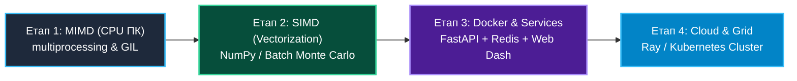

# Наскрізний проєкт: Симуляція стійкості енергосистеми IEEE-118 методом Монте-Карло

> **Декларація курсу.** Академічна доброчесність та авторство матеріалів — у [DISCLAIMER.md](DISCLAIMER.md).

Цей документ описує **наскрізний проєкт** на весь семестр. Кожна практика — крок від скрипта на ноутбуці до хмарного кластера.

---

## 1. Архітектурний кейс та фізична задача

**Об'єкт дослідження:** Енергомережа **IEEE-118 Bus System** (118 високовольтних підстанцій та 186 ліній електропередач) на основі даних та концепцій з дослідження [PowerGraph-XAI](https://github.com/PowerGraph-Datasets/PowerGraph-XAI).

### Фізика каскадної відмови (Blackout Scenario):
1. **Початковий шок (N-k аварія):** Випадково або внаслідок атаки/негоди виходять з ладу $k$ ліній електропередач.
2. **Перерозподіл навантаження:** Струм із пошкоджених ліній миттєво перерозподіляється між тими, що залишилися.
3. **Каскадна реакція:** Якщо перевантаження сусідньої лінії перевищує її критичний допуск ($\text{Load} > \text{Capacity}$), вона автоматично вимикається захистом. Це викликає "доміно-ефект" (каскадне відключення всієї енергосистеми).

### Задача методу Монте-Карло:
Провести $N = 10^5 \dots 10^7$ випадкових випробувань комбінацій початкових аварій для:
- Оцінки ймовірності настання тотального блек-ауту;
- Визначення найбільш уразливих ("критичних") ліній та підстанцій (XAI — Explainable AI metrics);
- Розрахунку показника стійкості мережі за умов різного рівня споживання.

---

## 2. Еволюція проєкту за етапами курсу

---

### Етап 1. Локальне розпаралелювання на CPU (MIMD на ПК)
- **Мета:** Ознайомитися з багатьма ядрами CPU, обходом GIL у Python та вимірюванням прискорення.
- **Задача:**
  - Реалізувати однопотокову симуляцію каскадних відмов IEEE-118.
  - Розпаралелити симуляцію траєкторій Монте-Карло на всі ядра CPU за допомогою `multiprocessing.Pool`.
  - Заміряти прискорення ($S$), ефективність ($E$) та побудувати графік залежності часу від кількості ядер (Закон Амдала).
- **Результат:** CLI-програми з можливістю генерації `benchmark_results_mimd_pc.json`.

---

### Етап 2. Векторизація та SIMD-оптимізація (NumPy / Matrix Operations)
- **Мета:** Ознайомитися з парадигмою векторизації (Single Instruction, Multiple Data) без залежності від наявності дискретної відеокарти у студента.
- **Задача:**
  - Оптимізувати обчислювальне ядро Монте-Карло, замінивши поелементні цикли Python на векторизовані матричні операції (`NumPy`).
  - Реалізувати батчеву (*batch*) обробку траєкторій Монте-Карло для одночасного розрахунку навантажень масиву ліній.
  - Порівняти метрики: скалярне виконання на CPU проти векторизованого SIMD-виконання (пропускна здатність у траєкторіях/сек).
  - *(Опціонально)* Для бажаючих: запуск векторизованого алгоритму на хмарному GPU у **Google Colab** (PyTorch / CuPy).
- **Результат:** Звіт із порівняльним аналізом скалярних та векторизованих обчислень.

---

### Етап 3. Контейнеризація та Мікросервісна Архітектура
- **Мета:** Перетворити обчислювальний скрипт у готовий до продакшену відтворюваний сервіс.
- **Задача:**
  - Запакувати обчислювальне ядро в **Docker-контейнер**.
  - Розділити систему на мікросервіси:
    1. **Worker Service:** Обчислювальний модуль (Python / Docker);
    2. **Task Queue (Redis/RabbitMQ):** Черга задач для асинхронної обробки;
    3. **API Gateway (FastAPI):** REST API для прийому параметрів симуляції;
    4. **Web Dashboard:** Інтерфейс візуалізації графа IEEE-118 та анімації каскадних відмов.
- **Результат:** `docker-compose.yml`, який піднімає весь стек однією командою.

---

### Етап 4. Грід-обчислення та Хмарна Оркестрація (Ray / Kubernetes)
- **Мета:** Запустити масштабовану симуляцію на кластері з багатьох вузлів.
- **Задача:**
  - Зарозгортати обчислення на розподіленому кластері (Ray Cluster або Kubernetes Jobs).
  - Реалізувати відмовостійкість: якщо один вузол кластера падає під час симуляції, задача перерозподіляється на інші.
  - Провести підсумковий розрахунок $10^7$ траєкторій для визначення топ-5 найнебезпечніших ліній електромережі.
- **Результат:** Хмарний запуск, підсумкова аналітична панель та фінальний захист проєкту.

---

## 3. Фінальні критерії оцінювання проєкту

Кожен етап оцінюється окремо під час відповідної лабораторної роботи, а наприкінці семестру студент презентує **комплексну систему**:

1. **GitHub-репозиторій:** Чиста структура коду, історія коммітів, інструкція із запуску.
2. **Docker / Docker Compose:** Безпроблемний запуск проєкту "з коробки".
3. **Бенчмарки та аналітика:** Порівняльна таблиця продуктивності (1 CPU vs N CPU vs GPU vs Distributed Cluster).
4. **Розуміння коду:** Здатність студента пояснити будь-яку частину реалізованого алгоритму та захистити свої рішення.
