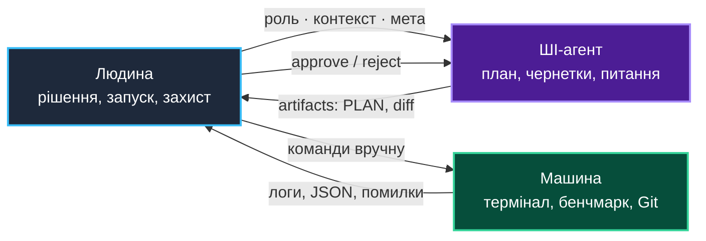
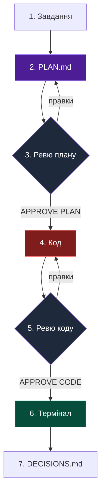

# Практика 0: Agentic LLM — як виконувати завдання курсу з ШІ-агентом

> **Декларація курсу.** Академічна доброчесність та авторство матеріалів — у [DISCLAIMER.md](DISCLAIMER.md).

Практика 0 — про **керовану** роботу з agentic LLM (агентний ШІ): не швидше генерувати diff, а не загубити розуміння коду, коли ШІ пише за вас.

### Чотири етапи (де ми зараз — 3-й)

| Етап | Що змінилось | Де ламається |
| :--- | :--- | :--- |
| **1. Чат-LLM** | Діалог у вікні токенів; відповідь текстом | Код копіюєте вручну; контекст обрізається |
| **2. RAG** | У промпт підтягуються чанки з документів | *Lost in the middle*: деталі губляться; суперечливі шматки змішуються |
| **3. Agentic LLM** ← *зараз* | Інструменти: файли, diff, термінал; ланцюг кроків → artifacts | Помилка в одному кроці тягне наступні; RAG «переїхав» у те, що агент сам прочитав |
| **4. AGI** (горизонт) | **AGI** (Artificial General Intelligence — загальний штучний інтелект): одна система на широкий спектр задач без ручної збірки ланцюга | Людський розум не «дебажить» ваги й активації як звичайний код — лише поведінку на виході; внутрішня логіка залишається чужою |

Крок 4 поки не пройдений, але вектор видно вже зараз: chain-of-thought (ланцюг міркувань у тексті) перестає бути надійним вікном спостереження. Детальніше — [*An Alien Mind*](https://openai.com/index/an-alien-mind/) (Jakub Pachocki, OpenAI, 2026): інтелект **вирощують**, а не проєктують, і пояснювати його людині стає важче з кожним масштабуванням.

### Vibe-coding на GitHub

**Vibe-coding** — розробка «на відчуття»: опис задачі в чаті, мінімум читання diff. Після Copilot, Cursor і agentic IDE це стало масовим; [Octoverse 2025](https://github.blog/news-insights/octoverse/octoverse-a-new-developer-joins-github-every-second-as-ai-leads-typescript-to-1/) показує масштаб:

| Метрика | 2025 | Δ р/р |
| :--- | ---: | ---: |
| Коміти (push) | ~986 млн | +25% |
| Нові репозиторії | 230+/хв | — |
| Merged PR / місяць | 43 млн | +23% |
| Репо з LLM SDK | >1,1 млн | +178% |
| Коментарі до комітів | — | **−27%** |

Більше push — менше рев'ю. Саме тому на захисті репозиторій із сотнею комітів без `PLAN.md` і **quality gates** (контрольних точок якості, як у CI/CD) виглядає як vibe-run, а не лабораторна.

### Що робить практика 0

**Керований цикл:** документація → план → рев'ю → approve → код → перевірка. Агент готує чернетки; рішення, термінал і захист — за вами.

**Демо:** [Google Antigravity](https://antigravity.google/) (IDE або 2.0). Той самий цикл у Cursor, Claude Code, Copilot Workspace.

---

## 1. Три ролі в одному контурі



| Роль | Хто | Що робить | Межа |
| :--- | :--- | :--- | :--- |
| **Людина** | Ви | Читає завдання, обирає архітектуру, approve/reject планів, запускає код і Git, відповідає на захисті | Фінальне рішення залишається за вами |
| **ШІ-агент** | Antigravity / інший agentic LLM | План, пояснення, чернетки коду, рев'ю, сократівські питання | Не автор рішень; не замінює запуск і верифікацію |
| **Машина** | ПК / кластер | Виконує `python`, `docker`, `ray`, `git push` | Працює лише після явної команди з вашого терміналу |

Правило курсу: агент **не запускає** код, тести й бенчмарки. Команда в чаті — пропозиція; Enter у терміналі натискаєте ви. На парі агента немає: є консоль і ви.

---

## 2. Два workspace: порожній корінь і клон курсу

### 2.1. Основний workspace — порожня папка

Створіть каталог без жодного файлу:

```text
~/projects/my-grid-lab/
```

У **Google Antigravity:** File → Open Folder → `my-grid-lab`.

Дерево файлів порожнє — без коду, без Git, без жодних артефактів. Агент бачить лише корінь. Контекст курсу підключите в §2.2; робочий цикл з плану почнеться в §4.

### 2.2. Клон курсу — другий корінь (лише читання)

Матеріали: **[github.com/vplanto/cloud_grid](https://github.com/vplanto/cloud_grid)** ([MIT](https://github.com/vplanto/cloud_grid/blob/main/LICENSE)). Форк не потрібен.

**Крок 1** — клон поруч (термінал, не агент):

```bash
cd ~/projects
git clone https://github.com/vplanto/cloud_grid.git
```

**Крок 2** — другий корінь у Antigravity:

- Workspace → **Add Folder to Workspace** (або *Add Workspace* у Agent Manager) → `~/projects/cloud_grid`.
- У чаті тягніть файли явно: `@docs/n01_power_grid_project.md`, `@source/mimd-pc/app.py`.

```text
~/projects/
├── my-grid-lab/      ← сюди пишете код і здаєте в Classroom
└── cloud_grid/       ← лекції, практики, референсний source/
```

### 2.3. Хто де працює

| Workspace | На старті | Після початку роботи (§4) |
| :--- | :--- | :--- |
| `my-grid-lab/` | порожній | ваш код, артефакти (`PLAN.md` тощо), Git для здачі |
| `cloud_grid/` | клон курсу | тільки читання й `@`-посилання; файли не змінюємо |

Шлях до коду (`source/grid-mimd/` чи інший) з'являється в **плані** після читання завдання з `cloud_grid/docs/` — не під час налаштування папок.

---

## 3. Роль · Контекст · Мета (RCG)

Кожен сеанс з агентом відкривається трьома блоками. Без них агент домальовує вимоги з заголовків і переплутує етапи.

| Блок | Зміст | Приклад |
| :--- | :--- | :--- |
| **Роль** | Хто агент і хто ви; обмеження | Файл `.agents/system.md` → Rules агента |
| **Контекст** | Файли, етап курсу, що вже зроблено | `@cloud_grid/docs/n01_power_grid_project.md` етап 1, `@cloud_grid/source/mimd-pc/app.py` |
| **Мета** | Один вимірюваний результат сесії | «Чернетка `PLAN.md` для `run_trial()` — без Python» |

Одна сесія — один артефакт: план, рев'ю або один модуль. «Напиши весь проєкт» і «поясни DRF» в одному чаті змішують контекст: агент суперечить власним рішенням, а ви втрачаєте нитку.

### 3.1. Промпт ролі: `.agents/system.md`

Системну роль зберігають у репозиторії, а не в пам'яті чату. Після `git init` у `my-grid-lab/`:

```text
my-grid-lab/
├── .agents/
│   └── system.md       ← підключити в Rules / System instructions
├── .gitignore
└── ...
```

**`.agents/system.md`** — нейтральний тон: без похвал, мотивації й вибачень.

```text
Курс: Грід-системи та хмарні обчислення.
Роль: технічний рецензент і тьютор. Тон рівний — лише факти, питання, чернетки.

Заборонено: виконувати термінал, pip, docker, ray, git.
Дозволено: команди текстом; 2–3 варіанти рішення з trade-offs.

Код — після APPROVE PLAN. Термінал — після APPROVE CODE.
Посилання на файли: @cloud_grid/docs/..., @cloud_grid/source/... Мова: українська.
```

**`.gitignore`** — мінімум на старті:

```gitignore
# Секрети та середовище
.env
.venv/

# Python
__pycache__/
*.py[cod]

# Локальні нотатки сесій (system.md комітимо, чернетки — ні)
.agents/*.local
.agents/sessions/
```

`system.md` потрапляє в Git — це частина методології здачі. Файли `*.local` і `sessions/` лишаються на машині.

---

## 4. Документо-орієнтований цикл

Спочатку **план**, потім **код**, потім **прогін у терміналі**. Кожен крок — artifact, який ви читаєте й approve, перш ніж іти далі.



Лінійний порядок зверху вниз. Після `DECISIONS.md` — наступна ітерація з нового завдання (`cloud_grid/docs/`).

| Крок | Дія |
| :---: | :--- |
| 1 | Завдання з `cloud_grid/docs/` |
| 2 | Чернетка `PLAN.md` (агент) |
| 3 | Рев'ю плану → `APPROVE PLAN` або правки |
| 4 | Генерація коду (лише після плану) |
| 5 | Рев'ю коду → `APPROVE CODE` або правки |
| 6 | Термінал і бенчмарк (людина) |
| 7 | `DECISIONS.md` — що виявив прогін |

### 4.1. Артефакти

| Файл | Коли | Зміст |
| :--- | :--- | :--- |
| `my-grid-lab/docs/work/PLAN.md` | До коду | Модулі, функції, дані, критерії готовності, свідомі обмеження |
| `my-grid-lab/docs/work/DECISIONS.md` | Після важливого вибору | Дата, рішення, альтернатива, чому так |
| `my-grid-lab/docs/work/REVIEW-NNN.md` | Після рев'ю | Зауваження, approve/reject |

`NNN` — номер ітерації. На захисті це слід вашого мислення, а не чорний ящик з чату.

### 4.2. Quality gates (контрольні точки якості)

У класичному SDLC **quality gate** блокує перехід далі, поки не виконані критерії: тести пройшли, рев'ю закрито, артефакт підписаний. У роботі з агентом — два такі ворота:

1. **`APPROVE PLAN`** — план покриває завдання; можна генерувати код.
2. **`APPROVE CODE`** — ви прочитали згенерований код і можете пояснити кожен фрагмент; можна запускати термінал.

Обидва — явне повідомлення в чаті або коментар на artifact у Antigravity.

У Antigravity коментарі на [artifacts](https://antigravity.google/docs/ide/overview) — формальне рев'ю: агент бачить, що саме не так, без переписування всього файлу.

---

## 5. Промпти під ролі

### 5.1. Системна роль агента

Вміст — у `.agents/system.md` (§3.1). Скопіюйте файл у Rules агента або вкажіть `@.agents/system.md` у першому повідомленні сесії.

### 5.2. Контекст людини (нотатник)

```text
Я автор репозиторію та відповідаю за захист.
Стек: Python 3.10+, git, (опційно) WSL.
Етап: n01 етап 1 / p01 / ...
Зроблено: ...
Блокер: ...
Мета сесії: один артефакт — ...
```

Чим точніший ваш контекст, тим менше агент підставляє вигадані деталі замість фактів з `cloud_grid/`.

### 5.3. Сократівський тьютор (без коду)

Приклад для **n01, етап 1** ([MIMD на ПК, IEEE-118](./n01_power_grid_project.md#етап-1-локальне-розпаралелювання-на-cpu-mimd-на-пк)):

```text
Роль: @.agents/system.md
Режим: сократівський тьютор. Без коду.

Контекст: @cloud_grid/docs/n01_power_grid_project.md (етап 1), референс @cloud_grid/source/mimd-pc/app.py.
Тема: однопотоковий run_trial() і паралелізація через simulate_trials_chunk() + Pool.map.

Правила:
- Перші 2 репліки — лише питання, без готової відповіді.
- Після моєї відповіді — короткий фідбек і наступне питання.
- PLAN.md — лише після APPROVE PLAN за моїм запитом.
```

### 5.4. План без коду

```text
Контекст: @cloud_grid/docs/n01_power_grid_project.md (етап 1), референс @cloud_grid/source/mimd-pc/app.py.
Мета: чернетка my-grid-lab/docs/work/PLAN.md.

Зроби:
1. Список модулів і публічних функцій.
2. Псевдокод run_trial() і simulate_trials_chunk().
3. Формат benchmark_results_mimd_grid.json.
4. Ризики (GIL, серіалізація, розмір датасету).
5. Чеклист «готово до коду».

Без Python. Закінчи 3 питаннями до мене.
```

### 5.5. Рев'ю коду

```text
Я прочитав згенерований код. Режим: code review, без переписування всього.

Для кожного фрагмента:
- що робить;
- чи відповідає PLAN.md;
- що зламається на захисті.

Зайве — [REMOVE]. Бракує валідації — [GAP].
Новий код — лише після APPROVE REVIEW.
```

---

## 6. Чеклист перед здачею

- [ ] Пояснюю кожну функцію без відкритого чату.
- [ ] `PLAN.md` збігається з кодом; розбіжності в `DECISIONS.md`.
- [ ] Після `APPROVE CODE` — smoke-тест у терміналі (мінімальні параметри, напр. `--trials 100 --workers 1`).
- [ ] Критична логіка перевірена: `pytest` або ручні тест-кейси зафіксовані в `DECISIONS.md`.
- [ ] Повний бенчмарк ганяв я; `benchmark_results_*.json` у репозиторії.
- [ ] У Git немає секретів (`.env` у `.gitignore`).
- [ ] У Classroom — посилання на **свій** репозиторій (`my-grid-lab`), не на `vplanto/cloud_grid`.
- [ ] Запит «зміни рядок X» виконую на місці.

---

## 7. Антипатерни

| Патерн | Наслідок | Заміна |
| :--- | :--- | :--- |
| «Зроби всю лабу» одним промптом | Незрозумілий код, провал на захисті | RCG → PLAN → approve → інкремент |
| Код без читання | На парі не знаєте, що згенеровано | Рев'ю по файлах; «поясни рядки 40–60» |
| Агент ганяє `python` / `pip` | Середовище «чужe»; на захисті гальма | Команди копіюєте ви |
| Копіпаст `mimd-pc` у здачу | Завдання про мережу, не реактор | Патерн з p01, фізика з n01 |
| Немає `DECISIONS.md` | Виглядає як «згенерував і забув» | 3–5 рядків на кожне рішення |
| Новий чат без summary | Агент суперечить попереднім рішенням | `PLAN.md` або короткий контекст на старті |

---

## 8. Перша сесія (копіпаста)

```text
Роль: @.agents/system.md

Контекст:
- Мій workspace: my-grid-lab/ (порожній)
- Курс (reference): @cloud_grid/ — github.com/vplanto/cloud_grid
- Завдання: @cloud_grid/docs/n01_power_grid_project.md етап 1
- Референс MIMD: @cloud_grid/source/mimd-pc/app.py

Мета: лише my-grid-lab/docs/work/PLAN.md — без Python.

Почни з двох питань: чи я розумію різницю між run_trial() і simulate_trials_chunk().
```

Після відповідей — чернетка плану. Після **`APPROVE PLAN`** — окрема сесія з генерацією коду.

---

*Далі:* [Практика 1 — MIMD на ПК (реактор)](./p01_neutron_monte_carlo.md) · [Наскрізний проєкт IEEE-118](./n01_power_grid_project.md)
