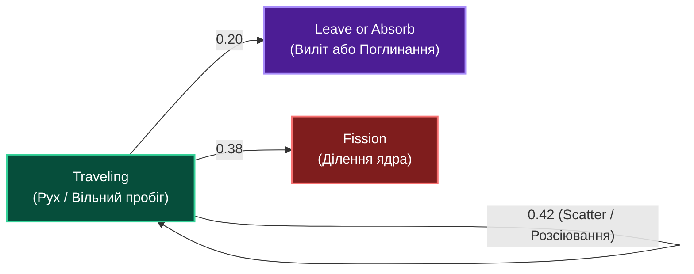
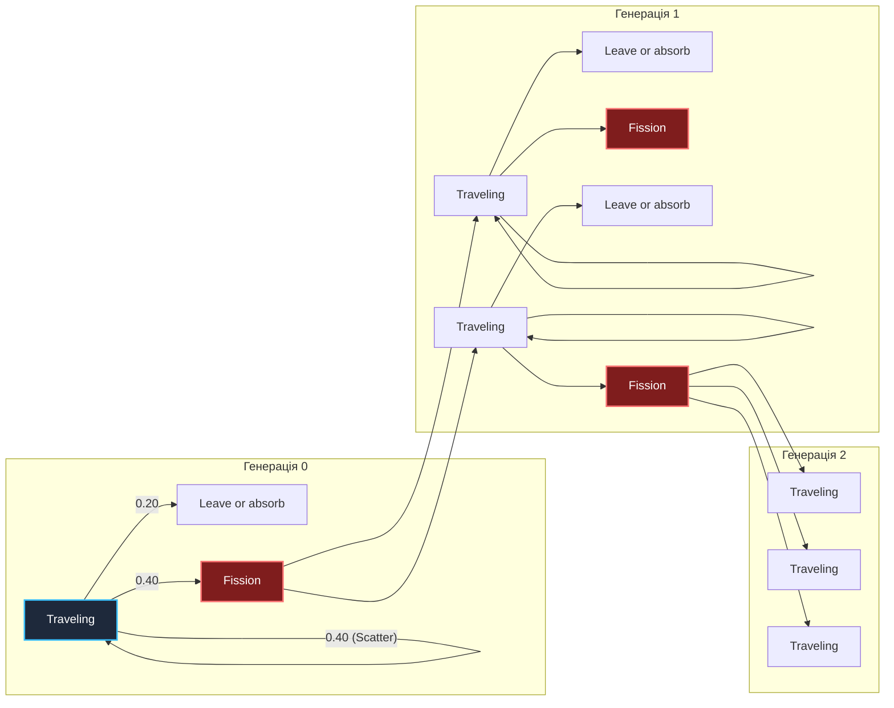
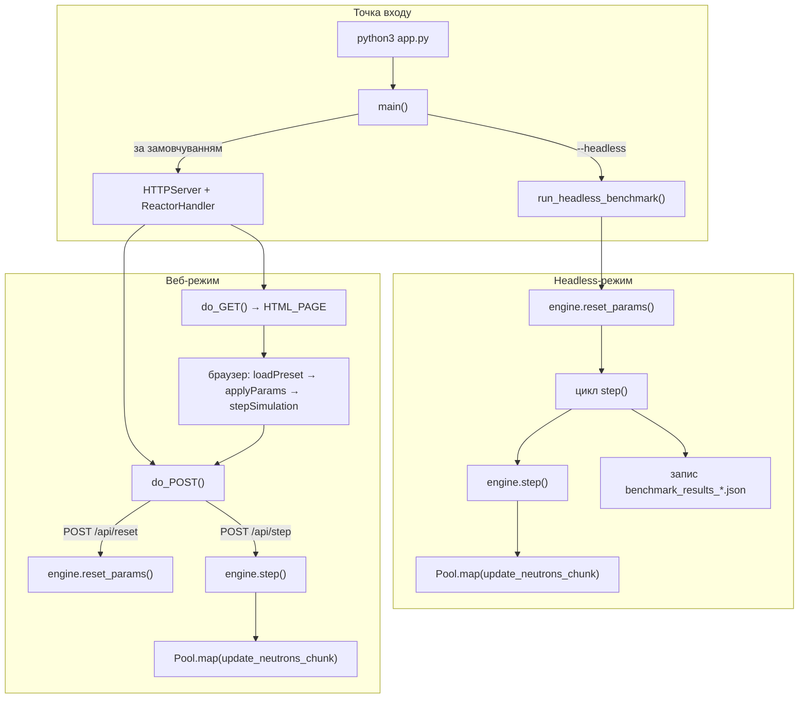
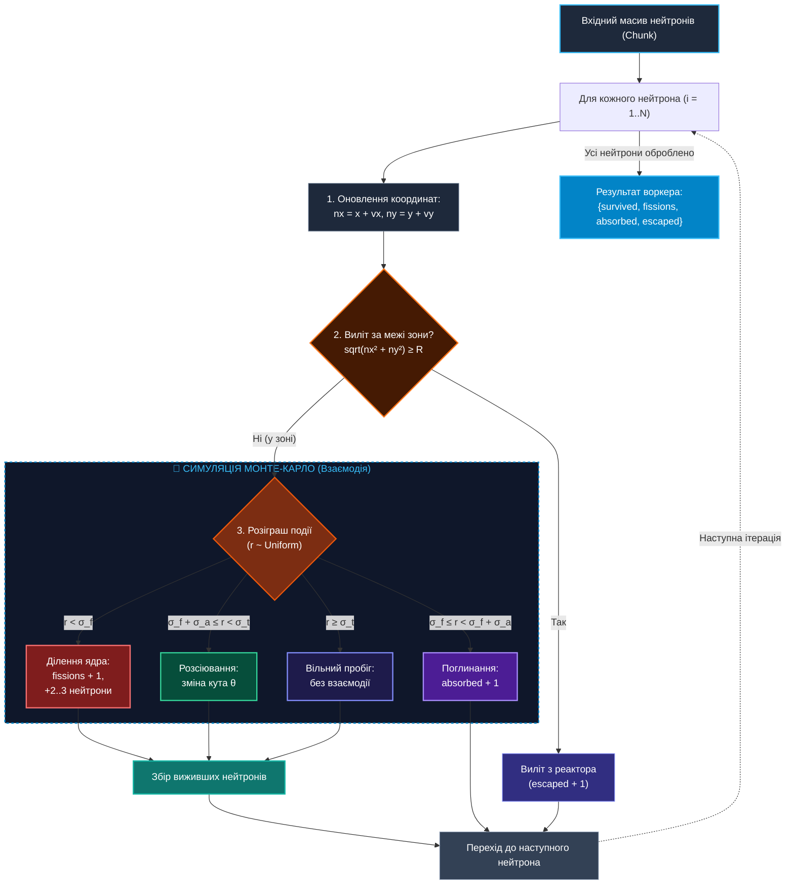
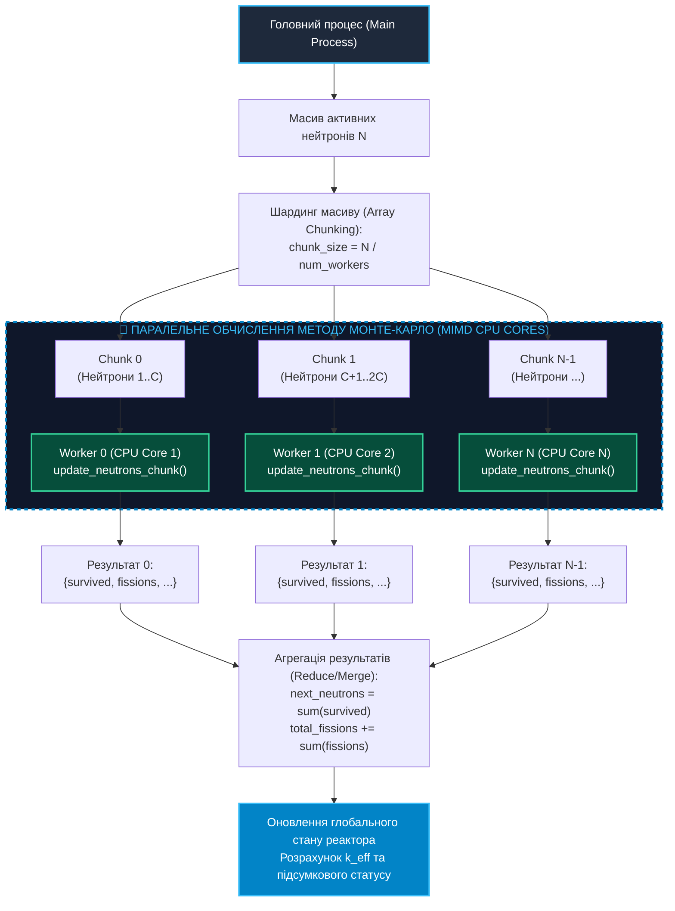

# Практична робота 1: Симуляція Монте-Карло для ділення нейтронів з візуалізацією у браузері (MIMD на ПК)

> **Декларація курсу.** Академічна доброчесність та авторство матеріалів — у [DISCLAIMER.md](DISCLAIMER.md).

---

## 1. Мета роботи

Ознайомитися з практичною реалізацією паралельних обчислень за методом Монте-Карло на багатоядерних персональних комп'ютерах (архітектура **MIMD**). Навчитися розпаралелювати обчислювально місткі задачі за допомогою модуля `multiprocessing` у Python. Візуалізація траєкторій у браузері — **допоміжна** задача: простий веб-інтерфейс для перевірки результатів симуляції, а не головна мета роботи.

---

## 2. Постановка задачі

Повна математична та фізична постановка задачі переносу та ділення нейтронів методом Монте-Карло доступна у документі **[Постановка задачі (source/README.md)](https://github.com/vplanto/cloud_grid/blob/main/source/README.md)**.

### 2.1. Ймовірнісний граф станів нейтрона
Схема ймовірностей для кожного кроку переносу нейтронів:



### 2.2. Дерево каскадної ланцюгової реакції та коефіцієнт розмноження ($k$)
Дерево розгалуження генерацій нейтронів при діленні ядер:



---

## 3. Вихідний код та архітектура MIMD

Готовий реалізований Python-проєкт розміщено в каталозі [`source/mimd-pc/app.py`](https://github.com/vplanto/cloud_grid/blob/main/source/mimd-pc/app.py).

Файл — один модуль, який об'єднує **обчислювальне ядро**, **HTTP-сервер** і **headless-бенчмарк**. Нижче — карта файлу: у якому порядку йдуть блоки, які методи є і хто їх викликає. Без фрагментів коду — лише структура.

### 3.1. Блоки файлу (зверху вниз)

| № | Блок у `app.py` | Призначення |
| :--- | :--- | :--- |
| 1 | `import …` | Стандартна бібліотека: `argparse`, `json`, `multiprocessing`, `HTTPServer` |
| 2 | `class ReactorSimulationEngine` | Стан реактора та один тик симуляції (`step`) |
| 3 | `def update_neutrons_chunk` | Обчислення Монте-Карло для одного шматка масиву нейтронів (воркер) |
| 4 | `engine = ReactorSimulationEngine()` | Глобальний екземпляр двигуна — спільний для веб-режиму |
| 5 | `HTML_PAGE = """…"""` | Вбудована HTML-сторінка з CSS, Canvas і JavaScript (dashboard) |
| 6 | `class ReactorHandler` | HTTP-обробник: `GET /` і `POST /api/*` |
| 7 | `def run_headless_benchmark` | Консольний прогін без браузера + запис JSON |
| 8 | `def main` | Точка розгалуження: веб-сервер або `--headless` |
| 9 | `if __name__ == "__main__"` | Запуск `main()` при прямому виклику скрипта |

### 3.2. Методи Python і місця виклику

#### `ReactorSimulationEngine`

| Метод | Що робить | Хто викликає |
| :--- | :--- | :--- |
| `__init__()` | Створює двигун із дефолтними параметрами (паливо 50%, 350k fast + 150k slow, `num_workers = cpu_count()`) | `engine = ReactorSimulationEngine()` при завантаженні модуля |
| `reset_params(params)` | Скидає лічильники, перегенеровує початковий масив `self.neutrons` за `fuel_mass`, `n_fast`, `n_slow`, `num_workers` | `__init__()`; `ReactorHandler.do_POST()` → `POST /api/reset`; `run_headless_benchmark()` на старті бенчмарку |
| `get_state()` | Повертає знімок стану **без** обчислення тику (статус, k, вибірка до 750 нейтронів для Canvas) | `step()` — якщо активних нейтронів 0 або > 3.5M (ранній вихід) |
| `step()` | Один тик: шардить `self.neutrons`, запускає `Pool.map(update_neutrons_chunk, …)`, зливає результати, рахує `k_factor` і `status` | `ReactorHandler.do_POST()` → `POST /api/step`; цикл у `run_headless_benchmark()` |

#### `update_neutrons_chunk` (функція модуля, не метод класу)

| Функція | Що робить | Хто викликає |
| :--- | :--- | :--- |
| `update_neutrons_chunk(args)` | Для кожного нейтрона в chunk: рух → виліт / ділення / поглинання / розсіювання. Повертає `{survived, fissions, absorbed, escaped, new_born}` | `ReactorSimulationEngine.step()` через `multiprocessing.Pool.map(...)` — по одному виклику на кожен CPU-воркер і chunk |

#### `ReactorHandler` (HTTP)

| Метод | Що робить | Хто викликає |
| :--- | :--- | :--- |
| `do_GET()` | `GET /` або `/index.html` → віддає `HTML_PAGE` | Браузер при відкритті `http://localhost:8080/` |
| `do_POST()` | Маршрутизація: `/api/reset` → `engine.reset_params()`; `/api/step` → `engine.step()` → JSON у відповідь | JavaScript у `HTML_PAGE`: `fetch('/api/reset')` з `applyParams()`, `fetch('/api/step')` з `stepSimulation()` |

#### Точка входу та бенчмарк

| Функція | Що робить | Хто викликає |
| :--- | :--- | :--- |
| `run_headless_benchmark(params, max_steps, output_file)` | `reset_params` → цикл `step()` до `max_steps` або термінального статусу → друк метрик → `benchmark_results_mimd_pc.json` | `main()` при прапорці `--headless` |
| `main()` | Розбирає CLI (`--headless`, `--fuel`, `--fast`, `--slow`, `--steps`, `--workers`, `--port`, `--out`); або бенчмарк, або `HTTPServer.serve_forever()` | `if __name__ == "__main__"` |

### 3.3. JavaScript у `HTML_PAGE` (клієнтська частина)

Вбудований у рядок `HTML_PAGE`, не окремий файл:

| Функція | Що робить | Хто викликає |
| :--- | :--- | :--- |
| `drawReactorCore()` | Малює коло активної зони на Canvas | Завантаження сторінки; після кожного `stepSimulation()` і `applyParams()` |
| `stepSimulation()` | `POST /api/step` → оновлює метрики й точки нейтронів на Canvas | `toggleRun()` (кожні 250 ms); `applyParams()` після reset |
| `toggleRun()` | Старт/пауза `setInterval(stepSimulation, 250)` | Кнопка «Запустити неперервно» |
| `applyParams(params)` | `POST /api/reset` з JSON-параметрами → один крок симуляції | `loadPreset('explosion' \| 'control' \| 'extinction')` |
| `loadPreset(name)` | Виставляє слайдери пресету й викликає `applyParams()` | Кнопки 💥 / 🔋 / ❄️ на dashboard |

### 3.4. Граф викликів (два режими запуску)



### 3.5. Обчислювальне ядро та MIMD-шар

Нижче — деталізація саме обчислювального контуру (те, що відбувається всередині `step()` → `update_neutrons_chunk`).

#### Схема алгоритму `update_neutrons_chunk`



2. **Паралельний пул (`multiprocessing.Pool`):** Усередині `ReactorSimulationEngine.step()` — шардинг масиву та `pool.map(update_neutrons_chunk, task_args)`.

#### Схема паралельного розподілу в `step()`



3. **Веб-шар (`ReactorHandler` + `HTML_PAGE`):** `do_GET` віддає dashboard; `do_POST` на `/api/reset` і `/api/step` делегує в `engine`. Клієнтська частина (Rendering Path, `POST`) — [Лекція 4: Браузер зсередини](https://vplanto.github.io/java_script/04_browser_internals.html), [Лекція 7: HTTP/S та REST](https://vplanto.github.io/java_script/07_http_rest.html).

```
 ┌─────────────────────────────────────────────────────────────────────────────┐
 │                           Веб-браузер (Клієнт)                              │
 │     loadPreset / toggleRun → stepSimulation / applyParams → Canvas          │
 └──────────────────────────────────────┬──────────────────────────────────────┘
                                        │ POST /api/step  ·  POST /api/reset
                                        ▼
 ┌─────────────────────────────────────────────────────────────────────────────┐
 │              ReactorHandler (Main Process) → engine.step() / reset_params() │
 └──────────────────────────────────────┬──────────────────────────────────────┘
                                        │ multiprocessing.Pool.map
                ┌───────────────────────┼───────────────────────┐
                ▼                       ▼                       ▼
     ┌─────────────────────┐ ┌─────────────────────┐ ┌─────────────────────┐
     │ update_neutrons_chunk│ │ update_neutrons_chunk│ │ update_neutrons_chunk│
     │   (Worker / Core 1)  │ │   (Worker / Core 2)  │ │   (Worker / Core N)  │
     └─────────────────────┘ └─────────────────────┘ └─────────────────────┘
```

---

## 4. Інструкція із запуску та інтерфейс

### Крок 1. Запуск неперервного серверного застосунку
Відкрийте термінал у корені проєкту та виконайте команду:

```bash
python3 source/mimd-pc/app.py
```

Ви побачите повідомлення:
```text
=== Monte Carlo Reactor Simulation (MIMD PC) ===
Server running at http://localhost:8080/
CPU Cores Available: 8
```

### Крок 2. Робота у браузері та Швидкі Демо-Пресет Режими
Перейдіть за адресою [http://localhost:8080/](http://localhost:8080/) у браузері.

Для миттєвої демонстрації у верхній частині панелі доступні **3 кнопки Демо-Пресетів (Мега-масштаб 1M+)**:
- 💥 **[Вибух]:** 90% палива, 600,000 швидких та 300,000 повільних нейтронів → неконтрольоване розмноження до 1,500,000+ частинок.
- 🔋 **[Контроль]:** 50% палива, 350,000 швидких та 150,000 повільних нейтронів → утримує рівноважний критичний стан ($k \approx 1.0$).
- ❄️ **[Затухання]:** 25% палива, 150,000 швидких та 30,000 повільних нейтронів → згасання реакції ($k < 0.75$).

Паралельний розрахунок **500,000 – 1,500,000 активних нейтронів** на пулі процесів `multiprocessing.Pool` завантажує 100% усіх ядер процесора в `htop` на кожному тику симуляції.

### Крок 3. Запуск у Headless Бенчмарк-режимі (Без браузера)
Для точного вимірювання продуктивності CPU, фіксації часу виконання та подальшого порівняння з іншими архітектурами (GPU, Cloud кластери) розроблено консольний Headless-режим:

```bash
python3 source/mimd-pc/app.py --headless --steps 30 --out source/mimd-pc/benchmark_results_mimd_pc.json
```

Параметри консольного запуску:
- `--headless`: Запуск без підйому веб-сервера (чисті CLI-обчислення);
- `--steps 30`: Кількість тиків симуляції для бенчмарку;
- `--fuel 50`: Кількість палива в реакторі (%);
- `--fast 350000` / `--slow 150000`: Початковий масив частинок;
- `--out source/mimd-pc/benchmark_results_mimd_pc.json`: Збереження підсумкового JSON-звіту для подальшого порівняння.

---

## 5. Завдання для практичного виконання

### Завдання 1. Дослідження демо-режимів реактора (Мега-Масштаб 1M+)
1. Почергово натисніть кнопки пресетів **💥 Вибух**, **🔋 Контроль**, **❄️ Затухання**.
2. Зафіксуйте кількість активних нейтронів, кількість подій ділення ядра та підсумковий коефіцієнт $k$.
3. Заповніть порівняльну таблицю:

| Демо-Режим | Паливо (%) | Швидкі | Повільні | Підсумковий статус | Коефіцієнт $k$ |
| :--- | :--- | :--- | :--- | :--- | :--- |
| **Вибух** | 90% | 600 000 | 300 000 | 💥 EXPLOSION | $> 1.10$ |
| **Контроль** | 50% | 350 000 | 150 000 | 🔋 STABLE_RUN | $\approx 1.00$ |
| **Затухання** | 25% | 150 000 | 30 000 | ❄️ EXTINCTION | $< 0.75$ |

### Завдання 2. Headless-бенчмарк та фіксація результатів для порівняння
1. Запустіть Headless-бенчмарк на 30 кроків:
   `python3 source/mimd-pc/app.py --headless --steps 30`
2. Перевірте згенерований файл [`source/mimd-pc/benchmark_results_mimd_pc.json`](https://github.com/vplanto/cloud_grid/blob/main/source/mimd-pc/benchmark_results_mimd_pc.json).
3. Занотуйте підсумкові метрики для майбутнього порівняльного аналізу з GPU/Cloud архітектурами:
   - Загальний час виконання $T_{\text{total}}$ (сек);
   - Середній час обчислення одного тику $T_{\text{step}}$ (мс);
   - Швидкість прорахунку частинок (нейтронів/сек).

---

## 6. Контрольні питання

<details markdown="1">
<summary><b>1. Чому симуляцію переносу нейтронів методом Монте-Карло називають "ідеально паралельною" (Embarrassingly Parallel) задачею?</b></summary>

Тому що доля кожного початкового нейтрона обчислюється повністю автономно та незалежно від інших нейтронів. Вузлам (Worker процесам) не потрібно синхронізувати стан або обмінюватися даними в процесі симуляції, що зводить накладні витрати на міжпроцесну взаємодію до мінімуму.
</details>

<details markdown="1">
<summary><b>2. Що відбувається з прискоренням (Speedup), якщо задати кількість воркерів `num_workers` більшою за кількість фізичних або віртуальних ядер процесора?</b></summary>

Прискорення перестає рости — і починає падати. Зайвий воркер = context switching, боротьба за кеш. Фізичних ядер більше не стає.
</details>

<details markdown="1">
<summary><b>3. Як зміна перерізу розсіювання $\Sigma_s$ впливає на коефіцієнт критичності $k_{eff}$ при незмінному радіусі $R$?</b></summary>

Збільшення $\Sigma_s$ зростає ймовірність відскоку нейтрона всередині зони. Це подовжує траєкторію нейтрона всередині реактора, зменшує ймовірність його вильоту назовні (Escaped) та збільшує ймовірність ділення ядра, що підвищує $k_{eff}$.
</details>
