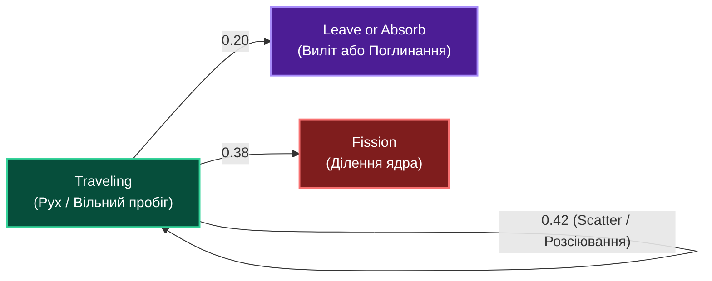
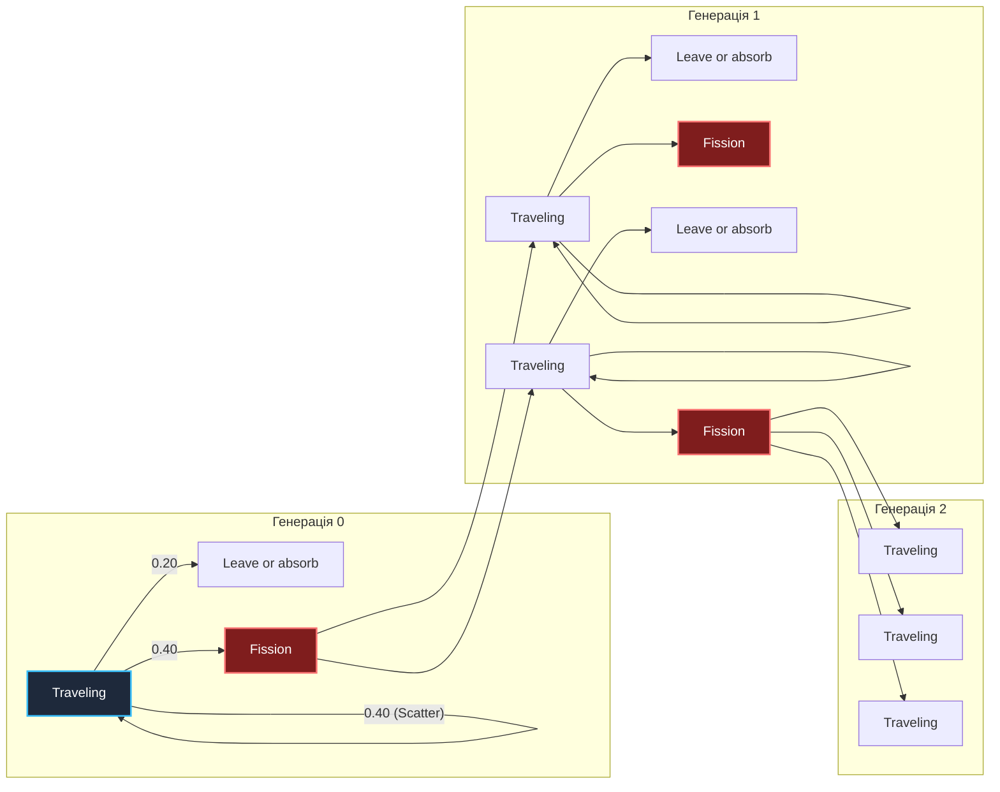
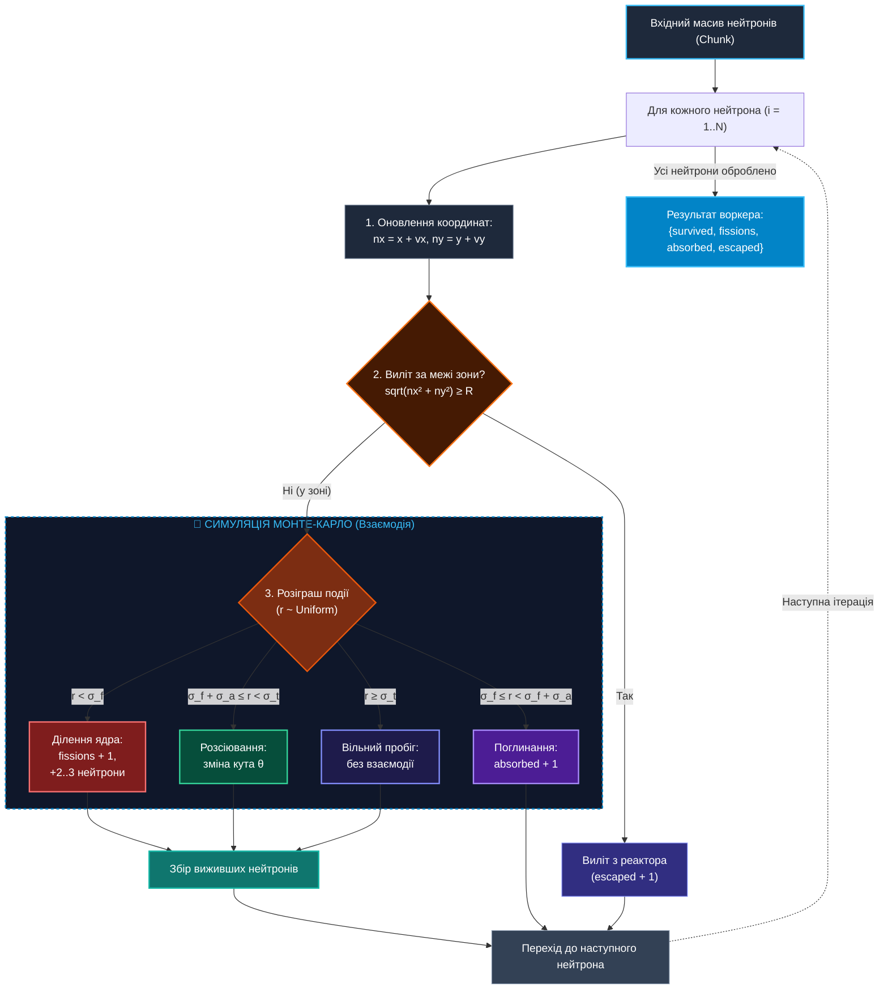
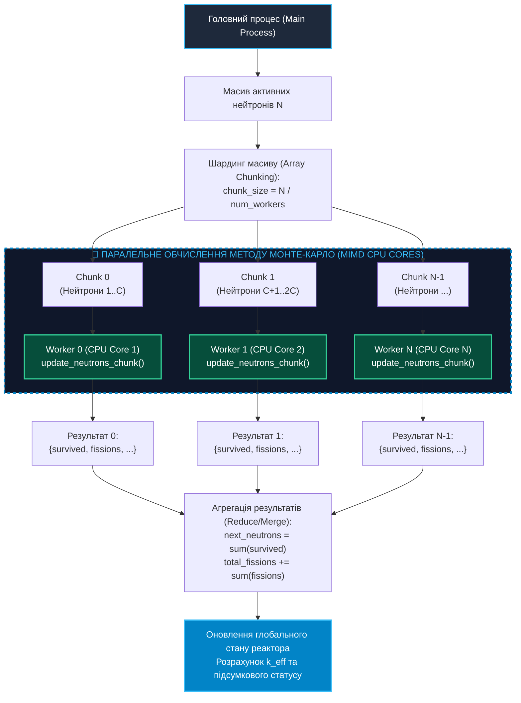

# Практична робота 1: Симуляція Монте-Карло для ділення нейтронів з візуалізацією у браузері (MIMD на ПК)

> **Декларація курсу.** Академічна доброчесність та авторство матеріалів — у [DISCLAIMER.md](DISCLAIMER.md).

---

## 1. Мета роботи

Ознайомитися з практичною реалізацією паралельних обчислень за методом Монте-Карло на багатоядерних персональних комп'ютерах (архітектура **MIMD**). Навчитися розпаралелювати обчислювально місткі задачі за допомогою модуля `multiprocessing` у Python та будувати веб-інтерфейс для візуалізації траєкторій у браузері.

---

## 2. Постановка задачі

Повна математична та фізична постановка задачі переносу та ділення нейтронів методом Монте-Карло доступна у документі **[Постановка задачі (source/README.md)](https://github.com/vplanto/cloud_grid/blob/main/source/README.md)**.

### 2.1. Ймовірнісний граф станів нейтрона
Схема ймовірностей для кожного кроку переносу нейтронів:



### 2.2. Дерево каскадної ланцюгової реакції та коефіцієнт розмноження ($k$)
Дерево розгалуження генерацій нейтронів при діленні ядер:



---

## 3. Вихідний код та архітектура MIMD

Готовий реалізований Python-проєкт розміщено в каталозі [`source/mimd-pc/app.py`](https://github.com/vplanto/cloud_grid/blob/main/source/mimd-pc/app.py).

### Архітектура системи:
1. **Обчислювальне ядро (`update_neutrons_chunk`):** Виконується в окремих воркер-процесах і симулює перенос та взаємодію масиву нейтронів на кожному тику.

#### Схема алгоритму обчислювального ядра (`update_neutrons_chunk`):



2. **Паралельний пул (`multiprocessing.Pool`):** Розподіляє масив початкових нейтронів між ядрами CPU (MIMD-обчислення).

#### Схема паралельного розподілу задач MIMD (`multiprocessing.Pool`):



3. **Вбудований веб-сервер та Dashboard (`HTTPServer`):** Приймає параметри з браузера, запускає симуляцію та повертає JSON із траєкторіями для візуалізації на 2D Canvas. Клієнтська частина (Rendering Path, `POST`) — [Лекція 4: Браузер зсередини](https://vplanto.github.io/java_script/04_browser_internals.html), [Лекція 7: HTTP/S та REST](https://vplanto.github.io/java_script/07_http_rest.html).

```
 ┌─────────────────────────────────────────────────────────────────────────────┐
 │                           Веб-браузер (Клієнт)                              │
 │            Інтерактивна Canvas-візуалізація + HTML Dashboard                │
 └──────────────────────────────────────┬──────────────────────────────────────┘
                                        │ HTTP POST /api/simulate (JSON)
                                        ▼
 ┌─────────────────────────────────────────────────────────────────────────────┐
 │                     Python HTTP Server (Main Process)                       │
 └──────────────────────────────────────┬──────────────────────────────────────┘
                                        │ multiprocessing.Pool (MIMD)
                ┌───────────────────────┼───────────────────────┐
                ▼                       ▼                       ▼
     ┌─────────────────────┐ ┌─────────────────────┐ ┌─────────────────────┐
     │ Worker 1 (CPU Core) │ │ Worker 2 (CPU Core) │ │ Worker N (CPU Core) │
     └─────────────────────┘ └─────────────────────┘ └─────────────────────┘
```

---

## 4. Інструкція із запуску та інтерфейс

### Крок 1. Запуск неперервного серверного застосунку
Відкрийте термінал у корені проєкту та виконайте команду:

```bash
python3 source/mimd-pc/app.py
```

Ви побачите повідомлення:
```text
=== Monte Carlo Reactor Simulation (MIMD PC) ===
Server running at http://localhost:8080/
CPU Cores Available: 8
```

### Крок 2. Робота у браузері та Швидкі Демо-Пресет Режими
Перейдіть за адресою [http://localhost:8080/](http://localhost:8080/) у браузері.

Для миттєвої демонстрації у верхній частині панелі доступні **3 кнопки Демо-Пресетів (Мега-масштаб 1M+)**:
- 💥 **[Вибух]:** 90% палива, 600,000 швидких та 300,000 повільних нейтронів → неконтрольоване розмноження до 1,500,000+ частинок.
- 🔋 **[Контроль]:** 50% палива, 350,000 швидких та 150,000 повільних нейтронів → утримує рівноважний критичний стан ($k \approx 1.0$).
- ❄️ **[Затухання]:** 25% палива, 150,000 швидких та 30,000 повільних нейтронів → згасання реакції ($k < 0.75$).

Паралельний розрахунок **500,000 – 1,500,000 активних нейтронів** на пулі процесів `multiprocessing.Pool` завантажує 100% усіх ядер процесора в `htop` на кожному тику симуляції.

### Крок 3. Запуск у Headless Бенчмарк-режимі (Без браузера)
Для точного вимірювання продуктивності CPU, фіксації часу виконання та подальшого порівняння з іншими архітектурами (GPU, Cloud кластери) розроблено консольний Headless-режим:

```bash
python3 source/mimd-pc/app.py --headless --steps 30 --out source/mimd-pc/benchmark_results_mimd_pc.json
```

Параметри консольного запуску:
- `--headless`: Запуск без підйому веб-сервера (чисті CLI-обчислення);
- `--steps 30`: Кількість тиків симуляції для бенчмарку;
- `--fuel 50`: Кількість палива в реакторі (%);
- `--fast 350000` / `--slow 150000`: Початковий масив частинок;
- `--out source/mimd-pc/benchmark_results_mimd_pc.json`: Збереження підсумкового JSON-звіту для подальшого порівняння.

---

## 5. Завдання для практичного виконання

### Завдання 1. Дослідження демо-режимів реактора (Мега-Масштаб 1M+)
1. Почергово натисніть кнопки пресетів **💥 Вибух**, **🔋 Контроль**, **❄️ Затухання**.
2. Зафіксуйте кількість активних нейтронів, кількість подій ділення ядра та підсумковий коефіцієнт $k$.
3. Заповніть порівняльну таблицю:

| Демо-Режим | Паливо (%) | Швидкі | Повільні | Підсумковий статус | Коефіцієнт $k$ |
| :--- | :--- | :--- | :--- | :--- | :--- |
| **Вибух** | 90% | 600 000 | 300 000 | 💥 EXPLOSION | $> 1.10$ |
| **Контроль** | 50% | 350 000 | 150 000 | 🔋 STABLE_RUN | $\approx 1.00$ |
| **Затухання** | 25% | 150 000 | 30 000 | ❄️ EXTINCTION | $< 0.75$ |

### Завдання 2. Headless-бенчмарк та фіксація результатів для порівняння
1. Запустіть Headless-бенчмарк на 30 кроків:
   `python3 source/mimd-pc/app.py --headless --steps 30`
2. Перевірте згенерований файл [`source/mimd-pc/benchmark_results_mimd_pc.json`](https://github.com/vplanto/cloud_grid/blob/main/source/mimd-pc/benchmark_results_mimd_pc.json).
3. Занотуйте підсумкові метрики для майбутнього порівняльного аналізу з GPU/Cloud архітектурами:
   - Загальний час виконання $T_{\text{total}}$ (сек);
   - Середній час обчислення одного тику $T_{\text{step}}$ (мс);
   - Швидкість прорахунку частинок (нейтронів/сек).

---

## 6. Контрольні питання

<details markdown="1">
<summary><b>1. Чому симуляцію переносу нейтронів методом Монте-Карло називають "ідеально паралельною" (Embarrassingly Parallel) задачею?</b></summary>

Тому що доля кожного початкового нейтрона обчислюється повністю автономно та незалежно від інших нейтронів. Вузлам (Worker процесам) не потрібно синхронізувати стан або обмінюватися даними в процесі симуляції, що зводить накладні витрати на міжпроцесну взаємодію до мінімуму.
</details>

<details markdown="1">
<summary><b>2. Що відбувається з прискоренням (Speedup), якщо задати кількість воркерів `num_workers` більшою за кількість фізичних або віртуальних ядер процесора?</b></summary>

Прискорення перестає рости — і починає падати. Зайвий воркер = context switching, боротьба за кеш. Фізичних ядер більше не стає.
</details>

<details markdown="1">
<summary><b>3. Як зміна перерізу розсіювання $\Sigma_s$ впливає на коефіцієнт критичності $k_{eff}$ при незмінному радіусі $R$?</b></summary>

Збільшення $\Sigma_s$ зростає ймовірність відскоку нейтрона всередині зони. Це подовжує траєкторію нейтрона всередині реактора, зменшує ймовірність його вильоту назовні (Escaped) та збільшує ймовірність ділення ядра, що підвищує $k_{eff}$.
</details>
