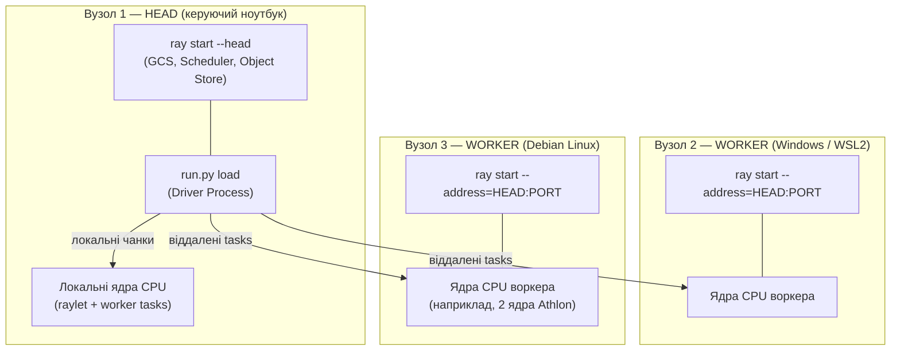
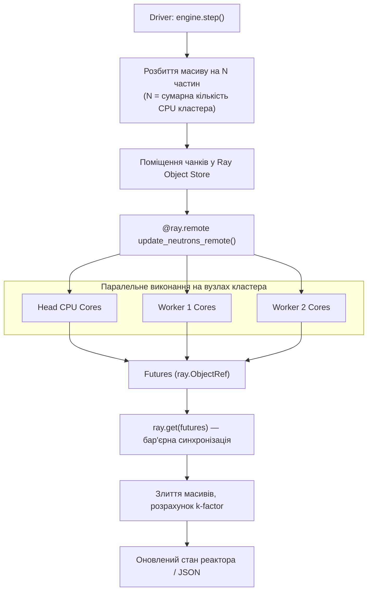

# Практична робота 2: Розподілений запуск Монте-Карло на Ray-кластері (аналог Гріда без Docker)

> **Декларація курсу.** Академічна доброчесність та авторство матеріалів — у [DISCLAIMER.md](DISCLAIMER.md).

**Передумова:** [Практика 1 — MIMD на ПК](./p01_neutron_monte_carlo.md) (`multiprocessing.Pool`, headless benchmark).

---

## 1. Мета роботи

1. Розгорнути **мінікластер із 3 пристроїв** (1 head + 2 workers) у локальній мережі без контейнеризації.
2. Масштабувати симуляцію Монте-Карло, розподіляючи обчислювальні чанки через **Ray tasks** між усіма вузлами.
3. Дослідити обмеження гетерогенного Гріда: мережеві затримки, накладні витрати серіалізації в object store та вплив повільних вузлів (stragglers).

Робота виконується виключно в режимі **batch headless** (профіль HPC/Grid з [лекції 2](./02_hpc_grid_vs_cloud.md)) без вебінтерфейсу.

---

## 2. Архітектура та топологія кластера

Кластер об'єднує фізично різні пристрої в єдиний обчислювальний простір через локальну мережу.



> **Важливий принцип:** Вузол head бере участь в обчисленнях нарівні з іншими. Ray планує задачі як на віддалених воркерах, так і на локальних ядрах процесора head.

| Роль | Призначення | Команда CLI |
| :--- | :--- | :--- |
| **Head** | Координація кластера (GCS) та запуск навантаження (driver) | `python run.py head`<br>`python run.py load` |
| **Worker (×2)** | Виконання обчислювальних задач у пулі | `python run.py client --head <HEAD_IP>` |

Гетерогенність означає нерівномірну продуктивність вузлів. Повільний процесор воркера затримує агрегацію результатів усього тику, тому сумарне прискорення суттєво відхиляється від теоретичного $3\times$.

---

## 3. Вихідний код і механізм розподілу

Код розміщено в каталозі [`source/ray-grid/`](https://github.com/vplanto/cloud_grid/tree/main/source/ray-grid):
- [`run.py`](https://github.com/vplanto/cloud_grid/blob/main/source/ray-grid/run.py) — консольний інтерфейс керування життєвим циклом кластера (`head`, `client`, `load`, `local`, `report`, `status`, `stop`);
- [`engine.py`](https://github.com/vplanto/cloud_grid/blob/main/source/ray-grid/engine.py) — обчислювальне ядро симуляції, реалізація трьох бекендів і формування метрик.

### 3.1. Порівняння трьох бекендів

Фізична модель нейтронів залишається ідентичною до [source/README.md](https://github.com/vplanto/cloud_grid/blob/main/source/README.md). Змінюється лише механізм паралелізації:

| Бекенд | Структура даних | Шар виконання | Контекст використання |
| :--- | :--- | :--- | :--- |
| `pool` | `list[dict]` | `multiprocessing.Pool` на 1 машині | Базовий рівень [практики 1](./p01_neutron_monte_carlo.md) |
| `numpy` | Векторизовані масиви | `numpy` + `multiprocessing.Pool` | SIMD-оптимізація локальних обчислень |
| `ray` | NumPy structured arrays | `@ray.remote` задачі по всьому кластеру | **Розподілений Грід** (локальні та мережеві вузли) |

### 3.2. Пресети навантаження

| Пресет | Швидкі нейтрони | Повільні нейтрони | Призначення |
| :--- | ---: | ---: | :--- |
| **`lab`** | 50 000 | 20 000 | Базовий пресет для кластера (захист слабких воркерів від вичерпання RAM) |
| **`control`** | 350 000 | 150 000 | Контрольний пресет для співставлення з метриками практики 1 |
| **`extinction`** | 150 000 | 30 000 | Режим згасання ланцюгової реакції ($k < 1$) |
| **`explosion`** | 600 000 | 300 000 | Стрес-тест для високопродуктивних вузлів ($k > 1$) |

### 3.3. Пайплайн кроку симуляції (`backend=ray`)



---

## 4. Підготовка та локальна верифікація

### 4.1. Встановлення залежностей (на всіх трьох пристроях)

```bash
git clone https://github.com/vplanto/cloud_grid.git
cd cloud_grid
pip install -r source/requirements.txt
```

**Вимоги до оточення:**
- Python версії **3.10+** (однакова мажорна версія на всіх пристроях);
- пряма IP-зв'язність у межах локальної підмережі (LAN / Wi-Fi);
- відкритий TCP-порт **6379** на вузлі head для підключення воркерів;
- на Windows рекомендується запускати оточення через **WSL2 Ubuntu**.

Перевірка доступності head з воркера:
```bash
ping <HEAD_IP>
nc -zv <HEAD_IP> 6379
```

### 4.2. Автономна перевірка на одній машині

Перед розгортанням у мережі працездатність коду перевіряється автономно. Скрипт послідовно тестує всі три бекенди на локальній системі:

```bash
cd source/ray-grid
python run.py stop
python run.py local
```

Успішне завершення команди без traceback підтверджує готовність коду до запуску в розподіленому кластері.

---

## 5. Інструкція із запуску кластера

### Крок 1. Запуск координатора (Head)

На головному комп'ютері виконайте:
```bash
cd source/ray-grid
python run.py head
```
Команда виведе LAN IP-адресу вузла (наприклад, `192.168.1.42`).

### Крок 2. Підключення воркерів (Workers)

На кожному з двох додаткових пристроїв запустіть клієнт, вказавши адресу head:
```bash
cd source/ray-grid
python run.py client --head 192.168.1.42
```
Для малопотужних пристроїв кількість задіяних ядер процесора можна обмежити явно:
```bash
python run.py client --head 192.168.1.42 --num-cpus 2
```

> [!WARNING]
> **«Біль Гріда» на практиці (блокування Windows / роутера):**
> Якщо клієнтський ПК на Windows під'єднано кабелем і у вас немає прав адміністратора, система заблокує перемикання мережі в режим *Private*. Брандмауер заблокує порти Ray. Також університетські роутери часто глушать трафік між Wi-Fi та Ethernet.
> **Аварійний вихід для збереження таймінгу пари:** підніміть воркер прямо на машині head у сусідньому терміналі:
> ```bash
> python run.py client --head 192.168.1.42 --force
> ```
> Це дозволить виконати лабораторну та зафіксувати метрики розподіленого Object Store без простою.

### Крок 3. Верифікація стану кластера

З термінала head перевірте склад кластера:
```bash
python run.py status
```
У виводі мають відображатися **3 активні вузли (Alive)** та їхня сумарна кількість ядер CPU.

### Крок 4. Запуск розподіленого навантаження

Запуск розрахунків виконується виключно з вузла head. Параметр `--wait-nodes 3` гарантує, що драйвер дочекається підключення обох воркерів перед початком бенчмарку:

```bash
# Базовий розрахунок на 30 кроків
python run.py load --preset lab --steps 30 --wait-nodes 3

# Порівняльний прогін трьох бекендів (pool, numpy, ray)
python run.py load --preset lab --steps 30 --compare --wait-nodes 3
```

Результати фіксуються у файлі [`source/ray-grid/benchmark_results_ray_grid.json`](https://github.com/vplanto/cloud_grid/blob/main/source/ray-grid/benchmark_results_ray_grid.json).

### Крок 5. Зупинка процесів

Після завершення вимірювань зупиніть Ray-демони на кожному пристрої:
```bash
python run.py stop
```

---

## 5.1. Еталонні результати: MIMD (p01) vs Ray Grid (p02)

Консольна команда для зіставлення звітів двох практик:
```bash
python run.py report --demo
```

### Порівняльна таблиця прогонів

| Параметр | Етап 1 — Один ПК (MIMD) | Етап 2 — Розподілений Грід (Ray) |
| :--- | :--- | :--- |
| **Виконавчий файл** | `source/mimd-pc/app.py` | `source/ray-grid/run.py load` |
| **Файл метрик** | `benchmark_results_mimd_pc.json` | `benchmark_results_ray_grid.json` |
| **Конфігурація** | 1 вузол, 8 локальних воркерів | 2 вузли, 32 сумарних ядра CPU |
| **Модель паралелізму** | `multiprocessing.Pool` | Ray tasks через Object Store |
| **Початкове навантаження** | 350k швидких + 150k повільних (`control`) | 50k швидких + 20k повільних (`lab`) |
| **Кількість кроків** | 30 | 30 |
| **Підсумковий стан** | STABLE_RUN | STABLE_RUN |
| **Загальний час виконання** | **19.79 с** | **2.08 с** |
| **Середній час кроку** | **659 мс** | **69 мс** |
| **Пропускна здатність** | **123 863 часток/с** | **164 078 часток/с** |

**Інженерні висновки зіставлення:**
- Різниця у загальному часі виконання зумовлена суттєво меншим пресетом `lab` у порівнянні з `control`.
- Throughput розподіленого кластера зростає на $1.32\times$, попри наявність мережевих затримок та серіалізації.
- Мережеві накладні витрати та очікування найповільнішого вузла (straggler effect) компенсуються лише за умови достатнього обсягу обчислень на один переданий чанк.

---

## 6. Завдання для практичного виконання

### Завдання 1. Розгортання кластера та фіксація топології
1. Запустіть вузол `head` та приєднайте два зовнішні вузли `client` згідно з [розділом 5](#5-інструкція-із-запуску-кластера).
2. Зафіксуйте вивід команди `python run.py status`, який підтверджує присутність 3 активних вузлів.

### Завдання 2. Проведення розподіленого бенчмарку
1. Виконайте розрахунок на 30 кроків:
   ```bash
   python run.py load --preset lab --steps 30 --wait-nodes 3 --backend ray
   ```
2. Зафіксуйте з підсумкового файлу `benchmark_results_ray_grid.json`:
   - загальний час розрахунку (`total_execution_time_sec`);
   - середню тривалість кроку (`avg_step_time_ms`);
   - пропускну здатність (`throughput_particles_per_sec`);
   - кількість зафіксованих вузлів та ядер CPU (`cluster.nodes`, `cluster.cpus`).

### Завдання 3. Порівняльний аналіз бекендів
1. Запустіть повне порівняння трьох бекендів на вузлі head за наявності підключених воркерів:
   ```bash
   python run.py load --preset lab --steps 30 --compare --wait-nodes 3
   ```
2. Заповніть підсумкову таблицю:

| Бекенд | $T_{\text{total}}$ (с) | Часток/сек | Характер навантаження |
| :--- | :--- | :--- | :--- |
| `pool` (локальний) | | | `multiprocessing.Pool` на ядрах head |
| `numpy` (локальний) | | | SIMD-векторизація на ядрах head |
| `ray` (3 вузли) | | | Розподілений запуск через LAN |

3. Зіставте отримані метрики з файлом практики 1 за допомогою генератора звіту:
   ```bash
   python run.py report
   ```

### Завдання 4. Аналіз феномену «болю Гріда» (письмовий звіт)
Дайте стислі відповіді (3–5 речень) на питання:
1. З якими несумісностями оточення ви зіткнулися під час підключення різних ОС (Windows, Linux, WSL)?
2. Які накладні витрати виникають під час серіалізації чанка нейтронів і передачі його через мережевий сокет?
3. Чому наявність повільного вузла в пулі може знизити загальну швидкість кластера нижче рівня одного потужного комп'ютера?
4. Чому відсутність прав адміністратора на клієнтських машинах (Windows з профілем Public, заблокований брандмауер) та ізоляція трафіку на роутері (Wi-Fi ↔ Ethernet) стають непереборною перешкодою для класичного Гріда?
5. Чому для розподіленого кластера Ray неможливо використати простий HTTP/SOCKS проксі, і як контейнеризація Docker з оверлейною мережею (SDN) вирішує цю кризу на наступному етапі?

---

## 7. Типові несправності та їх усунення

| Проблема | Ймовірна причина | Спосіб усунення |
| :--- | :--- | :--- |
| Воркер не може підключитися (`Failed to connect to GCS within 5s`) | Роутер блокує трафік між Wi-Fi та Ethernet (або AP Isolation), або активний брандмауер на head | Перевірити `ping HEAD_IP` з клієнта. Якщо ARP резолвиться, але пінг не йде — пакети ріже роутер. Під'єднайте обидва ПК до єдиного Wi-Fi, вимкніть брандмауер на head (`sudo ufw disable`) або використайте аварійний локальний воркер `--force` |
| Блокування портів на Windows через відсутність адмін-прав | Ethernet-адаптеру призначено профіль Public Network; зміна на Private чи відкриття портів raylet заблоковані UAC | Не витрачати час на підбір прав: перемкніть Windows на Wi-Fi або підніміть другий вузол на машині head через `--force` |
| Помилка `Only 1 node` при `--wait-nodes 3` | Воркери не стартували вчасно або перебувають в іншій підмережі | Перевірити коректність IP-адреси head та статус підключення Wi-Fi |
| Чому проксі (HTTP/SOCKS) не рятує Ray-кластер | Ray вимагає повнозв'язного двостороннього RPC (GCS 6379, raylet, plasma store, worker ports 10002–19999). Односторонній проксі ламає топологію | Потрібен прямий L3-доступ без трансляцій портів або оверлейна мережа (VPN / Docker overlay) |
| Помилка конфлікту портів на одній машині | Виклик `client --head 127.0.0.1` на head без прапорця | Заборонено створювати воркер на loopback-інтерфейсі head; для одного ПК обов'язково додавати `--force` |
| Підмережа WSL2 не бачить локальну LAN | Ізольований віртуальний адаптер NAT у Windows | Налаштувати `mirrored networking` у `.wslconfig` або підключатися до IP Windows-хоста |
| Переповнення оперативної пам'яті (OOM) на воркері | Завеликий початковий масив частинок | Застосувати пресет `--preset lab` та обмежити ядра через `--num-cpus 2` |
| Бекенд `ray` повільніший за `pool` на 1 машині | Накладні витрати Ray Object Store | На одній машині IPC-пам'ять створює додатковий оoverhead; перевага Ray проявляється в мережі |

---

## 8. Контрольні питання

<details markdown="1">
<summary><b>1. Чому на цьому етапі кластер розгортається без використання Docker?</b></summary>

Мета полягає в практичному зіткненні з типовими викликами традиційних Грід-систем: конфліктами версій Python, ручним керуванням залежностями, конфігурацією firewall та мережевою ізоляцією. Контейнеризація Docker на наступному етапі покликана продемонструвати розв'язання саме цих проблем.
</details>

<details markdown="1">
<summary><b>2. Яка принципова різниця між Ray task та multiprocessing.Pool.map?</b></summary>

`Pool.map` обмежений пам'яттю та ядрами одного фізичного комп'ютера через системні виклики `fork`/`spawn`. Ray tasks є мережево-прозорими: планувальник розподіляє їх між будь-якими вузлами кластера, передаючи аргументи та результати через розподілене сховище об'єктів (Plasma Object Store).
</details>

<details markdown="1">
<summary><b>3. Як слабкий вузол (straggler) уповільнює роботу всього кластера?</b></summary>

Кожен крок симуляції вимагає бар'єрної синхронізації `ray.get()`. Якщо два швидкі вузли порахують свої чанки за 10 мс, а третій слабкий вузол виконуватиме свій чанк 100 мс, увесь кластер простоюватиме в очікуванні останнього результату.
</details>

<details markdown="1">
<summary><b>4. Чому симуляція Монте-Карло належить до batch-навантажень, а не до інтерактивних сервісів?</b></summary>

Цільовою метрикою симуляції є загальна швидкість обробки масиву часток за одиницю часу (throughput), а не мінімальна затримка відповіді на поодинокий клієнтський запит (latency).
</details>

<details markdown="1">
<summary><b>5. Чому пресет lab є пріоритетним для першого запуску в гетерогенній мережі?</b></summary>

Пресет `lab` оперує пулом у 70 000 часток проти 500 000 у `control`. Це запобігає аварійному завершенню слабких вузлів через нестачу оперативної пам'яті під час серіалізації даних на етапі налаштування кластера.
</details>

---

## Література

📄 Moritz et al., [*Ray: A Distributed Framework for Emerging AI Applications*](https://www.usenix.org/conference/osdi18/presentation/moritz) (OSDI 2018) — §2–3: tasks, distributed object store.
