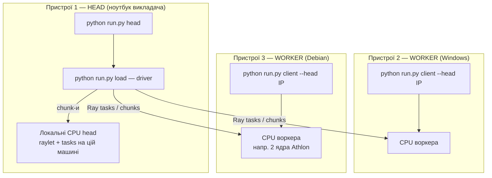
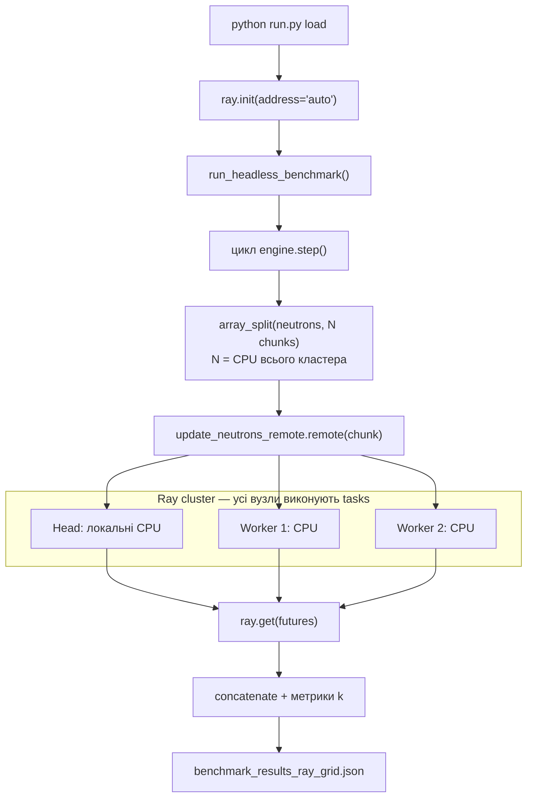

# Практична робота 2: Розподілений запуск Монте-Карло на Ray-кластері (аналог Гріда без Docker)

> **Декларація курсу.** Академічна доброчесність та авторство матеріалів — у [DISCLAIMER.md](DISCLAIMER.md).

**Передумова:** [Практика 1 — MIMD на ПК](./p01_neutron_monte_carlo.md) (`multiprocessing.Pool`, headless benchmark).

---

## 1. Мета роботи

1. Зібрати **міні-кластер з 3 пристроїв** (1 head + 2 workers) у локальній мережі — **без Docker**.
2. Запустити той самий симулятор нейтронів методом Монте-Карло, але рознести обчислювальні chunk-и через **Ray tasks** на всі вузли.
3. Порівняти throughput з [практикою 1](./p01_neutron_monte_carlo.md) і зрозуміти **біль гетерогенного Гріда**: різні ОС, слабкі вузли, мережа, серіалізація даних.

Веб-інтерфейс на цьому етапі **не використовується** — лише **batch headless** (профіль HPC/Grid з [лекції 2](./02_hpc_grid_vs_cloud.md)).

---

## 2. Топологія кластера



> **Важливо:** head — не лише «диспетчер». Ray запускає tasks і на **локальних CPU** head (вузол `LCPU`), і на CPU workers. `ray status` показує суму всіх вузлів.

| Роль | Хто запускає | Команда |
| :--- | :--- | :--- |
| **Head** | головний у групі (driver + навантаження) | `head` → `load` |
| **Worker ×2** | два інших пристрої в LAN | `client --head <IP>` |

**Типовий демо-набір викладача:** Linux/WSL ноутбук (head) + Windows ноутбук (worker) + старий Debian headless (worker, 2 ядра Athlon). Це **гетерогенний Грід** — вузли різної потужності; speedup не обов'язково дорівнює 3.

---

## 3. Вихідний код

Каталог: [`source/ray-grid/`](https://github.com/vplanto/cloud_grid/tree/main/source/ray-grid).

| Файл | Призначення |
| :--- | :--- |
| [`run.py`](https://github.com/vplanto/cloud_grid/blob/main/source/ray-grid/run.py) | CLI: `head`, `client`, `load`, `status`, `stop` |
| [`engine.py`](https://github.com/vplanto/cloud_grid/blob/main/source/ray-grid/engine.py) | Ядро MC, три backend-и, headless benchmark |

### 3.1. Три backend-и (одна фізика)

| Backend | Що робить | Аналог |
| :--- | :--- | :--- |
| `pool` | `list[dict]` + `multiprocessing.Pool` | [p01](./p01_neutron_monte_carlo.md) |
| `numpy` | `numpy` structured arrays + `Pool` | SIMD-шар на chunk |
| `ray` | NumPy chunk-и → `@ray.remote` tasks | **Grid** — chunk-и на всі вузли кластера |

Фізика нейтронів та сама, що в [source/README.md](https://github.com/vplanto/cloud_grid/blob/main/source/README.md). Змінюється лише **шар виконання**.

### 3.2. Пресети навантаження

| Пресет | Fast | Slow | Коли використовувати |
| :--- | ---: | ---: | :--- |
| **`lab`** | 50 000 | 20 000 | слабкий вузол (Athlon), перший прогін, 3-node демо |
| **`control`** | 350 000 | 150 000 | порівняння з p01 |
| **`extinction`** | 150 000 | 30 000 | режим затухання |
| **`explosion`** | 600 000 | 300 000 | лише потужний head |

### 3.3. Граф викликів `load` (backend `ray`)



---

## 4. Підготовка (на всіх 3 пристроях)

```bash
git clone https://github.com/vplanto/cloud_grid.git
cd cloud_grid
pip install -r source/requirements.txt
```

**Вимоги:**
- Python **3.10+** (однакова мажорна версія на всіх вузлах);
- пристрої в **одній LAN** (Wi‑Fi / Ethernet);
- порт **6379** не заблокований firewall;
- Windows: рекомендовано **WSL2 Ubuntu** (той самий стек, що на Linux headless).

Перевірка з worker:

```bash
ping <HEAD_IP>
# якщо є nc:
nc -zv <HEAD_IP> 6379
```

---

## 4.1. Локальна відладка (один ПК, **до** кластера)

Усі помилки в коді, залежностях і пресетах знімаємо **локально** — без Windows, без Debian, без `client`.

```bash
cd source/ray-grid
python run.py stop          # чистий старт, якщо Ray вже крутився
python run.py local         # pool → numpy → ray (1 вузол), по 3 кроки
```

Що перевіряє `local`:

| Крок | Backend | Ray потрібен? | Що ловимо |
| :---: | :--- | :---: | :--- |
| 1 | `pool` | ні | ядро MC, multiprocessing |
| 2 | `numpy` | ні | NumPy structured arrays |
| 3 | `ray` | так, лише **head на цій машині** | `ray.init`, remote tasks |

Якщо `local` пройшов без traceback — можна йти в мережу.

### Окремі команди (якщо ловите конкретну помилку)

```bash
# тільки ядро, без Ray — найшвидше
python run.py load --preset lab --steps 3 --backend pool

# NumPy-шар
python run.py load --preset lab --steps 3 --backend numpy

# Ray на одному вузлі (head, БЕЗ client)
python run.py stop
python run.py head
python run.py load --preset lab --steps 3 --backend ray
python run.py status    # має бути 1 node
```

**Не робіть** `client --head 127.0.0.1` на тій самій машині — це імітація worker, не локальний тест.

Після успішного `local` — [§5 інструкція для 3 пристроїв](#5-інструкція-запуску-3-пристрої).

---

## 5. Інструкція запуску (3 пристрої)

### Крок 1. Head (твій ноутбук)

```bash
cd cloud_grid/source/ray-grid
python run.py head
```

Запам'ятайте IP з виводу, наприклад `192.168.1.42`.

```bash
python run.py status
```

### Крок 2. Workers (2 інших пристрої)

**Windows (WSL) або Debian по SSH:**

```bash
cd cloud_grid/source/ray-grid
python run.py client --head 192.168.1.42
```

На headless Debian зручно `tmux`:

```bash
tmux new -s ray
python run.py client --head 192.168.1.42
# Ctrl+B, D — detach
```

Для слабкого Athlon можна обмежити CPU:

```bash
python run.py client --head 192.168.1.42 --num-cpus 2
```

### Крок 3. Перевірка кластера (head)

```bash
python run.py status
```

Очікується **3 alive nodes** (head + 2 workers) і сумарна кількість CPU.

### Крок 4. Навантаження (тільки з head)

**Порядок важливий:**

1. `head` на ноуті (крок 1) — вже зроблено.
2. **Два** `client` на **інших** машинах (крок 2) — або запустіть їх зараз.
3. `load` на head — з `--wait-nodes 3` або без нього.

Якщо workers ще не підключені, `--wait-nodes 3` **чекає** (до 180 с) і показує підказку.  
Підключати `client` **можна поки load чекає** — у другому терміналі на Windows/Debian.

```bash
# варіант A: workers УЖЕ підключені (ray status → 3 nodes)
python run.py load --preset lab --steps 30

# варіант B: workers підключите зараз (load чекатиме)
python run.py load --preset lab --steps 30 --wait-nodes 3

# варіант C: тільки head, без мережі (1 node) — для перевірки
python run.py load --preset lab --steps 30
# БЕЗ --wait-nodes 3

# порівняння pool / numpy / ray (ray автоматично бере CPU всього кластера)
python run.py load --preset lab --steps 15 --compare --wait-nodes 3
```

Без `--workers` backend `ray` використовує **сумарні CPU всіх вузлів**; `pool` і `numpy` — лише локальні ядра head.

Результат: [`source/ray-grid/benchmark_results_ray_grid.json`](https://github.com/vplanto/cloud_grid/blob/main/source/ray-grid/benchmark_results_ray_grid.json) — референсний JSON у git (як [`mimd_pc`](../source/mimd-pc/benchmark_results_mimd_pc.json) для p01).

**Перегенерувати і закомітити референс:**

```bash
cd source/ray-grid
python run.py load --preset lab --steps 30 --backend ray
# після перевірки:
git add source/ray-grid/benchmark_results_ray_grid.json
git commit -m "Update p02 Ray grid reference benchmark"
```

Інші прогони (`benchmark_results_local_smoke.json` тощо) лишаються поза git (див. `.gitignore`).

### Крок 5. Зупинка

На кожному вузлі (коли лаба завершена):

```bash
python run.py stop
```

---

## 5.1. Демо на парі: «Ось локальна машина — ось Грід»

На майстер-класі показуємо **два JSON поруч** — не як чесний bake-off, а як **історію курсу**: етап 1 (один ПК) → етап 2 (Ray-кластер). Студенти бачать цифри; викладач проговорює контекст.

```bash
cd source/ray-grid
python run.py report --demo
# ASCII English in terminal (no mojibake). Optional copy for slides:
python run.py report --demo --demo-file benchmark_demo.txt
```

Текст українською для слайдів — у таблиці нижче (термінал часто ламає UTF-8).

### Референсні результати (перший прогін викладача)

| | **Етап 1 — локально** | **Етап 2 — Грід (Ray)** |
| :--- | :--- | :--- |
| **Де** | один ноутбук | head + 1 worker *(репетиція: 2 nodes на одному IP)* |
| **Код** | `source/mimd-pc/app.py` | `source/ray-grid/run.py load` |
| **JSON** | `benchmark_results_mimd_pc.json` | `benchmark_results_ray_grid.json` |
| **Паралелізм** | `multiprocessing.Pool`, 8 воркерів | Ray tasks, 32 CPU (2 nodes) |
| **Нейтрони** | 350 000 fast + 150 000 slow | 50 000 fast + 20 000 slow (`lab`) |
| **Кроків** | 30 | 30 |
| **Статус** | STABLE_RUN | STABLE_RUN |
| **Загальний час** | **19.79 с** | **2.08 с** |
| **Середній крок** | **659 мс** | **69 мс** |
| **Throughput** | **123 863 част./с** | **164 078 част./с** |

`report --demo` також показує: локально довше за wall-clock **~9.5×** (інше навантаження); throughput Грід/локально **~1.32×**.

### Що сказати студентам (30 секунд)

1. **«Ось локальна машина»** — p01, один ПК, `Pool.map`, важкий пресет (500k нейтронів), 30 кроків.
2. **«Ось Грід»** — p02, Ray розносить chunk-и; `ray status` — кілька вузлів, сумарні CPU.
3. **«Ось результати»** — два JSON. Грід **коротший за час** (2 с vs 20 с), але пресет **легший** — це не чесне змагання 1:1.
4. **Висновок:** один метод MC, різний **шар виконання** (Pool → Ray). Далі — Docker, щоб вузли були однакові.

> Після підключення **справжніх** Windows + Debian workers оновіть праву колонку таблиці й знову `python run.py report --demo`.

---

## 6. Завдання для практичного виконання

### Завдання 1. Збірка кластера 1 + 2

1. Підніміть `head` на головному пристрої.
2. Підключіть **два** `client` з інших машин.
3. Зробіть скрін або копію виводу `python run.py status` (3 nodes).

### Завдання 2. Batch-прогін

```bash
python run.py load --preset lab --steps 30 --wait-nodes 3 --backend ray
```

Занотуйте:
- `total_execution_time_sec`;
- `avg_step_time_ms`;
- `throughput_particles_per_sec`;
- `cluster.nodes` і `cluster.cpus` з JSON.

### Завдання 3. Порівняння з p01

```bash
python run.py report
# або явно:
python run.py report \
  --baseline ../mimd-pc/benchmark_results_mimd_pc.json \
  --candidate benchmark_results_ray_grid.json
```

Для **чесного** порівняння throughput спочатку зніміть p02 з тим самим пресетом, що p01:

```bash
python run.py load --preset control --steps 30 --backend pool   # аналог p01 на head
python run.py load --preset control --steps 30 --backend ray --wait-nodes 3
```

### Завдання 3 (таблиця)

Запустіть на head (можна без workers):

```bash
python run.py load --preset lab --steps 30 --compare
```

Заповніть таблицю:

| Backend | $T_{\text{total}}$ (с) | neutrons/sec | Примітка |
| :--- | :--- | :--- | :--- |
| p01 `Pool` (практика 1) | | | `benchmark_results_mimd_pc.json` |
| `pool` (p02) | | | той самий алгоритм, новий раннер |
| `numpy` | | | NumPy structured arrays |
| `ray` (3 nodes) | | | мережа + слабкий вузол |

**Важливо:** 3 вузли **не гарантують** speedup > 1. Зафіксуйте, чи був приріст — і чому ні, якщо його не було.

### Завдання 4. «Біль Гріда» (короткий звіт)

Відповідь 3–5 реченнями:
- що налаштовували на Windows / Debian;
- чи була різниця версій Python або пакетів;
- що серіалізується при відправці chunk на інший вузол;
- чому Docker на наступному етапі знімає частину цього болю.

---

## 7. Типові проблеми

| Симптом | Що перевірити |
| :--- | :--- |
| Worker не підключається | `ping`, firewall, правильний `--head IP`, head слухає `0.0.0.0:6379` |
| `client --head 127.0.0.1` на head | **заборонено** — це не окремий вузол; Ray конфліктує по портах 10019+ |
| `Only 1 node` у `load --wait-nodes 3` | workers не запущені або інша підмережа Wi‑Fi |
| WSL2 не бачить LAN | mirrored networking / head на Windows-host IP |
| OOM на старому сервері | `--preset lab`, `--num-cpus 2` на worker |
| `ray` повільніший за `pool` на 1 ПК | overhead object store; на 1 машині це нормально |

---

## 8. Контрольні питання

<details markdown="1">
<summary><b>1. Чому на етапі 2 ми свідомо не використовуємо Docker?</b></summary>

Щоб відчути біль Гріда «до контейнерів»: різні версії Python, ручний `pip install` на кожному вузлі, мережа, firewall. Docker на [етапі 3](./index.md) дає однакове середовище на всіх машинах.
</details>

<details markdown="1">
<summary><b>2. Чим Ray task відрізняється від multiprocessing.Pool.map?</b></summary>

`Pool.map` працює на **одній** машині в межах локального fork/spawn. Ray tasks можуть виконуватися на **будь-якому вузлі кластера**; дані chunk-ів проходять через object store і мережу.
</details>

<details markdown="1">
<summary><b>3. Чому слабкий Athlon може знизити загальний throughput кластера?</b></summary>

Найповільніший вузол обмежує batch: driver чекає на `ray.get()` найповільніших tasks (straggler). Це типова проблема гетерогенного Grid — на відміну від однорідного HPC-кластера з Slurm/DRF.
</details>

<details markdown="1">
<summary><b>4. Чому MC залишається batch workload, а не interactive API?</b></summary>

Користувач не чекає відповідь на кожен нейтрон; метрика успіху — throughput (particles/sec), а не P99 одного HTTP-запиту. Детальніше — [лекція 2, розділ 4](./02_hpc_grid_vs_cloud.md#розділ-4-місток-до-наскрізного-проєкту-монте-карло).
</details>

<details markdown="1">
<summary><b>5. Що робить пресет lab і коли його застосовувати?</b></summary>

`lab` — ~70k початкових нейтронів замість 500k+ у `control`. Призначений для слабких вузлів і першого мережевого прогону, щоб кластер не впав по RAM/CPU до демонстрації ідеї Grid.
</details>

---

## Reading

📄 Moritz et al., [*Ray: A Distributed Framework for Emerging AI Applications*](https://www.usenix.org/conference/osdi18/presentation/moritz) (OSDI 2018) — §2–3: tasks, distributed object store.
