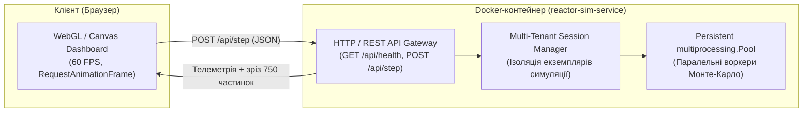

# Практична робота 3: Контейнеризація воркерів у Dockerfile, WebGL Dashboard / REST API (Етап 3)

> **Декларація курсу.** Академічна доброчесність та авторство матеріалів — у [DISCLAIMER.md](DISCLAIMER.md).

**Передумови:**
- [Практика 1 — MIMD на ПК](./p01_neutron_monte_carlo.md) (`multiprocessing.Pool`, headless benchmark).
- [Практика 2 — Грід на Ray](./p02_ray_grid.md) (розподілені задачі без контейнеризації).
- [Лекція 3 — Механіка ізоляції](./03_isolation_mechanics.md) (namespaces, cgroups v2, гіпервізори vs контейнери).

---

## Питання для розминки

**Питання 1: пастка «на моєму комп'ютері все працює» у розподілених обчисленнях**

У практиці 2 ви налаштовували кластер на кількох різних машинах. Ви зафіксували бібліотеки у `requirements.txt` і передали код колезі. На вашому лептопі все працює, а у колеги скрипт падає через відсутність системного компілятора C++ для NumPy або несумісність версій Python. Чому файлу зі списком залежностей `requirements.txt` недостатньо для гарантії, що код виконається однаково на будь-якому комп'ютері?

<details markdown="1">
<summary><b>Дізнатися відповідь</b></summary>

`requirements.txt` описує лише пакети Python, але не операційну систему. Програмі для роботи потрібне повне системне оточення: конкретна версія інтерпретатора Python, системні C-бібліотеки (`glibc`, `libgomp`), змінні середовища та структура файлової системи.

Якщо на машині колеги інша версія ОС або бракує системних бібліотек, код не запуститься. Це класичний симптом «It works on my machine». Щоб гарантувати відтворюваність обчислень, потрібно ізолювати та пакувати не лише код, а й **усе середовище виконання** разом із системними файлами.

</details>

**Питання 2: як приборкати «ненажерливий» обчислювальний процес?**

Ви запустили важку симуляцію Монте-Карло, яка утилізувала 100% усіх ядер процесора і почала стрімко накопичувати масиви в оперативній пам'яті. Через це вся операційна система зависла, курсор миші почав смикатися, а термінал перестав реагувати на команди.

Чи може звичайна операційна система за замовчуванням гарантувати, що конкретна фонова програма ні за яких умов не забере більше 25% процесора і не заповнить усю пам'ять, поклавши систему?

<details markdown="1">
<summary><b>Дізнатися відповідь</b></summary>

За замовчуванням звичайна ОС цього не гарантує. Класичні процеси конкурують за спільні ресурси комп'ютера. Навіть утиліта зниження пріоритету `nice` не обмежує максимальну утилізацію: якщо інші програми мовчать, ненажерливий процес все одно забере 100% CPU.

Щоб примусово встановити жорстку «стелю» (квоту) процесора чи оперативної пам'яті, потрібен спеціальний системний механізм ізоляції ресурсів на рівні ядра операційної системи (в Linux це **cgroups**). Саме на ньому базується контейнеризація, яку ми вивчаємо у цій роботі.

</details>

---

## Контекст індустрії: від «працює на моєму ноутбуці» до reproducible compute

У практиці 2 ви розгортали вузли Ray вручну. Кожен пристрій вимагав точної версії системного Python, однакових версій бібліотек `numpy` та підтримки векторних інструкцій AVX. Варто було одній машині оновити мінорний пакет C++ рантайму, як кластер сипався помилками серіалізації або `SIGILL`.

В індустрії обчислювальних хмар (Cloud HPC, FinTech, Training кластери штучного інтелекту) ручне розгортання оточення неприпустиме. Контейнеризація зафіксувала золотий стандарт: **код, системні бібліотеки, інтерпретатор та конфігурація пакуються в єдиний незмінний бінарний образ (Image)**.

У цій практичній роботі ми перетворюємо симулятор Монте-Карло на повноцінний хмарний сервіс: ізолюємо обчислювальні воркери, огортаємо рушій у REST API та підключаємо інтерактивний WebGL/Canvas дашборд через Docker Compose.

---

## 1. Мета роботи

1. Опанувати концепцію контейнеризації: зрозуміти різницю між віртуальними машинами та контейнерами на рівні ядра Linux (`namespaces`, `cgroups v2`, UnionFS).
2. Навчитися писати ефективні, безпечні та кешовані `Dockerfile` для розрахункових сервісів.
3. Декомпозувати розрахункову задачу на сервісну архітектуру: відокремити важкий обчислювальний воркер від веб-сервера та браузерного рендерингу.
4. Спроєктувати декларативний маніфест `docker-compose.yml` з контролем портів, мережі та жорсткими лімітами ресурсів.
5. Провести бенчмарк накладних витрат контейнеризації порівняно з «голим залізом» (Bare-Metal) та дослідити поведінку системи під лімітами CPU throttling.

---

## 2. Що таке Docker і як працює контейнеризація

### 2.1. Контейнер проти Віртуальної машини

Головна відмінність контейнера від віртуальної машини полягає у відсутності дублювання операційної системи.

```
Віртуальна машина (VM):               Контейнер (Docker):
┌─────────────────────────┐           ┌─────────────────────────┐
│ Застосунок + Залежності │           │ Застосунок + Залежності │
├─────────────────────────┤           ├─────────────────────────┤
│ Гостьова ОС (Guest OS)  │           │   Container Runtime     │
├─────────────────────────┤           ├─────────────────────────┤
│ Гіпервізор (KVM/ESXi)   │           │    Ядро хоста (Linux)   │
├─────────────────────────┤           ├─────────────────────────┤
│ Хостова ОС              │           │        Залізо           │
├─────────────────────────┤           └─────────────────────────┘
│ Залізо                  │
└─────────────────────────┘
```

| Критерій | Віртуальна машина (VM) | Контейнер (Docker) |
| :--- | :--- | :--- |
| **Рівень ізоляції** | Апаратна емуляція (окреме віртуальне ядро ОС) | Процесна ізоляція ядра хоста |
| **Час холодного старту** | 20–120 секунд | **10–500 мілісекунд** |
| **Накладні витрати пам'яті** | 1–4 ГБ на кожну копію гостьової ОС | **Мінімальні (пам'ять споживає лише сам процес)** |
| **Швидкодія CPU/IO** | Втрати 3–15% на трансляції гіпервізора | **Близька до нативної (0.5–2%)** |
| **Розмір образу** | 5–50 ГБ | 50–500 МБ |

Контейнер — це не окрема операційна система. Контейнер на Linux — це **звичайний процес хоста**, запущений з обмеженими правами, власним ізольованим баченням системи та жорсткими квотами ресурсів.

---

### 2.2. Механіка під капотом: Namespaces та cgroups

Docker не містить магії. Він виступає високорівневим оркестратором поверх фундаментальних примітивів ядра Linux:

```
┌────────────────────────────────────────────────────────┐
│                   Docker CLI / Engine                  │
├────────────────────────────────────────────────────────┤
│                 containerd / runc (OCI)                │
├──────────────────────────┬─────────────────────────────┤
│   Linux Namespaces       │    Linux cgroups v2         │
│   (Ізоляція бачення)     │    (Обмеження ресурсів)     │
├──────────────────────────┴─────────────────────────────┤
│                   Ядро Linux (Kernel)                  │
└────────────────────────────────────────────────────────┘
```

1. **Namespaces (простори імен)** ізолюють те, що процес **бачить**:
   - `pid`: ізолює дерево процесів. Головний процес у контейнері має `PID 1`, хоча на хості це може бути звичайний `PID 48210`.
   - `net`: виділяє окремий мережевий стек (власні мережеві інтерфейси, таблиця маршрутизації, локальний порт `8080`).
   - `mnt`: монтує унікальну файлову систему, приховуючи файли хоста.
   - `ipc`: ізолює канали міжпроцесорної комунікації (Shared Memory, семафори).
   - `user`: відображає локального root-користувача всередині контейнера на безпечного користувача без прав на хості.

2. **cgroups v2 (Control Groups)** контролюють те, скільки ресурсів процес **використовує**:
   - обмежують межу оперативної пам'яті (`memory.max`). При перевищенні ядро активує OOM Killer і завершує процес з аварійним кодом **Exit Code 137**;
   - нарізають квоти процесорного часу (`cpu.max`). При перевищенні ядро вмикає тротлінг (заморожує виконання на мікросекунди);
   - обмежують швидкість дискового вводу-виводу (IOPS, bandwidth).

---

### 2.3. Життєвий цикл образу: Шари та Union File System

Образ Docker (**Image**) — це не монолітний архів. Він складається з незмінних (*read-only*) шарів, об'єднаних за допомогою багатошарової файлової системи (**OverlayFS**).

```
┌──────────────────────────────────────────────┐
│ Writable Container Layer (Copy-on-Write)     │  ← Зміни процесу в рантаймі
├──────────────────────────────────────────────┤
│ Layer 4: COPY app.py /app/app.py             │  ┐
├──────────────────────────────────────────────┤  │
│ Layer 3: RUN pip install -r requirements.txt │  │  Незмінні Read-Only шари
├──────────────────────────────────────────────┤  │  (кешуються локально і в Registry)
│ Layer 2: WORKDIR /app                        │  │
├──────────────────────────────────────────────┤  │
│ Layer 1: FROM python:3.11-slim               │  ┘
└──────────────────────────────────────────────┘
```

* **Кешування збірки:** Якщо файл `requirements.txt` не змінювався, Docker бере шари 1–3 з локального кешу за 0.1 секунди, не завантажуючи бібліотеки повторно.
* **Copy-on-Write (CoW):** Коли процес у контейнері змінює існуючий файл, файл копіюється з нижнього read-only шару у верхній тонкий Writable шар. Базовий образ залишається абсолютно чистим і недоторканим.

---

## 3. Сервісна архітектура симулятора (Stage 3)

У попередніх практиках обчислювальний код і візуалізація запускалися в одному скрипті. Це призводило до блокування: важкий розрахунок навантажував CPU, викликаючи затримки у віддачі HTTP-відповідей і ривки у браузерному інтерфейсі.

На третьому етапі ми впроваджуємо **сервісну декомпозицію**:



### Принципи архітектури:
1. **Headless Worker Pool:** Обчислення виконуються пулом процесів Python на бекенді. Потік залишається активним між запитами, що усуває оверхед на системні виклики `fork` при кожному кліку.
2. **REST API Interface:** Всі керуючі дії (скидання параметрів, зміна маси палива, запуск батчу) передаються через стандартизовані HTTP JSON-виклики.
3. **Telemetry Downsampling:** Симулятор обробляє сотні тисяч нейтронів у пам'яті контейнера, але клієнту через мережу передається лише агрегована статистика та репрезентативна вибірка з 750 векторів для плавної візуалізації без перевантаження браузера.
4. **Multi-Tenancy:** Менеджер сесій (`SessionManager`) ізолює стани симуляції різних студентів на основі заголовка `X-Simulation-Session` або Cookie.

---

## 4. Анатомія правильного Dockerfile

Нижче наведено продакшн-орієнтований `Dockerfile`, розташований у каталозі [`source/docker-web/Dockerfile`](https://github.com/vplanto/cloud_grid/blob/main/source/docker-web/Dockerfile):

```dockerfile
# 1. Базовий образ: офіційний slim на базі Debian
FROM python:3.11-slim

# 2. Системні прапорці середовища
ENV PYTHONUNBUFFERED=1 \
    PYTHONDONTWRITEBYTECODE=1 \
    PORT=8080 \
    SIM_WORKERS=4

WORKDIR /app

# 3. Кешування шарів залежностей (виконується до копіювання коду)
COPY requirements.txt .
RUN pip install --no-cache-dir -r requirements.txt

# 4. Безпека: створення непривілейованого системного користувача
RUN groupadd -g 10001 appgroup && \
    useradd -u 10001 -g appgroup -s /bin/sh -m appuser

# 5. Копіювання коду застосунку зі зміною власника
COPY --chown=appuser:appgroup app.py .

# 6. Перемикання контексту виконання на non-root
USER appuser

# 7. Декларація порту сервісу
EXPOSE 8080

# 8. Healthcheck для моніторингу працездатності контейнера
HEALTHCHECK --interval=15s --timeout=3s --start-period=5s --retries=3 \
    CMD python -c "import urllib.request; urllib.request.urlopen('http://localhost:' + str(__import__('os').environ.get('PORT', 8080)) + '/api/health')" || exit 1

# 9. Exec-форма точки входу (PID 1 сигнал-менеджмент)
ENTRYPOINT ["python", "app.py"]
```

### Чому кожна інструкція написана саме так:

1. **`python:3.11-slim` замість `alpine`:**
   У дистрибутиві Alpine використовується бібліотека `musl libc`, тоді як більшість скомпільованих наукових пакетів Python (`numpy`, `scipy`) зібрані під стандартну `glibc`. Використання Alpine змушує компілювати C-розширення з джерел під час збірки образу, що збільшує час збірки з 5 секунд до 10 хвилин. Образ `slim` базується на Debian і використовує попередньо скомпільовані wheel-пакети.

2. **Порядок `COPY requirements.txt` перед `COPY app.py`:**
   Docker перевіряє хеш-суму файлів на кожному кроці. Оскільки вихідний код змінюється на порядок частіше за список бібліотек, винесення інсталяції залежностей у верхній шар дозволяє Docker миттєво перевикористовувати кеш.

3. **Запуск під непривілейованим `appuser` (UID 10001):**
   Запуск процесів під `root` усередині контейнера створює пряму загрозу підвищення привілеїв (**Container Escape**). Якщо зловмисник знайде RCE-вразливість у веб-сервері, він отримає root-доступ до файлів хоста, змонтованих через томи.

4. **Exec-форма `ENTRYPOINT ["python", "app.py"]`:**
   Запис без квадратних дужок (`ENTRYPOINT python app.py`) неявно запускає процес через під оболонку `/bin/sh -c`. При зупинці контейнера через `docker stop` сигнал `SIGTERM` отримає оболонка `sh`, яка не передає його нащадкам. Програма не зможе коректно закрити пули воркерів і буде жорстко вбита через 10 секунд сигналом `SIGKILL`. Exec-форма ставить процес Python безпосередньо на **PID 1**, забезпечуючи коректний Graceful Shutdown.

---

## 5. Мультиконтейнерна оркестрація з Docker Compose

Файл [`source/docker-web/docker-compose.yml`](https://github.com/vplanto/cloud_grid/blob/main/source/docker-web/docker-compose.yml) описує декларативну конфігурацію запуску:

```yaml
version: "3.8"

services:
  reactor-sim:
    build:
      context: .
      dockerfile: Dockerfile
    image: cloud-grid/reactor-sim:stage3
    container_name: reactor-sim-service
    restart: unless-stopped
    ports:
      - "8080:8080"
    environment:
      - PORT=8080
      - SIM_WORKERS=4
      - SIM_FUEL=50
    deploy:
      resources:
        limits:
          cpus: "2.00"
          memory: 512M
        reservations:
          cpus: "1.00"
          memory: 256M
    networks:
      - grid-net
    healthcheck:
      test: ["CMD", "python", "-c", "import urllib.request; urllib.request.urlopen('http://localhost:8080/api/health')"]
      interval: 10s
      timeout: 3s
      retries: 3
      start_period: 5s

networks:
  grid-net:
    driver: bridge
```

### Ключові елементи конфігурації:
- **`ports: "8080:8080"`:** Прокидання порту. Ядро хоста відкриває порт `8080` на зовнішньому інтерфейсі та через правила `iptables`/`nftables` перенаправляє пакети у внутрішній `net` namespace контейнера.
- **`deploy.resources.limits`:** Жорстке налаштування контрольних груп ядра Linux:
  - `cpus: "2.00"` — лімітує час виконання 200 мс на кожні 100 мс інтервалу;
  - `memory: 512M` — захищає робочу станцію від неконтрольованого зростання пам'яті під час ланцюгової реакції розмноження нейтронів.
- **`networks: grid-net`:** Ізольована підмережа мостового типу (Bridge). Контейнери в одній мережі спілкуються за іменами сервісів через вбудований DNS Docker Engine.

---

## 6. REST API та взаємодія з WebGL Dashboard

Бекенд симулятора реалізує чіткий контракт API:

| Метод | Шлях | Призначення | Приклад виклику |
| :--- | :--- | :--- | :--- |
| `GET` | `/` | Завантаження HTML5/Canvas веб-інтерфейсу | Браузер: `http://localhost:8080` |
| `GET` | `/api/health` | Liveness-проба для оркестратора | `curl http://localhost:8080/api/health` |
| `GET` | `/api/metrics` | Системні показники сервісу (активні сесії, PID) | `curl http://localhost:8080/api/metrics` |
| `POST` | `/api/reset` | Скидання геометрії та параметрів реактора | `curl -X POST http://localhost:8080/api/reset -d '{"fuel_mass": 55}'` |
| `POST` | `/api/step` | Виконання одного кроку Монте-Карло | `curl -X POST http://localhost:8080/api/step` |
| `POST` | `/api/batch` | Пакетне виконання N ітерацій у фоні | `curl -X POST http://localhost:8080/api/batch -d '{"steps": 10}'` |

### Зразок відповіді кроку симуляції (`POST /api/step`):
```json
{
  "tick": 42,
  "status": "STABLE_RUN",
  "k_factor": 1.004,
  "active_neutrons": 501230,
  "total_fissions": 18240,
  "total_absorbed": 11090,
  "total_escaped": 7120,
  "fuel_mass": 50.0,
  "calc_time_ms": 28.4,
  "session_id": "sess_8f3a9b1c",
  "neutrons": [
    {"x": 12.4, "y": -45.1, "vx": 18.2, "vy": 7.1, "type": "fast", "life": 1},
    {"x": -104.2, "y": 88.0, "vx": 5.4, "vy": -8.1, "type": "slow", "life": 3}
  ]
}
```

---

## 7. Практичний сценарій виконання роботи

### Крок 1. Запуск та перевірка контейнеризованого комплексу

Перейдіть у каталог модуля та зберіть сервіс:
```bash
cd source/docker-web
docker compose up --build -d
```

Перевірте статус контейнера та роботу перевірки стану (Healthcheck):
```bash
docker compose ps
```
Контейнер повинен перейти у статус `Up (healthy)`.

Перевірте доступність API через термінал:
```bash
curl -s http://localhost:8080/api/health | jq .
curl -s http://localhost:8080/api/metrics | jq .
```

Відкрийте браузер за адресою [http://localhost:8080](http://localhost:8080). Перевірте роботу слайдерів палива, частоту кадрів анімації нейтронів (60 FPS) та показники реактора.

---

### Крок 2. Дослідження ізоляції та спостереження за cgroups

Виконайте моніторинг ресурсів контейнера в реальному часі через окреме вікно терміналу:
```bash
docker stats reactor-sim-service
```

Зверніть увагу на поля:
- **`CPU %`:** Навіть при активній симуляції споживання процесора не перевищить `200.0%` (жорсткий ліміт `cpus: "2.00"`).
- **`MEM USAGE / LIMIT`:** Ви побачите фактичне споживання пам'яті відносно стелі у `512 MiB`.

Запустіть масовий стрес-прогін симуляції через ендпоінт пакетної обробки:
```bash
curl -X POST http://localhost:8080/api/batch \
  -H "Content-Type: application/json" \
  -d '{"steps": 25}' | jq .
```
Зафіксуйте час виконання кроку під час тротлінгу процесора.

---

### Крок 3. Дослідження поведінки OOMKilled (Exit Code 137)

У [лекції 3](./03_isolation_mechanics.md) ми розглядали нестисливість оперативної пам'яті. Перевірте дію механізму OOM на практиці.

1. Запустіть тестовий контейнер із жорстким дефіцитом пам'яті (64 МБ):
```bash
docker run --rm -it \
  --memory=64m \
  cloud-grid/reactor-sim:stage3 \
  --workers 4
```
2. Виконайте скидання з великою кількістю частинок через сусідній термінал (або запустіть скрипт виділення пам'яті).
3. Спостерігайте, як ядро хоста миттєво надсилає сигнал `SIGKILL`:
```text
Killed
```
4. Перевірте код повернення процесу:
```bash
echo $?
# Результат: 137 (128 + 9 = примусове вбивство через SIGKILL)
```

---

### Крок 4. Бенчмарк: Bare-Metal проти Docker

Порівняйте продуктивність обчислювального рушія нативної ОС (з [Практики 1](./p01_neutron_monte_carlo.md)) та у Docker-контейнері:

```bash
# 1. Запуск розрахунку локально (Bare-Metal)
cd ../mimd-pc
python app.py --headless --workers 4

# 2. Запуск аналогічного розрахунку всередині контейнера
docker exec -it reactor-sim-service python -c "
import time, json
from app import ReactorSimulationEngine
engine = ReactorSimulationEngine(num_workers=4)
engine.reset_params({'fuel_mass': 50, 'n_fast': 350000, 'n_slow': 150000})
t0 = time.perf_counter()
for _ in range(20):
    engine.step()
print('Docker 20 steps elapsed:', round(time.perf_counter() - t0, 3), 's')
"
```

Заповніть підсумкову таблицю зіставлення результатів для захисту лабораторної роботи.

---

## 8. Завдання для самостійного проєкту (IEEE-118 PowerGrid)

Для студентів, які виконують наскрізний курсовий проєкт розрахунку стійкості енергосистеми ([n01_power_grid_project.md](./n01_power_grid_project.md)), на Етапі 3 вимагається:

1. **Створити `Dockerfile` у підкаталозі `source/grid-web/`:**
   - Базовий образ `python:3.11-slim`.
   - Інсталяція залежностей: `numpy`, `networkx`, `scipy`.
   - Запуск під non-root користувачем.
2. **Розробити веб-сервіс (FastAPI або HTTP-сервер):**
   - Ендпоінт `POST /api/cascade/run`: запуск Монте-Карло розрахунку відключення випадкових ліній $N-k$.
   - Ендпоінт `GET /api/grid/topology`: віддача координат підстанцій та зв'язків IEEE-118 у форматі JSON.
3. **Підготувати `docker-compose.yml`:**
   - Підняття API-сервера та клієнтського інтерфейсу візуалізації топології графа мережі.
   - Налаштування лімітів cgroups (`cpus: "2"`, `memory: "1G"`).
   - Запуск комплексу має відбуватися строго однією командою: `docker compose up --build`.

---

## 9. Контрольні запитання для захисту Етапу 3 (КТ 2)

**Питання 1: Чому не можна додавати секретні ключі та паролі до бази даних в інструкцію `ENV` у Dockerfile?**

<details markdown="1">
<summary><b>Еталонна відповідь</b></summary>

Будь-які змінні, оголошені через `ENV`, назавжди запікаються у метадані шарів образу. Будь-який користувач або сканер безпеки, який має доступ до образу, може прочитати значення командою `docker inspect` або `docker history --no-trunc`.

Правильний підхід: передавати конфіденційні дані динамічно під час запуску контейнера через змінні середовища CLI (`docker run -e ...`), монтування `.env`-файлів у `docker-compose.yml` (які не комітяться у Git), або через системи керування секретами (Docker Secrets, Kubernetes Secrets, HashiCorp Vault).

</details>

**Питання 2: Чому порядок директив у Dockerfile критично впливає на час повторної збірки образу?**

<details markdown="1">
<summary><b>Еталонна відповідь</b></summary>

Docker кешує результат виконання кожної інструкції. Якщо вихідні файли інструкції не змінилися, Docker повторно використовує збережений шар. Але зміна будь-якого шару автоматично **інвалідує кеш для всіх наступних інструкцій**.

Якщо спочатку скопіювати весь проєкт (`COPY . .`), а потім викликати `RUN pip install`, будь-яка зміна символу у вихідному коді призведе до повторного завантаження всіх бібліотек із мережі. Правило: рідко змінювані важкі залежності (`requirements.txt`) виносяться на початок, а часто змінюваний код (`app.py`) — у самий кінець.

</details>

**Питання 3: Чому всередині контейнера команда `free -m` або кількість ядер у `os.cpu_count()` за замовчуванням показує ресурси всього фізичного сервера, а не ліміти контейнера?**

<details markdown="1">
<summary><b>Еталонна відповідь</b></summary>

Традиційні утиліти (`free`, `top`, старі версії libc) читають системну інформацію з віртуальної файлової системи хоста `/proc/meminfo` та `/proc/cpuinfo`. До появи механізму LXCFS ядро Linux не віртуалізувало файли `/proc` для контейнерів.

Обмеження cgroups діють на рівні планувальника ядра при спробі виділення ресурсу, а не на рівні відображення файлів у `/proc`. Тому сучасні рантайми (Java 10+, Go, Node.js та Python 3.13) використовують пряме читання лімітів з `/sys/fs/cgroup/` або вимагають явної конфігурації пулів через змінні середовища.

</details>

**Питання 4: У чому полягає відмінність між CPU Throttling та OOMKilled з погляду відмовостійкості системи?**

<details markdown="1">
<summary><b>Еталонна відповідь</b></summary>

- **CPU — це стисливий ресурс (compressible resource):** при нестачі ядер або вичерпанні ліміту планувальник хоста тимчасово затримує виконання потоків (throttling). Застосунок продовжує працювати, не втрачає стан і пам'ять, але його час відгуку (Latency P99) деградує.
- **RAM — це нестисливий ресурс (non-compressible resource):** оперативну пам'ять неможливо затримати або розтягнути у часі. Якщо контейнер вичерпує виділений ліміт `memory.max`, ядро не може надати додаткові байти і вимушене негайно ліквідувати процес сигналом `SIGKILL` (Exit Code 137). Стан програми втрачається, якщо він не був збережений на диск.

</details>

---

**[⬅️ Практична робота 2: Ray Grid](./p02_ray_grid.md)** | **[Практична робота 4: Kubernetes ➡️](./p04_k8s_orchestration.md)**

**[⬅️ Повернутися до змісту курсу](./index.md)**
