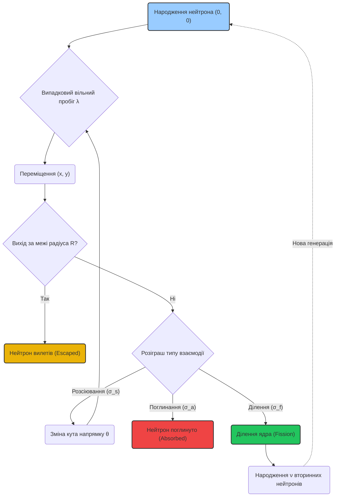
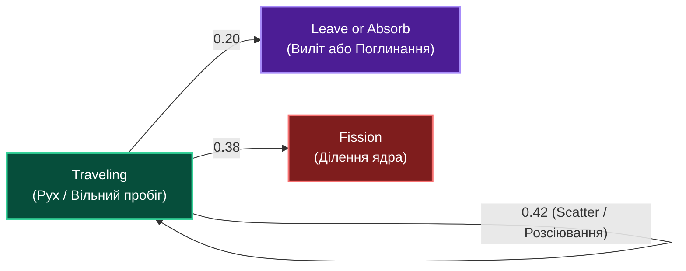
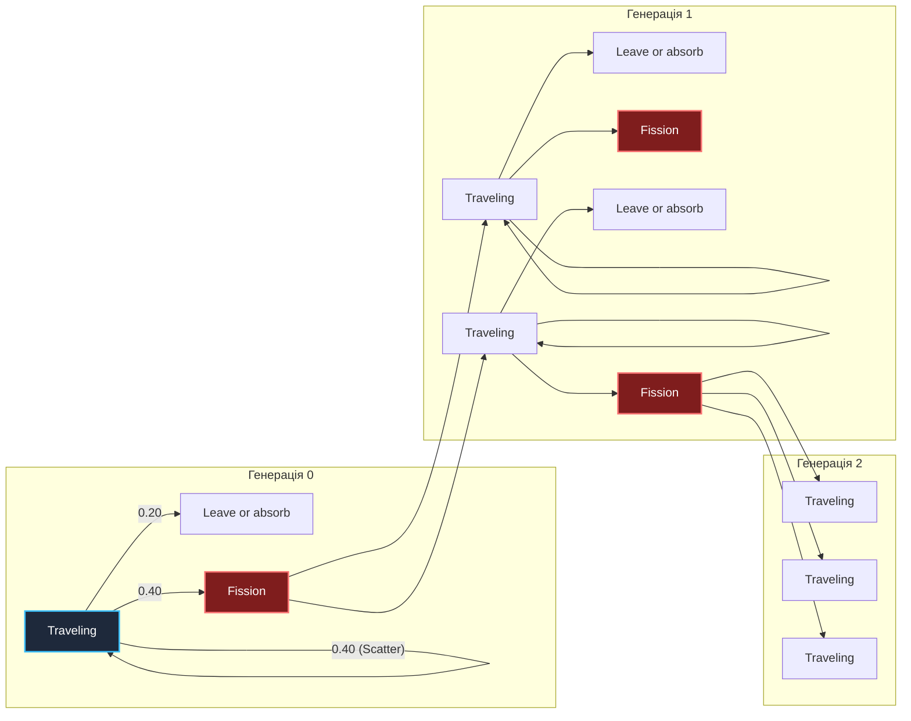

# Постановка задачі: Моделювання переносу та ділення нейтронів методом Монте-Карло

> **Навчальний курс:** Грід-системи та технології хмарних обчислень

---

## 1. Мета та фізичний контекст

Необхідно розробити та дослідити математичну модель процесів переносу, розсіювання, поглинання та ділення нейтронів методом Монте-Карло у 2D активній зоні ядерного реактора. 

Модель повинна забезпечувати ймовірнісну симуляцію траєкторій нейтронів, розрахунок коефіцієнта критичності реактора $k_{eff}$ та оцінку ефективності паралельних обчислень.

---

## 2. Математична та фізична модель

Розглядається кругова (2D) активна зона реактора радіуса $R$ (см).

### 2.1. Закони взаємодії та безперервний пробіг

> Модель нижче — спрощений **analog Monte Carlo** для нейтронного переносу (2D навчальна постановка). Класичний виклад експоненційного вільного пробігу та розіграшу столкновень за макроперерізами $\Sigma$ — у [Lewis & Miller, 1984](#3-література) (розд. 2–3), [Lux & Koblinger, 1991](#3-література) (розд. 1) та [Duderstadt & Hamilton, 1976](#3-література) (розд. 9).

1. **Початковий стан:** Нейтрони народжуються у центрі системи $(0, 0)$ з ізотропним розподілом початкового кута напрямку $\theta \in [0, 2\pi)$.
2. **Довжина вільного пробігу ($\lambda$):** Відстань до наступного зіткнення розраховується з експоненціального розподілу:
   $$\lambda = -\frac{\ln(U)}{\Sigma_t}$$
   де $U \sim \text{Uniform}(0, 1)$ — випадкова величина, $\Sigma_t = \Sigma_s + \Sigma_a + \Sigma_f$ — повний макроскопічний переріз взаємодії ($\text{см}^{-1}$). Експоненційний розподіл слідує з припущення про випадкові незалежні зіткнення в однорідному середовищі (див. [Bell & Glasstone, 1970](#3-література), розд. 1–2).
3. **Нові координати:**
   $$x_{\text{new}} = x + \lambda \cos(\theta), \quad y_{\text{new}} = y + \lambda \sin(\theta)$$

### 2.2. Розіграш типу взаємодії

У точці зіткнення генерується випадкове число $r \in [0, \Sigma_t)$ — стандартний **розіграш за накопиченими перерізами** (*collision roulette by cumulative cross sections*; [Lewis & Miller, 1984](#3-література), §2.3):
- **Пружне розсіювання ($\Sigma_s$):** при $r < \Sigma_s$. Нейтрон змінює напрямок руху на випадковий кут $\theta \sim \text{Uniform}(0, 2\pi)$ і продовжує рух.
- **Поглинання ($\Sigma_a$):** при $\Sigma_s \le r < \Sigma_s + \Sigma_a$. Нейтрон поглинається ядром і припиняє існування.
- **Ділення ядра ($\Sigma_f$):** при $r \ge \Sigma_s + \Sigma_a$. Ядро розщеплюється, вивільняючи в середньому $\nu$ нових вторинних нейтронів ($\nu \approx 2.5$; середнє число нейтронів на акт ділення — [Duderstadt & Hamilton, 1976](#3-література), табл. 2-1 для типових ізотопів).

### 2.3. Ймовірнісний граф станів нейтрона

Схема ймовірностей для кожного кроку переносу нейтронів:

### 2.4. Дерево каскадної ланцюгової реакції та коефіцієнт розмноження ($k$)

Дерево розгалуження генерацій нейтронів при діленні ядер:

### 2.5. Метрики та стани реактора
Основним розрахунковим параметром є **ефективний коефіцієнт розмноження ($k_{eff}$)**:
$$k_{eff} = \frac{N_{\text{вторинних}}}{N_{\text{початкових}}}$$

Визначаються 3 фазові стани системи:
- $k_{eff} < 1.0$ — **Підкритичний стан** (цепна реакція загасає);
- $k_{eff} = 1.0$ — **Критичний стан** (стабільна реакція);
- $k_{eff} > 1.0$ — **Надкритичний стан** (експоненціальне зростання кількості нейтронів).

---

## 3. Література

Базові джерела для формул § 2.1–2.5 (нейтронний перенос, Monte Carlo, $k_{eff}$):

1. **Lewis E.E., Miller W.F. Jr.** *Computational Methods of Neutron Transport.* John Wiley & Sons, 1984. ISBN 978-0471049925. — розд. 2–3: вільний пробіг, розіграш типу зіткнення за $\Sigma$.
2. **Lux I., Koblinger L.** *Monte Carlo Particle Transport Methods: Neutron and Photon Calculations.* CRC Press, 1991. ISBN 978-0849360770. — розд. 1: analog Monte Carlo, експоненційний розподіл довжини пробігу.
3. **Duderstadt J.J., Hamilton L.J.** *Nuclear Reactor Analysis.* Wiley, 1976. ISBN 978-0471223638. — розд. 9: Monte Carlo у фізиці реакторів; $k_{eff}$, середнє $\nu$ на ділення.
4. **Bell G.I., Glasstone S.** *Nuclear Reactor Theory.* Van Nostrand Reinhold, 1970. — розд. 1–2: рівняння переносу, макроскопічні перерізи $\Sigma$, фізичний зміст ймовірностей розсіювання / поглинання / ділення.

**Відкритий огляд (LANL):**

5. **Briesmeister J.F. (ed.)** *MCNP™ — A General Monte Carlo N-Particle Transport Code*, Version 4C. Los Alamos National Laboratory Tech. Rep. LA-13709-M, 2000. [https://mcnp-green.lanl.gov/pdf_files/TechReport_2000_LANL_LA-13709-M_Briesmeisterothers.pdf](https://mcnp-green.lanl.gov/pdf_files/TechReport_2000_LANL_LA-13709-M_Briesmeisterothers.pdf) — практичний опис тих самих кроків «пробіг → зіткнення» у промисловому коді (розд. 1–2 керівництва).
